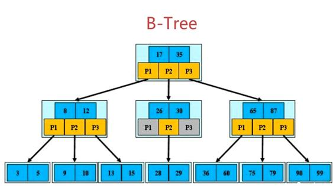
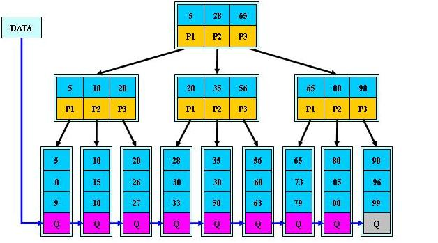

<h1 align = "center">MySQL8学习笔记</h1>

​																																																														——by  王浩

[toc]

# 一、MySQL概述

## 1、数据库的介绍

数据库是“按照数据结构来组织、存储和管理数据的仓库”。是一个长期存储在计算机内的、有组织的、可共享的、统一管理的大量数据的集合。

* 数据库是一个实体，它是能够合理保管数据的“仓库”，用户在该“仓库”中存放要管理的事务数据，“数据”和“库”两个概念结合成为数据库。
* 数据库是数据管理的新方法和技术，它能更合适的组织数据、更方便的维护数据、更严密的控制数据和更有效的利用数据。

## 2、关系型数据库管理系统的介绍

关系数据库管理系统（Relational Database Management System：RDBMS）是指包括相互联系的逻辑组织和存取这些数据的一套程序 (数据库管理系统软件)。关系数据库管理系统就是管理关系数据库，并将数据逻辑组织的系统。

## 3、数据库的安装及文档

### （1）下载地址

https://dev.mysql.com/downloads/mysql/

### （2）文档地址

https://www.mysqlzh.com/


# 二、使用Linux终端操作MySQL

## 1、登陆和退出数据库

### （1）登陆

```sql
mysql -uusername -ppassword -hhostname
mysql -uroot -p123456 -h172.18.0.2
```

### （2）退出

```sql
exit;
```

## 2、查看数据库的版本和数据库

### （1）查看数据库的版本

```sql
mysql> select version();
+-----------+
| version() |
+-----------+
| 8.0.25    |
+-----------+
1 row in set (0.00 sec)
```

### （2）查询数据库中的所有数据库

```sql
mysql> show databases;

+--------------------+
| Database           |
+--------------------+
| django             |
| information_schema |
| mysql              |
| performance_schema |
| sys                |
+--------------------+
5 rows in set (0.00 sec)
```

## 3、选择一个数据库进行操作

```sql
#use databasename;

mysql> use django;
Database changed
```

## 4、创建和删除数据库

### （1）创建数据库

```sql
#create database databasename;

mysql> create database test;
Query OK, 1 row affected (0.01 sec)
```

### （2）删除数据库

```sql
#drop database databasename;

mysql> drop database test2;
Query OK, 0 rows affected (0.02 sec)
```

## 5、查询数据库中的表

对表进行操作时，首先要先进入数据库

```sql
#use databasename;

mysql> use test;
Reading table information for completion of table and column names
You can turn off this feature to get a quicker startup with -A
Database changed
```

```sql
#show tables;

mysql> show tables;
Empty set (0.00 sec)
```

## 6、MySQL数据表的引擎

MySQL 数据表主要支持六种类型 ，分别是：BDB、HEAP、ISAM、MERGE、MYISAM、InnoDB。

### （1）MyISAM和InnoDB概述

* InnoDB 是较新的事务安全型存储引擎，用于事务处理应用程序
*  MyISAM 默认的MySQL插件式存储引擎，基于ISAM类型，但它增加了许多有用的扩展，它是在Web、数据仓储和其他应用环境下最常使用的存储引擎之一

### （2）MyISAM和InnoDB的比较

|                             | MyISAM                                 | InnoDB                     |
| --------------------------- | -------------------------------------- | -------------------------- |
| mysql8默认                  | 非默认                                 | 默认                       |
| 事务                        | 不支持                                 | 支持                       |
| 数据行锁定                  | 不支持，只有表锁定                     | 支持                       |
| 外键约束                    | 不支持                                 | 支持                       |
| 表空间大小                  | 相对小                                 | 相对大，最大是MyISAM2倍    |
| 全文索引(MySQL 5.6版本以前) | 支持                                   | 不支持                     |
| GIS数据                     | 支持                                   | 不支持                     |
| COUNT问题                   | 无                                     | 执行COUNT(*)查询时，速度慢 |
| 物理文件                    | .frm,  .MYD(数据文件), .MYI(索引文件） | 只有.frm文件               |

### （3）查看、添加、修改数据表引擎

* 查看数据表引擎
* * 查看数据库支持的引擎

```sql
#show engines;
```

* * 查看表的数据引擎

```sql
mysql> show create table student\G;
*************************** 1. row ***************************
       Table: student
Create Table: CREATE TABLE `student` (
  `id` int NOT NULL,
  `gradename` varchar(20) DEFAULT NULL,
  `stuname` varchar(20) DEFAULT NULL,
  `age` int DEFAULT NULL,
  PRIMARY KEY (`id`)
) ENGINE=InnoDB DEFAULT CHARSET=utf8mb4 COLLATE=utf8mb4_0900_ai_ci
1 row in set (0.00 sec)

ERROR:
No query specified
```

* 添加数据表引擎

创建表的时候添加,不设置的话默认innodb

```sql
mysql> create table engine( 
    ->name varchar(20)
	->)engine = myisam;
Query OK, 0 rows affected (0.01 sec)

mysql> show create table engine\G;
*************************** 1. row ***************************
       Table: engine
Create Table: CREATE TABLE `engine` (
  `name` varchar(20) DEFAULT NULL
) ENGINE=MyISAM DEFAULT CHARSET=utf8mb4 COLLATE=utf8mb4_0900_ai_ci
1 row in set (0.00 sec)

ERROR:
No query specified
```

* 修改数据表引擎

```sql
#alter table tablename engine = enginename;

mysql> alter table engine engine=innodb;
Query OK, 0 rows affected (0.03 sec)
Records: 0  Duplicates: 0  Warnings: 0

mysql> show create table engine\G;
*************************** 1. row ***************************
       Table: engine
Create Table: CREATE TABLE `engine` (
  `name` varchar(20) DEFAULT NULL
) ENGINE=InnoDB DEFAULT CHARSET=utf8mb4 COLLATE=utf8mb4_0900_ai_ci;
1 row in set (0.00 sec)

ERROR:
No query specified
```

## 7、MySQL的建表约束

### （1）查看、添加、删除、修改约束

* 查看约束

```sql
describe/desc tablename;
show create table tablename;
```

* 添加约束
* * 在创建表的时候，添加约束

```sql
mysql> create table student(										#创建一个表的同时，为id添加主键约束，为name添加唯一约束
    -> id int,
    -> name varchar(20),
    -> primary key(id),
	-> unique(name));
Query OK, 0 rows affected (0.02 sec)
```

* * 在现有的表中添加约束

```sql
#alter table tablename add constraintname(targetdata,...);

mysql> create table student(										#创建一个没有约束的表
    -> id int,
    -> name varchar(20));
Query OK, 0 rows affected (0.02 sec)

mysql> desc student;                               					#查看到里面没有任何约束 
+-------+-------------+------+-----+---------+-------+
| Field | Type        | Null | Key | Default | Extra |
+-------+-------------+------+-----+---------+-------+
| id    | int         | YES  |     | NULL    |       |
| name  | varchar(20) | YES  |     | NULL    |       |
+-------+-------------+------+-----+---------+-------+
2 rows in set (0.00 sec)

mysql> alter table student add primary key(id);
Query OK, 0 rows affected (0.03 sec)
Records: 0  Duplicates: 0  Warnings: 0

mysql> desc student;
+-------+-------------+------+-----+---------+-------+
| Field | Type        | Null | Key | Default | Extra |
+-------+-------------+------+-----+---------+-------+
| id    | int         | NO   | PRI | NULL    |       |
| name  | varchar(20) | YES  |     | NULL    |       |
+-------+-------------+------+-----+---------+-------+
2 rows in set (0.00 sec)
```

* 删除约束

```sql
#alter table tablename drop constraintname;

mysql> alter table student drop primary key;
Query OK, 0 rows affected (0.03 sec)
Records: 0  Duplicates: 0  Warnings: 0

mysql> desc student;
+-------+-------------+------+-----+---------+-------+
| Field | Type        | Null | Key | Default | Extra |
+-------+-------------+------+-----+---------+-------+
| id    | int         | NO   |     | NULL    |       |
| name  | varchar(20) | YES  |     | NULL    |       |
+-------+-------------+------+-----+---------+-------+
2 rows in set (0.00 sec)
```

* 修改约束 

通过修改字段的方式修改约束

```sql
#alter table tablename modify targetdata typename constraintname;

mysql> alter table student modify id int primary key;                      
Query OK, 0 rows affected (0.04 sec)
Records: 0  Duplicates: 0  Warnings: 0

mysql> desc student;
+-------+-------------+------+-----+---------+-------+
| Field | Type        | Null | Key | Default | Extra |
+-------+-------------+------+-----+---------+-------+
| id    | int         | NO   | PRI | NULL    |       |
| name  | varchar(20) | YES  |     | NULL    |       |
+-------+-------------+------+-----+---------+-------+
2 rows in set (0.00 sec)

mysql> alter table student modify id int auto_increment;
Query OK, 0 rows affected (0.03 sec)
Records: 0  Duplicates: 0  Warnings: 0

mysql> desc student;
+-------+-------------+------+-----+---------+----------------+
| Field | Type        | Null | Key | Default | Extra          |
+-------+-------------+------+-----+---------+----------------+
| id    | int         | NO   | PRI | NULL    | auto_increment |
| name  | varchar(20) | YES  |     | NULL    |                |
+-------+-------------+------+-----+---------+----------------+
2 rows in set (0.00 sec)
```

### （2）主键约束 primary_key

* 作用：它能够唯一确定表中的一条数据，也就是我们给表中添加主键约束，就可以使得该字段**不重复也不为空**
* 使用
* * 在创建table时，在要约束的字段后面添加primary key

```sql
mysql> create table student(
    -> id int primary key,
    -> name varchar(20));
Query OK, 0 rows affected (0.02 sec)

mysql> describe student;
+-------+-------------+------+-----+---------+-------+
| Field | Type        | Null | Key | Default | Extra |
+-------+-------------+------+-----+---------+-------+            #设置id为primary key，查看显示，key的值为PRI
| id    | int         | NO   | PRI | NULL    |       |
| name  | varchar(20) | YES  |     | NULL    |       |
+-------+-------------+------+-----+---------+-------+
2 rows in set (0.00 sec)

mysql> insert into student  value(1,'wanghao');                    #连续俩次添加相同的数据，第二次报错  
ERROR 1062 (23000): Duplicate entry '1' for key 'student.PRIMARY'

mysql> insert into student  value(2,'wanghao');                    #修改id信息就可以，id = 2
Query OK, 1 row affected (0.01 sec)

mysql> insert into student  value(NULL,'wanghao');                 #id设置为NULL，也会报错
ERROR 1048 (23000): Column 'id' cannot be null
```

* * 联合主键：primary key后面包含想要联合的内容，只要合起来的主键值不重复，不为空就可以

```sql
mysql> create table student(
    -> id int ,
    -> name varchar(20),
    -> primary key(id,name));
Query OK, 0 rows affected (0.02 sec)
```

### （3）自增约束 auto_increment

* 作用：与主键约束配合使用，可以自动的增加主键值

```sql
mysql> create table student( 
	->id int primary key auto_increment,
    ->name varchar(20));
Query OK, 0 rows affected (0.02 sec)

mysql> desc student;(describe student)
+-------+-------------+------+-----+---------+----------------+
| Field | Type        | Null | Key | Default | Extra          |
+-------+-------------+------+-----+---------+----------------+
| id    | int         | NO   | PRI | NULL    | auto_increment |
| name  | varchar(20) | YES  |     | NULL    |                |
+-------+-------------+------+-----+---------+----------------+
2 rows in set (0.00 sec)

mysql> insert into student (name) value ('wanghao');               #给表中的name添加一个值，会自动添加id的值，此时对应的id为1
Query OK, 1 row affected (0.01 sec)

mysql> select * from student;
+----+---------+
| id | name    |
+----+---------+
|  1 | wanghao |
+----+---------+
1 row in set (0.00 sec)

mysql> insert into student (name) value ('zhangsan');              #再给name添加一个值，此时相对应的id为2
Query OK, 1 row affected (0.01 sec)

mysql> select * from student;
+----+----------+
| id | name     |
+----+----------+
|  1 | wanghao  |
|  2 | zhangsan |
+----+----------+
2 rows in set (0.00 sec)
```

### （4）唯一约束 unique

约束修饰字段的值不可以重复

```sql
mysql> create table student(                                     	#创建一个表的同时给name添加一个唯一约束
    -> id int,
    -> name varchar(20),
	-> unique(name));
Query OK, 0 rows affected (0.02 sec)

mysql> desc student;
+-------+-------------+------+-----+---------+-------+
| Field | Type        | Null | Key | Default | Extra |
+-------+-------------+------+-----+---------+-------+
| id    | int         | YES  |     | NULL    |       |
| name  | varchar(20) | YES  | UNI | NULL    |       |
+-------+-------------+------+-----+---------+-------+
2 rows in set (0.00 sec)

mysql> insert into student value(1,'wanghao');                    	#第一次添加数据(1，wanghao),表中数据添加成功
Query OK, 1 row affected (0.01 sec)

mysql> select * from student;
+------+---------+
| id   | name    |
+------+---------+
|    1 | wanghao |
+------+---------+
1 row in set (0.00 sec)

mysql> insert into student value(1,'wanghao');			#第二次往表中添加数据(1,wanghao),报错，添加失败，表中只有一个name为wanghao的记录
ERROR 1062 (23000): Duplicate entry 'wanghao' for key 'student.name'

mysql> select * from student;
+------+---------+
| id   | name    |
+------+---------+
|    1 | wanghao |
+------+---------+
1 row in set (0.00 sec)
```

### （5）非空约束not null

修饰的字段的值不能为空 not null

```sql
mysql> create table student(                                         #创建一个表，设置name的约束为非空约束
    -> id int,
    -> name varchar(20) not null);                                  
Query OK, 0 rows affected (0.02 sec)

mysql> desc student;
+-------+-------------+------+-----+---------+-------+
| Field | Type        | Null | Key | Default | Extra |
+-------+-------------+------+-----+---------+-------+
| id    | int         | YES  |     | NULL    |       |
| name  | varchar(20) | NO   |     | NULL    |       |
+-------+-------------+------+-----+---------+-------+
2 rows in set (0.00 sec)

mysql> insert into student value();                                  #添加一个id和name均为空的数据，则name不允许为空，报错
ERROR 1364 (HY000): Field 'name' doesn't have a default value

mysql> insert into student(name) value('wanghao');                   #只添加不允许为空的name的值，不添加id值，则允许为空的id的值为null
Query OK, 1 row affected (0.01 sec)

mysql> select * from student;
+------+---------+
| id   | name    |
+------+---------+
| NULL | wanghao |
+------+---------+
1 row in set (0.00 sec)
```

### （6）默认约束default

当我们插入字段的时候，如果没有值的时候就会使用默认值

```sql
mysql> create table student(                                        #创建一个新表，设置age为默认约束，默认值为18
    ->id int, 
    ->name varchar(20), 
    ->age int default 18);
Query OK, 0 rows affected (0.03 sec)

mysql> desc student;
+-------+-------------+------+-----+---------+-------+
| Field | Type        | Null | Key | Default | Extra |
+-------+-------------+------+-----+---------+-------+
| id    | int         | YES  |     | NULL    |       |
| name  | varchar(20) | YES  |     | NULL    |       |
| age   | int         | YES  |     | 18      |       |
+-------+-------------+------+-----+---------+-------+
3 rows in set (0.01 sec)

mysql> insert into student (id, name) value(1,'wanghao');   		#只添加id和name字段的值，age未添加值，则age为默认值18
Query OK, 1 row affected (0.02 sec)

mysql> insert into student value(1,'zhangsan',19);                  #id,name，age的值同时添加，则age的值为添加的值19
Query OK, 1 row affected (0.03 sec)

mysql> select * from student;
+------+----------+------+
| id   | name     | age  |
+------+----------+------+
|    1 | wanghao  |   18 |
|    1 | zhangsan |   19 |
+------+----------+------+
2 rows in set (0.01 sec)
```

### （7）外键约束foreign_key

* 主表中必须先设置主键约束

```sql
mysql> create table class(
    -> id int primary key,                                          #主表的id添加主键约束
    -> name varchar(20));
Query OK, 0 rows affected (0.02 sec)

mysql> create table student(
    -> id int,
    -> name varchar(20),
    -> class_id int,
    -> foreign key (class_id) references class (id));               #副表的class_id设置为外键约束，引用主表的id
Query OK, 0 rows affected (0.02 sec)

mysql> desc class;
+-------+-------------+------+-----+---------+-------+
| Field | Type        | Null | Key | Default | Extra |
+-------+-------------+------+-----+---------+-------+
| id    | int         | NO   | PRI | NULL    |       |
| name  | varchar(20) | YES  |     | NULL    |       |
+-------+-------------+------+-----+---------+-------+
2 rows in set (0.00 sec)

mysql> desc student;
+----------+-------------+------+-----+---------+-------+
| Field    | Type        | Null | Key | Default | Extra |
+----------+-------------+------+-----+---------+-------+
| id       | int         | YES  |     | NULL    |       |
| name     | varchar(20) | YES  |     | NULL    |       |
| class_id | int         | YES  | MUL | NULL    |       |
+----------+-------------+------+-----+---------+-------+
3 rows in set (0.00 sec)
```

* 主表的内容会被副表引用

```sql
mysql> insert into class value (1,'yiban');                         #向主表中添加俩组数据，id=1,name= 'yiban';id=2,name='erban';
Query OK, 1 row affected (0.01 sec)

mysql> insert into class value (2,'erban');
Query OK, 1 row affected (0.01 sec)

mysql> select * from class;
+----+-------+
| id | name  |
+----+-------+
|  1 | yiban |
|  2 | erban |
+----+-------+
2 rows in set (0.00 sec)

mysql> insert into student value(1,'wanghao',1);                    #向副表中添加俩组数据，id=1,name='wanghao',class_id=1;
Query OK, 1 row affected (0.00 sec)									#id=1,name='zhangsan',class_id=1;

mysql> insert into student value(1,'zhangsan',1);
Query OK, 1 row affected (0.01 sec)

mysql> select * from student;
+------+----------+----------+
| id   | name     | class_id |
+------+----------+----------+
|    1 | wanghao  |        1 |
|    1 | zhangsan |        1 |
+------+----------+----------+
2 rows in set (0.00 sec)
```

* 主表中没有的数据值，在副表中是不可以使用的

```sql
mysql> insert into student value(1,'zhangsan',2);                  #向表中添加数据，id=1,name='zhangsan',class_id=2,
Query OK, 1 row affected (0.00 sec)								   #主表中id有2，添加成功
																   #向表中添加数据，id=1,name='zhangsan',class_id=3,
mysql> insert into student value(1,'zhangsan',3);				   #主表中id没有3，报错，添加失败
ERROR 1452 (23000): Cannot add or update a child row: a foreign key constraint fails (`test`.`student`, CONSTRAINT `student_ibfk_1` FOREIGN KEY (`class_id`) REFERENCES `class` (`id`))
```

* 主表中的记录被副表引用时，是不可以删除的

```sql
mysql> delete from class where id = 1;							   #删除主表中id=1的记录报错，因为副表在引用
ERROR 1451 (23000): Cannot delete or update a parent row: a foreign key constraint fails (`test`.`student`, CONSTRAINT `student_ibfk_1` FOREIGN KEY (`class_id`) REFERENCES `class` (`id`)) 
```

## 8、MySQL的数据类型

### （1）整型 

| 类型      | 大小（字节） | 范围（有符号）                                               | 范围（无符号）                | 用途       |
| :-------- | :----------- | :----------------------------------------------------------- | ----------------------------- | ---------- |
| TINYINT   | 1            | -2^7（-128）到 2^7 - 1 (127)的整数                           | 0到255的整数                  | 小整数值   |
| SMALLINT  | 2            | -2^15 (-32,768) 到 2^15 - 1 (32,767) 的整数                  | 0到65535的整数                | 大整数值   |
| MEDIUMINT | 3            | -2^23 (-8388608)到2^23 - 1 (8388607)的整数                   | 0到16777215的整数             | 大整数值   |
| INT       | 4            | -2^31 (-2,147,483,648) 到 2^31 - 1 (2,147,483,647) 的整数    | 0到4294967295的整数           | 大整数值   |
| BIGINT    | 8            | -2^63 (-9223372036854775808) 到 2^63-1 (9223372036854775807) 的整数 | 0到18446744073709551615的整数 | 极大整数值 |

### （2）浮点型

| 类型        | 大小（字节）    | 范围m | 范围d         |              |
| ----------- | --------------- | ----- | ------------- | ------------ |
| float(m,d)  | 8位精度(4字节)  | 0到8  | 小于8且小于m  | 单精度浮点型 |
| double(m,d) | 16位精度(8字节) | 0到16 | 小于16且小于m | 双精度浮点型 |

m表示总个数，d表示小数的位数

```sql
mysql> create table xiaoshu( 
	->number float(6,3), 
	->number1 double(10,5) );
Query OK, 0 rows affected, 2 warnings (0.03 sec)

mysql> insert into xiaoshu
    -> value (123.1234,12345.123456);   #单精度：如果插入一个数123.1234,实际数据库里存的是123.123，但总个数还以实际为准，即6位，整数部分最大是3位
Query OK, 1 row affected (0.03 sec)     #双精度：如果插入一个数12345.123456,实际数据库里存的是12345.12346，总个数10位，取近似值

mysql> insert into xiaoshu
    -> value(12.12,1234.1234);          #如果插入数12.12，存储的是12.120，不够的后面补0，保证小数位数为3
Query OK, 1 row affected (0.01 sec)     #如果插入数1234.1234，存储的是1234.12340，不够的后面补0，保证小数位数为5

mysql> select * from xiaoshu;
+---------+-------------+
| number  | number1     |
+---------+-------------+
| 123.123 | 12345.12346 |             
|  12.120 |  1234.12340 |             
+---------+-------------+
2 rows in set (0.00 sec)
```

### （3）定点数

浮点型在数据库中存放的是近似值，而定点类型在数据库中存放的是精确值

```sql
decimal(m,d)     #总个数m<65 ，小数位d<30且 d<m 
```

### （4）字符串类型

| 类型       | 大小                  | 用途                            |
| ---------- | --------------------- | ------------------------------- |
| CHAR(n)    | 0-255 bytes           | 定长字符串                      |
| VARCHAR(n) | 0-65535 bytes         | 变长字符串                      |
| TINYBLOB   | 0-255 bytes           | 不超过 255 个字符的二进制字符串 |
| TINYTEXT   | 0-255 bytes           | 短文本字符串                    |
| BLOB       | 0-65 535 bytes        | 二进制形式的长文本数据          |
| TEXT       | 0-65 535 bytes        | 长文本数据                      |
| MEDIUMBLOB | 0-16 777 215 bytes    | 二进制形式的中等长度文本数据    |
| MEDIUMTEXT | 0-16 777 215 bytes    | 中等长度文本数据                |
| LONGBLOB   | 0-4 294 967 295 bytes | 二进制形式的极大文本数据        |
| LONGTEXT   | 0-4 294 967 295 bytes | 极大文本数据                    |

CHAR(n) 和 VARCHAR(n) 中括号中 n 代表字符的个数，并不代表字节个数，比如 CHAR(30) 就可以存储 30 个字符

### （5）日期/时间

| 类型      | 大小   | 范围                                    | 格式                | 用途                     |
| --------- | ------ | --------------------------------------- | ------------------- | ------------------------ |
| DATE      | 3bytes | 1000-01-01/9999-12-31                   | YYYY-MM-DD          | 日期值                   |
| TIME      | 3bytes | '-838:59:59'/'838:59:59'                | HH:MM:SS            | 时间值或持续时间         |
| YEAR      | 1bytes | 1901/2155                               | YYYY                | 年份值                   |
| DATETIME  | 8bytes | 1000-01-01 00:00:00/9999-12-31 23:59:59 | YYYY-MM-DD HH:MM:SS | 混合日期和时间值         |
| TIMESTAMP | 4bytes | 1970-01-01 00:00:00/2038                | YYYYMMDD HHMMSS     | 混合日期和时间值，时间戳 |

#每个时间类型有一个有效值范围和一个"零"值，当指定不合法的MySQL不能表示的值时使用"零"值

#TIMESTAMP 有专有的自动更新特性，结束时间是第 2147483647 秒，北京时间 2038-1-19 11:14:07，格林尼治时间 2038年1月19日 凌晨 03:14:07

### （6）数据类型的属性

| MySQL关键字        | 含义                     |
| ------------------ | ------------------------ |
| NULL               | 数据列可包含NULL值       |
| NOT NULL           | 数据列不允许包含NULL值   |
| DEFAULT            | 默认值                   |
| PRIMARY KEY        | 主键                     |
| AUTO_INCREMENT     | 自动递增，适用于整数类型 |
| UNSIGNED           | 无符号                   |
| CHARACTER SET name | 制定一个字符集           |

### （7）数据类型的选择的方法

* 日期按照格式选择
* 字符和数值按照大小选择

## 9、创建和删除数据表

### （1）创建数据表

```sql
create table tablename (
    -> data datatype,
    ...
	...);
	
mysql> create table pet (
    -> name VARCHAR(20),
    -> owner VARCHAR(20),
    -> sex CHAR(1),
    -> birth DATE,
    -> death DATE);
Query OK, 0 rows affected (0.05 sec)
```

### （2）删除数据表

```sql
#drop table tablename ;

mysql> drop table test;
Query OK, 0 rows affected (0.02 sec)
```

## 10、查看表的具体详情

```sql
#describe tablename/desc tablename;

mysql> describe pet;
+-------+-------------+------+-----+---------+-------+
| Field | Type        | Null | Key | Default | Extra |
+-------+-------------+------+-----+---------+-------+
| name  | varchar(20) | YES  |     | NULL    |       |
| owner | varchar(20) | YES  |     | NULL    |       |
| sex   | char(1)     | YES  |     | NULL    |       |
| birth | date        | YES  |     | NULL    |       |
| death | date        | YES  |     | NULL    |       |
+-------+-------------+------+-----+---------+-------+
5 rows in set (0.02 sec)
```

## 11、增加表中的记录 insert

```sql
insert into pet [(data1,..)]
values ('values of data1',
 		...
		NULL);

#NULL表示添加当前数据为空
mysql> insert into pet (name,owner,sex,birth,death)
    -> values ('Bop','Tom', 'f','2021-07-01',NULL);
Query OK, 1 row affected (0.01 sec)

#修改之后检查是否添加成功
mysql> select * from pet;
+------+-------+------+------------+-------+
| name | owner | sex  | birth      | death |
+------+-------+------+------------+-------+
| Bop  | Tom   | f    | 2021-07-01 | NULL  |
+------+-------+------+------------+-------+
1 row in set (0.00 sec)
```

## 12、删除表中的记录delete 

### （1）删除整行记录

```sql
#delect from tabalename where condition;

mysql> delete from pet where name = 'Bop';         #删除pet表中，name为Bop的那一行数据
Query OK, 1 row affected (0.01 sec)

#delete from pet;删除整个表的数据，保持表结构
```

### （2）删除整列记录

```sql
mysql> select * from student;
+----+----------+--------------------------+
| id | name     | address                  |
+----+----------+--------------------------+
|  1 | wanghao  | zhongguoshanghaishanghai |
|  2 | zhangsan | zhongguoanhuihefei       |
|  3 | lisi     | zhongguozhejiangjiaxing  |
+----+----------+--------------------------+
3 rows in set (0.00 sec)

mysql> alter table student drop column address;
Query OK, 0 rows affected (0.04 sec)
Records: 0  Duplicates: 0  Warnings: 0

mysql> select * from student;
+----+----------+
| id | name     |
+----+----------+
|  1 | wanghao  |
|  2 | zhangsan |
|  3 | lisi     |
+----+----------+
3 rows in set (0.00 sec)
```

## 13、修改表中的记录 update

```sql
#update tablename set newinfo where condition;

mysql> update pet set name='Goo' where name = 'Go';            #更改pet表中，name为Go的那行中的name为Goo
Query OK, 1 row affected (0.01 sec)
Rows matched: 1  Changed: 1  Warnings: 0
```

在允许记录为空的时候，也可以修改单个记录为空来删除该记录

```sql
#update tablename set newinfo where condition;

mysql> update pet set name='' where name = 'Go';            #更改pet表中，name为Go的那行中的name为空
Query OK, 1 row affected (0.01 sec)
Rows matched: 1  Changed: 1  Warnings: 0
```

## 14、查看表中的记录 select

### （1）单表查询

创建一个student表

```sql
mysql> create table student(
 	->id int primary key,
    ->gradename varchar(20),
    ->stuname varchar(20), 
    ->age int);
Query OK, 0 rows affected (0.02 sec)
```

添加数据

```sql
insert into student value(1,'yiniaji','wanghao',18);
insert into student value(2,'erniaji','wanghao1',18);
insert into student value(3,'erniaji','wanghao2',19);
insert into student value(4,'erniaji','wanghao2',18);
insert into student value(5,'yiniaji','wanghao4',19);
insert into student value(6,'yiniaji','wanghao5',18);
insert into student value(7,'erniaji','wanghao6',19);
insert into student value(8,'erniaji','wanghao7',18);
insert into student value(9,'sanniaji','wanghao8',20);
insert into student value(10,'erniaji','wanghao9',17);
insert into student value(11,'erniaji','wanghao10',17);
insert into student value(12,'sanniaji','wanghao11',18);
insert into student value(13,'erniaji','wanghao12',17);
```

* 查询一张表

#select * from 表名;

```sql
select * from tablename;

mysql> select * from student;
+----+-----------+-----------+------+
| id | gradename | stuname   | age  |
+----+-----------+-----------+------+
|  1 | yiniaji   | wanghao   |   18 |
|  2 | erniaji   | wanghao1  |   18 |
|  3 | erniaji   | wanghao3  |   19 |
|  4 | erniaji   | wanghao2  |   18 |
|  5 | yiniaji   | wanghao4  |   19 |
|  6 | yiniaji   | wanghao5  |   18 |
|  7 | erniaji   | wanghao6  |   19 |
|  8 | erniaji   | wanghao7  |   18 |
|  9 | sanniaji  | wanghao8  |   20 |
| 10 | erniaji   | wanghao9  |   17 |
| 11 | erniaji   | wanghao10 |   17 |
| 12 | sanniaji  | wanghao11 |   18 |
| 13 | erniaji   | wanghao12 |   17 |
+----+-----------+-----------+------+
13 rows in set (0.00 sec)
```

* 查询指定字段 

#select 字段1，字段2，….from 表名;

```sql
select target1，target2,..., from tablename;

mysql> select stuname from student;
+-----------+
| stuname   |
+-----------+
| wanghao   |
| wanghao1  |
| wanghao3  |
| wanghao2  |
| wanghao4  |
| wanghao5  |
| wanghao6  |
| wanghao7  |
| wanghao8  |
| wanghao9  |
| wanghao10 |
| wanghao11 |
| wanghao12 |
+-----------+
13 rows in set (0.00 sec)
```

* distinct去重复查询

select distinct 字段名 from 表名；

```sql
#select distinct data from tablename;

mysql> select distinct age from student;					#查看name信息时，显示不重复的部分
+------+
| age  |
+------+
|   18 |
|   19 |
|   20 |
|   17 |
+------+
4 rows in set (0.00 sec)
```

* where条件查询

#select 字段1，字段2 from 表名 where 条件表达式

```sql
#select * from tablename where condition;

mysql> select * from student where age>=18;
+----+-----------+-----------+------+
| id | gradename | stuname   | age  |
+----+-----------+-----------+------+
|  1 | yiniaji   | wanghao   |   18 |
|  2 | erniaji   | wanghao1  |   18 |
|  3 | erniaji   | wanghao3  |   19 |
|  4 | erniaji   | wanghao2  |   18 |
|  5 | yiniaji   | wanghao4  |   19 |
|  6 | yiniaji   | wanghao5  |   18 |
|  7 | erniaji   | wanghao6  |   19 |
|  8 | erniaji   | wanghao7  |   18 |
|  9 | sanniaji  | wanghao8  |   20 |
| 12 | sanniaji  | wanghao11 |   18 |
+----+-----------+-----------+------+
10 rows in set (0.00 sec)
```

* where条件带between and的范围查询

#select 字段1，字段2 from 表名 where 字段 [not]between 取值1 and 取值2；

```sql
mysql> select * from student where id between 2 and 5;
+----+-----------+----------+------+
| id | gradename | stuname  | age  |
+----+-----------+----------+------+
|  2 | erniaji   | wanghao1 |   18 |
|  3 | erniaji   | wanghao3 |   19 |
|  4 | erniaji   | wanghao2 |   18 |
|  5 | yiniaji   | wanghao4 |   19 |
+----+-----------+----------+------+
4 rows in set (0.00 sec)

mysql> select * from student where id >= 2 and id <=5;
+----+-----------+----------+------+
| id | gradename | stuname  | age  |
+----+-----------+----------+------+
|  2 | erniaji   | wanghao1 |   18 |
|  3 | erniaji   | wanghao3 |   19 |
|  4 | erniaji   | wanghao2 |   18 |
|  5 | yiniaji   | wanghao4 |   19 |
+----+-----------+----------+------+
4 rows in set (0.00 sec)
```

* where条件带in关键字查询 

#select 字段1，字段2 from 表名 where 字段 [not]in(元素1，元素2)；

```sql
mysql> select * from student where age in(17,18);
+----+-----------+-----------+------+
| id | gradename | stuname   | age  |
+----+-----------+-----------+------+
|  1 | yiniaji   | wanghao   |   18 |
|  2 | erniaji   | wanghao1  |   18 |
|  4 | erniaji   | wanghao2  |   18 |
|  6 | yiniaji   | wanghao5  |   18 |
|  8 | erniaji   | wanghao7  |   18 |
| 10 | erniaji   | wanghao9  |   17 |
| 11 | erniaji   | wanghao10 |   17 |
| 12 | sanniaji  | wanghao11 |   18 |
| 13 | erniaji   | wanghao12 |   17 |
+----+-----------+-----------+------+
9 rows in set (0.00 sec)
```

* where条件带like的模糊查询

#select 字段1，字段2… from 表名 where 字段 [not] like ‘字符串’；

* * “%”代表任意字符

* * “_”代表单个字符

```sql
mysql> select * from student where stuname like 'wanghao';				#只含wanghao的记录
+----+-----------+---------+------+
| id | gradename | stuname | age  |
+----+-----------+---------+------+
|  1 | yiniaji   | wanghao |   18 |
+----+-----------+---------+------+
1 row in set (0.00 sec)
			
mysql> select * from student where stuname like 'wanghao%';				#以wanghao开头的任意记录
+----+-----------+-----------+------+
| id | gradename | stuname   | age  |
+----+-----------+-----------+------+
|  1 | yiniaji   | wanghao   |   18 |
|  2 | erniaji   | wanghao1  |   18 |
|  3 | erniaji   | wanghao3  |   19 |
|  4 | erniaji   | wanghao2  |   18 |
|  5 | yiniaji   | wanghao4  |   19 |
|  6 | yiniaji   | wanghao5  |   18 |
|  7 | erniaji   | wanghao6  |   19 |
|  8 | erniaji   | wanghao7  |   18 |
|  9 | sanniaji  | wanghao8  |   20 |
| 10 | erniaji   | wanghao9  |   17 |
| 11 | erniaji   | wanghao10 |   17 |
| 12 | sanniaji  | wanghao11 |   18 |
| 13 | erniaji   | wanghao12 |   17 |
+----+-----------+-----------+------+
13 rows in set (0.00 sec)
             
mysql> select * from student where stuname like '%wanghao%';			#含有wanghao的任意记录
+----+-----------+-----------+------+
| id | gradename | stuname   | age  |
+----+-----------+-----------+------+
|  1 | yiniaji   | wanghao   |   18 |
|  2 | erniaji   | wanghao1  |   18 |
|  3 | erniaji   | wanghao3  |   19 |
|  4 | erniaji   | wanghao2  |   18 |
|  5 | yiniaji   | wanghao4  |   19 |
|  6 | yiniaji   | wanghao5  |   18 |
|  7 | erniaji   | wanghao6  |   19 |
|  8 | erniaji   | wanghao7  |   18 |
|  9 | sanniaji  | wanghao8  |   20 |
| 10 | erniaji   | wanghao9  |   17 |
| 11 | erniaji   | wanghao10 |   17 |
| 12 | sanniaji  | wanghao11 |   18 |
| 13 | erniaji   | wanghao12 |   17 |
+----+-----------+-----------+------+
13 rows in set (0.00 sec)
               
mysql> select * from student where stuname like 'wanghao_';				#wanghao后面有一个字符的记录
+----+-----------+----------+------+
| id | gradename | stuname  | age  |
+----+-----------+----------+------+
|  2 | erniaji   | wanghao1 |   18 |
|  3 | erniaji   | wanghao3 |   19 |
|  4 | erniaji   | wanghao2 |   18 |
|  5 | yiniaji   | wanghao4 |   19 |
|  6 | yiniaji   | wanghao5 |   18 |
|  7 | erniaji   | wanghao6 |   19 |
|  8 | erniaji   | wanghao7 |   18 |
|  9 | sanniaji  | wanghao8 |   20 |
| 10 | erniaji   | wanghao9 |   17 |
+----+-----------+----------+------+
9 rows in set (0.00 sec)
```
* where条件的null空值查询

#select 字段1，字段2…from 表名 where 字段  is[not] null;

```sql
mysql> select * from student where age is null;							#查询表名为student的age为空的记录，因为全有age，所以没有null的
Empty set (0.00 sec)
```

* where条件带and的多条件查询

#select 字段1，字段2…from 表名 where 条件表达式1 and 条件表达式2 [and 条件表达式n];

```sql
mysql> select * from student where gradename= 'yiniaji' and age=18;		#查询表名为student的一年级的且年龄为18岁的记录
+----+-----------+----------+------+
| id | gradename | stuname  | age  |
+----+-----------+----------+------+
|  1 | yiniaji   | wanghao  |   18 |
|  6 | yiniaji   | wanghao5 |   18 |
+----+-----------+----------+------+
2 rows in set (0.00 sec)
```

* where带条件or的多条件查询

#select 字段1，字段2… from 表名 where 条件表达式1 or 条件表达式2 [or 条件表达式n];

```sql
mysql> select * from student where gradeName='yiniaji' or age=18;		#查询表名为student的一年级或者年龄为18岁的记录
+----+-----------+-----------+------+
| id | gradename | stuname   | age  |
+----+-----------+-----------+------+
|  1 | yiniaji   | wanghao   |   18 |
|  2 | erniaji   | wanghao1  |   18 |
|  4 | erniaji   | wanghao2  |   18 |
|  5 | yiniaji   | wanghao4  |   19 |
|  6 | yiniaji   | wanghao5  |   18 |
|  8 | erniaji   | wanghao7  |   18 |
| 12 | sanniaji  | wanghao11 |   18 |
+----+-----------+-----------+------+
7 rows in set (0.00 sec)
```

* 排序查询order by

#select 字段1，字段2…from 表名 order by 属性名 [asc|desc];

* * asc  升序，从小到大，默认为升序，可以不写

* * desc  降序，从大到小

```sql
mysql> select * from student order by age;							#查询表名为student的按年龄升序排列的记录
+----+-----------+-----------+------+
| id | gradename | stuname   | age  |
+----+-----------+-----------+------+
| 10 | erniaji   | wanghao9  |   17 |
| 11 | erniaji   | wanghao10 |   17 |
| 13 | erniaji   | wanghao12 |   17 |
|  1 | yiniaji   | wanghao   |   18 |
|  2 | erniaji   | wanghao1  |   18 |
|  4 | erniaji   | wanghao2  |   18 |
|  6 | yiniaji   | wanghao5  |   18 |
|  8 | erniaji   | wanghao7  |   18 |
| 12 | sanniaji  | wanghao11 |   18 |
|  3 | erniaji   | wanghao3  |   19 |
|  5 | yiniaji   | wanghao4  |   19 |
|  7 | erniaji   | wanghao6  |   19 |
|  9 | sanniaji  | wanghao8  |   20 |
+----+-----------+-----------+------+
13 rows in set (0.00 sec)
					  
mysql> select * from student order by age desc;						#查询表名为student的按年龄降序排列的记录
+----+-----------+-----------+------+
| id | gradename | stuname   | age  |
+----+-----------+-----------+------+
|  9 | sanniaji  | wanghao8  |   20 |
|  3 | erniaji   | wanghao3  |   19 |
|  5 | yiniaji   | wanghao4  |   19 |
|  7 | erniaji   | wanghao6  |   19 |
|  1 | yiniaji   | wanghao   |   18 |
|  2 | erniaji   | wanghao1  |   18 |
|  4 | erniaji   | wanghao2  |   18 |
|  6 | yiniaji   | wanghao5  |   18 |
|  8 | erniaji   | wanghao7  |   18 |
| 12 | sanniaji  | wanghao11 |   18 |
| 10 | erniaji   | wanghao9  |   17 |
| 11 | erniaji   | wanghao10 |   17 |
| 13 | erniaji   | wanghao12 |   17 |
+----+-----------+-----------+------+
13 rows in set (0.00 sec)
```

* 分页查询limit 

#select 字段1，字段2，…from 表名 limit 初始位置，记录数；

limit 第一个参数表示起始位置，第二个参数表示个数

```sql
mysql> select * from student limit 2,5;								#查询表名为student的从位置3开始的前5个记录，第一个位置是0
+----+-----------+----------+------+
| id | gradename | stuname  | age  |
+----+-----------+----------+------+
|  3 | erniaji   | wanghao3 |   19 |
|  4 | erniaji   | wanghao2 |   18 |
|  5 | yiniaji   | wanghao4 |   19 |
|  6 | yiniaji   | wanghao5 |   18 |
|  7 | erniaji   | wanghao6 |   19 |
+----+-----------+----------+------+
5 rows in set (0.00 sec)
```

* 聚合函数

* * avg(col): 返回指定列的平均值

* * count(col): 返回指定列中非NULL值的个数

* * min/max

  min(col): 返回指定列的最小值

  max(col): 返回指定列的最大值

* * sum(col)：返回指定列的所有值之和

* * group_concat: 返回由属于一组的列值连接组合而成的结果

#聚合函数一般与分组查询连用,不能用在where句子中

* 分组查询group by

* * 与having一起使用（显示输出的结果）

```sql
#查询根据gradename分组的student表中大于2个的gradename记录
mysql> select gradename,count(stuname) from student group by gradename having count(stuname)>2;
+-----------+----------------+
| gradename | count(stuname) |
+-----------+----------------+
| yiniaji   |              3 |
| erniaji   |              8 |
+-----------+----------------+
2 rows in set (0.00 sec)
```

* * 与group_concat()一起使用

```sql
#查询根据gradename分组的student表中所有的学生的名字
mysql> select gradename,group_concat(stuname) from student group by gradename;
+-----------+---------------------------------------------------------------------------+
| gradename | group_concat(stuname)                                                     |
+-----------+---------------------------------------------------------------------------+
| erniaji   | wanghao1,wanghao3,wanghao2,wanghao6,wanghao7,wanghao9,wanghao10,wanghao12 |
| sanniaji  | wanghao8,wanghao11                                                        |
| yiniaji   | wanghao,wanghao4,wanghao5                                                 |
+-----------+---------------------------------------------------------------------------+
3 rows in set (0.00 sec)
```

* * 与with rollup 一起使用（最后加入一个总和行)

```sql
#查询根据gradename分组的student表中所有的学生的名字并在最后一行加入总和行
#select gradeName,group_concat(stuname) from student group by gradeName with rollup;

mysql> select gradename,group_concat(stuname) from student group by gradename with rollup;
+-----------+---------------------------------------------------------------------------+
| gradename | group_concat(stuname)                                                     |
+-----------+---------------------------------------------------------------------------+
| erniaji   | wanghao1,wanghao3,wanghao2,wanghao6,wanghao7,wanghao9,wanghao10,wanghao12 |
| sanniaji  | wanghao8,wanghao11                                                        |
| yiniaji   | wanghao,wanghao4,wanghao5                                                 |
| NULL		| wanghao1,wanghao3,...wanghao5(上面三行的所有的名字)			   			      |
+-----------+---------------------------------------------------------------------------+
4 rows in set (0.01 sec)
```

### （2）多表查询

创建三个表book，booktype，pricelevel 并插入相关数据

```sql
mysql> create table book(
    -> id int,
    -> bookname varchar(20),
    -> price float(6,2),
    -> auther varchar(20),
    -> booktypeid int);
Query OK, 0 rows affected, 1 warning (0.02 sec)

insert into book value (1,'java',100.00,'wanghao',1);
insert into book value (2,'python',89.99,'wanghao1',1);
insert into book value (3,'wulinwaizhuan',60.00,'wanghao2',2);
insert into book value (4,'math',45.00,'wanghao3',3);
insert into book value (5,'other',20.00,'wanghao4',4);

mysql> select * from book;
+----+---------------+--------+----------+------------+
| id | bookname      | price  | auther   | booktypeid |
+----+---------------+--------+----------+------------+
|  1 | java          | 100.00 | wanghao  |          1 |
|  2 | python        |  89.99 | wanghao1 |          1 |
|  3 | wulinwaizhuan |  60.00 | wanghao2 |          2 |
|  4 | math          |  45.00 | wanghao3 |          3 |
|  5 | other         |  20.00 | wanghao4 |          4 |
+----+---------------+--------+----------+------------+
5 rows in set (0.00 sec)

mysql> create table booktype(
    -> typeid int,
    -> typename varchar(20));
Query OK, 0 rows affected (0.02 sec)

insert into booktype value (1, 'computer');
insert into booktype value (2, 'literature');
insert into booktype value (3, 'education');

mysql> select * from booktype;
+--------+------------+
| typeid | typename   |
+--------+------------+
|      1 | computer   |
|      2 | literature |
|      3 | education  |
+--------+------------+
3 rows in set (0.00 sec)

mysql> create table price(
    -> priceid int primary key,
    -> pricelevel int,
    -> pricenum int,
    -> description varchar(20));
Query OK, 0 rows affected (0.03 sec)

insert into price value (1,1,80,'expensive');
insert into price value (2,2,60,'medium');
insert into price value (3,3,40,'cheap');

mysql> select * from price;
+---------+------------+----------+-------------+
| priceid | pricelevel | pricenum | description |
+---------+------------+----------+-------------+
|       1 |          1 |       80 | expensive   |
|       2 |          2 |       60 | medium      |
|       3 |          3 |       40 | cheap       |
+---------+------------+----------+-------------+
3 rows in set (0.00 sec)
```

* 内/自连接查询 inner join

两张或以上的表连接起来查询需要的数据，只返回两个表中关联字段相等的行

* * where写法

```sql
#根据表book的booktypeId查询出所有typename,bookname为other的不在范围内
mysql> select * from book,booktype where book.booktypeid=booktype.typeid;
+----+---------------+--------+----------+------------+--------+------------+
| id | bookname      | price  | auther   | booktypeid | typeid | typename   |
+----+---------------+--------+----------+------------+--------+------------+
|  1 | java          | 100.00 | wanghao  |          1 |      1 | computer   |
|  2 | python        |  89.99 | wanghao1 |          1 |      1 | computer   |
|  3 | wulinwaizhuan |  60.00 | wanghao2 |          2 |      2 | literature |
|  4 | math          |  45.00 | wanghao3 |          3 |      3 | education  |
+----+---------------+--------+----------+------------+--------+------------+
4 rows in set (0.00 sec)
```

*  inner join...on写法 （左表inner join 右表on）

```sql
mysql> select * from book inner join booktype on book.booktypeid=booktype.typeid;
+----+---------------+--------+----------+------------+--------+------------+
| id | bookname      | price  | auther   | booktypeid | typeid | typename   |
+----+---------------+--------+----------+------------+--------+------------+
|  1 | java          | 100.00 | wanghao  |          1 |      1 | computer   |
|  2 | python        |  89.99 | wanghao1 |          1 |      1 | computer   |
|  3 | wulinwaizhuan |  60.00 | wanghao2 |          2 |      2 | literature |
|  4 | math          |  45.00 | wanghao3 |          3 |      3 | education  |
+----+---------------+--------+----------+------------+--------+------------+
4 rows in set (0.00 sec)
```

* 外连接查询 outer join

两张或以上的表连接起来查询某张表的全部信息


* * 左连接查询 left [outer] join...on...  （左表left [outer] join右表on...）

```sql
#返回包括左表book中的所有记录和右表中关联字段相等的记录,右表多余的则不要，右表没有则为NULL
mysql> select * from book left outer join booktype on book.booktypeid=booktype.typeid;
+----+---------------+--------+----------+------------+--------+------------+
| id | bookname      | price  | auther   | booktypeid | typeid | typename   |
+----+---------------+--------+----------+------------+--------+------------+
|  1 | java          | 100.00 | wanghao  |          1 |      1 | computer   |
|  2 | python        |  89.99 | wanghao1 |          1 |      1 | computer   |
|  3 | wulinwaizhuan |  60.00 | wanghao2 |          2 |      2 | literature |
|  4 | math          |  45.00 | wanghao3 |          3 |      3 | education  |
|  5 | other         |  20.00 | wanghao4 |          4 |   NULL | NULL       |
+----+---------------+--------+----------+------------+--------+------------+
5 rows in set (0.00 sec)
```

* * 右连接查询right [outer] join...on... （左表left [outer] join右表on...）

```sql
#返回包括右表bookype中的所有记录和左表book中关联字段相等的记录,左表多余的则不要，左表没有则为NULL
mysql> select * from book right outer join booktype on book.booktypeid=booktype.typeid;
+------+---------------+--------+----------+------------+--------+------------+
| id   | bookname      | price  | auther   | booktypeid | typeid | typename   |
+------+---------------+--------+----------+------------+--------+------------+
|    2 | python        |  89.99 | wanghao1 |          1 |      1 | computer   |
|    1 | java          | 100.00 | wanghao  |          1 |      1 | computer   |
|    3 | wulinwaizhuan |  60.00 | wanghao2 |          2 |      2 | literature |
|    4 | math          |  45.00 | wanghao3 |          3 |      3 | education  |
+------+---------------+--------+----------+------------+--------+------------+
4 rows in set (0.00 sec)
```

* * 全连接查询 full[outer] join...on...  mysql不能使用全连接查询，可以使用左右合并查询

#返回符合条件的所有表的记录，没有与之匹配的，用null表示（结果是左连接和右连接的并集）

```sql

mysql> select * from book right outer join booktype on book.booktypeid=booktype.typeid
    -> union[all]
    -> select * from book left outer join booktype on book.booktypeid=booktype.typeid;
+------+---------------+--------+----------+------------+--------+------------+
| id   | bookname      | price  | auther   | booktypeid | typeid | typename   |
+------+---------------+--------+----------+------------+--------+------------+
|    2 | python        |  89.99 | wanghao1 |          1 |      1 | computer   |
|    1 | java          | 100.00 | wanghao  |          1 |      1 | computer   |
|    3 | wulinwaizhuan |  60.00 | wanghao2 |          2 |      2 | literature |
|    4 | math          |  45.00 | wanghao3 |          3 |      3 | education  |
|    5 | other         |  20.00 | wanghao4 |          4 |   NULL | NULL       |
+------+---------------+--------+----------+------------+--------+------------+
5 rows in set (0.01 sec)
```

* * 多连接查询（属于内连接查询）

```sql
#返回俩表中typeid相关联的且价格在70以上的
mysql> select * from book,booktype where book.booktypeid=booktype.typeid and book.price>70;
+----+----------+--------+----------+------------+--------+----------+
| id | bookname | price  | auther   | booktypeid | typeid | typename |
+----+----------+--------+----------+------------+--------+----------+
|  2 | python   |  89.99 | wanghao1 |          1 |      1 | computer |
|  1 | java     | 100.00 | wanghao  |          1 |      1 | computer |
+----+----------+--------+----------+------------+--------+----------+
2 rows in set (0.01 sec)
```

* 合并查询 union/union all

* * union  将所有的查询结果合并到一起，然后去掉相同的记录；

```sql
mysql> select id from book 
	->union 
	->select typeid from booktype;
+------+
| id   |
+------+
|    1 |
|    2 |
|    3 |
|    4 |
|    5 |
+------+
5 rows in set (0.00 sec)
```

* * union all 将所有的查询结果合并到一起，不去掉相同的记录；

```sql
mysql> select id from book 
	->union all 
	->select typeid from booktype;
+------+
| id   |
+------+
|    1 |
|    2 |
|    3 |
|    4 |
|    5 |
|    1 |
|    2 |
|    3 |
+------+
8 rows in set (0.00 sec)
```

* 子查询 select...(select...)

* * 带in关键字的子查询

```sql
mysql> select * from book where booktypeid in(select typeid from booktype);
+----+---------------+--------+----------+------------+
| id | bookname      | price  | auther   | booktypeid |
+----+---------------+--------+----------+------------+
|  1 | java          | 100.00 | wanghao  |          1 |
|  2 | python        |  89.99 | wanghao1 |          1 |
|  3 | wulinwaizhuan |  60.00 | wanghao2 |          2 |
|  4 | math          |  45.00 | wanghao3 |          3 |
+----+---------------+--------+----------+------------+
4 rows in set (0.00 sec)

mysql> select * from book where booktypeid not in(select typeid from booktype);
+----+----------+-------+----------+------------+
| id | bookname | price | auther   | booktypeid |
+----+----------+-------+----------+------------+
|  5 | other    | 20.00 | wanghao4 |          4 |
+----+----------+-------+----------+------------+
1 row in set (0.00 sec)
```

* * 带比较运算符的子查询

```sql
mysql> select * from book where price >= (select pricenum from price where priceid=2);
+----+---------------+--------+----------+------------+
| id | bookname      | price  | auther   | booktypeid |
+----+---------------+--------+----------+------------+
|  1 | java          | 100.00 | wanghao  |          1 |
|  2 | python        |  89.99 | wanghao1 |          1 |
|  3 | wulinwaizhuan |  60.00 | wanghao2 |          2 |
+----+---------------+--------+----------+------------+
3 rows in set (0.00 sec)
```

* * 带exists关键字的子查询 假如子查询查询到记录，则进行外层查询，否则，不执行外层查询

```sql
mysql> select * from book where exists(select * from booktype);
+----+---------------+--------+----------+------------+
| id | bookname      | price  | auther   | booktypeid |
+----+---------------+--------+----------+------------+
|  1 | java          | 100.00 | wanghao  |          1 |
|  2 | python        |  89.99 | wanghao1 |          1 |
|  3 | wulinwaizhuan |  60.00 | wanghao2 |          2 |
|  4 | math          |  45.00 | wanghao3 |          3 |
|  5 | other         |  20.00 | wanghao4 |          4 |
+----+---------------+--------+----------+------------+
5 rows in set (0.00 sec)

mysql> select * from book where not exists(select * from booktype);
Empty set (0.00 sec)
```

* * 带any关键字的子查询  any关键字表示满足其中任一条件都会被查询到

```sql
#价格档次为80，60，40。100.00，89.99，60.00，45.00都大于其中的至少一个数
mysql> select * from book where price >= any(select pricenum from price);
+----+---------------+--------+----------+------------+
| id | bookname      | price  | auther   | booktypeid |
+----+---------------+--------+----------+------------+
|  1 | java          | 100.00 | wanghao  |          1 |
|  2 | python        |  89.99 | wanghao1 |          1 |
|  3 | wulinwaizhuan |  60.00 | wanghao2 |          2 |
|  4 | math          |  45.00 | wanghao3 |          3 |
+----+---------------+--------+----------+------------+
4 rows in set (0.01 sec)
```

* * 带all关键字的子查询 all关键字表示满足所有条件

```sql
#价格档次为80，60，40。只有100.00，89.99大于所有的档次
mysql> select * from book where price>= all(select pricenum from price);
+----+----------+--------+----------+------------+
| id | bookname | price  | auther   | booktypeid |
+----+----------+--------+----------+------------+
|  1 | java     | 100.00 | wanghao  |          1 |
|  2 | python   |  89.99 | wanghao1 |          1 |
+----+----------+--------+----------+------------+
2 rows in set (0.00 sec)
```

## 15、数据库的三大设计范式

### （1）第一范式1NF

数据库中的每一列都是不可分割的基本数据项，同一列中不能有多个值，即数据表中所有的字段都是不可分割的原子值

如果字段可以被拆分，则不满足第一范式

取决于设计需要

```sql
mysql> create table student(
    -> id int primary key,
    -> name varchar(20),
    -> address varchar(30));
Query OK, 0 rows affected (0.03 sec)

mysql> insert into student value(1,'wanghao','zhongguoshanghaishanghai');
Query OK, 1 row affected (0.01 sec)

mysql> insert into student value(1,'zhangsan','zhongguoanhuihefei');
ERROR 1062 (23000): Duplicate entry '1' for key 'student.PRIMARY'
mysql> insert into student value(2,'zhangsan','zhongguoanhuihefei');
Query OK, 1 row affected (0.01 sec)

mysql> insert into student value(3,'lisi','zhongguozhejiangjiaxing');
Query OK, 1 row affected (0.01 sec)

mysql> select * from student;                                  
+----+----------+--------------------------+
| id | name     | address                  |
+----+----------+--------------------------+
|  1 | wanghao  | zhongguoshanghaishanghai |
|  2 | zhangsan | zhongguoanhuihefei       |
|  3 | lisi     | zhongguozhejiangjiaxing  |
+----+----------+--------------------------+
3 rows in set (0.00 sec)
```

如果需要根据地址中省份来筛选学生的话，上面的表就无法处理，此时就需要进行详细的拆分

```sql
mysql> create table student2(
    -> id int primary key,
    -> name varchar(20),
    -> country varchar(20),
    -> province varchar(20),
    -> city varchar(20));
Query OK, 0 rows affected (0.03 sec)

mysql> insert into student2 value(1,'wanghao','zhongguo','shanghai','shanghai');
Query OK, 1 row affected (0.01 sec)

mysql> insert into student2 value(2,'zhangsan','zhongguo','anhui','hefei');
Query OK, 1 row affected (0.02 sec)

mysql> insert into student2 value(3,'lisi','zhongguo','zhejiang','jiaxing');
Query OK, 1 row affected (0.01 sec)

mysql> select * from student2;
+----+----------+----------+----------+----------+
| id | name     | country  | province | city     |
+----+----------+----------+----------+----------+
|  1 | wanghao  | zhongguo | shanghai | shanghai |
|  2 | zhangsan | zhongguo | anhui    | hefei    |
|  3 | lisi     | zhongguo | zhejiang | jiaxing  |
+----+----------+----------+----------+----------+
3 rows in set (0.00 sec)

mysql> select name, province from student2;
+----------+----------+
| name     | province |
+----------+----------+
| wanghao  | shanghai |
| zhangsan | anhui    |
| lisi     | zhejiang |
+----------+----------+
3 rows in set (0.00 sec)
```

### （2）第二范式2NF

在满足第一范式的条件下，每一列的数据都完全依赖主键

如果出现不完全依赖，只可能出现在联合主键，如下：

```sql
mysql> create table myorder(                 #创建的订单表product_id和customer_id为联合主键
	->product_id int, 						 #product_name依赖于product_id
	->customer_id int, 						 #customer_name依赖于customer_id
    ->product_name varchar(20), 			 #组合在一起就不是完全依赖于主键
    ->customer_name varchar(20), 
	->primary key(product_id,customer_id));
Query OK, 0 rows affected (0.02 sec)
```

以上这种情况就需要拆分，拆分之后，每个表中的其他数据都完全依赖于主键，就符合第二范式了

```sql
mysql> create table myorder(
	->order_id int primary key,
	->product_id int, 
	->customer_id int);
Query OK, 0 rows affected (0.02 sec)

mysql> create table product( 
	->id int primary key, 
	->name varchar(20));
Query OK, 0 rows affected (0.02 sec)

mysql> create table customer(
    -> id int primary key,
    -> name varchar(20));
Query OK, 0 rows affected (0.02 sec)
```

### （3）第三范式3NF

在满足第二范式的条件下，除了主键列的其他列数据不能有传递依赖关系

即其他列之间有依赖关系，如下：

```sql
mysql> create table myorder1(                           #此时的customer_phone依赖于customer_id
	->order_id int primary key,
    ->product_id int
	->customer_id int
	->customer_phone varchar(20));
Query OK, 0 rows affected (0.02 sec)
```

以上这种情况就需要拆分，拆分之后，每个表中的其他数据除了完全依赖于主键外，没有任何依赖，就符合第三范式了

```sql
mysql> create table myorder1(                           
	->order_id int primary key,
    ->product_id int
	->customer_id int);
Query OK, 0 rows affected (0.02 sec)

mysql> create table customer(
    -> id int primary key,
    -> name varchar(20),
    -> phone varchar(20));
```

**三个范式的总结：表中的都是不可分割的字段，每个表中每个字段都依赖于主键，且除依赖主键外没有任何其他依赖**


# 三、MySQL事务Transaction

## 1、事务的概述

* MySQL事务主要用于处理操作量大，复杂度高的数据。
* MySQL 中只有使用了 Innodb 数据库引擎的数据库或表才支持事务。
* 事务处理可以用来维护数据库的完整性，保证成批的SQL语句要么全部执行，要么全部不执行。
* 事务用来管理DML(insert,update,delete)  语句。

比如a给b转账1000：

a的钱减少1000：

```sql
update user set money= money-1000 where name = 'a';
```

b的钱增加1000：

```sql
update user set money= money+1000 where name = 'a';
```

这就要求这俩条语句**同时执行成功，或者同时失败**，就构成了事务。

## 2、事务四大特征ACID

### （1）原子性(Atomicity，或称不可分割性)

一个事务（transaction）中的所有操作，要么全部完成，要么全部不完成，不会结束在中间某个环节。事务在执行过程中发生错误，会被回滚（Rollback）到事务开始前的状态，就像这个事务从来没有执行过一样。

### （2）一致性（Consistency）

在事务开始之前和事务结束以后，数据库的完整性没有被破坏。这表示写入的资料必须完全符合所有的预设规则，这包含资料的精确度、串联性以及后续数据库可以自发性地完成预定的工作。

### （3）隔离性（Isolation，又称独立性）

数据库允许多个并发事务同时对其数据进行读写和修改的能力，隔离性可以防止多个事务并发执行时由于交叉执行而导致数据的不一致。事务隔离分为不同级别，包括读未提交（Read uncommitted）、读提交（read committed）、可重复读（repeatable read）和串行化（Serializable）。

### （4）持久性（Durability）

事务处理结束后，对数据的修改就是永久的，即便系统故障也不会丢失。如果没有提交，就不会改变，如果提交成功，就会持久化改变。

## 3、并发下事务会产生的读取问题

事务A和事务B操纵的是同一个资源，事务A有若干个子事务，事务B也有若干个子事务，事务A和事务B在高并发的情况下，会出现各种各样的问题。

### （1）脏读

一个事务读取另外一个事务的未提交的数据

事务A读到了事务B还没有提交的数据

```sql
->事务A：开启事务（余额1000用户wanghao转账出去100，未操作）
->切换到事务B：开启事务 （余额1000用户wanghao转账出去100，操作1000-100=900，未提交）
->再切回事务A （操作，读取到了事务B未提交的余额900）
```

### （2）不可重复读

在一个事务里面读取了两次某个数据，读出来的数据不一致

```sql
->事务A：开启事务（用户wanghao的余额为1000）
->切换到事务B：开启事务（余额1000用户wanghao转账出去100，操作1000-100=900，提交）
->再切回事务A（用户wanghao的余额为900）
```

### （3）幻读/虚读

在一个事务里面的操作中发现了多的未被操作的数据，幻读出现的前提是并发的事务中有事务发生了插入、删除操作。

```sql
->事务A：开启事务（操作修改所有员工当天签到状况为Ture，未提交）
->切换到事务B：开启事务（插入了一条学生数据）
->切换回事务A（提交的时候发现了一条自己没有修改过的数据）
```

## 4、事务控制语句

### （1）开启begin/start transaction

显式地开启一个事务

```sql
begin; 										#执行后，之后的所有命令都是在一个事物内
start transaction;
```

### （2）提交commit/commit work

会提交事务，并使已对数据库进行的所有修改成为永久性的

```sql
commit;
commit work;
```

### （3）回滚rollback/rollback work

会结束用户的事务，并撤销正在进行的所有未提交的修改

```sql
rollback;
rollback work;
```

### （4）设置保存点 savepoint

一个事务中可以有多个保存点

```sql
savepoint savepointname;
```

### （5）回滚到保存点rollback to

```sql
rollback to savepointname;
```

### （6）删除保存点release savepoint  

```sql
release savepoint savepointname;
```

## 5、处理事务的方法

### （1）begin, rollback, commit来实现

###  （2）set 来改变 MySQL 的自动提交模式

* 查看自动提交模式

```sql
mysql> select @@autocommit;           		#为1表示开启自动提交
+--------------+
| @@autocommit |
+--------------+
|            1 |
+--------------+
1 row in set (0.00 sec)
```

* 开启自动提交模式

```sql
set autocommit = 1;
```

* 禁止自动提交模式

```sql
set autocommit = 0;
```

## 6、事务的隔离级别

事务隔离级别，就是为了解决上面几种问题而诞生的。为什么要有事务隔离级别，因为事务隔离级别越高，在并发下会产生的问题就越少，但同时付出的性能消耗也将越大，因此很多时候必须在并发性和性能之间做一个权衡。

### （1）第一级别：读未提交read uncommitted

能够读取到没有被提交的数据

### （2）第二级别：读已提交read committed

能够读到那些已经提交的数据

### （3）第三级别：可重复读取repeatable read

**MySQL默认的隔离级别**，读取了一条数据，这个事务不结束，别的事务就不可以改这条记录

### （4）第四级别：可序化/串行化serializable

多个事务时，只有运行完一个事务之后，才能运行其他事务

### （5）四个隔离的区别

| 隔离级别\并发的问题 | 脏读   | 不可重复读 | 幻读   |
| ------------------- | ------ | ---------- | ------ |
| 读未提交            | 可能   | 可能       | 可能   |
| 读已提交            | 不可能 | 可能       | 可能   |
| 可重复读            | 不可能 | 不可能     | 可能   |
| 串行化              | 不可能 | 不可能     | 不可能 |

## 7、事务的隔离级别的操作

### （1）查看事务的隔离级别

```sql
mysql> select @@transaction_isolation;
+-------------------------+
| @@transaction_isolation |
+-------------------------+
| REPEATABLE-READ         |
+-------------------------+
1 row in set (0.00 sec)
```

### （2）设置事务的隔离级别 global/session/null

* 设置数据库系统的全局事务隔离级别，该命令不会影响当前已连接的会话的事务隔离级别，对于以后的连接会话生效。

```sql
#set global transaction_isolation =level;
set global transaction_isolation= 'read-committed';
```

* 设置当前会话的事务隔离级别，该命令只对当前会话生效，不影响其他会话和全局的事务隔离级别配置。

```sql
#set session transaction isolation level；
set session transaction_isolation= 'read-committed';
```

* 设置下一次事务的事务隔离级别，该命令只对下一次事务生效，不会影响会话本身设置的事务隔离级别。

```sql
#set transaction isolation level；
set transaction_isolation= 'read-committed';
```

## 8、处理事务的流程

```sql
#创建一个银行的表
mysql> create table bank(
    -> id int,
    -> name varchar(30),
    -> money decimal(9,2));
Query OK, 0 rows affected (0.02 sec)

#添加数据
insert into bank value(1,'A','1000.00');
insert into bank value(2,'B','2000.00');

#查看表中的信息
mysql> select * from bank;
+------+------+---------+
| id   | name | money   |
+------+------+---------+
|    1 | A    | 1000.00 |
|    2 | B    | 2000.00 |
+------+------+---------+
2 rows in set (0.00 sec)
```

### （1）关闭自动提交模式

```sql
mysql> set autocommit=0;
Query OK, 0 rows affected (0.00 sec)

#确认关闭自动提交
mysql> select @@autocommit;
+--------------+
| @@autocommit |
+--------------+
|            0 |
+--------------+
1 row in set (0.00 sec)
```

### （2） 根据情况设置隔离级别

mysql默认的可重复读就可以,不用修改

### （3） 开启事务

```sql
begin;
```

### （4） 输入要处理的DML语句 

```sql
#A转给B500
update bank set money= money-500 where name = 'A';
update bank set money= money+500 where name = 'B';

#再次查看记录，因为默认的隔离级别是可重复读，所以不会出现脏读
mysql> select * from bank;
+------+------+---------+
| id   | name | money   |
+------+------+---------+
|    1 | A    |  500.00 |
|    2 | B    | 2500.00 |
+------+------+---------+
2 rows in set (0.00 sec)
```

### （5） 如果成功则提交，不成功则回滚 

```sql
#回滚
mysql> rollback;
Query OK, 0 rows affected (0.01 sec)

#再查看记录
mysql> select * from bank;
+------+------+---------+
| id   | name | money   |
+------+------+---------+
|    1 | A    | 1000.00 |
|    2 | B    | 2000.00 |
+------+------+---------+
2 rows in set (0.00 sec)

#再重新处理A转给B500
update bank set money= money-500 where name = 'A';
update bank set money= money+500 where name = 'B';

#提交
mysql> commit;
Query OK, 0 rows affected (0.00 sec)

#再查看记录，修改完成
mysql> select * from bank;
+------+------+---------+
| id   | name | money   |
+------+------+---------+
|    1 | A    |  500.00 |
|    2 | B    | 2500.00 |
+------+------+---------+
2 rows in set (0.00 sec)
```

### （6） 恢复默认的自动提交模式

```sql
mysql> set autocommit=1;
Query OK, 0 rows affected (0.00 sec)

#检查下
mysql> select @@autocommit;
+--------------+
| @@autocommit |
+--------------+
|            1 |
+--------------+
1 row in set (0.00 sec)
```


# 四、MySQL索引Index

## 1、索引的概述

索引是对数据库表中一列或多列的值进行排序的一种结构。MySQL索引的建立对于MySQL的高效运行是很重要的，索引可以大大提高MySQL的检索速度。

### （1）索引的优点

* 索引大大减小了服务器需要扫描的数据量，从而大大加快数据的检索速度，这也是创建索引的最主要的原因。
* 索引可以帮助服务器避免排序和创建临时表
* 索引可以将随机IO变成顺序IO
* 索引对于InnoDB（对索引支持行级锁）非常重要，因为它可以让查询锁更少的元组，提高了表访问并发性
* 关于InnoDB、索引和锁：InnoDB在二级索引上使用共享锁（读锁），但访问主键索引需要排他锁（写锁）
* 通过创建唯一性索引，可以保证数据库表中每一行数据的唯一性
* 可以加速表和表之间的连接，特别是在实现数据的参考完整性方面特别有意义
* 通过使用索引，可以在查询的过程中，使用优化隐藏器，提高系统的性能

### （2）索引的缺点

* 创建索引和维护索引要耗费时间，这种时间随着数据量的增加而增加
* 索引需要占物理空间，除了数据表占用数据空间之外，每一个索引还要占用一定的物理空间，如果需要建立聚簇索引，那么需要占用的空间会更大
* 对表中的数据进行增、删、改的时候，索引也要动态的维护，这就降低了整数的维护速度
* 对于非常小的表，大部分情况下简单的全表扫描更高效

## 2、索引的结构

### （1）B-TREE（InnoDB引擎默认）

* 图示



* 特征

  * 关键字集合分布在整颗树中；

  * 任何一个关键字出现且只出现在一个结点中；
  * 搜索有可能在非叶子结点结束；
  * 其搜索性能等价于在关键字全集内做一次二分查找；
  * 自动层次控制；

### （2）B+TREE

* 图示



* 特征
  * 所有关键字都出现在叶子结点的链表中（稠密索引），且链表中的关键字恰好是有序的；
  * 不可能在非叶子结点命中；
  * 非叶子结点相当于是叶子结点的索引（稀疏索引），叶子结点相当于是存储（关键字）数据的数据层；
  * 每一个叶子节点都包含指向下一个叶子节点的指针，从而方便叶子节点的范围遍历；
  * 更适合文件索引系统；

### （3）HASH

* 图示


* 特征
  * 检索时不需要类似B+树那样从根节点到叶子节点逐级查找，只需一次哈希算法即可立刻定位到相应的位置，速度非常快；
  * Hash索引仅仅能满足"=",“in"和”<=>"查询，不能使用范围查询。也不支持任何范围查询，例如where price > 100，由于Hash索引比较的是进行Hash运算之后的Hash值，所以它只能用于等值的过滤，不能用于基于范围的过滤，因为经过相应的Hash算法处理之后的Hash值的大小关系，并不能保证和Hash运算前完全一样。

## 3、索引的分类

### （1）逻辑分类

* 按功能划分
  * 主键索引 primary key，唯一的标识，主键不可重复，只能有一个列作为主键
  * 唯一索引 unique key，避免重复的列出现，唯一索引可以重复，可以有多个列作为唯一索引
  * 常规索引 key/index，默认的，可以通过关键字key/index来设置
  * 全文索引 fulltext，mysql5.6以后MyISAM和InnoDB引擎中都可以使用，加速查询

* 按组成索引的列数划分
  * 单列索引，一个索引只包含一个列，一个表可以有多个单例索引
  * 组合索引，一个组合索引包含两个或两个以上的列。查询的时候遵循mysql组合索引的 “最左前缀”原则，即使用 where 时条件要按照建立索引的时候字段的排列方式放置索引才会生效。（“最左前缀”原则：从数据块的左边开始匹配，在匹配右边的。当b+树的数据项是复合的数据结构，比如(name,age,sex)的时候，b+数是按照从左到右的顺序来建立搜索树的，比如当(张三,20,F)这样的数据来检索的时候，b+树会优先比较name来确定下一步的所搜方向，如果name相同再依次比较age和sex，最后得到检索的数据；但当(20,F)这样的没有name的数据来的时候，b+树就不知道下一步该查哪个节点，因为建立搜索树的时候name就是第一个比较因子，必须要先根据name来搜索才能知道下一步去哪里查询。比如当(张三,F)这样的数据来检索时，b+树可以用name来指定搜索方向，但下一个字段age的缺失，所以只能把名字等于张三的数据都找到，然后再匹配性别是F的数据了。）

### （2）物理分类

* 聚簇索引

聚簇是为了提高某个属性(或属性组)的查询速度，把这个或这些属性(称为聚簇码)上具有相同值的元组集中存放在连续的物理块。

聚簇索引（clustered index）不是单独的一种索引类型，而是一种数据存储方式。这种存储方式是依靠B+树来实现的，根据表的主键构造一棵B+树且B+树叶子节点存放的都是表的行记录数据时，方可称该主键索引为聚簇索引。聚簇索引也可理解为将数据存储与索引放到了一块，找到索引也就找到了数据。

* 非聚簇索引（有时也称辅助索引或二级索引）

数据和索引是分开的，B+树叶子节点存放的不是数据表的行记录。

* 聚簇索引和非聚簇索引区别：

虽然InnoDB和MyISAM存储引擎都默认使用B+树结构存储索引，但是只有InnoDB的主键索引才是聚簇索引，InnoDB中的辅助索引以及MyISAM使用的都是非聚簇索引。每张表最多只能拥有一个聚簇索引。

## 4、索引的使用

### （1）使用索引的准则

* 应该创建索引的列（针对数据量大的表，加快查询速度）
  * 经常需要搜索的列，可以加快搜索的速度
  * 作为主键的列，强制该列的唯一性和组织表中数据的排列结构
  * 经常用在连接（join）的列，这些列主要是一外键，可以加快连接的速度
  * 经常需要根据范围（<，<=，=，>，>=，between，in）进行搜索的列，因为索引已经排序，其指定的范围是连续的
  * 经常需要排序（order by）的列，因为索引已经排序，这样查询可以利用索引的排序，加快排序查询时间
  * 经常使用在where子句中的列上面创建索引，加快条件的判断速度

* 不该创建索引的列

  * 很少使用或者参考的列，很少使用到，有无索引，并不能提高查询速度。相反，由于增加了索引，反而降低了系统的维护速度和增大了空间需求。

  * 很少数据值或者重复值多的列
  * 定义为text, image和bit数据类型的列，这些列的数据量要么相当大，要么取值很少
  * 修改性能要求远远高于检索性能的列

### （2）查看表的索引

```sql
show index from tablename;
describe/desc tablename;
show create table tablename[\G];
```

### （3）添加表的索引

* 主键索引的添加

* * 在创建表的时候创建

```sql
#按照添加约束的方式添加
#在字段后面添加
mysql> create table primary_key( 
    ->id int primary key);
Query OK, 0 rows affected (0.02 sec)
#在最后添加
mysql> create table primary_key(
    -> id int,
    -> primary key(id));
Query OK, 0 rows affected (0.02 sec)
#查看结果
mysql> desc primary_key;
+-------+------+------+-----+---------+-------+
| Field | Type | Null | Key | Default | Extra |
+-------+------+------+-----+---------+-------+
| id    | int  | NO   | PRI | NULL    |       |
+-------+------+------+-----+---------+-------+
1 row in set (0.00 sec)
```

* * 在现有的表中添加

```sql
#alter table tablename add primary key(data);
mysql> desc primary_key;
+-------+------+------+-----+---------+-------+
| Field | Type | Null | Key | Default | Extra |
+-------+------+------+-----+---------+-------+
| id    | int  | NO   |     | NULL    |       |
+-------+------+------+-----+---------+-------+
1 row in set (0.00 sec)

mysql> alter table primary_key add primary key(id);
Query OK, 0 rows affected (0.02 sec)
Records: 0  Duplicates: 0  Warnings: 0

mysql> desc primary_key;
+-------+------+------+-----+---------+-------+
| Field | Type | Null | Key | Default | Extra |
+-------+------+------+-----+---------+-------+
| id    | int  | NO   | PRI | NULL    |       |
+-------+------+------+-----+---------+-------+
1 row in set (0.01 sec)
```

* 唯一索引的添加

* * 在创建表的时候创建

```sql
#在字段后面添加
mysql> create table unique_key(
    -> email varchar(30) unique key);
Query OK, 0 rows affected (0.02 sec)
#在最后添加
#unique(data,...)
mysql> create table unique_key(
    -> email varchar(30),
    -> unique(email));
Query OK, 0 rows affected (0.02 sec)
#查看
mysql> desc unique_key;
+-------+-------------+------+-----+---------+-------+
| Field | Type        | Null | Key | Default | Extra |
+-------+-------------+------+-----+---------+-------+
| email | varchar(30) | YES  | UNI | NULL    |       |
+-------+-------------+------+-----+---------+-------+
1 row in set (0.00 sec)
```

* * 在现有的表中添加

```sql
#alter table tablename add unique key indexname(data1,...)
mysql> desc unique_key;
+-------+-------------+------+-----+---------+-------+
| Field | Type        | Null | Key | Default | Extra |
+-------+-------------+------+-----+---------+-------+
| email | varchar(30) | YES  |     | NULL    |       |
+-------+-------------+------+-----+---------+-------+
1 row in set (0.00 sec)

mysql> alter table unique_key add unique key email(email);
Query OK, 0 rows affected (0.03 sec)
Records: 0  Duplicates: 0  Warnings: 0

mysql> desc unique_key;
+-------+-------------+------+-----+---------+-------+
| Field | Type        | Null | Key | Default | Extra |
+-------+-------------+------+-----+---------+-------+
| email | varchar(30) | YES  | UNI | NULL    |       |
+-------+-------------+------+-----+---------+-------+
1 row in set (0.00 sec)

```

* 常规索引的添加

* * 在创建表的时候创建

```sql
#创建表的时候添加只能在最后添加
#index indexname(data,...)
mysql> create table index_key(
    -> name varchar(20),
    -> index(name));
Query OK, 0 rows affected (0.02 sec)
#查看
mysql> desc index_key;
+-------+-------------+------+-----+---------+-------+
| Field | Type        | Null | Key | Default | Extra |
+-------+-------------+------+-----+---------+-------+
| name  | varchar(20) | YES  | MUL | NULL    |       |
+-------+-------------+------+-----+---------+-------+
1 row in set (0.01 sec)
```

* * 在现有的表中添加

```sql
#alter table tablename add index indexname(data)
mysql> desc index_key;
+-------+-------------+------+-----+---------+-------+
| Field | Type        | Null | Key | Default | Extra |
+-------+-------------+------+-----+---------+-------+
| name  | varchar(20) | YES  |     | NULL    |       |
+-------+-------------+------+-----+---------+-------+
1 row in set (0.00 sec)

mysql> alter table index_key add index name(name);
Query OK, 0 rows affected (0.03 sec)
Records: 0  Duplicates: 0  Warnings: 0
#查看
mysql> desc index_key;
+-------+-------------+------+-----+---------+-------+
| Field | Type        | Null | Key | Default | Extra |
+-------+-------------+------+-----+---------+-------+
| name  | varchar(20) | YES  | MUL | NULL    |       |
+-------+-------------+------+-----+---------+-------+
1 row in set (0.00 sec)
```

* 全文索引的添加

* * 在创建表的时候创建

```sql
#fulltext index indexname(data1,data2));
#添加在最后
mysql> create table full_index(
	->name varchar(30),
	->email varchar(30),
	->fulltext index name_email(name,email));
Query OK, 0 rows affected (0.10 sec)
#查看
#show index from full_index;
mysql> show index from full_index;
+------------+------------+------------+--------------+-------------+-----------+-------------+----------+--------+------+------
| Table      | Non_unique | Key_name   | Seq_in_index | Column_name | Collation | Cardinality | Sub_part | Packed | Null | 
+------------+------------+------------+--------------+-------------+-----------+-------------+----------+--------+------+------
| full_index |          1 | name_email |            1 | name        | NULL      |           0 |     NULL |   NULL | YES  |      
| full_index |          1 | name_email |            2 | email       | NULL      |           0 |     NULL |   NULL | YES  | 
+------------+------------+------------+--------------+-------------+-----------+-------------+----------+--------+------+------
2 rows in set (0.00 sec)
```

* * 在现有的表中添加

```sql
#alter table tablebname add fulltext index indexname (data1,data2);

mysql> alter table full_index add fulltext index name_email(name,email);
Query OK, 0 rows affected (0.15 sec)
Records: 0  Duplicates: 0  Warnings: 0
#查看
mysql> show index from full_index;
+------------+------------+------------+--------------+-------------+-----------+-------------+----------+--------+------+------
| Table      | Non_unique | Key_name   | Seq_in_index | Column_name | Collation | Cardinality | Sub_part | Packed | Null | 
+------------+------------+------------+--------------+-------------+-----------+-------------+----------+--------+------+------
| full_index |          1 | name_email |            1 | name        | NULL      |           0 |     NULL |   NULL | YES  |      
| full_index |          1 | name_email |            2 | email       | NULL      |           0 |     NULL |   NULL | YES  | 
+------------+------------+------------+--------------+-------------+-----------+-------------+----------+--------+------+------
2 rows in set (0.00 sec)
```

### （4）删除表的索引

* 主键索引的删除

```sql
#alter table tablename drop primary key;

mysql> desc primary_key;
+-------+------+------+-----+---------+-------+
| Field | Type | Null | Key | Default | Extra |
+-------+------+------+-----+---------+-------+
| id    | int  | NO   | PRI | NULL    |       |
+-------+------+------+-----+---------+-------+
1 row in set (0.00 sec
            
mysql> alter table primary_key drop primary key;
Query OK, 0 rows affected (0.03 sec)
Records: 0  Duplicates: 0  Warnings: 0
#查看
mysql> desc primary_key;
+-------+------+------+-----+---------+-------+
| Field | Type | Null | Key | Default | Extra |
+-------+------+------+-----+---------+-------+
| id    | int  | NO   |     | NULL    |       |
+-------+------+------+-----+---------+-------+
1 row in set (0.00 sec)
```

* 唯一索引的删除

```sql
#alter table tablename drop index uniqueindexname;

mysql> desc unique_key;
+-------+-------------+------+-----+---------+-------+
| Field | Type        | Null | Key | Default | Extra |
+-------+-------------+------+-----+---------+-------+
| email | varchar(30) | YES  |     | NULL    |       |
+-------+-------------+------+-----+---------+-------+
1 row in set (0.00 sec)

mysql> alter table unique_key drop index email;
Query OK, 0 rows affected (0.02 sec)
Records: 0  Duplicates: 0  Warnings: 0
#查看
mysql> desc unique_key;
+-------+-------------+------+-----+---------+-------+
| Field | Type        | Null | Key | Default | Extra |
+-------+-------------+------+-----+---------+-------+
| email | varchar(30) | YES  |     | NULL    |       |
+-------+-------------+------+-----+---------+-------+
1 row in set (0.00 sec)
```

* 常规索引的删除

```sql
#alter table tablename drop index indexname;

mysql> desc index_key;
+-------+-------------+------+-----+---------+-------+
| Field | Type        | Null | Key | Default | Extra |
+-------+-------------+------+-----+---------+-------+
| name  | varchar(20) | YES  | MUL | NULL    |       |
+-------+-------------+------+-----+---------+-------+
1 row in set (0.00 sec)

mysql> alter table index_key drop index name;
Query OK, 0 rows affected (0.02 sec)
Records: 0  Duplicates: 0  Warnings: 0

mysql> desc index_key;
+-------+-------------+------+-----+---------+-------+
| Field | Type        | Null | Key | Default | Extra |
+-------+-------------+------+-----+---------+-------+
| name  | varchar(20) | YES  |     | NULL    |       |
+-------+-------------+------+-----+---------+-------+
1 row in set (0.00 sec)
```

* 全文索引的删除

```sql
#alter table tablename drop index fullindexname;

mysql> show index from full_index;
+------------+------------+------------+--------------+-------------+-----------+-------------+----------+--------+------+------
| Table      | Non_unique | Key_name   | Seq_in_index | Column_name | Collation | Cardinality | Sub_part | Packed | Null | 
+------------+------------+------------+--------------+-------------+-----------+-------------+----------+--------+------+------
| full_index |          1 | name_email |            1 | name        | NULL      |           0 |     NULL |   NULL | YES  |      
| full_index |          1 | name_email |            2 | email       | NULL      |           0 |     NULL |   NULL | YES  | 
+------------+------------+------------+--------------+-------------+-----------+-------------+----------+--------+------+------
2 rows in set (0.00 sec)

mysql> alter table full_index drop index name_email;
Query OK, 0 rows affected (0.02 sec)
Records: 0  Duplicates: 0  Warnings: 0
#查看
mysql> show index from full_index;
Empty set (0.00 sec)
```

### （5）索引的使用注意事项

* 主键、外键、唯一既是约束，也是索引，添加约束时就自动添加了索引

* 添加索引之后，查询的SQL语句还是原来一样，添加了索引，索引内已经包含了相关的字段


# 五、MySQL锁Lock

## 1、锁的概述

锁是计算机协调多个进程或线程并发访问某一资源的机制。

数据库中的锁可以用来解决因为并发访问导致数据出现的一些问题，如事务中的脏读，不可重复读机制。

在数据库中，除传统的计算资源（如 CPU、RAM、I/O 等）的争用以外，数据也是一种供许多用户共享的资源。如何保证数据并发访问的一致性、有效性是所有数据库必须解决的一个问题，锁冲突也是影响数据库并发访问性能的一个重要因素。从这个角度来说，锁对数据库而言显得尤其重要，也更加复杂。

## 2、锁的分类

### （1）从对数据操作的粒度分 

* 表锁：操作时，会锁定整个表。

* 行锁：操作时，会锁定当前操作行。

### （2）从对数据操作的类型分

* 读锁（共享锁）：针对同一份数据，多个读操作可以同时进行而不会互相影响。

*  写锁（排它锁）：当前操作没有完成之前，它会阻断其他写锁和读锁。

## 3、MySQL支持的锁

MySQL的锁机制比较简单，其最显著的特点是不同的存储引擎支持不同的锁机制。

### （1）引擎对锁的支持情况

MyISAM 默认支持表级锁，不支持行级锁。InnoDB既支持表级锁，又支持行级锁，默认支持的是行级锁。

| 存储引擎 | 表级锁 | 行级锁 | 页面锁 |
| -------- | ------ | ------ | ------ |
| MyISAM   | 支持   | 不支持 | 不支持 |
| InnoDB   | 支持   | 支持   | 不支持 |
| MEMORY   | 支持   | 不支持 | 不支持 |
| BDB      | 支持   | 不支持 | 支持   |

### （2）MySQL锁的类型及特点

| 锁类型 | 特点                                                         |
| ------ | ------------------------------------------------------------ |
| 表级锁 | 偏向MyISAM 存储引擎，开销小，加锁快；不会出现死锁；锁定粒度大，发生锁冲突的概率最高,并发度最低；更适合于以查询为主，只有少量按索引条件更新数据的应用，如Web 应用。 |
| 行级锁 | 偏向InnoDB 存储引擎，开销大，加锁慢；会出现死锁；锁定粒度最小，发生锁冲突的概率最低,并发度也最高；更适合于有大量按索引条件并发更新少量不同数据，同时又有并查询的应用，如一些在线事务处理（OLTP）系统。 |
| 页面锁 | 开销和加锁时间界于表锁和行锁之间；会出现死锁；锁定粒度界于表锁和行锁之间，并发度一般。 |

## 4、MyISAM表锁的使用

### （1）MyISAM表锁类型

| 表锁类型 | 说明                                                         |
| -------- | ------------------------------------------------------------ |
| 读锁     | 锁后，针对同一份数据，多个读操作可以同时进行而不会互相影响，但是不能写操作 |
| 写锁     | 锁后，当前操作没有完成之前，它会阻断其他写锁和读锁           |

### （2）添加表锁

* MyISAM 在执行查询语句（select）前，会自动给涉及的所有表加读锁，在执行更新操作（update、delete、insert等）前，会自动给涉及的表加写锁，这个过程并不需要用户干预，因此，用户一般不需要直接用 lock table命令给 MyISAM 表显式加锁。

* 显示加表锁语法

```sql
#加读锁
lock table tablename read;

#加写锁
lock table tablename write；
```

### （3）查看锁的争用情况

```sql
#show status like 'Table_locks%';

mysql> show status like 'Table_locks%';
+-----------------------+-------+
| Variable_name         | Value |
+-----------------------+-------+
| Table_locks_immediate | 71    |
| Table_locks_waited    | 0     |
+-----------------------+-------+
2 rows in set (0.01 sec)
```

* Table_locks_immediate 指的是能够立即获得表级锁的次数，每立即获取锁，值加1。
* Table_locks_waited 指的是不能立即获取表级锁而需要等待的次数，每等待一次，该值加1，此值高说明存在着较为严重的表级锁争用情况。

### （4）解锁

```sql
#unlock tables;

mysql> unlock tables;
Query OK, 0 rows affected (0.00 sec)
```

### （5）加读锁后查询

```sql
#创建表tablelock和user
mysql> create table tablelock(
    -> id int primary key,
    -> name varchar(20),
    -> type varchar(10))
    -> engine=myisam;
Query OK, 0 rows affected (0.01 sec)

mysql> create table user(
    -> id int primary key,
    -> name varchar(20))
    -> engine=myisam;
Query OK, 0 rows affected (0.01 sec)

#插入数据
insert into tablelock (id,name,type) value (1,'lock1','read');
insert into tablelock (id,name,type) value (2,'lock2','write');
insert into user value(1,'wanghao1');
insert into user value(2,'wanghao2');

#查看数据
mysql> select * from tablelock;
+----+-------+-------+
| id | name  | type  |
+----+-------+-------+
|  1 | lock1 | read  |
|  2 | lock2 | write |
+----+-------+-------+
2 rows in set (0.00 sec)

mysql> select * from user;
+----+----------+
| id | name     |
+----+----------+
|  1 | wanghao1 |
|  2 | wanghao2 |
+----+----------+
2 rows in set (0.00 sec)
```

我们需要同时开启两个MySQL客户端。以便我们进行并发的读写操作。

* 加锁后查询

客户端1：

```sql
##已对某一张表加锁之后，查询未锁定的表，此时查询失败，报错了。原因是我们已经对tablelock加锁了，这就相当于在12306中抢票一样，抢到了一张火车票，但是没有完成支付，就无法再购买另一张火车票。把tablelock这张表锁定了，还没有释放锁，就不能再操作其他的表了。

#tablelock获得读锁
mysql> lock table tablelock read;
Query OK, 0 rows affected (0.00 sec)

# 查询数据，可以查到
mysql> select * from tablelock;
+----+-------+-------+
| id | name  | type  |
+----+-------+-------+
|  1 | lock1 | read  |
|  2 | lock2 | write |
+----+-------+-------+
2 rows in set (0.00 sec)

#未获得读锁的user表无法查看
mysql> select * from user;
ERROR 1100 (HY000): Table 'user' was not locked with LOCK TABLES
```

客户端2：

```sql
#都可以查到
mysql> select * from tablelock;
+----+-------+-------+
| id | name  | type  |
+----+-------+-------+
|  1 | lock1 | read  |
|  2 | lock2 | write |
+----+-------+-------+
2 rows in set (0.00 sec)

mysql> select * from user;
+----+----------+
| id | name     |
+----+----------+
|  1 | wanghao1 |
|  2 | wanghao2 |
+----+----------+
2 rows in set (0.00 sec)
```

* 解锁后查询

客户端1：

```sql
#解锁后都可以查询
mysql> unlock tables;
Query OK, 0 rows affected (0.00 sec)

mysql> select * from tablelock;
+----+-------+-------+
| id | name  | type  |
+----+-------+-------+
|  1 | lock1 | read  |
|  2 | lock2 | write |
+----+-------+-------+
2 rows in set (0.00 sec)

mysql> select * from user;
+----+----------+
| id | name     |
+----+----------+
|  1 | wanghao1 |
|  2 | wanghao2 |
+----+----------+
2 rows in set (0.00 sec)
```

客户端2：

```sql
#都可以查到，加读锁查询只对当前的客户端有影响，其他的客户端正常执行
mysql> select * from tablelock;
+----+-------+-------+
| id | name  | type  |
+----+-------+-------+
|  1 | lock1 | read  |
|  2 | lock2 | write |
+----+-------+-------+
2 rows in set (0.00 sec)

mysql> select * from user;
+----+----------+
| id | name     |
+----+----------+
|  1 | wanghao1 |
|  2 | wanghao2 |
+----+----------+
2 rows in set (0.00 sec)
```

### （6）加读锁后更新

* 加锁后更新

客户端1：

```sql
#加锁后更新报错， 由于当前tablelock获得的是读锁，不能执行写操作
mysql> lock table tablelock read;
Query OK, 0 rows affected (0.00 sec)

mysql> update tablelock set name='lock3' where id =2;
ERROR 1099 (HY000): Table 'tablelock' was locked with a READ lock and can't be updated
```

客户端2：

```sql
#一直处于阻塞状态
mysql> update tablelock set name='lock3' where id =2;
|
```

* 解锁后更新

客户端1：

```sql
#解锁后可以更新
mysql> unlock tables;
Query OK, 0 rows affected (0.00 sec)

mysql> update tablelock set name='lock3' where id =2;
Query OK, 0 rows affected (0.00 sec)
Rows matched: 1  Changed: 0  Warnings: 0
```

客户端2：

```sql
#客户端1解锁后客户端2继续执行更新，可见，MyISAM对某一张表加了读锁，它不会阻塞其它线程的读操作，但是会阻塞其它线程的写操作
mysql> update tablelock set name='lock3' where id =2;
Query OK, 1 row affected (1 min 27.72 sec)
Rows matched: 1  Changed: 1  Warnings: 0
```

### （7）加写锁后查询

* 加锁后查询

客户端1：

```sql
#加写锁之后可以查询
mysql> lock table tablelock write;
Query OK, 0 rows affected (0.00 sec)

mysql> select * from tablelock;
+----+-------+-------+
| id | name  | type  |
+----+-------+-------+
|  1 | lock1 | read  |
|  2 | lock3 | write |
+----+-------+-------+
2 rows in set (0.00 sec)
```

客户端2：

```sql
#一直处于阻塞状态
mysql> select * from tablelock;

```

* 解锁后查询

客户端1：

```sql
#解锁后也可以查询，对当前客户端无影响
mysql> unlock tables;
Query OK, 0 rows affected (0.00 sec)

mysql> select * from tablelock;
+----+-------+-------+
| id | name  | type  |
+----+-------+-------+
|  1 | lock1 | read  |
|  2 | lock3 | write |
+----+-------+-------+
2 rows in set (0.00 sec)
```

客户端2：

```sql
#客户端1解锁后客户端2继续执行查询
mysql> select * from tablelock;
+----+-------+-------+
| id | name  | type  |
+----+-------+-------+
|  1 | lock1 | read  |
|  2 | lock3 | write |
+----+-------+-------+
2 rows in set (2 min 33.87 sec)
```

### （8）加写锁后更新

* 加锁后更新

客户端1：

```sql
#加锁后可以更新
mysql> lock table tablelock write;
Query OK, 0 rows affected (0.00 sec)

mysql> update tablelock set name='lock4' where id=1;
Query OK, 1 row affected (0.02 sec)
Rows matched: 1  Changed: 1  Warnings: 0
```

客户端2：

```sql
#一直处于阻塞状态
mysql> update tablelock set name='lock4' where id=1;
|
```

* 解锁后更新

客户端1：

```sql
#解锁后可以更新，无影响
mysql> unlock tables;
Query OK, 0 rows affected (0.00 sec)

mysql> update tablelock set name='lock4' where id=1;
Query OK, 0 rows affected (0.00 sec)
Rows matched: 1  Changed: 0  Warnings: 0
```

客户端2：

```sql
#客户端1解锁后客户端2继续执行更新,因为写锁是排它锁，当前操作没有完成之前，它会阻断其他写锁和读锁，也就是无法读和写。
mysql> update tablelock set name='lock4' where id=1;
Query OK, 0 rows affected (1 min 50.91 sec)
Rows matched: 1  Changed: 0  Warnings: 0
```

### （9）MyISAM表锁模式的相互兼容性

| 当前锁模式\请求锁模式 | 读锁 | 写锁 |
| --------------------- | ---- | ---- |
| 读锁                  | 兼容 | 冲突 |
| 写锁                  | 冲突 | 冲突 |

* 对MyISAM 表的读操作，不会阻塞当前用户对同一表的读请求，但会阻塞对同一表的写请求；
* 对MyISAM 表的读操作，不会阻塞其他用户对同一表的读请求，但会阻塞对同一表的写请求；
* 对MyISAM 表的写操作，则会阻塞其他用户对同一表的读和写操作；
* MyISAM 的读写锁调度是写优先，这也是MyISAM不适合做写为主的表的存储引擎的原因。因为写锁后，其他线程不能做任何操作，大量的更新会使查询很难得到锁，从而造成永远阻塞。

## 5、InnoDB表锁的使用

### （1）InnoDB表锁类型

InnoDB 实现了以下两种类型的表锁：

| 类型             | 说明                          |
| ---------------- | ----------------------------- |
| 意向共享锁（IS） | 事务打算对表中的行设置共享S锁 |
| 意向排他锁（IX） | 事务打算对表中的行设置排他X锁 |

### （2）InnoDB表锁使用场景

对于InnoDB表，在绝大部分情况下都应该使用行级锁，因为事务和行锁往往是我们之所以选择InnoDB表的理由。但在个别特殊事务中，也可以考虑使用表级锁。

- 第一种情况是：事务需要更新大部分或全部数据，表又比较大，如果使用默认的行锁，不仅这个事务执行效率低，而且可能造成其他事务长时间锁等待和锁冲突，这种情况下可以考虑使用表锁来提高该事务的执行速度。
- 第二种情况是：事务涉及多个表，比较复杂，很可能引起死锁，造成大量事务回滚。这种情况也可以考虑一次性锁定事务涉及的表，从而避免死锁、减少数据库因事务回滚带来的开销。

  当然，应用中这两种事务不能太多，否则，就应该考虑使用ＭyISAＭ表。

### （3）InnoDB表锁使用方法

使用方和MyISAM表锁使用方法相同。

### （4）InnoDB表锁注意事项

* 使用lock tables虽然可以给InnoDB加表级锁，但必须说明的是，表锁不是由InnoDB存储引擎层管理的，而是由其上一层ＭySQL Server负责的，仅当autocommit=0、innodb_table_lock=1（默认设置）时，InnoDB层才能知道MySQL加的表锁，ＭySQL Server才能感知InnoDB加的行锁，这种情况下，InnoDB才能自动识别涉及表级锁的死锁；否则，InnoDB将无法自动检测并处理这种死锁。

* 在用lock tables对InnoDB锁时要注意，要将autocommit设为0，否则ＭySQL不会给表加锁；事务结束前，不要用unlock tables释放表锁，因为unlock tables会隐含地提交事务；commit或rollback不能释放用lock tables加的表级锁，必须用unlock tables释放表锁，正确的方式见如下语句:

```sql
set autocommit=0;
lock table t1 write, t2 read, ...;
[do something with tables t1 and here];
commit;
unlock tables;
```

### （5）InnonDB表锁的相互兼容性

| 当前锁模式\请求锁模式 | 意向排他锁（IX） | 意向共享锁（IS） |
| --------------------- | ---------------- | ---------------- |
| 意向排他锁（IX）      | 兼容             | 兼容             |
| 意向共享锁（IS）      | 兼容             | 兼容             |

## 6、InnoDB行锁的使用

### （1）InnoDB行锁类型

| 行锁类型    | 说明                                                         |
| ----------- | ------------------------------------------------------------ |
| 共享锁（S） | 又称为读锁，简称S锁，共享锁就是多个事务对于同一数据可以共享一把锁，都能访问到数据，但是只能读不能修改。 |
| 排他锁（X） | 又称为写锁，简称X锁，排他锁就是不能与其他锁并存，如一个事务获取了一个数据行的排他锁，其他事务就不能再获取该行的其他锁，包括共享锁和排他锁，但是获取排他锁的事务是可以对数据就行读取和修改。 |

### （2）添加行锁

* InnoDB行锁时通过给索引上的索引项加锁来实现的，这一点MySQL和Oracle不同，后者是通过在数据块中相应数据行加锁来实现的。InnoDB这种行锁特点意味着，只有通过条件索引检索数据，InnoDB才使用行锁，否则，InnoDB将使用表锁。

* 对于update、delete和insert语句，InnoDB会自动给涉及数据集加排他锁（X)；对于普通select语句，InnoDB不会加任何锁；

* 显示给记录集加共享锁或排他锁语法

```sql
#共享锁（S）：
select * from tablename where condition lock in share mode;

#排他锁（X) 
select * from tablename where condition for update;
```

condition表示选择行的条件

### （3）查看锁的争用情况

```sql
#show status like 'innodb_row_lock%';

mysql> show status like 'innodb_row_lock%';
+-------------------------------+-------+
| Variable_name                 | Value |
+-------------------------------+-------+
| Innodb_row_lock_current_waits | 0     |
| Innodb_row_lock_time          | 0     |
| Innodb_row_lock_time_avg      | 0     |
| Innodb_row_lock_time_max      | 0     |
| Innodb_row_lock_waits         | 0     |
+-------------------------------+-------+
5 rows in set (0.00 sec)
```

* Innodb_row_lock_current_waits: 当前正在等待锁定的数量
* Innodb_row_lock_time: 从系统启动到现在锁定总时间长度
* Innodb_row_lock_time_avg:每次等待所花平均时长
* Innodb_row_lock_time_max:从系统启动到现在等待最长的一次所花的时间
* Innodb_row_lock_waits: 系统启动后到现在总共等待的次数

### （4）解锁

InnoDB支持事务，在关闭自动提交的情况下，添加的行锁会在commit之后自动解锁。

### （5）无索引的行使用行排它锁

只有通过条件索引检索数据，InnoDB才使用行锁，否则，InnoDB将使用表锁。

```sql
mysql> create table noindex(
    -> id int,
    -> name varchar(20));
Query OK, 0 rows affected (0.02 sec)

insert into noindex value(1,'wanghao1');
insert into noindex value(2,'wanghao2');

mysql> select * from noindex;
+------+----------+
| id   | name     |
+------+----------+
|    1 | wanghao1 |
|    2 | wanghao2 |
+------+----------+
2 rows in set (0.00 sec)

mysql> desc noindex;
+-------+-------------+------+-----+---------+-------+
| Field | Type        | Null | Key | Default | Extra |
+-------+-------------+------+-----+---------+-------+
| id    | int         | YES  |     | NULL    |       |
| name  | varchar(20) | YES  |     | NULL    |       |
+-------+-------------+------+-----+---------+-------+
2 rows in set (0.00 sec)
```

* 加排它锁

客户端1：

```sql
mysql> set autocommit=0;
Query OK, 0 rows affected (0.00 sec)

mysql> select * from noindex where id=1 for update;
+------+----------+
| id   | name     |
+------+----------+
|    1 | wanghao1 |
+------+----------+
1 row in set (0.00 sec)
```

客户端2：

```sql
mysql> set autocommit=0;
Query OK, 0 rows affected (0.00 sec)

#一直在等待状态,等待时间过长会报错
mysql> select * from noindex where id=2 for update;
|

mysql> select * from noindex where id=2 for update;
ERROR 1205 (HY000): Lock wait timeout exceeded; try restarting transaction
```

* 在等待的时间限制内提交

客户端1：

```sql
mysql> commit;
Query OK, 0 rows affected (0.00 sec)

mysql> set autocommit=1;
Query OK, 0 rows affected (0.00 sec)
```

客户端2：

```sql
#看起来客户端1只给一行加了排他锁，但客户端2在请求其他行的排他锁时，却出现了锁等待！在客户端1提交以后可以继续执行，原因就是在没有索引的情况下，InnoDB只能使用表锁！
mysql> select * from noindex where id=2 for update;
+------+----------+
| id   | name     |
+------+----------+
|    2 | wanghao2 |
+------+----------+
1 row in set (5.76 sec)

mysql> commit;
Query OK, 0 rows affected (0.00 sec)

mysql> set autocommit=1;
Query OK, 0 rows affected (0.00 sec)
```

### （6）无索引的行使用行共享锁

```sql
mysql> select * from noindex;
+------+----------+
| id   | name     |
+------+----------+
|    1 | wanghao1 |
|    2 | wanghao2 |
+------+----------+
2 rows in set (0.00 sec)

mysql> desc noindex;
+-------+-------------+------+-----+---------+-------+
| Field | Type        | Null | Key | Default | Extra |
+-------+-------------+------+-----+---------+-------+
| id    | int         | YES  |     | NULL    |       |
| name  | varchar(20) | YES  |     | NULL    |       |
+-------+-------------+------+-----+---------+-------+
2 rows in set (0.00 sec)
```

* 加共享锁

客户端1：

```sql
mysql> set autocommit=0;
Query OK, 0 rows affected (0.00 sec)

#给id=1的行加上共享锁
mysql> select * from noindex where id=1 lock in share mode;
+------+----------+
| id   | name     |
+------+----------+
|    1 | wanghao1 |
+------+----------+
1 row in set (0.00 sec)
```

客户端2：

```sql
mysql> set autocommit=0;
Query OK, 0 rows affected (0.00 sec)

#不影响读操作
mysql> select * from noindex where id=1;
+------+----------+
| id   | name     |
+------+----------+
|    1 | wanghao1 |
+------+----------+
1 row in set (0.00 sec

#同行写操作需要等待，时间过长会出错
mysql> update noindex set name='wanghao111' where id=1;
|
mysql> update noindex set name='wanghao111' where id=1;
ERROR 1205 (HY000): Lock wait timeout exceeded; try restarting transaction

#不同行也需要等待，时间过长会出错，说明此时不是行锁，而是表锁
mysql> update noindex set name='wanghao222' where id=2;
|
mysql> update noindex set name='wanghao222' where id=2;
ERROR 1205 (HY000): Lock wait timeout exceeded; try restarting transaction
```

* 在等待的时间限制内提交

客户端1：

```sql
mysql> commit;
Query OK, 0 rows affected (0.00 sec)

mysql> set autocommit=1;
Query OK, 0 rows affected (0.00 sec)
```

客户端2：

```sql
#继续执行更新操作，和表锁的表现一样
mysql> update noindex set name='wanghao222' where id=2;
Query OK, 1 row affected (14.26 sec)
Rows matched: 1  Changed: 1  Warnings: 0

#此时查询的数据和客户端1不同（客户端1无变化）的原因是，事务的隔离级别影响的，客户端2在修改之后也需要提交
mysql> select * from noindex;
+------+------------+
| id   | name       |
+------+------------+
|    1 | wanghao1   |
|    2 | wanghao222 |
+------+------------+
2 rows in set (0.00 sec)

mysql> commit;
Query OK, 0 rows affected (0.00 sec)

mysql> set autocommit=1;
Query OK, 0 rows affected (0.00 sec)
```

客户端1：

```sql
#当客户端2提交之后，才能看到更新之后的数据，和表锁的表现相同
mysql> select * from noindex;
+------+------------+
| id   | name       |
+------+------------+
|    1 | wanghao1   |
|    2 | wanghao222 |
+------+------------+
2 rows in set (0.00 sec)
```

### （7）有索引的行使用行排它锁

```sql
mysql> create table withindex(
    -> id int,
    -> name varchar(20),
    -> index(id));
Query OK, 0 rows affected (0.03 sec)

insert into withindex value(1,'wanghao1');
insert into withindex value(2,'wanghao2');
insert into withindex value(1,'wanghao3');

mysql> select * from withindex;
+------+----------+
| id   | name     |
+------+----------+
|    1 | wanghao1 |
|    2 | wanghao2 |
|    1 | wanghao3 |
+------+----------+
3 rows in set (0.00 sec)

mysql> desc withindex;
+-------+-------------+------+-----+---------+-------+
| Field | Type        | Null | Key | Default | Extra |
+-------+-------------+------+-----+---------+-------+
| id    | int         | YES  | MUL | NULL    |       |
| name  | varchar(20) | YES  |     | NULL    |       |
+-------+-------------+------+-----+---------+-------+
2 rows in set (0.00 sec)
```

* 加排它锁

客户端1：

```sql
mysql> set autocommit=0;
Query OK, 0 rows affected (0.00 sec)

mysql> select * from withindex where id=1 and name='wanghao1' for update;
+----+----------+
| id | name     |
+----+----------+
|  1 | wanghao1 |
+----+----------+
1 row in set (0.00 sec)
```

客户端2：

```sql
mysql> set autocommit=0;
Query OK, 0 rows affected (0.00 sec)

#给同行同索引值加锁，则等待，等待时间过长会报错
mysql> select * from withindex where id=1 and name='wanghao1' for update;
|
mysql> select * from withindex where id=1 and name='wanghao1' for update;
ERROR 1205 (HY000): Lock wait timeout exceeded; try restarting transaction

#给不同行不同索引值加锁则成功
mysql> select * from withindex where id=2 and name='wanghao2' for update;
+------+----------+
| id   | name     |
+------+----------+
|    2 | wanghao2 |
+------+----------+
1 row in set (0.00 sec)

#给不同行同索引值加锁，则等待，等待时间过长会报错
mysql> select * from withindex where id=1 and name='wanghao3' for update;
|
mysql> select * from withindex where id=1 and name='wanghao3' for update;
ERROR 1205 (HY000): Lock wait timeout exceeded; try restarting transaction
```

* 在等待的时间限制内提交

客户端1：

```sql
mysql> commit;
Query OK, 0 rows affected (0.00 sec)

mysql> set autocommit=1;
Query OK, 0 rows affected (0.00 sec)
```

客户端2：

```sql
mysql> select * from withindex where id=2 and name='wanghao2' for update;
+------+----------+
| id   | name     |
+------+----------+
|    2 | wanghao2 |
+------+----------+
1 row in set (0.00 sec)

mysql> select * from withindex where id=1 and name='wanghao3' for update;
+------+----------+
| id   | name     |
+------+----------+
|    1 | wanghao3 |
+------+----------+
1 row in set (0.00 sec)

mysql> set autocommit=1;
Query OK, 0 rows affected (0.00 sec)
```

### （8）有索引的行使用行共享锁

```sql
mysql> select * from withindex;
+------+----------+
| id   | name     |
+------+----------+
|    1 | wanghao1 |
|    2 | wanghao2 |
|    1 | wanghao3 |
+------+----------+
3 rows in set (0.00 sec)

mysql> desc withindex;
+-------+-------------+------+-----+---------+-------+
| Field | Type        | Null | Key | Default | Extra |
+-------+-------------+------+-----+---------+-------+
| id    | int         | YES  | MUL | NULL    |       |
| name  | varchar(20) | YES  |     | NULL    |       |
+-------+-------------+------+-----+---------+-------+
2 rows in set (0.00 sec)
```

* 加共享锁

客户端1：

```sql
mysql> set autocommit=0;
Query OK, 0 rows affected (0.00 sec)

mysql> select * from withindex where id=1 and name='wanghao1' lock in share mode;
+------+----------+
| id   | name     |
+------+----------+
|    1 | wanghao1 |
+------+----------+
1 row in set (0.00 sec)
```

客户端2：

```sql
mysql> set autocommit=0;
Query OK, 0 rows affected (0.00 sec)

#可以对同行同索引读操作
mysql> select * from withindex where id=1 and name='wanghao1';
+------+----------+
| id   | name     |
+------+----------+
|    1 | wanghao1 |
+------+----------+
1 row in set (0.00 sec)

#可以对不同行不同索引读操作
mysql> select * from withindex where id=2 and name='wanghao2';
+------+----------+
| id   | name     |
+------+----------+
|    2 | wanghao2 |
+------+----------+
1 row in set (0.00 sec)

#可以对不同行同索引读操作
mysql> select * from withindex where id=1 and name='wanghao3';
+------+----------+
| id   | name     |
+------+----------+
|    1 | wanghao3 |
+------+----------+
1 row in set (0.00 sec)

#对同行同索引写操作，需要等待，时间过长会报错
mysql> update withindex set name='wanghao111' where id=1 and name='wanghao1';
|
mysql> update withindex set name='wanghao111' where id=1 and name='wanghao1';
ERROR 1205 (HY000): Lock wait timeout exceeded; try restarting transaction

#可以对不同行不同索引写操作
mysql> update withindex set name='wanghao222' where id=2 and name='wanghao2';
Query OK, 1 row affected (0.00 sec)
Rows matched: 1  Changed: 1  Warnings: 0

#对不同行同索引写操作，需要等待，时间过长会报错
mysql> update withindex set name='wanghao333' where id=1 and name='wanghao3';
|
mysql> update withindex set name='wanghao333' where id=1 and name='wanghao3';
ERROR 1205 (HY000): Lock wait timeout exceeded; try restarting transaction
```

* 在等待的时间限制内提交

客户端1：

```
mysql> commit;
Query OK, 0 rows affected (0.00 sec)

mysql>  set autocommit=1;
Query OK, 0 rows affected (0.00 sec)
```

客户端2：

```sql
#在客户端提交之后，会继续执行写操作
mysql> update withindex set name='wanghao111' where id=1 and name='wanghao1';
Query OK, 1 row affected (7.02 sec)
Rows matched: 1  Changed: 1  Warnings: 0

mysql> commit;
Query OK, 0 rows affected (0.00 sec)

mysql>  set autocommit=1;
Query OK, 0 rows affected (0.00 sec)
```

客户端1：

```sql
#只有在客户端2commit之后，都才能看到更新之后的数据
mysql> select * from withindex;
+------+------------+
| id   | name       |
+------+------------+
|    1 | wanghao111 |
|    2 | wanghao222 |
|    1 | wanghao3   |
+------+------------+
3 rows in set (0.00 sec)
```

### （9）InnonDB行锁的的相互兼容性

| 当前锁模式/是否兼容/请求锁模式 | 排他锁（X） | 共享锁（S） |
| ------------------------------ | ----------- | ----------- |
| 排他锁（X）                    | 冲突        | 冲突        |
| 共享锁（S）                    | 冲突        | 兼容        |


# 六、MySQL视图View

## 1、视图的概述

视图是一个从单张表或多张表或其他视图中构建出来的虚拟表，同真实表一样，视图也由列和行构成，但视图并不实际存在于数据库中。行和列的数据来自于定义视图的查询中所使用的表，并且还是在使用视图时动态生成的。

视图可以从原有的表上选取对用户有用的信息，那些对用户没用，或者用户没有权限了解的信息，都可以直接屏蔽掉，作用类似于筛选。这样做既使应用简单化，也保证了系统的安全。

## 2、视图的特点

### （1）定制用户数据，聚焦特定的数据

在实际的应用过程中，不同的用户可能对不同的数据有不同的要求。例如，当数据库同时存在时，如学生基本信息表、课程表和教师信息表等多种表同时存在时，可以根据需求让不同的用户使用各自的数据。学生查看修改自己基本信息的视图，安排课程人员查看修改课程表和教师信息的视图，教师查看学生信息和课程信息表的视图。

### （2）简化数据操作

在使用查询时，很多时候要使用聚合函数，同时还要显示其他字段的信息，可能还需要关联到其他表，语句可能会很长，如果这个动作频繁发生的话，可以创建视图来简化操作。

### （3）提高数据的安全性

视图是虚拟的，物理上是不存在的。可以只授予用户视图的权限，而不具体指定使用表的权限，来保护基础数据的安全。

### （4）共享所需数据

通过使用视图，每个用户不必都定义和存储自己所需的数据，可以共享数据库中的数据，同样的数据只需要存储一次。

### （5）更改数据格式

通过使用视图，可以重新格式化检索出的数据，并组织输出到其他应用程序中。

### （6）重用 SQL 语句

视图提供的是对查询操作的封装，本身不包含数据，所呈现的数据是根据视图定义从基础表中检索出来的，如果基础表的数据新增或删除，视图呈现的也是更新后的数据。视图定义后，编写完所需的查询，可以方便地重用该视图。

## 3、视图的使用

### （1）查看视图

```sql
select * from viewname;
describe/desc viewname;
show create view viewname[\G];
```

### （2）创建或替换视图

* 创建或替换基于单表的视图

```sql
#create [or replace] view viewname      #使用create or replace,   
#(viewdata,...)                			#定义视图的各字段的名字,不定义就直接引用原来的名字
#as 								
#select tabledata,...					#视图各字段的数据来源value(viewdata1)=value(tabledata1)，*表示全部数据
#from tablename							#视图数据来源的表名
#where condition						#不添加表示无条件

mysql> select * from student2;
+----+----------+----------+----------+----------+
| id | name     | country  | province | city     |
+----+----------+----------+----------+----------+
|  1 | wanghao  | zhongguo | shanghai | shanghai |
|  2 | zhangsan | zhongguo | anhui    | hefei    |
|  3 | lisi     | zhongguo | zhejiang | jiaxing  |
+----+----------+----------+----------+----------+
3 rows in set (0.00 sec)

mysql> create view student2_view
    -> as
    -> select * from student2;
Query OK, 0 rows affected (0.01 sec)

mysql> select * from student2_view;
+----+----------+----------+----------+----------+
| id | name     | country  | province | city     |
+----+----------+----------+----------+----------+
|  1 | wanghao  | zhongguo | shanghai | shanghai |
|  2 | zhangsan | zhongguo | anhui    | hefei    |
|  3 | lisi     | zhongguo | zhejiang | jiaxing  |
+----+----------+----------+----------+----------+
3 rows in set (0.00 sec)
```

* 创建或替换基于多表的视图

```sql
#create [or replace] view viewname                 
#(viewdata1,viewdata2,...) 									#定义视图的各字段的名字,不定义就直接引用原来的名字
#as  
#select table1.data1,table2.data2,...						#视图各字段的数据来源value(viewdata1)=value(table1.data1)...
#from table1,table2,... 									#视图数据来源的表名
#where condition;											#条件

mysql> select * from book;
+----+---------------+--------+----------+------------+
| id | bookname      | price  | auther   | booktypeid |
+----+---------------+--------+----------+------------+
|  1 | java          | 100.00 | wanghao  |          1 |
|  2 | python        |  89.99 | wanghao1 |          1 |
|  3 | wulinwaizhuan |  60.00 | wanghao2 |          2 |
|  4 | math          |  45.00 | wanghao3 |          3 |
|  5 | other         |  20.00 | wanghao4 |          4 |
+----+---------------+--------+----------+------------+
5 rows in set (0.00 sec)

mysql> select * from booktype;
+--------+------------+
| typeid | typename   |
+--------+------------+
|      1 | computer   |
|      2 | literature |
|      3 | education  |
+--------+------------+
3 rows in set (0.00 sec)

mysql> create view book_booktype
	->(bookid,bookname,bookprice,bookauther,booktypeid,booktypename) 
	->as 
	->select book.id,book.bookname,book.price,book.auther,booktype.typeid,booktype.typename 
	->from book,booktype 
	->where book.booktypeid=booktype.typeid;
Query OK, 0 rows affected (0.01 sec)

#因为typeid= 4,不符合筛选条件，所以不能在视图中看到
mysql> select * from book_booktype;
+--------+---------------+-----------+------------+------------+--------------+
| bookid | bookname      | bookprice | bookauther | booktypeid | booktypename |
+--------+---------------+-----------+------------+------------+--------------+
|      1 | java          |    100.00 | wanghao    |          1 | computer     |
|      2 | python        |     89.99 | wanghao1   |          1 | computer     |
|      3 | wulinwaizhuan |     60.00 | wanghao2   |          2 | literature   |
|      4 | math          |     45.00 | wanghao3   |          3 | education    |
+--------+---------------+-----------+------------+------------+--------------+
4 rows in set (0.00 sec)
```

* 创建或替换基于视图的视图

```sql
#create [or replace] view newviewname
#(newviewdata,...)                    #定义视图的各字段的名字,不定义就直接引用原来的名字
#as
#select baseviewdata				  #视图各字段的数据来源 value(newviewdata)=value(baseviewdata)
#from baseviewname  				  #源视图的名字
#where condition					  #条件

mysql> select * from book_booktype;
+--------+---------------+-----------+------------+------------+--------------+
| bookid | bookname      | bookprice | bookauther | booktypeid | booktypename |
+--------+---------------+-----------+------------+------------+--------------+
|      1 | java          |    100.00 | wanghao    |          1 | computer     |
|      2 | python        |     89.99 | wanghao1   |          1 | computer     |
|      3 | wulinwaizhuan |     60.00 | wanghao2   |          2 | literature   |
|      4 | math          |     45.00 | wanghao3   |          3 | education    |
+--------+---------------+-----------+------------+------------+--------------+
4 rows in set (0.00 sec)

mysql> create view view_on_view
    -> as
    -> select * from book_booktype
    -> where bookid between 2 and 3;
Query OK, 0 rows affected (0.00 sec)

mysql> select * from view_on_view;
+--------+---------------+-----------+------------+------------+--------------+
| bookid | bookname      | bookprice | bookauther | booktypeid | booktypename |
+--------+---------------+-----------+------------+------------+--------------+
|      2 | python        |     89.99 | wanghao1   |          1 | computer     |
|      3 | wulinwaizhuan |     60.00 | wanghao2   |          2 | literature   |
+--------+---------------+-----------+------------+------------+--------------+
2 rows in set (0.00 sec)
```

### （4）修改视图中的数据

* 向以单表为基础视图的插入数据，则也会插入到基础的表中，反之，添加到表中，也会插入到视图中。

```sql
#和正常的表的insert语句一样
mysql> select * from student2_view;
+----+----------+----------+----------+----------+
| id | name     | country  | province | city     |
+----+----------+----------+----------+----------+
|  1 | wanghao  | zhongguo | shanghai | shanghai |
|  2 | zhangsan | zhongguo | anhui    | hefei    |
|  3 | lisi     | zhongguo | zhejiang | jiaxing  |
+----+----------+----------+----------+----------+
3 rows in set (0.00 sec)

#向视图中插入数据
mysql> insert into student2_view value(4,'testname','zhongguo','testprovince','testcity');
Query OK, 1 row affected (0.01 sec)

mysql> select * from student2_view;
+----+----------+----------+--------------+----------+
| id | name     | country  | province     | city     |
+----+----------+----------+--------------+----------+
|  1 | wanghao  | zhongguo | shanghai     | shanghai |
|  2 | zhangsan | zhongguo | anhui        | hefei    |
|  3 | lisi     | zhongguo | zhejiang     | jiaxing  |
|  4 | testname | zhongguo | testprovince | testcity |
+----+----------+----------+--------------+----------+
4 rows in set (0.00 sec)

#表和视图同步
mysql> select * from student2;
+----+----------+----------+--------------+----------+
| id | name     | country  | province     | city     |
+----+----------+----------+--------------+----------+
|  1 | wanghao  | zhongguo | shanghai     | shanghai |
|  2 | zhangsan | zhongguo | anhui        | hefei    |
|  3 | lisi     | zhongguo | zhejiang     | jiaxing  |
|  4 | testname | zhongguo | testprovince | testcity |
+----+----------+----------+--------------+----------+
4 rows in set (0.00 sec)
```

* 向以单表为基础视图的修改数据，则也会修改到基础的表中，反之，修改基础表中的数据，也会修改到视图中。

```sql
#和正常的表的update语句一样
mysql> update student2_view set country='testcountry' where name='testname';
Query OK, 1 row affected (0.00 sec)
Rows matched: 1  Changed: 1  Warnings: 0

#查看表中的数据
mysql> select * from student2_view;
+----+----------+-------------+--------------+----------+
| id | name     | country     | province     | city     |
+----+----------+-------------+--------------+----------+
|  1 | wanghao  | zhongguo    | shanghai     | shanghai |
|  2 | zhangsan | zhongguo    | anhui        | hefei    |
|  3 | lisi     | zhongguo    | zhejiang     | jiaxing  |
|  4 | testname | testcountry | testprovince | testcity |
+----+----------+-------------+--------------+----------+
4 rows in set (0.00 sec)

#验证表中的数据
mysql> select * from student2;
+----+----------+-------------+--------------+----------+
| id | name     | country     | province     | city     |
+----+----------+-------------+--------------+----------+
|  1 | wanghao  | zhongguo    | shanghai     | shanghai |
|  2 | zhangsan | zhongguo    | anhui        | hefei    |
|  3 | lisi     | zhongguo    | zhejiang     | jiaxing  |
|  4 | testname | testcountry | testprovince | testcity |
+----+----------+-------------+--------------+----------+
4 rows in set (0.00 sec)
```

* 向以单表为基础视图的删除数据，则会删除到基础的表中数据，反之，删除基础表中的数据，也会删除视图中的数据。

```sql
mysql> delete from student2 where id =4;
Query OK, 1 row affected (0.01 sec)

mysql> select * from student2;
+----+----------+----------+----------+----------+
| id | name     | country  | province | city     |
+----+----------+----------+----------+----------+
|  1 | wanghao  | zhongguo | shanghai | shanghai |
|  2 | zhangsan | zhongguo | anhui    | hefei    |
|  3 | lisi     | zhongguo | zhejiang | jiaxing  |
+----+----------+----------+----------+----------+
3 rows in set (0.00 sec)

mysql> select * from student2_view;
+----+----------+----------+----------+----------+
| id | name     | country  | province | city     |
+----+----------+----------+----------+----------+
|  1 | wanghao  | zhongguo | shanghai | shanghai |
|  2 | zhangsan | zhongguo | anhui    | hefei    |
|  3 | lisi     | zhongguo | zhejiang | jiaxing  |
+----+----------+----------+----------+----------+
3 rows in set (0.00 sec)
```

* 当创建视图时添加了with check option时，添加数据到视图中会受到where条件的限制

```sql
mysql> select * from student2;
+----+----------+----------+----------+----------+
| id | name     | country  | province | city     |
+----+----------+----------+----------+----------+
|  1 | wanghao  | zhongguo | shanghai | shanghai |
|  2 | zhangsan | zhongguo | anhui    | hefei    |
|  3 | lisi     | zhongguo | zhejiang | jiaxing  |
+----+----------+----------+----------+----------+
3 rows in set (0.00 sec)

mysql> create or replace view student2_view
	->as 
	->select * from student2 
	->where id<=3 
	->with check option;
Query OK, 0 rows affected (0.00 sec)

mysql> select * from student2_view;
+----+----------+----------+----------+----------+
| id | name     | country  | province | city     |
+----+----------+----------+----------+----------+
|  1 | wanghao  | zhongguo | shanghai | shanghai |
|  2 | zhangsan | zhongguo | anhui    | hefei    |
|  3 | lisi     | zhongguo | zhejiang | jiaxing  |
+----+----------+----------+----------+----------+
3 rows in set (0.00 sec)

#插入超过限制的数据时，就会报错
mysql> insert into student2_view value(4,'test','test','test','test');
ERROR 1369 (HY000): CHECK OPTION failed 'test.student2_view'

#视图中的数据不会变
mysql> select * from student2_view;
+----+----------+----------+----------+----------+
| id | name     | country  | province | city     |
+----+----------+----------+----------+----------+
|  1 | wanghao  | zhongguo | shanghai | shanghai |
|  2 | zhangsan | zhongguo | anhui    | hefei    |
|  3 | lisi     | zhongguo | zhejiang | jiaxing  |
+----+----------+----------+----------+----------+
3 rows in set (0.00 sec)

#表中的数据也不会变
mysql> select * from student2;
+----+----------+----------+----------+----------+
| id | name     | country  | province | city     |
+----+----------+----------+----------+----------+
|  1 | wanghao  | zhongguo | shanghai | shanghai |
|  2 | zhangsan | zhongguo | anhui    | hefei    |
|  3 | lisi     | zhongguo | zhejiang | jiaxing  |
+----+----------+----------+----------+----------+
3 rows in set (0.00 sec)
```

* 对于以多表为基础的视图，需要使用到触发器tirgger

### （5）删除视图

```sql
drop view viewname;
```

### （6）视图的使用场景

* 保密工作，比如有一个员工工资表，可长期查看，如果你只希望财务看到员工工资这个字段，而其他人不能看到工资字段，那就用一个视图，把工资这个敏感字段过滤掉。
* 有一个查询语句非常复杂，大概有100行这么多，有时还想把这个巨大无比的select语句和其他表关联起来得到结果，写太多很麻烦，可以用一个视图来代替这100行的select语句，充当一个变量角色。

### （7）使用视图的注意事项

* 创建视图需要足够的访问权限。
* 创建视图的数目没有限制。
* 视图可以嵌套，即从其他视图中检索数据的查询来创建视图。
* 视图不能索引，也不能有关联的触发器、默认值或规则。
* 视图可以和表一起使用。
* 视图不包含数据，所以每次使用视图时，都必须执行查询中所需的任何一个检索操作。如果用多个连接和过滤条件创建了复杂的视图或嵌套了视图，可能会发现系统运行性能下降得十分严重。因此，在部署大量视图应用时，应该进行系统测试。
* order by子句可以用在视图中，但若该视图检索数据的 select 语句中也含有order by 子句，则该视图中的 order by 子句将被覆盖。


# 七、MySQl临时表Temporary table

## 1、临时表的概述

当工作在非常大的表上时，可能偶尔需要运行很多查询获得一个大量数据的小的子集，不是对整个表运行这些查询，而是让MySQL每次找出所需的少数记录,将记录选择到一个临时表可能更快些,然后在这些表运行查询。临时表分为内部临时表和外部临时表，这里只介绍外部临时表。

## 2、临时表的特点

### （1）省空间

客户端新建了一个会话，这个会话只是服务器与客户端1对1的关系，客户端可能在服务端建立一个临时表，满足客户端处理某些事务的需求，当客户端退出会话后，这个临时表自动drop，没有任何数据信息占用数据库空间。

### （2）私密性

客户端建立临时表只为特定的事务服务，这个表具有专用和私有性，不需要共享给其他人。

### （3）效率高

客户端建立的临时表具有单独操作和读写性能，因此速度上和处理效率上更高。

## 3、临时表的使用

### （1）查看临时表

```sql
select * from tablename;
describe/desc tablename;
show create table tablename\G;
```

* 在数据库中show tables无法查看

### （2）创建临时表

* 不使用其他的数据

客户端1：

```sql
#create temporary table tablename(data);

mysql> create temporary table temtable(
    -> id int,
    -> name varchar(20));
Query OK, 0 rows affected (0.00 sec)

insert into temtable value (1,'wanghao1');
insert into temtable value (2,'wanghao2');

mysql> select * from temtable;
+------+----------+
| id   | name     |
+------+----------+
|    1 | wanghao1 |
|    2 | wanghao2 |
+------+----------+
2 rows in set (0.00 sec)

mysql> desc temtable;
+-------+-------------+------+-----+---------+-------+
| Field | Type        | Null | Key | Default | Extra |
+-------+-------------+------+-----+---------+-------+
| id    | int         | YES  |     | NULL    | NULL  |
| name  | varchar(20) | YES  |     | NULL    | NULL  |
+-------+-------------+------+-----+---------+-------+
2 rows in set (0.00 sec)

mysql> show create table temtable\G;
*************************** 1. row ***************************
       Table: temtable
Create Table: CREATE TEMPORARY TABLE `temtable` (
  `id` int DEFAULT NULL,
  `name` varchar(20) DEFAULT NULL
) ENGINE=InnoDB DEFAULT CHARSET=utf8mb4 COLLATE=utf8mb4_0900_ai_ci
1 row in set (0.00 sec)

ERROR:
No query specified
```

客户端2：

```sql
#在客户端1创建的临时表，其他客户端无法查看
mysql> select * from temtable;
ERROR 1146 (42S02): Table 'test.temtable' doesn't exist

mysql> desc temtable;
ERROR 1146 (42S02): Table 'test.temtable' doesn't exist

mysql> show create table temtable\G;
ERROR 1146 (42S02): Table 'test.temtable' doesn't exist
ERROR:
No query specified
```

* 使用其他表的数据

客户端1：

```sql
#create temporary table tablename(select data from tablename);

mysql> select * from user;
+----+----------+
| id | name     |
+----+----------+
|  1 | wanghao1 |
|  2 | wanghao2 |
+----+----------+
2 rows in set (0.00 sec)

mysql> create temporary table temtable2 select * from user;
Query OK, 2 rows affected (0.00 sec)
Records: 2  Duplicates: 0  Warnings: 0

mysql> select * from temtable2;
+----+----------+
| id | name     |
+----+----------+
|  1 | wanghao1 |
|  2 | wanghao2 |
+----+----------+
2 rows in set (0.00 sec)

mysql> desc temtable2;
+-------+-------------+------+-----+---------+-------+
| Field | Type        | Null | Key | Default | Extra |
+-------+-------------+------+-----+---------+-------+
| id    | int         | NO   |     | NULL    | NULL  |
| name  | varchar(20) | YES  |     | NULL    | NULL  |
+-------+-------------+------+-----+---------+-------+
2 rows in set (0.00 sec)

mysql> show create table temtable2\G;
*************************** 1. row ***************************
       Table: temtable2
Create Table: CREATE TEMPORARY TABLE `temtable2` (
  `id` int NOT NULL,
  `name` varchar(20) DEFAULT NULL
) ENGINE=InnoDB DEFAULT CHARSET=utf8mb4 COLLATE=utf8mb4_0900_ai_ci
1 row in set (0.00 sec)

ERROR:
No query specified
```

客户端2：

```sql
mysql> select * from temtable2;
ERROR 1146 (42S02): Table 'test.temtable2' doesn't exist

mysql> desc temtable2;
ERROR 1146 (42S02): Table 'test.temtable2' doesn't exist

mysql> show create table temtable2\G;
ERROR 1146 (42S02): Table 'test.temtable2' doesn't exist
ERROR:
No query specified
```

### （3）修改临时表的数据

* 插入数据

```sql
#insert into tablename value(data1,...);

mysql> select * from temtable;
+------+----------+
| id   | name     |
+------+----------+
|    1 | wanghao1 |
|    2 | wanghao2 |
+------+----------+
2 rows in set (0.00 sec)

mysql> insert into temtable value(1,'wanghao3');
Query OK, 1 row affected (0.00 sec)

mysql> select * from temtable;
+------+----------+
| id   | name     |
+------+----------+
|    1 | wanghao1 |
|    2 | wanghao2 |
|    1 | wanghao3 |
+------+----------+
3 rows in set (0.00 sec)
```

* 修改数据

```sql
#update tablename set targetdata where condition;

mysql> select * from temtable;
+------+----------+
| id   | name     |
+------+----------+
|    1 | wanghao1 |
|    2 | wanghao2 |
|    1 | wanghao3 |
+------+----------+
3 rows in set (0.00 sec)

mysql> update temtable set id=3 where name='wanghao3';
Query OK, 1 row affected (0.00 sec)
Rows matched: 1  Changed: 1  Warnings: 0

mysql> select * from temtable;
+------+----------+
| id   | name     |
+------+----------+
|    1 | wanghao1 |
|    2 | wanghao2 |
|    3 | wanghao3 |
+------+----------+
3 rows in set (0.00 sec)
```

* 删除某行数据

```sql
#delete from tablename where condition;

mysql> select * from temtable;
+------+----------+
| id   | name     |
+------+----------+
|    1 | wanghao1 |
|    2 | wanghao2 |
|    3 | wanghao3 |
+------+----------+
3 rows in set (0.00 sec)

mysql> delete from temtable where id=3;
Query OK, 1 row affected (0.00 sec)

mysql>  select * from temtable;
+------+----------+
| id   | name     |
+------+----------+
|    1 | wanghao1 |
|    2 | wanghao2 |
+------+----------+
2 rows in set (0.00 sec)
```

* 删除某列数据

```sql
mysql>  select * from temtable;
+------+----------+
| id   | name     |
+------+----------+
|    1 | wanghao1 |
|    2 | wanghao2 |
+------+----------+
2 rows in set (0.00 sec)

mysql> alter table temtable drop column id;
Query OK, 2 rows affected (0.00 sec)
Records: 2  Duplicates: 0  Warnings: 0

mysql> select * from temtable;
+----------+
| name     |
+----------+
| wanghao1 |
| wanghao2 |
+----------+
2 rows in set (0.00 sec)
```

### （4）删除临时表

* 临时表只在当前连接可见，当关闭连接时，Mysql会自动删除表并释放所有空间
* 如果是使用编程语言（PHP、Java等）的脚本来创建临时表，则当脚本执行完成后，该临时表也会自动销毁
* 手动删除临时表

```sql
#drop temporary table tablename;
#drop table tablename;

mysql> drop table temtable2;
Query OK, 0 rows affected (0.00 sec)
```

### （5）临时表的使用场景

* 你在短期内有很多DML操作，比如京东淘宝亚马逊的购物车表，把东西放购物车（insert），变更数量（update），删除商品(delete)，一旦结算金钱后，这些数据就要清掉，这时需要用临时表。
* 在导出数据时，你可能不想导完整的数据库，或者表，你可能只想要导出符合某些条件的数据，那么你可以创建临时表，把select语句插入到临时表，接着导出这个临时表，导完以后通过结束session或者事务的方式，让这些没用的数据自动清理掉。
* 你在写存储过程时，有很多的连接，比如你需要连接A,B,C,D,E,F,G,H那么多张表，才能得到你的结果表，同时做连接的消耗太大，你可以先A,B,C连接的结果，放在临时表，接着再把这张临时表，跟D,E,F连接，作为新的结果放在临时表，接着再把临时表与G,H连接，最后得到临时表数据，一次插入到结果表（永久表），此时用临时表而不用视图。

### （6）使用临时表的注意事项

* 临时表只在当前连接可见，当这个连接关闭的时候，会自动drop。这就意味着你可以在两个不同的连接里使用相同的临时表名，并且相互不会冲突，或者使用 已经存在的表，但不是临时表的表名。

* 如果是使用的其他MySQL客户端程序连接MySQL数据库服务器来创建临时表，那么只有在关闭客户端程序时才会销毁临时表，用完了不关闭客户端，就要及时删除。

  

# 八、MySQL存储例程 Stored routine

## 1、存储例程的概述

一条SQL语句只能实现一个操作，执行复杂的操作时，就需要写很多SQL语句并每条执行一次，存储例程可以看作是多条SQL语句的集合。存储例程是在大型数据库系统中，一组为了完成特定功能的SQL 语句集，存储在数据库中，经过第一次编译后调用不需要再次编译，用户通过指定存储例程的名字并给出参数（如果该存储例程带有参数）来执行它。存储例程是数据库中的一个重要对象。

存储例程是一个可编程的函数，它在数据库中创建并保存。它可以有SQL语句和一些特殊的控制结构组成。当希望在不同的应用程序或平台上执行相同的函数，或者封装特定功能时，存储例程是非常有用的。

## 2、存储例程的优点

### （1）提高执行性能

存储例程的执行效率之所以高，在于普通的SQL语句，每次都会对语法分析，编译，执行，而存储例程只是在第一次执行语法语法分析，编译，执行，以后都是对结果的调用。

### （2）减轻网络负担

针对同一个数据库对象的操作（如查询、修改），如果这一操作所涉及的SQL语句被组织成例程，那么当在客户计算机上调用该存储例程时，网络中传送的只是该调用语句，从而大大增加了网络流量并降低了网络负载。

### （3）将数据库的处理黑匣子化

在要得到某个目标的结果时，不需要知道存储例程内部的详细处理，只需要调用那个存储例程就可以了。

### （4）增强 SQL 语句的功能和灵活性

存储例程可以用流程控制语句编写，有很强的灵活性，可以完成复杂的判断和较复杂的运算。

## 3、存储例程的分类及其区别

| 区别          | 存储过程                                           | 存储函数                                     |
| ------------- | -------------------------------------------------- | -------------------------------------------- |
| sql语句中调用 | 不可调用                                           | 可调用                                       |
| 用途          | 一般用于计算数据                                   | 完成特定任务                                 |
| 返回类型      | 需描述返回类型，且pl/sql语块中至少有一个return语句 | 无返回类型，可以通过out、inout参数返回多个值 |
| 独立运行      | 不能独立运行，必须作为表达式的一部分               | 可以作为一个独立pl/sql语句运行               |
| 声明          | function                                           | procedure                                    |
| 调用方法      | call                                               | select                                       |

## 4、存储过程Stored Procedure

### （1）创建存储过程

```sql
#delimiter //
#create procedure procedurename([in|out|inout] parametername parametertype)
#begin
#SQL处理语句块
#end //
#delimiter ;

mysql> select * from student;
+----+-----------+-----------+------+
| id | gradename | stuname   | age  |
+----+-----------+-----------+------+
|  1 | yiniaji   | wanghao   |   18 |
|  2 | erniaji   | wanghao1  |   18 |
|  3 | erniaji   | wanghao3  |   19 |
|  4 | erniaji   | wanghao2  |   18 |
|  5 | yiniaji   | wanghao4  |   19 |
|  6 | yiniaji   | wanghao5  |   18 |
|  7 | erniaji   | wanghao6  |   19 |
|  8 | erniaji   | wanghao7  |   18 |
|  9 | sanniaji  | wanghao8  |   20 |
| 10 | erniaji   | wanghao9  |   17 |
| 11 | erniaji   | wanghao10 |   17 |
| 12 | sanniaji  | wanghao11 |   18 |
| 13 | erniaji   | wanghao12 |   17 |
+----+-----------+-----------+------+
13 rows in set (0.00 sec)

mysql> delimiter //                                             #设置//为结束符

mysql> create procedure getstudentinfo (in grade varchar(20))   #创建一个名为getstudentinfo的存储过程，输入参数为gradename
	->begin 														
	->if grade is null or grade='' then 					    #当输入参数gradename为空时，则显示全部的信息
	->select * from student; 
	->else 
	->select * from student where gradename=grade;				#否则就选择表中的gradename相符的数据记录
    ->end if; 
    ->end//
Query OK, 0 rows affected (0.01 sec)

mysql> delimiter ;												#重新设置；为结束符
```

* 由括号包围的参数列必须总是存在。如果没有参数，也该使用一个空参数列()。每个参数默认都是一个in参数。要指定为其它参数，可在参数名之前使用关键词 out或inout
* 查看存储过程因为MYSQL默认的语句结束符为分号; ，存储过程中的SQL语句需要分号来结束，为了避免与存储过程中SQL语句结束符相冲突，需要使用delimiter 改变存储过程的结束符，并以"end //"结束存储过程。存储过程定义完毕之后再使用"delimiter ; "恢复默认结束符。delimiter也可以指定其他符号为结束符。注意：当使用delimiter命令时，应该避免使用反斜杠（\）字符，因为反斜杠是MYSQL的转义字符！

### （2）查看存储过程

```sql
#show create procudure procedurename\G;
#show procedure status like 'procedurename'\G;
#select * from information_schema.routines where routine_name=pricedurename\G;

mysql> show procedure status like 'getstudentinfo'\G;
*************************** 1. row ***************************
                  Db: test
                Name: getstudentinfo
                Type: PROCEDURE
             Definer: root@localhost
            Modified: 2021-07-22 21:26:40
             Created: 2021-07-22 21:26:40
       Security_type: DEFINER
             Comment:
character_set_client: latin1
collation_connection: latin1_swedish_ci
  Database Collation: utf8mb4_0900_ai_ci
1 row in set (0.01 sec)

ERROR:
No query specified
```

### （3）修改存储过程

* 修改存储过程的特征

```sql
#alter procedure procedurename [tagartinfor...]

mysql> alter procedure getstudentinfo comment 'add new comment';
Query OK, 0 rows affected (0.00 sec)

mysql> show procedure status like 'getstudentinfo'\G;
*************************** 1. row ***************************
                  Db: test
                Name: getstudentinfo
                Type: PROCEDURE
             Definer: root@localhost
            Modified: 2021-07-22 21:59:59
             Created: 2021-07-22 21:26:40
       Security_type: DEFINER
             Comment: add new comment
character_set_client: latin1
collation_connection: latin1_swedish_ci
  Database Collation: utf8mb4_0900_ai_ci
1 row in set (0.00 sec)

ERROR:
No query specified
```

可以修改的特征：

| 特征值                              | 含义                                          |
| ----------------------------------- | --------------------------------------------- |
| contains sql                        | 子程序包含 SQL 语句，但不包含读或写数据的语句 |
| no sql                              | 子程序中不包含 SQL 语句                       |
| reads sql data                      | 子程序中包含读数据的语句                      |
| modifies sql data                   | 子程序中包含写数据的语句                      |
| sql security { definer \| invoker } | 指明谁有权限来执行                            |
| definer                             | 只有定义者自己才能够执行                      |
| invoker                             | 调用者可以执行                                |
| comment 'comment context'           | 注释信息                                      |

* 修改存储过程的内容

alter语句用于修改存储过程的某些特征。如果要修改存储过程的内容，可以先删除原存储过程，再以相同的命名创建新的存储过程；如果要修改存储过程的名称，可以先删除原存储过程，再以不同的命名创建新的存储过程。

### （4）调用存储过程

```sql
#call procedurename(paramaters)

mysql> call getstudentinfo('erniaji');
+----+-----------+-----------+------+
| id | gradename | stuname   | age  |
+----+-----------+-----------+------+
|  2 | erniaji   | wanghao1  |   18 |
|  3 | erniaji   | wanghao3  |   19 |
|  4 | erniaji   | wanghao2  |   18 |
|  7 | erniaji   | wanghao6  |   19 |
|  8 | erniaji   | wanghao7  |   18 |
| 10 | erniaji   | wanghao9  |   17 |
| 11 | erniaji   | wanghao10 |   17 |
| 13 | erniaji   | wanghao12 |   17 |
+----+-----------+-----------+------+
8 rows in set (0.00 sec)
Query OK, 0 rows affected (0.00 sec)
```

### （5）删除存储过程

```sql
#drop procedure [if exists ] procedurename；

mysql> drop procedure getstudentinfo;
Query OK, 0 rows affected (0.02 sec)

mysql> show procedure status like 'getstudentinfo'\G;
Empty set (0.00 sec)

ERROR:
No query specified
```

## 5、存储函数Stored Function

### （1）创建存储函数

```sql
#set global log_bin_trust_function_creators = 1; 
#delimiter //
#create function functionname(paramater paramatertype)
#returns returntype
#begin
#return(DML语句)
#end //
#delimiter ;
#set global log_bin_trust_function_creators = 0;

mysql> select * from student;
+----+-----------+-----------+------+
| id | gradename | stuname   | age  |
+----+-----------+-----------+------+
|  1 | yiniaji   | wanghao   |   18 |
|  2 | erniaji   | wanghao1  |   18 |
|  3 | erniaji   | wanghao3  |   19 |
|  4 | erniaji   | wanghao2  |   18 |
|  5 | yiniaji   | wanghao4  |   19 |
|  6 | yiniaji   | wanghao5  |   18 |
|  7 | erniaji   | wanghao6  |   19 |
|  8 | erniaji   | wanghao7  |   18 |
|  9 | sanniaji  | wanghao8  |   20 |
| 10 | erniaji   | wanghao9  |   17 |
| 11 | erniaji   | wanghao10 |   17 |
| 12 | sanniaji  | wanghao11 |   18 |
| 13 | erniaji   | wanghao12 |   17 |
+----+-----------+-----------+------+
13 rows in set (0.00 sec)

#mysql默认是不能创建函数的，需要设置全局变量
mysql> set global log_bin_trust_function_creators = 1;
Query OK, 0 rows affected (0.00 sec)

#修改默认结束符
mysql> delimiter //

#创建函数
mysql> create function getstudentinfo(stuid int)
	->returns varchar(20) 
	->return(select stuname from student where id=stuid); 
	->end //
Query OK, 0 rows affected (0.01 sec)

#设置回默认的结束符
mysql> delimiter ;

#设置全局变量为默认值
mysql> set global log_bin_trust_function_creators = 0;
Query OK, 0 rows affected (0.00 sec)
```

### （2）查看存储函数

```sql
#show create function functionname\G;
#show function status like 'functionname'\G;
#select * from information_schema.routines where routine_name=functoinname\G;

mysql> show function status like 'getstudentinfo'\G;
*************************** 1. row ***************************
                  Db: test
                Name: getstudentinfo
                Type: FUNCTION
             Definer: root@localhost
            Modified: 2021-07-23 03:53:29
             Created: 2021-07-23 03:53:29
       Security_type: DEFINER
             Comment:
character_set_client: latin1
collation_connection: latin1_swedish_ci
  Database Collation: utf8mb4_0900_ai_ci
1 row in set (0.01 sec)

ERROR:
No query specified
```

### （3）修改存储函数

修改存储函数的方法与修改存储过程基本一致

* 修改存储函数的特征

```sql
#alter function functionname [tagartinfor...]

mysql> alter function getstudentinfo comment 'add new comment for function';
Query OK, 0 rows affected (0.01 sec)

mysql> show function status like 'getstudentinfo'\G;
*************************** 1. row ***************************
                  Db: test
                Name: getstudentinfo
                Type: FUNCTION
             Definer: root@localhost
            Modified: 2021-07-23 04:25:10
             Created: 2021-07-23 03:53:29
       Security_type: DEFINER
             Comment: add new comment for function
character_set_client: latin1
collation_connection: latin1_swedish_ci
  Database Collation: utf8mb4_0900_ai_ci
1 row in set (0.00 sec)

ERROR:
No query specified
```

* 修改存储过程的内容

alter语句用于修改存储过程的某些特征。如果要修改存储过程的内容，可以先删除原存储过程，再以相同的命名创建新的存储过程；如果要修改存储过程的名称，可以先删除原存储过程，再以不同的命名创建新的存储过程。

### （4）调用存储函数

```sql
#select functionname(parameter);

#查询id为10的学生姓名
mysql> select getstudentinfo(10); 
+--------------------+
| getstudentinfo(10) |
+--------------------+
| wanghao9           |
+--------------------+
1 row in set (0.00 sec)
```

### （5）删除存储函数

```sql
#drop function [if exists] functionname;

mysql> drop function getstudentinfo;
Query OK, 0 rows affected (0.01 sec)
```

## 6、存储例程的变量

### （1）变量的概述

在 MySQL 中，除了支持标准的存储过程和函数外，还引入了表达式。表达式与其它高级语言的表达式一样，由变量、运算符和流程控制来构成。

变量是表达式语句中最基本的元素，可以用来临时存储数据。在存储过程和函数中都可以定义和使用变量。用户可以使用 declare 关键字来定义变量，定义后可以为变量赋值。这些变量的作用范围是 begin...end 程序段中。

### （2）定义变量

```sql
#declare variablename[,...] variabletype [default variablevalue]

#定义变量id的类型为int,默认值为10
declare id int default 10;
```

* declare关键字是用来声明变量的
* varname 参数是变量的名称，这里可以同时定义多个变量
* type 参数用来指定变量的类型
* default value 子句将变量默认值设置为 value，没有使用 default子句时，默认值为 NULL

### （3）变量赋值

* 直接赋值set

```sql
#set variablename1 = variablevalue1 [,variablename2 = variablevalue2]...
declare id int default 0;                     #赋值前需要先定义变量
declare name varchar default '';
set @id = 10,@name='wanghao';
```

* * set 关键字用来为变量赋值
* * variablename参数是变量的名称
* * variablevalue参数是赋值表达式
* * 一个 SET 语句可以同时为多个变量赋值，各个变量的赋值语句之间用逗号隔开

* 从表中获取数值来赋值select...into

```sql
#select columnname [...] into variablename[,...] from tablename where condition;
#将student表中id为10的字段中id值赋给变量stuid，name的值赋给stuname
declare stuid int default 0;				  #赋值前需要先定义变量
declare stuname varchar(20) default '';
select id name into stuid stuname from student where id=10;
```

* * columnname参数表示查询的字段名称
* * variablename参数是变量的名称
* * tablename参数指表的名称
* * condition参数指查询条件
* * 当将查询结果赋值给变量时，该查询语句的返回结果只能是单行，即单个数值赋值给单个变量

## 7、存储例程的定义条件和处理程序

### （1）条件和处理程序的概述

在程序的运行过程中可能会遇到问题，此时我们可以通过定义条件和处理程序来事先定义这些问题。

定义条件是指事先定义程序执行过程中遇到的问题，处理程序定义了在遇到这些问题时应当采取的处理方式和解决办法，保证存储过程和函数在遇到警告或错误时能继续执行，从而增强程序处理问题的能力，避免程序出现异常被停止执行。

### （2）定义条件

```sql
#declare conditionname condition for conditionvalue 
#conditionvalue: sqlstatevalue | mysqlerrorcode

#使用sqlstate定义
declare can_not_find condition for sqlstate '42S02';

#使用errorcode定义
declare can_not_find condition for 1146;
```

* declare关键字是用来声明条件的
* condition_name 参数表示条件的名称
* conditionvalue 参数表示条件的类型 sqlstatevalue [mysqlerrorcode] ，值为sqlstate的值或者errorcode的值，sqlstatevalue 表示长度为 5 的字符串类型错误代码，mysqlerrorcode表示数值类型错误代码。例如 ERROR 1146(42S02) 中，sqlstatevalue 值是 42S02，mysqlerrorcode值是 1146

### （3）定义处理程序

```sql
#declare handlertype handler for conditionvalue[...] storedroutinestatement
#handlertype: continue | exit | undo
#conditionvalue: sqlstatevalue | conditionname | sqlwarning | not found | sqlexception | mysqlerrorcode
```

* declare关键字是用来声明处理程序的
* handlertype 处理程序的类型，分为以下3种：

| 处理程序的类型 | 含义                                          |
| -------------- | --------------------------------------------- |
| continue       | 遇到错误不处理，接着往下执行                  |
| exit           | 遇到错误立即退出                              |
| undo           | 遇到错误撤回之前的处理，MySQL暂不支持回滚操作 |

通常情况下，执行过程中遇到错误应该立刻停止执行下面的语句，并且撤回前面的操作。但是，MySQL中现在还不能支持undo操作。因此，遇到错误时最好执行exit操作。如果事先能够预测错误类型，并且进行相应的处理，那么可以执行continue操作。

* conditionvalue 指明错误类型，分为以下6种：

| 错误类型       | 含义                                                         |
| -------------- | ------------------------------------------------------------ |
| sqlstatevalue  | 表示长度为 5 的字符串类型错误代码                            |
| conditionname  | declare定义的条件的名字                                      |
| sqlwarning     | 所有以01开头的sqlstatevalue值                                |
| not found      | 所有以02开头的sqlstatevalue值                                |
| sqlexception   | 所有没有被sqlwarning或not found捕获的sqlstate_value值，即除所有以01和02开头的sqlstatevalue值 |
| mysqlerrorcode | 数值类型错误代码                                             |

* 定义处理程序的六种方式

```sql
#捕获sqlstatevalue
#如果遇到sqlstatevalue值为42000，执行continue操作，继续执行后面语句，并且输出"can not find"信息
declare continue hander for sqlstate '42000' set @info='can not find';

#先定义条件，再定义处理程序
#先定义mysqlerrorcode值为1146为can_not_find，如果遇到错误1148，执行continue操作，继续执行后面语句，并且输出"can not find"信息
declare can_not_find condition for 1148;
declare continue hander for can_not_find set @info='can not find';

#使用sqlwarning
#sqlwarning捕获任何以01开头的sqlstatevalue值时，执行exit操作，并且输出"can not find"信息
declare exit hander for sqlwarning set @info='can not find';

#使用not found
#not found捕获任何以02开头的sqlstatevalue值时，执行exit操作，并且输出"can not find"信息
declare exit hander for not found set @info='can not find';

#使用sqlexception
#sqlexception捕获任何除以01和02开头的sqlstatevalue值时，执行exit操作，并且输出"can not find"信息
declare exit hander for sqlexception set @info='can not find';

#捕获mysqlerrorcode
#如果遇到mysqlerrorcode值为1148，执行continue操作，继续执行后面语句，并且输出"can not find"信息
declare continue hander for 1148 set @info='can not find'; 
```

## 8、存储例程的光标/游标Cursor

### （1）光标的概述

在 MySQL 中，存储过程或函数中的查询有时会返回多条记录，而使用简单的 SELECT 语句，没有办法得到第一行、下一行或前十行的数据，这时可以使用游标来逐条读取查询结果集中的记录。游标在部分资料中也被称为光标。

关系数据库管理系统实质是面向集合的，在 MySQL 中并没有一种描述表中单一记录的表达形式，除非使用 WHERE 子句来限制只有一条记录被选中。所以有时我们必须借助于游标来进行单条记录的数据处理。

### （2）定义光标

```sql
#declare cursorname cursor for selectstatement;

declare cursor1 cursor for select * from student;
```

* declare用来声明游标的
* cursorname表示游标的名字
* selectstatement表示select语句，可以一行或者多行
* 游标只局限于存储过程中，存储例程处理完成后，游标就消失了

### （3）打开游标

```sql
#open cursorname;

open cursor1;
```

* cursor_name 表示所要打开游标的名称
* 打开一个游标时，游标并不指向第一条记录，而是指向第一条记录的前边
* 在程序中，一个游标可以打开多次
* 用户打开游标后，其他用户或程序可能正在更新数据表，所以有时会导致用户每次打开游标后，显示的结果都不同

### （4）使用游标

```sql
#将游标中select语句的执行结果保存到变量参数中
#fetch cursorname into variablename1, variablename2[,...];

fetch cursor1 into id,gradename,stuname,age;
```

* 变量参数 variablename1,variablename2必须在游标使用之前定义
* 使用游标类似高级语言中的数组遍历，当第一次使用游标时，此时游标指向结果集的第一条记录
* MySQL 的游标是只读的，也就是说，你只能顺序地从开始往后读取结果集，不能从后往前，也不能直接跳到中间的记录

### （5）关闭游标

```sql
#close cursorname;

close cursor1;
```

* close释放游标使用的所有内部内存和资源，因此每个游标不再需要时都应该关闭
* 在一个游标关闭后，如果没有重新打开，则不能使用它，但是，使用声明过的游标不需要再次声明，用 OPEN 语句打开它就可以了
* 如果你不明确关闭游标，MySQL 将会在到达 END 语句时自动关闭它，游标关闭之后，不能使用 FETCH 来使用该游标

## 9、存储例程的流程控制语句

在存储过程和自定义函数中可以使用流程控制语句来控制程序的流程。MySQL 中流程控制语句有：IF 语句、CASE 语句、LOOP 语句、LEAVE 语句、ITERATE 语句、REPEAT 语句和 WHILE 语句等。

### （1）if语句

if 语句用来进行条件判断，根据是否满足条件（可包含多个条件），来执行不同的语句，是流程控制中最常用的判断语句

```sql
#if condition1 then sqlstatement1;
#	[elseif condition2 then sqlstatement2;]
#	[...]
#	[else sqlstatement3;]
#end if;

#根据age与18的大小关系来执行不同的set语句。如果age值大于18，那么将count1的值加 1；如果age值等于18，那么将count2的值加1；其他情况将count3 的值加1。
if age>18 then set @count1=@count1+1;
	elseif age=18 set @count2=@count2+1;
	else set @count3=@count3+1;
end if;
```

* 表示条件判断语句，如果返回值为 TRUE，相应的 sql语句列表sqlstatement2被执行；如果返回值为 FALSE，则 else 子句的语句列表被执行
* if 语句都需要使用 end if来结束

### （2）case语句

case语句也是用来进行条件判断的，它提供了多个条件进行选择，可以实现比 if语句更复杂的条件判断

* 根据变量的值判断

```sql
#case casevalue
#    when whenvalue then sqlstatement1;
#    [when whenvalue then sqlstatement2;]
#	 [...]
#    [else sqlstatement3;]
#end case;

#判断age的值，如果为18，则变量count1值加1，age为其他的值时，变量count2的值加1
case age
	when 18 then set @count1=@count1+1;
	else @count2=@count2+1;
end case;
```

* * casevalue 参数表示条件判断的变量，决定了哪一个 WHEN 子句会被执行
* * whenvalue参数表示变量的取值，如果某个whenvalue表达式与casevalue变量的值相同，则执行对应的 then 关键字后的 sqlstatement1中的语句
* * else sqlstatement3 参数表示whenvalue值没有与casevalue 相同值时的执行语句
* * case 语句都需要使用 end case来结束
* 根据变量范围条件判断

```sql
#case
#    when condition then sqlstatement1;
#    [when search_condition then sqlstatement2;]
#    [...]
#    [else sqlstatement3;]
#end case;

#判断age的值如果为18，则变量count1值加1，age为其他的值时，变量count2的值加1
case
    when age=18 then SET @count1=@count1+1;
    ELSE SET @count2=@count2+1;
end case;
```

* * 该语句中的 when语句将被逐个执行，直到某个condition表达式为真，则执行对应then关键字后面的 sqlstatement语句。如果没有条件匹配，else子句里的语句被执行。
* * condition 参数表示条件判断语句
* * sqlstatement1参数表示不同的条件执行的sql语句

### （3）loop语句

loop语句可以使某些特定的语句重复执行。与if和case语句相比，loop只实现了一个简单的循环，并不进行条件判断

```sql
#[beginlabel:]loop
#    sqlstatement；
#end loop[endlabel];

#循环执行count加1的操作
addcount:loop
    set @count=@count+1;
end loop addcount;
#或者用如下写法
loop
	set @count=@count+1;
end loop
```

* loop语句本身没有停止循环的语句，必须使用leave语句等才能停止循环，跳出循环过程
* beginlabel 参数和 endlabel 参数分别表示循环开始和结束的标志，这两个标志必须相同，而且都可以省略
* sqlstatement 参数表示需要循环执行的语句
* loop语句需要使用 end loop来结束循环语句，不是跳出循环

### （4）leave语句

leave语句用来退出循环

```sql
#leave label

#循环执行count加1的操作。当count的值等于100时，跳出循环
addcount:loop
    set @count=@count+1;
    if @count=100 then leave addcount;
end loop addcount;
```

* label表示循环的标志

### （5）iterate语句

iterate语句用来结束本次循环，直接进行下一次循环

```sql
#iterate label

#循环执行 count 加1的操作，count值为100时结束循环。如果count 的值能够整除 3，则跳出本次循环，不再执行下面的select 语句
addcount:loop
    set @count=@count+1;
    if @count=100 then leave addcount;
    	elseif mod(@count,3)=0 then iterate addcount;
    select * from student where id = count;
end loop addcount;
```

* label是循环的标志

### （6）repeat语句

有条件控制的循环语句，每次语句执行完毕后，会对条件表达式进行判断，如果表达式返回值为 TRUE，则循环结束，否则重复执行循环中的语句

```sql
#[beginlabel:] repeat
#	sqlstatement;
#	until searchcondition
#end repeat [endlabel]

#循环执行count加1的操作，count值为100时结束循环
repeatcount: repeat
	set @count=@count+1;
	until @count=100
end repeat repeatcount;
#还可以写为：
repeat
	set @count=@count+1;
	until @count=100
end repeat;
```

* beginlabel为repeat 语句的标注名称，该参数可以省略
* 语句内的语句被重复，直至 searchcondition 返回值为 TRUE
* sqlstatement表示循环执行的语句
* searchcondition表示结束循环的条件，满足该条件时循环结束
* repeat循环都用end repeat结束

### （7）while语句

有条件控制的循环语句。while语句和repeat 语句不同的是，while语句是当满足条件时，执行循环内的语句，否则退出循环

```sql
#[beginlabel:] while searchcondition do
#	sqlstatement;
#end while [endlabel];

#循环执行count加1的操作，count值小于100时执行循环。如果count值等于100了，则跳出循环
whilecount: while @count<100 do
    set @count=@count+1;
end while whilecount;

#也可以写成：
while @count<100 do
    set @count=@count+1;
end while;
```

* beginlabel为while语句的标注名称，该参数可以省略
* searchcondition表示循环执行的条件，满足该条件时循环执行
* sqlstatement表示循环的执行语句
* while循环需要使用end while来结束

## 10、存储例程使用示例

使用存储过程的email和newpassword参数来实现对相应的密码的修改

```sql
#创建一个表
mysql> create table user(
    -> id int primary key auto_increment,
    -> email varchar(30),
    -> password varchar(30),
    -> unique(email));
Query OK, 0 rows affected (0.02 sec)

#插入数据
insert into user value(1,"hao.wang01@mysql.com","2021WANGhao1");
insert into user value(2,"hao.wang02@mysql.com","2021WANGhao2");
insert into user value(3,"hao.wang03@mysql.com","2021WANGhao3");

#查看需要处理的表的信息
mysql> select * from user;
+----+----------------------+--------------+
| id | email                | password     |
+----+----------------------+--------------+
|  1 | hao.wang01@mysql.com | 2021WANGhao1 |
|  2 | hao.wang02@mysql.com | 2021WANGhao2 |
|  3 | hao.wang03@mysql.com | 2021WANGhao3 |
+----+----------------------+--------------+
3 rows in set (0.00 sec)

delimiter //
drop procedure if exists procedure_user_changepassword;
create procedure procedure_user_changepassword(in useremail varchar(20),newpassword varchar(30))
begin
declare count, userid int default 0;
declare result varchar(200);
declare tableemail varchar(30);
declare cursor1 cursor for select id from user;
open cursor1;
loopcount:loop
set count=count+1;
fetch cursor1 into userid;
select email into tableemail from user where id = userid;
if useremail=tableemail then 
update user set password=newpassword where email = useremail;
else iterate loopcount;
end if;
leave loopcount;
end loop loopcount;
close cursor1;
set result=concat('You have chenged the password of ',useremail,' in the ',count,' row');
select result; 
end //
delimiter ;
#如果按照缩进方式在终端输入，会报警告Display all 879 possibilities? (y or n)

#设置//为结束符号
mysql> delimiter //

#去除缩进空行创建存储过程
mysql> drop procedure if exists procedure_user_changepassword;
    -> create procedure procedure_user_changepassword(in useremail varchar(20),newpassword varchar(30))
    -> begin
    -> declare count, userid int default 0;
    -> declare result varchar(200);
    -> declare tableemail varchar(30);
    -> declare cursor1 cursor for select id from user;
    -> open cursor1;
    -> loopcount:loop
    -> set count=count+1;
    -> fetch cursor1 into userid;
    -> select email into tableemail from user where id = userid;
    -> if useremail=tableemail then
    -> update user set password=newpassword where email = useremail;
    -> else iterate loopcount;
    -> end if;
    -> leave loopcount;
    -> end loop loopcount;
    -> close cursor1;
    -> set result=concat('You have chenged the password of ',useremail,' in the ',count,' row');
    -> select result;
    -> end //
Query OK, 0 rows affected (0.02 sec)

Query OK, 0 rows affected (0.02 sec)

#恢复;为结束符
mysql> delimiter ;

#使用存储过程根据邮箱修改新的密码
mysql> call procedure_user_changepassword('hao.wang02@mysql.com','Aa@123456789');
+--------------------------------------------------------------------+
| result                                                             |
+--------------------------------------------------------------------+
| You have chenged the password of hao.wang02@mysql.com in the 2 row |
+--------------------------------------------------------------------+
1 row in set (0.00 sec)

#查看修改后的结果，修改完成
mysql> select * from user;
+----+----------------------+--------------+
| id | email                | password     |
+----+----------------------+--------------+
|  1 | hao.wang01@mysql.com | 2021WANGhao1 |
|  2 | hao.wang02@mysql.com | Aa@123456789 |
|  3 | hao.wang03@mysql.com | 2021WANGhao3 |
+----+----------------------+--------------+
3 rows in set (0.00 sec)
```


# 九、MySQL触发器Trigger

## 1、触发器的概述

MySQL 的触发器和存储过程一样，都是嵌入到 MySQL 中的一段程序，是 MySQL 中管理数据的有力工具。不同的是执行存储过程要使用call语句来调用，而触发器的执行不需要使用call语句来调用，也不需要手工启动，而是通过对数据表的相关操作来触发、激活从而实现执行。比如当对 student 表进行操作（insert, delete或 update）时就会激活它执行。

触发器与数据表关系密切，主要用于保护表中的数据。特别是当有多个表具有一定的相互联系的时候，触发器能够让不同的表保持数据的一致性。在 MySQL 中，只有执行insert, delete和update操作时才能激活触发器，其它 SQL 语句则不会激活触发器。

那么为什么要使用触发器呢？比如，在实际开发项目时，我们经常会遇到以下情况：

* 在学生表中添加一条关于学生的记录时，学生的总数就必须同时改变
* 增加一条学生记录时，需要检查年龄是否符合范围要求
* 删除一条学生信息时，需要删除其成绩表上的对应记录
* 删除一条数据时，需要在数据库存档表中保留一个备份副本

虽然上述情况实现的业务逻辑不同，但是它们都需要在数据表发生更改时，自动进行一些处理。这时就可以使用触发器处理。例如，对于第一种情况，可以创建一个触发器对象，每当添加一条学生记录时，就执行一次计算学生总数的操作，这样就可以保证每次添加一条学生记录后，学生总数和学生记录数是一致的。

## 2、触发器的优缺点

### （1）触发器的优点

* 触发器的执行是自动的，当对触发器相关表的数据做出相应的修改后立即执行
* 触发器可以实施比 foreign key约束、check约束更为复杂的检查和操作
* 触发器可以实现表数据的级联更改，在一定程度上保证了数据的完整性

### （2）触发器的缺点

* 使用触发器实现的业务逻辑在出现问题时很难进行定位，特别是涉及到多个触发器的情况下，会使后期维护变得困难
* 大量使用触发器容易导致代码结构被打乱，增加了程序的复杂性
* 如果需要变动的数据量较大时，触发器的执行效率会非常低，会非常占用资源

## 3、触发器的类型

### （1）before类型

执行了监视动作后，才会执行触发事件，若希望验证新数据是否满足条件，则使用before选项

### （2）after类型

执行了监视动作前，就执行触发事件，若希望在激活触发器的语句执行之后完成几个或更多的改变，则通常使用after选项

### （3）注意事项

* 当触发器设计对触发表自身的更新操作（即更新new表的值）时，只能使用before类型的触发器，after类型的触发器将不被允许
* mysql不允许在trigger中使用updat语句来更新本表数据，可以直接使用set来更新本表数据，可以
* before触发器多用于修改数据，after触发器多用于校验数据

## 4、MySQL支持的触发器

### （1）insert触发器

在insert语句执行之前或之后响应的触发器

使用insert触发器需要注意以下几点：

* 在insert触发器代码内，可引用一个名为 new（不区分大小写）的虚拟表来访问被插入的行
* 在 before insert 触发器中，new中的值也可以被更新，即允许更改被插入的值（只要具有对应的操作权限）
* 对于 auto_increment列，new在 inseret执行之前包含的值是 0，在 insert执行之后将包含新的自动生成值

### （2）update触发器

在update语句执行之前或之后响应的触发器

使用update触发器需要注意以下几点：

* 在 update触发器代码内，可引用一个名为 new（不区分大小写）的虚拟表来访问更新的值
* 在 update触发器代码内，可引用一个名为 old（不区分大小写）的虚拟表来访问update语句执行前的值，old中的值全部是只读的，不能被更新
* 在 before update触发器中，new中的值可能也被更新，即允许更改将要用于update语句中的值（只要具有对应的操作权限）

### （3）delete触发器

在 delete语句执行之前或之后响应的触发器

使用 delete触发器需要注意以下几点：

* 在delete触发器代码内，可以引用一个名为old（不区分大小写）的虚拟表来访问被删除的行，old中的值全部是只读的，不能被更新

## 5、创建触发器

### （1）触发器创建的四个要素

* 监视地点（table）
* 监视事件（insert/update/delete）
* 触发时间（after/before）
* 触发事件（insert/update/delete）

```sql
#create trigger triggername before | after
#insert | update | delete
#on tablename for each row sqlstatement;
```

* triggername表示触发器的名称，触发器在当前数据库中必须具有唯一的名称。如果要在某个特定数据库中创建，名称前面应该加上数据库的名称

* before | after 表示触发器被触发的时刻，表示触发器是在激活它的语句之前或之后触发

* insert | uodate | delete 表示触发事件，用于指定激活触发器的语句的种类
* tablename表示与触发器相关联的表名，此表必须是永久性表
* for each row表示一般是指行级触发，对于受触发事件影响的每一行都要激活触发器的动作
* sqlstatement表示满足触发条件是应该执行的语句，可以一行或多行

### （2）创建before类型的触发器

```sql
#创建成绩表
mysql> create table score(
    -> id int primary key,
    -> name varchar(20),
    -> Chinese int default 0,
    -> Math int default 0,
    -> English int default 0,
    -> sum int default 0);
Query OK, 0 rows affected (0.03 sec)

#插入数据
insert into score (id,name,Chinese,Math,English) value(301,'wanghao01',80,90,79);
insert into score (id,name,Chinese,Math,English) value(302,'wanghao02',98,70,95);
insert into score (id,name,Chinese,Math,English) value(303,'wanghao01',93,87,89);
insert into score (id,name,Chinese,Math,English) value(304,'wanghao04',85,87,89);

#查看表中的数据
mysql> select * from score;
+-----+-----------+---------+------+---------+------+
| id  | name      | Chinese | Math | English | sum  |
+-----+-----------+---------+------+---------+------+
| 301 | wanghao01 |      80 |   90 |      79 |    0 |
| 302 | wanghao02 |      98 |   70 |      95 |    0 |
| 303 | wanghao01 |      93 |   87 |      89 |    0 |
| 304 | wanghao04 |      85 |   87 |      89 |    0 |
+-----+-----------+---------+------+---------+------+
4 rows in set (0.00 sec)

###创建before insert触发器，判断数据是否有效，然后在将计算的总和值添加到表中
#监视地点（score）
#监视事件（insert）
#触发时间（before）
#触发事件（if & set）

delimiter //
create trigger test_score_sumtrigger
before insert on score
for each row
begin
if new.Chinese >= 100 then set new.Chinese=0;
elseif new.Math >= 100 then set new.Math=0;
elseif new.English >= 100 then set new.English=0;
end if;
set new.sum = new.Chinese + new.Math + new.English;
end;
//
delimiter ;
###

mysql> delimiter //

mysql> create trigger test_score_sumtrigger
    -> before insert on score
    -> for each row
    -> begin
    -> if new.Chinese >= 100 then set new.Chinese=0;
    -> elseif new.Math >= 100 then set new.Math=0;
    -> elseif new.English >= 100 then set new.English=0;
    -> end if;
    -> set new.sum = new.Chinese + new.Math + new.English;
    -> end;
    ->//
Query OK, 0 rows affected (0.02 sec)

mysql> delimiter ;

mysql> insert into score (id,name,Chinese,Math,English) value(305,'wanghao05',107,90,79);
Query OK, 1 row affected (0.01 sec)

mysql> select * from score;
+-----+-----------+---------+------+---------+------+
| id  | name      | Chinese | Math | English | sum  |
+-----+-----------+---------+------+---------+------+
| 301 | wanghao01 |      80 |   90 |      79 |    0 |
| 302 | wanghao02 |      98 |   70 |      95 |    0 |
| 303 | wanghao01 |      93 |   87 |      89 |    0 |
| 304 | wanghao04 |      85 |   87 |      89 |    0 |
| 305 | wanghao05 |       0 |   90 |      79 |  169 |
+-----+-----------+---------+------+---------+------+
5 rows in set (0.00 sec)
```

### （3）创建after类型触发器

```sql
mysql> select * from score;
+-----+-----------+---------+------+---------+------+
| id  | name      | Chinese | Math | English | sum  |
+-----+-----------+---------+------+---------+------+
| 301 | wanghao01 |      80 |   90 |      79 |    0 |
| 302 | wanghao02 |      98 |   70 |      95 |    0 |
| 303 | wanghao01 |      93 |   87 |      89 |    0 |
| 304 | wanghao04 |      85 |   87 |      89 |    0 |
| 305 | wanghao05 |       0 |   90 |      79 |    0 |
+-----+-----------+---------+------+---------+------+
5 rows in set (0.00 sec)

#创建sum_score表
mysql> create table sum_score( 
    ->id int, 
    ->sum int default 0);
Query OK, 0 rows affected (0.02 sec)

mysql> select * from sum_score;
Empty set (0.00 sec)

###创建after insert触发器，在score表中插入数据，将总和存储到sum_score表中
delimiter //
create trigger test_score_sumtrigger1
after insert on score
for each row
begin
insert into sum_score value(new.id,new.Chinese + new.Math + new.English);
end;
//
delimiter ;
###

mysql> delimiter //

mysql> create trigger test_score_sumtrigger1
    -> after insert on score
    -> for each row
    -> begin
    -> insert into sum_score value(new.id,new.Chinese + new.Math + new.English);
    -> end;
    -> //
Query OK, 0 rows affected (0.01 sec)

mysql> delimiter ;

mysql> insert into score (id,name,Chinese,Math,English) value(306,'wanghao06',97,90,79);
Query OK, 1 row affected (0.02 sec)

#这里的最新的数据有值，是因为前面创建的before insert触发器起了作用
mysql> select * from score;
+-----+-----------+---------+------+---------+------+
| id  | name      | Chinese | Math | English | sum  |
+-----+-----------+---------+------+---------+------+
| 301 | wanghao01 |      80 |   90 |      79 |    0 |
| 302 | wanghao02 |      98 |   70 |      95 |    0 |
| 303 | wanghao01 |      93 |   87 |      89 |    0 |
| 304 | wanghao04 |      85 |   87 |      89 |    0 |
| 305 | wanghao05 |       0 |   90 |      79 |  169 |
| 306 | wanghao06 |      97 |   90 |      79 |  266 |
+-----+-----------+---------+------+---------+------+
6 rows in set (0.00 sec)

mysql> select * from sum_score;
+------+------+
| id   | sum  |
+------+------+
|  306 |  266 |
+------+------+
1 row in set (0.00 sec)
```

## 6、查看触发器

```sql
#show create trigger triggername\G;
#show triggers;

mysql> show create trigger test_score_sumtrigger3\G;
*************************** 1. row ***************************
               Trigger: test_score_sumtrigger3
              sql_mode: ONLY_FULL_GROUP_BY,STRICT_TRANS_TABLES,NO_ZERO_IN_DATE,NO_ZERO_DATE,ERROR_FOR_DIVISION_BY_ZERO,NO_ENGINE_SUBSTITUTION
SQL Original Statement: CREATE DEFINER=`root`@`localhost` TRIGGER `test_score_sumtrigger3` BEFORE INSERT ON `score` FOR EACH ROW begin
if new.Chinese >= 100 then set new.Chinese=0;
elseif new.Math >= 100 then set new.Math=0;
elseif new.English >= 100 then set new.English=0;
end if;
set new.sum = new.Chinese + new.Math + new.English;
end
  character_set_client: latin1
  collation_connection: latin1_swedish_ci
    Database Collation: utf8mb4_0900_ai_ci
               Created: 2021-07-23 13:12:08.30
1 row in set (0.00 sec)

ERROR:
No query specified
```

## 7、修改和删除触发器

### （1）修改触发器

修改触发器可以通过删除原来的触发器创建一个同名的新的触发器

### （2）删除触发器

```sql
#drop trigger trigger name;

mysql> drop trigger test_score_sumtrigger1;
Query OK, 0 rows affected (0.00 sec)
```


## 8、触发器处理错误的方式

* 对于事务性表，如果触发程序失败，以及由此导致的整个语句失败，那么该语句所执行的所有更改将回滚；对于非事务性表，则不能执行此类回滚，即使语句失败，失败之前所做的任何更改依然有效。

* 若 before触发程序失败，则 MySQL 将不执行相应行上的操作。

* 若在before或 after触发程序的执行过程中出现错误，则将导致调用触发程序的整个语句失败。

* 仅当before触发程序和行操作均已被成功执行，MySQL 才会执行after触发程序。

## 9、临时性触发器-事件Event

### （1）事件的概述

事件（event）是MySQL在相应的时刻调用的过程式数据库对象。一个事件可调用一次，也可周期性的启动，它由一个特定的线程来管理的，也就是所谓的“事件调度器”。

事件和触发器类似，都是在某些事情发生的时候启动。当数据库上启动一条语句的时候，触发器就启动了，而事件是根据调度事件来启动的。由于他们彼此相似，所以事件也称为临时性触发器。

### （2）事件的优缺点

* 优点
  * 事件取代了原先只能由操作系统的计划任务来执行的工作，而且MySQL的事件调度器可以精确到每秒钟执行一个任务，而操作系统的计划任务（如：Linux下的CRON或Windows下的任务计划）只能精确到每分钟执行一次。
  * 一些对数据定时性操作不再依赖外部程序，而直接使用数据库本身提供的功能。
* 缺点
  * 定时触发，不可以调用

### （3）事件调度器

MySQL事件调度器event_scheduler负责调用事件，它默认是关闭的。这个调度器不断地监视一个事件是否要调用， 要创建事件，必须打开调度器。

* 查看事件调度器的状态

```sql
#show variables like '%event_scheduler%';
#select @@event_scheduler;

mysql> show variables like '%event_scheduler%';
+-----------------+-------+
| Variable_name   | Value |
+-----------------+-------+
| event_scheduler | ON    |
+-----------------+-------+
1 row in set (0.02 sec)
```

* 开启事件调度器

要想创建事件，必须打开事件调度器

```sql
#set global event_scheduler = ON; 
#set @@global.event_scheduler = ON; 
#set global event_scheduler = 1; 
#set @@global.event_scheduler = 1;

mysql> set @@global.event_scheduler = 1;
Query OK, 0 rows affected (0.00 sec)

mysql> select @@event_scheduler;
+-------------------+
| @@event_scheduler |
+-------------------+
| ON                |
+-------------------+
1 row in set (0.00 sec)
```

* 关闭事件调度器

关闭事件调度器后，不会有新的事件执行，但现有的正在运行的事件会执行到完毕

```sql
#set global event_scheduler = OFF; 
#set @@global.event_scheduler = OFF; 
#set global event_scheduler = 0; 
#set @@global.event_scheduler = 0;

mysql> set @@global.event_scheduler = OFF;
Query OK, 0 rows affected (0.00 sec)

mysql> select @@event_scheduler;
+-------------------+
| @@event_scheduler |
+-------------------+
| OFF               |
+-------------------+
1 row in set (0.01 sec)
```

### （4）创建事件

```sql
#create [definer={user | currentuser}]
#	event [if not exists] eventname
#	on schedule scheduletype
#	[on completion [not] preserve]
#	[enbale | disable | disbale in slave]
#	[comment 'comment']
#	do eventbody;

mysql> create table test_event_table(
    -> id int  primary key auto_increment,
    -> time datetime);
Query OK, 0 rows affected (0.03 sec)

mysql> select * from test_event_table;
Empty set (0.00 sec)

###创建事件，每一分钟往表格中添加当前时间
set @@global.event_scheduler = 1;
delimiter //
create event if not exists test_event
on schedule every 1 minute
do
begin
insert into test_event_table (time) value(now());
end;
//
delimiter ;
###

#先打开事件调度器
mysql> set @@global.event_scheduler = 1;
Query OK, 0 rows affected (0.00 sec)

mysql> create event if not exists test_event
    -> on schedule every 1 minute
    -> do
    -> begin
    -> insert into test_event_table (time) value(now());
    -> end;
    -> //
Query OK, 0 rows affected (0.02 sec)

#刚创建完成时，是没有数据的
mysql> select * from test_event_table;
Empty set (0.00 sec)

#一分钟之后查看
mysql> select * from test_event_table;
+----+---------------------+
| id | time                |
+----+---------------------+
|  1 | 2021-07-23 23:36:05 |
+----+---------------------+
1 row in set (0.00 sec)

#再过一分钟之后查看
mysql> select * from test_event_table;
+----+---------------------+
| id | time                |
+----+---------------------+
|  1 | 2021-07-23 23:36:05 |
|  2 | 2021-07-23 23:37:05 |
+----+---------------------+
2 rows in set (0.00 sec)
```

* definer表示事件执行时检查权限的用户，可不设置
* eventname指定事件名，eventname的最大长度为64个字符，如果未指定eventname，则默认为当前的MySQL用户名（不区分大小写），必须设置
* on schedule scheduletype定义执行的时间和时间间隔，一些常用的事件间隔设置如下：

```sql
#每隔5秒钟执行
on schedule every 10 second 
#每隔1分钟执行
on schedule every 1 minute
#每天凌晨1点执行
on schedule every 1 day start date_add(date_add(curdate(), interval 1 day), interval 1 HOUR)
#每个月的第一天凌晨1点执行
on schedule every 1 month start date_add(date_add(data_sub(curdate(),interval day(interval())-1 day),interval 1 month),interval 1 hour)
#每3个月，从现在起一周后开始
on schedule every 3 month starts current_timestamp + 1 week
#每十二个小时，从现在起三十分钟后开始，并于现在起四个星期后结束
on schedule every 12 hour starts current_timestamp + interval 30 minute ends current_timestamp + interval 4 week
```

* on completion [not] preserve定义事件是否循环执行，即是一次执行还是永久执行，默认为一次执行，即 not preserve，可不设置
* enbale | disable | disbale in slave 用于指定事件的一种属性，可不设置

| 属性             | 含义                                                         |
| ---------------- | ------------------------------------------------------------ |
| enbale           | 表示该事件是活动的，也就是调度器检查事件是否必选调用         |
| disable          | 表示该事件是关闭的，也就是事件的声明存储到目录中，但是调度器不会检查它是否应该调用 |
| disbale in slave | 表示事件在从机中是关闭的                                     |

* comment 'comment'用于定义事件的注释，可不设置

* do eventbody指定事件启动时所要执行的代码。可以是任何有效的sql语句、存储例程或者一个计划执行的事件。如果包含多条语句，可以使用begin...end复合结构，必须设置

### （5）查看事件

```sql
select * from information_schema.events; 
show create event eventname\G;
show events;

mysql> show events;
+------+------------+----------------+-----------+-----------+------------+----------------+----------------+-------------------
| Db   | Name       | Definer        | Time zone | Type      | Execute at | Interval value | Interval field | Starts             
+------+------------+----------------+-----------+-----------+------------+----------------+----------------+-------------------
| test | test_event | root@localhost | +08:00    | RECURRING | NULL       | 1              | MINUTE         | 2021-07-23 
+------+------------+----------------+-----------+-----------+------------+----------------+----------------+-------------------
1 row in set (0.00 sec)
```

### （6）启动与关闭事件

通过修改事件状态来启动和关闭，在创建时，默认为为启动

* 启动事件

```sql
#alter event eventname enable;

mysql> alter event test_event enable;
Query OK, 0 rows affected (0.01 sec)
```

* 关闭事件

```sql
#alter event eventname disable;

mysql> alter event test_event disable;
Query OK, 0 rows affected (0.01 sec)
```

### （7）修改事件

```sql
#alter event eventname data;

alter event test_event comment 'modify comment';

mysql> alter event test_event comment 'modify comment';
Query OK, 0 rows affected (0.02 sec)

mysql> select * from information_schema.events\G;
*************************** 1. row ***************************
       EVENT_CATALOG: def
        EVENT_SCHEMA: test
          EVENT_NAME: test_event
             DEFINER: root@localhost
           TIME_ZONE: +08:00
          EVENT_BODY: SQL
    EVENT_DEFINITION: begin
insert into test_event_table (time) value(now());
end
          EVENT_TYPE: RECURRING
          EXECUTE_AT: NULL
      INTERVAL_VALUE: 1
      INTERVAL_FIELD: MINUTE
            SQL_MODE: ONLY_FULL_GROUP_BY,STRICT_TRANS_TABLES,NO_ZERO_IN_DATE,NO_ZERO_DATE,ERROR_FOR_DIVISION_BY_ZERO,NO_ENGINE_SUBSTITUTION
              STARTS: 2021-07-23 23:34:05
                ENDS: NULL
              STATUS: DISABLED
       ON_COMPLETION: NOT PRESERVE
             CREATED: 2021-07-23 23:34:05
        LAST_ALTERED: 2021-07-23 23:53:52
       LAST_EXECUTED: 2021-07-23 23:45:05
       EVENT_COMMENT: modify comment
          ORIGINATOR: 1
CHARACTER_SET_CLIENT: latin1
COLLATION_CONNECTION: latin1_swedish_ci
  DATABASE_COLLATION: utf8mb4_0900_ai_ci
1 row in set (0.00 sec)

ERROR:
No query specified
```

### （8）删除事件

```sql
#drop event [if exists] eventname;

drop event test_event;
```


# 十、MySQL用户管理

MySQL 是一个多用户数据库，具有功能强大的访问控制系统，可以为不同用户指定不同权限。在前面使用的是root用户，该用户是超级管理员，拥有所有权限，包括创建用户、删除用户和修改用户密码等管理权限。为了实际项目的需要，可以创建拥有不同权限的普通用户。

#查看所有的数据库

```sql
mysql> show databases;
+--------------------+
| Database           |
+--------------------+
| django             |
| information_schema |
| mysql              |
| performance_schema |
| sys                |
| test               |
+--------------------+
6 rows in set (0.00 sec)

#进入mysql数据库
mysql> use mysql;
Reading table information for completion of table and column names
You can turn off this feature to get a quicker startup with -A

Database changed

#查看数据库中的表
mysql> show tables;
+------------------------------------------------------+
| Tables_in_mysql                                      |
+------------------------------------------------------+
| columns_priv                                         |
| component                                            |
| db                                                   |
| default_roles                                        |
| engine_cost                                          |
| func                                                 |
| general_log                                          |
| global_grants                                        |
| gtid_executed                                        |
| help_category                                        |
| help_keyword                                         |
| help_relation                                        |
| help_topic                                           |
| innodb_index_stats                                   |
| innodb_table_stats                                   |
| password_history                                     |
| plugin                                               |
| procs_priv                                           |
| proxies_priv                                         |
| replication_asynchronous_connection_failover         |
| replication_asynchronous_connection_failover_managed |
| role_edges                                           |
| server_cost                                          |
| servers                                              |
| slave_master_info                                    |
| slave_relay_log_info                                 |
| slave_worker_info                                    |
| slow_log                                             |
| tables_priv                                          |
| time_zone                                            |
| time_zone_leap_second                                |
| time_zone_name                                       |
| time_zone_transition                                 |
| time_zone_transition_type                            |
| user                                                 |
+------------------------------------------------------+
35 rows in set (0.00 sec)
```

## 1、user权限表（51列）

MySQL在安装时会自动创建一个名为mysql的数据库，mysql数据库中存储的都是用户权限表。用户登录以后，MySQL会根据这些权限表的内容为每个用户赋予相应的权限。

user表是MySQL中最重要的一个权限表，用来记录允许连接到服务器的账号信息。需要注意的是，在user表里启用的所有权限都是全局级的，适用于所有数据库。user 表中的字段大致可以分为 4 类，分别是用户列、权限列、安全列和资源控制列。

```sql
#查看user权限表的信息
mysql> desc user;
+--------------------------+-----------------------------------+------+-----+-----------------------+-------+
| Field                    | Type                              | Null | Key | Default               | Extra |
+--------------------------+-----------------------------------+------+-----+-----------------------+-------+
| Host                     | char(255)                         | NO   | PRI |                       |       |
| User                     | char(32)                          | NO   | PRI |                       |       |
| Select_priv              | enum('N','Y')                     | NO   |     | N                     |       |
| Insert_priv              | enum('N','Y')                     | NO   |     | N                     |       |
| Update_priv              | enum('N','Y')                     | NO   |     | N                     |       |
| Delete_priv              | enum('N','Y')                     | NO   |     | N                     |       |
| Create_priv              | enum('N','Y')                     | NO   |     | N                     |       |
| Drop_priv                | enum('N','Y')                     | NO   |     | N                     |       |
| Reload_priv              | enum('N','Y')                     | NO   |     | N                     |       |
| Shutdown_priv            | enum('N','Y')                     | NO   |     | N                     |       |
| Process_priv             | enum('N','Y')                     | NO   |     | N                     |       |
| File_priv                | enum('N','Y')                     | NO   |     | N                     |       |
| Grant_priv               | enum('N','Y')                     | NO   |     | N                     |       |
| References_priv          | enum('N','Y')                     | NO   |     | N                     |       |
| Index_priv               | enum('N','Y')                     | NO   |     | N                     |       |
| Alter_priv               | enum('N','Y')                     | NO   |     | N                     |       |
| Show_db_priv             | enum('N','Y')                     | NO   |     | N                     |       |
| Super_priv               | enum('N','Y')                     | NO   |     | N                     |       |
| Create_tmp_table_priv    | enum('N','Y')                     | NO   |     | N                     |       |
| Lock_tables_priv         | enum('N','Y')                     | NO   |     | N                     |       |
| Execute_priv             | enum('N','Y')                     | NO   |     | N                     |       |
| Repl_slave_priv          | enum('N','Y')                     | NO   |     | N                     |       |
| Repl_client_priv         | enum('N','Y')                     | NO   |     | N                     |       |
| Create_view_priv         | enum('N','Y')                     | NO   |     | N                     |       |
| Show_view_priv           | enum('N','Y')                     | NO   |     | N                     |       |
| Create_routine_priv      | enum('N','Y')                     | NO   |     | N                     |       |
| Alter_routine_priv       | enum('N','Y')                     | NO   |     | N                     |       |
| Create_user_priv         | enum('N','Y')                     | NO   |     | N                     |       |
| Event_priv               | enum('N','Y')                     | NO   |     | N                     |       |
| Trigger_priv             | enum('N','Y')                     | NO   |     | N                     |       |
| Create_tablespace_priv   | enum('N','Y')                     | NO   |     | N                     |       |
| ssl_type                 | enum('','ANY','X509','SPECIFIED') | NO   |     |                       |       |
| ssl_cipher               | blob                              | NO   |     | NULL                  |       |
| x509_issuer              | blob                              | NO   |     | NULL                  |       |
| x509_subject             | blob                              | NO   |     | NULL                  |       |
| max_questions            | int unsigned                      | NO   |     | 0                     |       |
| max_updates              | int unsigned                      | NO   |     | 0                     |       |
| max_connections          | int unsigned                      | NO   |     | 0                     |       |
| max_user_connections     | int unsigned                      | NO   |     | 0                     |       |
| plugin                   | char(64)                          | NO   |     | caching_sha2_password |       |
| authentication_string    | text                              | YES  |     | NULL                  |       |
| password_expired         | enum('N','Y')                     | NO   |     | N                     |       |
| password_last_changed    | timestamp                         | YES  |     | NULL                  |       |
| password_lifetime        | smallint unsigned                 | YES  |     | NULL                  |       |
| account_locked           | enum('N','Y')                     | NO   |     | N                     |       |
| Create_role_priv         | enum('N','Y')                     | NO   |     | N                     |       |
| Drop_role_priv           | enum('N','Y')                     | NO   |     | N                     |       |
| Password_reuse_history   | smallint unsigned                 | YES  |     | NULL                  |       |
| Password_reuse_time      | smallint unsigned                 | YES  |     | NULL                  |       |
| Password_require_current | enum('N','Y')                     | YES  |     | NULL                  |       |
| User_attributes          | json                              | YES  |     | NULL                  |       |
+--------------------------+-----------------------------------+------+-----+-----------------------+-------+
51 rows in set (0.01 sec)
```

### （1）用户列（3列）

用户列存储了用户连接 MySQL 数据库时需要输入的信息，需要注意的是 MySQL8版本不再使用 Password 来作为密码的字段，而改成了 authentication_string

```sql
mysql> select host,user,authentication_string from user;
+-----------+------------------+------------------------------------------------------------------------+
| host      | user             | authentication_string                                                  |
+-----------+------------------+------------------------------------------------------------------------+
| %         | root             | $A$005$/~];\~t7w9e}ns4Z/aImj4U1rxme3aavwCI56Easdygzd8hjRtZkkGB         |
| localhost | mysql.infoschema | $A$005$THISISACOMBINATIONOFINVALIDSALTANDPASSWORDTHATMUSTNEVERBRBEUSED |
| localhost | mysql.session    | $A$005$THISISACOMBINATIONOFINVALIDSALTANDPASSWORDTHATMUSTNEVERBRBEUSED |
| localhost | mysql.sys        | $A$005$THISISACOMBINATIONOFINVALIDSALTANDPASSWORDTHATMUSTNEVERBRBEUSED |
+-----------+------------------+------------------------------------------------------------------------+
4 rows in set (0.00 sec)
```

各字段的含义如下：

| 字段名                | 字段类型  | 是否为空 | 默认值 | 说明   |
| --------------------- | --------- | -------- | ------ | ------ |
| Host                  | char(255) | NO       | 无     | 主机名 |
| User                  | char(32)  | NO       | 无     | 用户名 |
| authentication_string | text      | YES      | NULL   | 密码   |

### （2）权限列（31列）

权限列的字段决定了用户的权限，用来描述在全局范围内允许对数据和数据库进行的操作

权限大致分为两大类，分别是高级管理权限和普通权限：

- 高级管理权限主要对数据库进行管理，例如关闭服务的权限、超级权限和加载用户等；
- 普通权限主要操作数据库，例如查询权限、修改权限等。

user 表的权限列包括 Select_priv、Insert_ priv 等以 priv 结尾的字段，这些字段值的数据类型为 enum，可取的值只有 Y 和 N：Y 表示该用户有对应的权限，N 表示该用户没有对应的权限。从安全角度考虑，这些字段的默认值都为 N。

各字段的含义如下：

| 字段名                 | 权限名称                | 字段类型      | 是否为空 | 默认值 | 说明                                                         |
| ---------------------- | ----------------------- | ------------- | -------- | ------ | ------------------------------------------------------------ |
| Select_priv            | select                  | enum('N','Y') | NO       | N      | 是否可以通过select命令查询数据                               |
| Insert_priv            | insert                  | enum('N','Y') | NO       | N      | 是否可以通过insert命令插入数据                               |
| Update_priv            | update                  | enum('N','Y') | NO       | N      | 是否可以通过update命令修改现有数据                           |
| Delete_priv            | delete                  | enum('N','Y') | NO       | N      | 是否可以通过delete命令删除现有数据                           |
| Create_priv            | create                  | enum('N','Y') | NO       | N      | 是否可以创建新的数据库和表                                   |
| Drop_priv              | drop                    | enum('N','Y') | NO       | N      | 是否可以删除现有数据库和表                                   |
| Reload_priv            | reload                  | enum('N','Y') | NO       | N      | 是否可以执行刷新和重新加载MySQL所用的各种内部缓存的特定命令，包括日志、权限、主机、查询和表 |
| Shutdown_priv          | shutdown                | enum('N','Y') | NO       | N      | 是否可以关闭MySQL服务器。将此权限提供给root账户之外的任何用户时，都应当非常谨慎 |
| Process_priv           | process                 | enum('N','Y') | NO       | N      | 是否可以通过show processlist命令查看其他用户的进程           |
| File_priv              | file                    | enum('N','Y') | NO       | N      | 是否可以执行select int outfile和load data infile命令         |
| Grant_priv             | grant option            | enum('N','Y') | NO       | N      | 是否可以将自己的权限再授予其他用户                           |
| References_priv        | references              | enum('N','Y') | NO       | N      | 是否可以创建外键约束                                         |
| Index_priv             | index                   | enum('N','Y') | NO       | N      | 是否可以对索引进行增删查                                     |
| Alter_priv             | alter                   | enum('N','Y') | NO       | N      | 是否可以重命名和修改表结构                                   |
| Show_db_priv           | show databases          | enum('N','Y') | NO       | N      | 是否可以查看服务器上所有数据库的名字，包括用户拥有足够访问权限的数据库 |
| Super_priv             | super                   | enum('N','Y') | NO       | N      | 是否可以执行某些强大的管理功能，例如通过kill命令删除用户进程；使用set global命令修改全局MySQL变量，执行关于复制和日志的各种命令。（超级权限） |
| Create_tmp_table_priv  | create temporary tables | enum('N','Y') | NO       | N      | 是否可以创建临时表                                           |
| Lock_tables_priv       | lock table              | enum('N','Y') | NO       | N      | 是否可以使用lock tables命令阻止对表的访问/修改               |
| Execute_priv           | execute routine         | enum('N','Y') | NO       | N      | 是否可以执行存储过程                                         |
| Repl_slave_priv        | replication slave       | enum('N','Y') | NO       | N      | 是否可以读取用于维护复制数据库环境的二进制日志文件           |
| Repl_client_priv       | replication client      | enum('N','Y') | NO       | N      | 是否可以确定复制从服务器和主服务器的位置                     |
| Create_view_priv       | create view             | enum('N','Y') | NO       | N      | 是否可以创建视图                                             |
| Show_view_priv         | show view               | enum('N','Y') | NO       | N      | 是否可以查看视图                                             |
| Create_routine_priv    | create  routine         | enum('N','Y') | NO       | N      | 是否可以更改或放弃存储例程                                   |
| Alter_routine_priv     | alter routine           | enum('N','Y') | NO       | N      | 是否可以修改或删除存储存储例程                               |
| Create_user_priv       | create user             | enum('N','Y') | NO       | N      | 是否可以执行create user命令，这个命令用于创建新的MySQL账户   |
| Event_priv             | event                   | enum('N','Y') | NO       | N      | 是否可以创建、修改和删除事件                                 |
| Trigger_priv           | trigger                 | enum('N','Y') | NO       | N      | 是否可以创建和删除触发器                                     |
| Create_tablespace_priv | create tablespace       | enum('N','Y') | NO       | N      | 是否可以创建表空间                                           |
| Create_role_priv       | create role             | enum('N','Y') | NO       | N      | 是否可以创建角色                                             |
| Drop_role_priv         | drop role               | enum('N','Y') | NO       | N      | 是否可以删除角色                                             |

* 如果要修改权限，可以使用 grant语句为用户赋予一些权限，也可以通过update语句更新user表的方式来设置权限。

### （3）安全列（13列）

安全列主要用来判断用户是否能够登录成功

各字段的含义如下：

| 字段名                   | 字段类型                          | 是否为空 | 默认值                | 说明                                                         |
| ------------------------ | --------------------------------- | -------- | --------------------- | ------------------------------------------------------------ |
| ssl_type                 | enum('','ANY','X509','SPECIFIED') | NO       | 无                    | 支持ssl标准加密安全字段                                      |
| ssl_cipher               | blob                              | NO       | NULL                  | 支持ssl标准加密安全字段                                      |
| x509_issuer              | blob                              | NO       | NULL                  | 支持x509标准字段                                             |
| x509_subject             | blob                              | NO       | NULL                  | 支持x509标准字段                                             |
| plugin                   | char(64)                          | NO       | caching_sha2_password | 引入plugins以进行用户连接时的密码验证，plugin创建外部/代理用户 |
| password_expired         | enum('N','Y')                     | NO       | N                     | 密码是否过期 (N 未过期，Y已过期)                             |
| password_last_changed    | timestamp                         | YES      | NULL                  | 记录密码最近修改的时间                                       |
| password_lifetime        | smallint unsigned                 | YES      | NULL                  | 设置密码的有效时间，单位为天数                               |
| account_locked           | enum('N','Y')                     | NO       | N                     | 用户是否被锁定（Y 锁定，N 未锁定）                           |
| Password_reuse_history   | smallint unsigned                 | YES      | NULL                  | 新密码不能和前面几次（可设值）的密码相同                     |
| Password_reuse_time      | smallint unsigned                 | YES      | NULL                  | 新密码不能和前面几天（可设值）的密码相同                     |
| Password_require_current | enum('N','Y')                     | YES      | NULL                  | 修改密码需要用户提供当前密码 (开启后修改密码需要验证旧密码，root 用户不需要) |
| User_attributes          | json                              | YES      | NULL                  | 提供有关用户注释和用户属性的信息                             |

* 即使 password_expired 为“Y”，用户也可以使用密码登录 MySQL，但是不允许做任何操作

### （4）资源控制列（4列）

资源控制列的字段用来限制用户使用的资源

各字段的含义如下：

| 字段名               | 字段类型     | 是否为空 | 默认值 | 说明                             |
| -------------------- | ------------ | -------- | ------ | -------------------------------- |
| max_questions        | int unsigned | NO       | 0      | 规定每小时允许执行查询的操作次数 |
| max_updates          | int unsigned | NO       | 0      | 规定每小时允许执行更新的操作次数 |
| max_connections      | int unsigned | NO       | 0      | 规定每小时允许执行的连接操作次数 |
| max_user_connections | int unsigned | NO       | 0      | 规定允许同时建立的连接次数       |

* 以上字段的默认值为 0，表示没有限制。一个小时内用户查询或者连接数量超过资源控制限制，用户将被锁定，直到下一个小时才可以在此执行对应的操作。可以使用 grant语句更新这些字段的值。

## 2、db权限表（22列）

db 表比较常用，是 MySQL 数据库中非常重要的权限表，表中存储了用户对某个数据库的操作权限。表中的字段大致可以分为两类，分别是用户列和权限列。

```sql
mysql> desc db;
+-----------------------+---------------+------+-----+---------+-------+
| Field                 | Type          | Null | Key | Default | Extra |
+-----------------------+---------------+------+-----+---------+-------+
| Host                  | char(255)     | NO   | PRI |         |       |
| Db                    | char(64)      | NO   | PRI |         |       |
| User                  | char(32)      | NO   | PRI |         |       |
| Select_priv           | enum('N','Y') | NO   |     | N       |       |
| Insert_priv           | enum('N','Y') | NO   |     | N       |       |
| Update_priv           | enum('N','Y') | NO   |     | N       |       |
| Delete_priv           | enum('N','Y') | NO   |     | N       |       |
| Create_priv           | enum('N','Y') | NO   |     | N       |       |
| Drop_priv             | enum('N','Y') | NO   |     | N       |       |
| Grant_priv            | enum('N','Y') | NO   |     | N       |       |
| References_priv       | enum('N','Y') | NO   |     | N       |       |
| Index_priv            | enum('N','Y') | NO   |     | N       |       |
| Alter_priv            | enum('N','Y') | NO   |     | N       |       |
| Create_tmp_table_priv | enum('N','Y') | NO   |     | N       |       |
| Lock_tables_priv      | enum('N','Y') | NO   |     | N       |       |
| Create_view_priv      | enum('N','Y') | NO   |     | N       |       |
| Show_view_priv        | enum('N','Y') | NO   |     | N       |       |
| Create_routine_priv   | enum('N','Y') | NO   |     | N       |       |
| Alter_routine_priv    | enum('N','Y') | NO   |     | N       |       |
| Execute_priv          | enum('N','Y') | NO   |     | N       |       |
| Event_priv            | enum('N','Y') | NO   |     | N       |       |
| Trigger_priv          | enum('N','Y') | NO   |     | N       |       |
+-----------------------+---------------+------+-----+---------+-------+
22 rows in set (0.00 sec)
```

### （1）用户列（3列）

db 表用户列有 3 个字段，分别是 Host、User、Db，标识从某个主机连接某个用户对某个数据库的操作权限

各字段的含义如下：

| 字段名 | 字段类型  | 是否为空 | 默认值 | 说明     |
| ------ | --------- | -------- | ------ | -------- |
| Host   | char(255) | NO       | 无     | 主机名   |
| Db     | char(64)  | NO       | 无     | 数据库名 |
| User   | char(32)  | NO       | 无     | 用户名   |

### （2）权限列（19列）

db 表中的权限列和 user 表中的权限列大致相同，只是user 表中的权限是针对所有数据库的，而 db 表中的权限只针对指定的数据库。如果希望用户只对某个数据库有操作权限，可以先将 user 表中对应的权限设置为 N，然后在 db 表中设置对应数据库的操作权限。

各字段的含义如下：

| 字段名                | 字段类型      | 是否为空 | 默认值 | 说明                                           |
| --------------------- | ------------- | -------- | ------ | ---------------------------------------------- |
| Select_priv           | enum('N','Y') | NO       | N      | 是否可以通过select命令查询数据                 |
| Insert_priv           | enum('N','Y') | NO       | N      | 是否可以通过insert命令插入数据                 |
| Update_priv           | enum('N','Y') | NO       | N      | 是否可以通过update命令修改数据                 |
| Delete_priv           | enum('N','Y') | NO       | N      | 是否可以通过delete命令删除数据                 |
| Create_priv           | enum('N','Y') | NO       | N      | 是否可以创建新表                               |
| Drop_priv             | enum('N','Y') | NO       | N      | 是否可以删除表                                 |
| Grant_priv            | enum('N','Y') | NO       | N      | 是否可以将自己的权限再授予其他用户             |
| References_priv       | enum('N','Y') | NO       | N      | 是否可以创建外键约束                           |
| Index_priv            | enum('N','Y') | NO       | N      | 是否可以对索引进行增删查                       |
| Alter_priv            | enum('N','Y') | NO       | N      | 是否可以重命名和修改表结构                     |
| Create_tmp_table_priv | enum('N','Y') | NO       | N      | 是否可以创建临时表                             |
| Lock_tables_priv      | enum('N','Y') | NO       | N      | 是否可以使用lock tables命令阻止对表的访问/修改 |
| Create_view_priv      | enum('N','Y') | NO       | N      | 是否可以创建视图                               |
| Show_view_priv        | enum('N','Y') | NO       | N      | 是否可以查看视图                               |
| Create_routine_priv   | enum('N','Y') | NO       | N      | 是否可以更改或放弃存储例程                     |
| Alter_routine_priv    | enum('N','Y') | NO       | N      | 是否可以修改或删除存储函数及函数               |
| Execute_priv          | enum('N','Y') | NO       | N      | 是否可以执行存储过程                           |
| Event_priv            | enum('N','Y') | NO       | N      | 是否可以创建、修改和删除事件                   |
| Trigger_priv          | enum('N','Y') | NO       | N      | 是否可以创建和删除触发器                       |

## 3、tables_priv表（8列）

用来对单个表进行权限设置

```sql
mysql> desc tables_priv\G;
*************************** 1. row ***************************
  Field: Host
   Type: char(255)
   Null: NO
    Key: PRI
Default:
  Extra:
*************************** 2. row ***************************
  Field: Db
   Type: char(64)
   Null: NO
    Key: PRI
Default:
  Extra:
*************************** 3. row ***************************
  Field: User
   Type: char(32)
   Null: NO
    Key: PRI
Default:
  Extra:
*************************** 4. row ***************************
  Field: Table_name
   Type: char(64)
   Null: NO
    Key: PRI
Default:
  Extra:
*************************** 5. row ***************************
  Field: Grantor
   Type: varchar(288)
   Null: NO
    Key: MUL
Default:
  Extra:
*************************** 6. row ***************************
  Field: Timestamp
   Type: timestamp
   Null: NO
    Key:
Default: CURRENT_TIMESTAMP
  Extra: DEFAULT_GENERATED on update CURRENT_TIMESTAMP
*************************** 7. row ***************************
  Field: Table_priv
   Type: set('Select','Insert','Update','Delete','Create','Drop','Grant','References','Index','Alter','Create View','Show view','Trigger')
   Null: NO
    Key:
Default:
  Extra:
*************************** 8. row ***************************
  Field: Column_priv
   Type: set('Select','Insert','Update','References')
   Null: NO
    Key:
Default:
  Extra:
8 rows in set (0.00 sec)

ERROR:
No query specified

```

各字段的含义如下：

| 字段名      | 字段类型                                                     | 是否为空 | 默认值            | 说明                 |
| ----------- | ------------------------------------------------------------ | -------- | ----------------- | -------------------- |
| Host        | char(255)                                                    | NO       | 无                | 主机名               |
| Db          | char(64)                                                     | NO       | 无                | 数据库名             |
| User        | char(32)                                                     | NO       | 无                | 用户名               |
| Table_name  | char(64)                                                     | NO       | 无                | 表名                 |
| Grantor     | varchar(288)                                                 | NO       | 无                | 修改该记录的用户     |
| Timestamp   | timestamp                                                    | NO       | CURRENT_TIMESTAMP | 修改该记录的时间     |
| Table_priv  | set('Select','Insert','Update','Delete','Create','Drop','Grant','References','Index','Alter','Create View','Show view','Trigger') | NO       | 无                | 对表的操作权限       |
| Column_priv | set('Select','Insert','Update','References')                 | NO       | 无                | 对表中的列的操作权限 |

## 4、columns_priv表（7列）

用来对单个数据列进行权限设置

```sql
mysql> desc columns_priv\G;
*************************** 1. row ***************************
  Field: Host
   Type: char(255)
   Null: NO
    Key: PRI
Default:
  Extra:
*************************** 2. row ***************************
  Field: Db
   Type: char(64)
   Null: NO
    Key: PRI
Default:
  Extra:
*************************** 3. row ***************************
  Field: User
   Type: char(32)
   Null: NO
    Key: PRI
Default:
  Extra:
*************************** 4. row ***************************
  Field: Table_name
   Type: char(64)
   Null: NO
    Key: PRI
Default:
  Extra:
*************************** 5. row ***************************
  Field: Column_name
   Type: char(64)
   Null: NO
    Key: PRI
Default:
  Extra:
*************************** 6. row ***************************
  Field: Timestamp
   Type: timestamp
   Null: NO
    Key:
Default: CURRENT_TIMESTAMP
  Extra: DEFAULT_GENERATED on update CURRENT_TIMESTAMP
*************************** 7. row ***************************
  Field: Column_priv
   Type: set('Select','Insert','Update','References')
   Null: NO
    Key:
Default:
  Extra:
7 rows in set (0.01 sec)

ERROR:
No query specified
```

各字段的含义如下：

| 字段名      | 字段类型                                     | 是否为空 | 默认值            | 说明                                                         |
| ----------- | -------------------------------------------- | -------- | ----------------- | ------------------------------------------------------------ |
| Host        | char(255)                                    | NO       | 无                | 主机名                                                       |
| Db          | char(64)                                     | NO       | 无                | 数据库名                                                     |
| User        | char(32)                                     | NO       | 无                | 用户名                                                       |
| Table_name  | char(64)                                     | NO       | 无                | 表名                                                         |
| Column_name | char(64)                                     | NO       | 无                | 数据列名称，用来指定对哪些数据列具有操作权限                 |
| Timestamp   | timestamp                                    | NO       | CURRENT_TIMESTAMP | 修改该记录的时间                                             |
| Column_priv | set('Select','Insert','Update','References') | NO       | 无                | 表示对表中的列的操作权限，包括select、insert、update 和references |

## 5、procs_priv表（8列）

存储例程进行权限设置

```sql
mysql> desc procs_priv\G;
*************************** 1. row ***************************
  Field: Host
   Type: char(255)
   Null: NO
    Key: PRI
Default:
  Extra:
*************************** 2. row ***************************
  Field: Db
   Type: char(64)
   Null: NO
    Key: PRI
Default:
  Extra:
*************************** 3. row ***************************
  Field: User
   Type: char(32)
   Null: NO
    Key: PRI
Default:
  Extra:
*************************** 4. row ***************************
  Field: Routine_name
   Type: char(64)
   Null: NO
    Key: PRI
Default:
  Extra:
*************************** 5. row ***************************
  Field: Routine_type
   Type: enum('FUNCTION','PROCEDURE')
   Null: NO
    Key: PRI
Default: NULL
  Extra:
*************************** 6. row ***************************
  Field: Grantor
   Type: varchar(288)
   Null: NO
    Key: MUL
Default:
  Extra:
*************************** 7. row ***************************
  Field: Proc_priv
   Type: set('Execute','Alter Routine','Grant')
   Null: NO
    Key:
Default:
  Extra:
*************************** 8. row ***************************
  Field: Timestamp
   Type: timestamp
   Null: NO
    Key:
Default: CURRENT_TIMESTAMP
  Extra: DEFAULT_GENERATED on update CURRENT_TIMESTAMP
8 rows in set (0.00 sec)

ERROR:
No query specified
```

各字段的含义如下：

| 字段名       | 字段类型                               | 是否为空 | 默认值            | 说明                                                         |
| ------------ | -------------------------------------- | -------- | ----------------- | ------------------------------------------------------------ |
| Host         | char(255)                              | NO       | 无                | 主机名                                                       |
| Db           | char(64)                               | NO       | 无                | 数据库名                                                     |
| User         | char(32)                               | NO       | 无                | 用户名                                                       |
| Routine_name | char(64)                               | NO       | 无                | 存储例程名，存储过程名或者存储函数名                         |
| Routine_type | enum('FUNCTION','PROCEDURE')           | NO       | 无                | 表示存储过程或函数的类型，FUNCTION 表示这是一个函数；PROCEDURE 表示这是一个存储过程 |
| Grantor      | varchar(288)                           | NO       | 无                | 插入或修改该记录的用户                                       |
| Proc_priv    | set('Execute','Alter Routine','Grant') | NO       | 无                | 表示拥有的权限，包括 Execute、Alter Routine、Grant 3种       |
| Timestamp    | timestamp                              | NO       | CURRENT_TIMESTAMP | 表示记录更新时间                                             |

## 6、创建用户

MySQL 在安装时，会默认创建一个名为 root 的用户，该用户拥有超级权限，可以控制整个 MySQL 服务器。

在对 MySQL 的日常管理和操作中，为了避免有人恶意使用 root 用户控制数据库，我们通常创建一些具有适当权限的用户，尽可能地不用或少用 root 用户登录系统，以此来确保数据的安全访问。

```sql
#由于mysql8去除了password()密码加密函数，所以建议使用create user就可以了
#create user 'username'@'hostname' identified by 'password';

mysql> create user 'test_user'@'localhost' identified by 'test';
Query OK, 0 rows affected (0.02 sec)

mysql> flush privileges;
Query OK, 0 rows affected (0.01 sec)
```

* username表示用户名
* hostname表示主机名，即用户连接 MySQL 时所用主机的名字。如果在创建的过程中，只给出了用户名，而没指定主机名，那么主机名默认为“%”，表示一组主机，即对所有主机开放权限。
* password表示密码，mysql8查询密码需要用到的字段是authentication_string，而不是password
* 创建用户可能会无法登陆，此时需要flush privileges来刷新权限,执行flush 命令需要 reload权限
* user 表中的 User 和 Host 字段区分大小写，创建用户时要指定正确的用户名称或主机名

## 7、查看用户

```sql
#select userdata1,... from musql.user;

mysql> select host,user,authentication_string from mysql.user;
+-----------+------------------+------------------------------------------------------------------------+
| host      | user             | authentication_string                                                  |
+-----------+------------------+------------------------------------------------------------------------+
| %         | root             | $A$005$/~];\~t7w9e}ns4Z/aImj4U1rxme3aavwCI56Easdygzd8hjRtZkkGB         |
| localhost | mysql.infoschema | $A$005$THISISACOMBINATIONOFINVALIDSALTANDPASSWORDTHATMUSTNEVERBRBEUSED |
| localhost | mysql.session    | $A$005$THISISACOMBINATIONOFINVALIDSALTANDPASSWORDTHATMUSTNEVERBRBEUSED |
| localhost | mysql.sys        | $A$005$THISISACOMBINATIONOFINVALIDSALTANDPASSWORDTHATMUSTNEVERBRBEUSED |
| localhost | test_user        | $A$005$'r04'>~qJvc3f.X"RsuJd5HHRbfXNSWYOaRzTuzeJmRSDPdt9i9YEnTkDqt9    |
+-----------+------------------+------------------------------------------------------------------------+
5 rows in set (0.00 sec)
```

* mysql8查看的密码不是直接的创建用户的密码，而是经过加密的，需要查看authentication_string来查看加密后的密码

## 8、修改用户

```sql
#rename user olduser to newuser; 

mysql> select host,user from mysql.user;
+-----------+------------------+
| host      | user             |
+-----------+------------------+
| %         | root             |
| localhost | mysql.infoschema | 
| localhost | mysql.session    | 
| localhost | mysql.sys        |
| localhost | test_user        | 
+-----------+------------------+
5 rows in set (0.00 sec)

mysql> rename user 'test_user'@'localhost' to 'wanghao'@'localhost';
Query OK, 0 rows affected (0.01 sec)

mysql> select host,user from mysql.user;
+-----------+------------------+
| host      | user             |
+-----------+------------------+
| %         | root             |
| localhost | mysql.infoschema |
| localhost | mysql.session    |
| localhost | mysql.sys        |
| localhost | wanghao          |
+-----------+------------------+
5 rows in set (0.00 sec)
```

* olduser系统中已经存在的 MySQL 用户账号
* newuser新的 MySQL 用户账号
* 若系统中旧账户不存在或者新账户已存在，该语句执行时会出现错误
* 使用 rename  user 语句，必须拥有 mysql 数据库的update权限或全局 create user权限

## 9、删除用户

### （1）用drop user语句删除

```sql
#drop user userdata;

mysql> select host,user from mysql.user;
+-----------+------------------+
| host      | user             |
+-----------+------------------+
| %         | root             |
| localhost | mysql.infoschema |
| localhost | mysql.session    |
| localhost | mysql.sys        |
| localhost | wanghao          |
+-----------+------------------+
5 rows in set (0.00 sec)

mysql> drop user 'wanghao'@'localhost';
Query OK, 0 rows affected (0.01 sec)

mysql> select host,user from mysql.user;
+-----------+------------------+
| host      | user             |
+-----------+------------------+
| %         | root             |
| localhost | mysql.infoschema |
| localhost | mysql.session    |
| localhost | mysql.sys        |
+-----------+------------------+
4 rows in set (0.00 sec)
```

* drop user可用于删除一个或多个用户，并撤销其权限
* 使用drop user语句必须拥有 mysql 数据库的delete权限或全局 create user权限
* 在drop user语句的使用中，若没有明确地给出账户的主机名，则该主机名默认为“%”
* 用户的删除不会影响他们之前所创建的表、索引或其他数据库对象，因为 MySQL 并不会记录是谁创建了这些对象

### （2）使用delete语句删除普通用户

```sql
#delete from mysql.user where host='hostname' and user='username';

mysql>  select host,user from mysql.user;
+-----------+------------------+
| host      | user             |
+-----------+------------------+
| %         | root             |
| localhost | mysql.infoschema |
| localhost | mysql.session    |
| localhost | mysql.sys        |
| localhost | wanghao          |
+-----------+------------------+
5 rows in set (0.00 sec)

mysql> delete from mysql.user where host='localhost' and user='wanghao';
Query OK, 1 row affected (0.00 sec)

mysql>  select host,user from mysql.user;
+-----------+------------------+
| host      | user             |
+-----------+------------------+
| %         | root             |
| localhost | mysql.infoschema |
| localhost | mysql.session    |
| localhost | mysql.sys        |
+-----------+------------------+
4 rows in set (0.00 sec)
```

* 使用 delete语句直接删除 mysql.user 表中相应的用户信息，但必须拥有 mysql.user 表的 delete权限
* Host 和 User 这两个字段都是 mysql.user 表的主键。因此，需要两个字段的值才能确定一条记录

## 10、查看用户的权限

### （1）select语句查询

```sql
select * from mysql.user;
```

* 通过查询 mysql.user表的所有信息来查看权限
* 要执行该语句，必须拥有对 user 表的查询权限，新创建的用户只有登录 MySQL 服务器的权限，没有任何其它权限，不能查询 user 表

### （2）show grants for语句查询

```sql
#show grants for userdata;

mysql> select host,user from mysql.user;
+-----------+------------------+
| host      | user             |
+-----------+------------------+
| %         | root             |
| localhost | mysql.infoschema |
| localhost | mysql.session    |
| localhost | mysql.sys        |
| localhost | wanghao          |
+-----------+------------------+
5 rows in set (0.00 sec)

mysql> show grants for 'wanghao'@'localhost';
+---------------------------------------------+
| Grants for wanghao@localhost                |
+---------------------------------------------+
| GRANT USAGE ON *.* TO `wanghao`@`localhost` |
+---------------------------------------------+
1 row in set (0.00 sec)
```

* USAGE ON * . * 表示该用户对任何数据库和任何表都没有权限

## 11、授予权限给用户

```sql
#grant privtype [(columnlist)] on database.table to user [identified by 'password'] [with options]

mysql> show grants for 'wanghao'@'localhost';
+---------------------------------------------+
| Grants for wanghao@localhost                |
+---------------------------------------------+
| GRANT USAGE ON *.* TO `wanghao`@`localhost` |
+---------------------------------------------+
1 row in set (0.00 sec)

#用户wanghao对所有的数据有查询、插入权限，并授予grant权限
mysql> grant select,insert on *.*  to 'wanghao'@'localhost' with grant option;
Query OK, 0 rows affected, 1 warning (0.02 sec)

mysql> show grants for 'wanghao'@'localhost';
+------------------------------------------------------------------------+
| Grants for wanghao@localhost                                           |
+------------------------------------------------------------------------+
| GRANT SELECT, INSERT ON *.* TO `wanghao`@`localhost` WITH GRANT OPTION |
+------------------------------------------------------------------------+
1 row in set (0.00 sec)
```

* privtype 表示权限类型，具体的权限列可以看user表中的权限列，权限的大致分类说明如下：

| 权限类型   | 说明                                                         |
| ---------- | ------------------------------------------------------------ |
| 列权限     | 和表中的一个具体列相关。例如，可以使用 update语句更新表 student中 name 列的值的权限 |
| 表权限     | 和一个具体表中的所有数据相关。例如，可以使用 select语句查询表 student 的所有数据的权限 |
| 数据库权限 | 和一个具体的数据库中的所有表相关。例如，可以在已有的数据库test 中创建新表的权限 |
| 用户权限   | 和 MySQL 中所有的数据库相关。例如，可以删除已有的数据库或者创建一个新的数据库的权限，角色的操作等 |

* columnlist表示表示权限作用于哪些列上，省略该参数时，表示作用于整个表
* database.table用于指定权限的级别，说明如下：

| 权限级别           | 说明                                                         |
| ------------------ | ------------------------------------------------------------ |
| *                  | 表示当前数据库中的所有表                                     |
| * . *              | 表示所有数据库中的所有表                                     |
| dbname.*           | 表示某个数据库中的所有表，dbname 指定数据库名                |
| dbname.tablename   | 表示某个数据库中的某个表或视图，dbname指定数据库名，tablename指定表名或视图名 |
| dbname.routinename | 表示某个数据库中的某个存储过程或函数，routine_name 指定存储过程名或函数名 |
| to子句             | 如果权限被授予给一个不存在的用户，MySQL 会自动执行一条create语句来创建这个用户，但同时必须为该用户设置密码 |

* user参数表示用户账户，由用户名和主机名构成，格式是'username'@'hostname'
* identified by 'password'参数用来为用户设置密码，只有在to子句中才必须设置密码
* with关键字后面带有一个或多个option 参数，可不设置，类型的说明如下：

| option类型                          | 说明                                     |
| ----------------------------------- | ---------------------------------------- |
| grant option                        | 被授权的用户可以将这些权限赋予给别的用户 |
| max_questions_per_hour count        | 设置每个小时可以允许执行 count 次查询    |
| max_updates_per_hour count          | 设置每个小时可以允许执行 count 次更新    |
| max_connections_per_hour count      | 设置每小时可以建立 count 个连接          |
| max_user_connections_per_hour count | 设置单个用户可以同时具有的 count 个连接  |

## 12、删除用户权限

### （1）删除特定的权限

```sql
#revoke privtype [(columnlist)] on database.table from user [, user]

mysql> show grants for 'wanghao'@'localhost';
+------------------------------------------------------------------------+
| Grants for wanghao@localhost                                           |
+------------------------------------------------------------------------+
| GRANT SELECT, INSERT ON *.* TO `wanghao`@`localhost` WITH GRANT OPTION |
+------------------------------------------------------------------------+
1 row in set (0.00 sec)

#删除select权限
mysql> revoke select on *.* from 'wanghao'@'localhost';
Query OK, 0 rows affected, 1 warning (0.00 sec)

mysql> show grants for 'wanghao'@'localhost';
+----------------------------------------------------------------+
| Grants for wanghao@localhost                                   |
+----------------------------------------------------------------+
| GRANT INSERT ON *.* TO `wanghao`@`localhost` WITH GRANT OPTION |
+----------------------------------------------------------------+
1 row in set (0.00 sec)
```

* privtype 参数表示权限的类型
* columnlist 参数表示权限作用于哪些列上，没有该参数时作用于整个表上
* user 参数由用户名和主机名构成，格式为'username'@'hostname'

### （2）删除所有的权限

```sql
#revoke all privileges, grant option on *.* from 'wanghao'@'localhost';

mysql> show grants for 'wanghao'@'localhost';
+----------------------------------------------------------------+
| Grants for wanghao@localhost                                   |
+----------------------------------------------------------------+
| GRANT INSERT ON *.* TO `wanghao`@`localhost` WITH GRANT OPTION |
+----------------------------------------------------------------+
1 row in set (0.00 sec)

mysql> revoke all privileges, grant option from 'wanghao'@'localhost';
Query OK, 0 rows affected (0.01 sec)

mysql> show grants for 'wanghao'@'localhost';
+---------------------------------------------+
| Grants for wanghao@localhost                |
+---------------------------------------------+
| GRANT USAGE ON *.* TO `wanghao`@`localhost` |
+---------------------------------------------+
1 row in set (0.00 sec)
```

## 13、修改用户密码

```sql
#alter user 'username'@'hostname' identified by 'password';

mysql> alter user 'wanghao'@'localhost' identified by '111111';
Query OK, 0 rows affected (0.02 sec)

#刷新权限列表
mysql> flush privileges;
Query OK, 0 rows affected (0.00 sec)
```


# 十一、MySQL数据库备份和恢复

## 1、数据库备份的概述

### （1）备份的原因

尽管采取了一些管理措施来保证数据库的安全，但是在不确定的意外情况下，总是有可能造成数据的损失。例如，意外的停电，不小心的操作失误等都可能造成数据的丢失。所以为了保证数据的安全，我们需要定期对数据进行备份。如果数据库中的数据出现了错误，就需要使用备份好的数据进行数据还原，这样可以将损失降至最低。任何数据库都需要备份，备份数据是维护数据库必不可少的操作。备份就是为了防止原数据丢失，保证数据的安全。当数据库因为某些原因造成部分或者全部数据丢失后，备份文件可以帮我们找回丢失的数据。因此，数据备份是很重要的工作。

### （2）常见的数据丢失的场景

* 数据丢失应用场景：
  - 人为操作失误造成某些数据被误操作
  - 软件 BUG 造成部分数据或全部数据丢失
  - 硬件故障造成数据库部分数据或全部数据丢失
  - 安全漏洞被入侵数据恶意破坏
* 非数据丢失应用场景：
  - 特殊应用场景下基于时间点的数据恢复
  - 开发测试环境数据库搭建
  - 相同数据库的新环境搭建
  - 数据库或者数据迁移

## 2、数据库备份的分类

### （1）根据备份的方法分类

根据备份的方法（是否需要数据库离线）可以将备份分为：

* 热备份（在线备份）：可以在数据库运行中直接备份，对正在运行的数据库操作没有任何的影响，数据库的读写操作可以正常执行。

按照备份后文件的内容，热备份又可以分为：

* * 逻辑备份：指备份出的文件内容是可读的，一般是文本内容。内容一般是由一条条 SQL 语句，或者是表内实际数据组成。如 mysqldump 和 select * into outfile 的方法。这类方法的好处是可以观察导出文件的内容，一般适用于数据库的升级、迁移等工作。但其缺点是恢复的时间较长。

* * 裸文件备份：指复制数据库的物理文件，既可以在数据库运行中进行复制（如 ibbackup、xtrabackup 这类工具），也可以在数据库停止运行时直接复制数据文件。这类备份的恢复时间往往比逻辑备份短很多。

* 冷备份（离线备份）：必须在数据库停止的情况下进行备份，数据库的读写操作不能执行。这种备份最为简单，一般只需要复制相关的数据库物理文件即可。
* 温备份：同样是在数据库运行中进行的，但是会对当前数据库的操作有所影响，备份时仅支持读操作，不支持写操作。

### （2）根据备份数据库的内容分类

根据备份数据库的内容分类，可以将备份分为：

* 完全备份：指对数据库进行一个完整的备份，即备份整个数据库，如果数据较多会占用较大的时间和空间。
* 部分备份：指备份部分数据库（例如，只备份一个表）

部分备份又分为：

* * 增量备份：增量备份需要使用专业的备份工具。指的是在上次完全备份的基础上，对更改的数据进行备份。也就是说每次备份只会备份自上次备份之后到备份时间之内产生的数据。因此每次备份都比差异备份节约空间，但是恢复数据麻烦。
* * 差异备份：差异备份指的是自上一次完全备份以来变化的数据。和增量备份相比，浪费空间，但恢复数据比增量备份简单。

### （3）支持备份的引擎

| 引擎类型\支持情况 | MyISAM | InnoDB |
| ----------------- | ------ | ------ |
| 热备              | 不支持 | 支持   |
| 温备              | 支持   | 支持   |
| 冷备              | 支持   | 支持   |

## 3、备份的数据类型

一般情况下，我们需要备份的数据分为以下几种：

- 表数据
- 二进制日志、InnoDB 事务日志
- 代码（存储过程、存储函数、触发器、事件调度器）
- 服务器配置文件

## 4、常用的备份数据

- mysqldump：逻辑备份工具，适用于所有的存储引擎，支持温备、完全备份、部分备份、对于 InnoDB 存储引擎支持热备。
- cp、tar 等归档复制工具：物理备份工具，适用于所有的存储引擎、冷备、完全备份、部分备份。
- lvm2 snapshot：借助文件系统管理工具进行备份。
- mysqlhotcopy：名不副实的一个工具，仅支持 MyISAM 存储引擎，MySQL8 移除了 mysqlhotcopy 脚本。
- xtrabackup：一款由 percona 提供的非常强大的 InnoDB/XtraDB 热备工具，支持完全备份、增量备份。

## 5、数据库备份

数据库备份是指通过导出数据或者复制表文件的方式来制作数据库的副本。当数据库出现故障或遭到破坏时，将备份的数据库加载到系统，从而使数据库从错误状态恢复到备份时的正确状态。

MySQL 中提供了两种备份方式，即 mysqldump 命令以及 mysqlhotcopy 脚本。由于 mysqlhotcopy 只能用于 MyISAM 表，所以 MySQL 5.7 移除了 mysqlhotcopy 脚本。

在linux中mysqldump 命令执行时，可以将数据库中的数据备份成一个文本文件。数据表的结构和数据将存储在生成的文本文件中。

### （1）备份一个数据库

查看要备份的数据库或表

```sql
mysql> show databases;
+--------------------+
| Database           |
+--------------------+
| django             |
| information_schema |
| mysql              |
| performance_schema |
| sys                |
| test               |
+--------------------+
6 rows in set (0.01 sec)

mysql> use test;
Reading table information for completion of table and column names
You can turn off this feature to get a quicker startup with -A

Database changed

mysql> show tables;
+------------------+
| Tables_in_test   |
+------------------+
| bank             |
| book             |
| book_booktype    |
| booktype         |
| class            |
| customer         |
| engine           |
| full_index       |
| index_key        |
| myorder          |
| myorder1         |
| price            |
| pricelevel       |
| primary_key      |
| product          |
| score            |
| student          |
| student2         |
| student2_view    |
| student3         |
| sum_score        |
| test_event_table |
| unique_key       |
| user             |
| view_on_view     |
| view_on_view1    |
+------------------+
26 rows in set (0.00 sec)

mysql> select * from student;
+----+-----------+-----------+------+
| id | gradename | stuname   | age  |
+----+-----------+-----------+------+
|  1 | yiniaji   | wanghao   |   18 |
|  2 | erniaji   | wanghao1  |   18 |
|  3 | erniaji   | wanghao3  |   19 |
|  4 | erniaji   | wanghao2  |   18 |
|  5 | yiniaji   | wanghao4  |   19 |
|  6 | yiniaji   | wanghao5  |   18 |
|  7 | erniaji   | wanghao6  |   19 |
|  8 | erniaji   | wanghao7  |   18 |
|  9 | sanniaji  | wanghao8  |   20 |
| 10 | erniaji   | wanghao9  |   17 |
| 11 | erniaji   | wanghao10 |   17 |
| 12 | sanniaji  | wanghao11 |   18 |
| 13 | erniaji   | wanghao12 |   17 |
+----+-----------+-----------+------+
13 rows in set (0.00 sec)

#退出数据库到linux中操作
mysql> exit
Bye
```

在linux终端进行备份

```shell
#mysqldump -u username -p dbname [tbname ...] > filename.sql

#执行备份命令，将test数据库中的student表备份到/mysqlback/test_student_backup.sql文件中
root@dbd40eeb0a6f:/mysqlback# mysqldump -u root -p test student > /mysqlback/test_student_backup.sql
Enter password:

#备份文件已经出现，表示备份完成
root@dbd40eeb0a6f:/mysqlback# ls
test_student_backup.sql
```

- username：表示用户名称；
- dbname：表示需要备份的数据库名称；
- tbname：表示数据库中需要备份的数据表，可以指定多个数据表。省略该参数时，会备份整个数据库；
- 右箭头“>”：用来告诉 mysqldump 将备份数据表的定义和数据写入备份文件；
- filename.sql：表示备份文件的名称，文件名前面可以加绝对路径。通常将数据库备份成一个后缀名为.sql的文件;
- mysqldump 命令必须在CMD窗口下执行，不能登录到 MySQL 服务中执行。

### （2）备份多个数据库

```shell
#mysqldump -u username -p --databases dbname1 dbname2 ... > filename.sql

root@dbd40eeb0a6f:/mysqlback# mysqldump -u root -p --databases mysql test > mysql+test_backup.sql
Enter password:

root@dbd40eeb0a6f:/mysqlback# ls
mysql+test_backup.sql  test_student_backup.sql
```

* 如果要使用mysqldump命令备份多个数据库，需要使用--databases 参数
* 加上“--databases”参数后，必须指定至少一个数据库名称，多个数据库名称之间用空格隔开

### （3）备份所有的数据库

```shell
#mysqldump -u username -P --all-databases > filename.sql

root@dbd40eeb0a6f:/mysqlback# mysqldump -u root -p --all-databases > all_backup.sql
Enter password:

root@dbd40eeb0a6f:/mysqlback# ls
all_backup.sql  mysql+test_backup.sql  test_student_backup.sql
```

* --all-databases表示备份所有的数据库

## 6、数据库备份文件

在linux终端中可以通过cat命令来查看

```shell
root@dbd40eeb0a6f:/mysqlback# cat test_student_backup.sql
-- MySQL dump 10.13  Distrib 8.0.25, for Linux (x86_64)                              
--
-- Host: localhost    Database: test
-- ------------------------------------------------------
-- Server version       8.0.25

/*!40101 SET @OLD_CHARACTER_SET_CLIENT=@@CHARACTER_SET_CLIENT */;
/*!40101 SET @OLD_CHARACTER_SET_RESULTS=@@CHARACTER_SET_RESULTS */;
/*!40101 SET @OLD_COLLATION_CONNECTION=@@COLLATION_CONNECTION */;
/*!50503 SET NAMES utf8mb4 */;
/*!40103 SET @OLD_TIME_ZONE=@@TIME_ZONE */;
/*!40103 SET TIME_ZONE='+00:00' */;
/*!40014 SET @OLD_UNIQUE_CHECKS=@@UNIQUE_CHECKS, UNIQUE_CHECKS=0 */;
/*!40014 SET @OLD_FOREIGN_KEY_CHECKS=@@FOREIGN_KEY_CHECKS, FOREIGN_KEY_CHECKS=0 */;
/*!40101 SET @OLD_SQL_MODE=@@SQL_MODE, SQL_MODE='NO_AUTO_VALUE_ON_ZERO' */;
/*!40111 SET @OLD_SQL_NOTES=@@SQL_NOTES, SQL_NOTES=0 */;

--
-- Table structure for table `student`
--

DROP TABLE IF EXISTS `student`;
/*!40101 SET @saved_cs_client     = @@character_set_client */;
/*!50503 SET character_set_client = utf8mb4 */;
CREATE TABLE `student` (
  `id` int NOT NULL,
  `gradename` varchar(20) DEFAULT NULL,
  `stuname` varchar(20) DEFAULT NULL,
  `age` int DEFAULT NULL,
  PRIMARY KEY (`id`)
) ENGINE=InnoDB DEFAULT CHARSET=utf8mb4 COLLATE=utf8mb4_0900_ai_ci;
/*!40101 SET character_set_client = @saved_cs_client */;

--
-- Dumping data for table `student`
--

LOCK TABLES `student` WRITE;
/*!40000 ALTER TABLE `student` DISABLE KEYS */;
INSERT INTO `student` VALUES (1,'yiniaji','wanghao',18),(2,'erniaji','wanghao1',18),(3,'erniaji','wanghao3',19),(4,'erniaji','wanghao2',18),(5,'yiniaji','wanghao4',19),(6,'yiniaji','wanghao5',18),(7,'erniaji','wanghao6',19),(8,'erniaji','wanghao7',18),(9,'sanniaji','wanghao8',20),(10,'erniaji','wanghao9',17),(11,'erniaji','wanghao10',17),(12,'sanniaji','wanghao11',18),(13,'erniaji','wanghao12',17);
/*!40000 ALTER TABLE `student` ENABLE KEYS */;
UNLOCK TABLES;
/*!40103 SET TIME_ZONE=@OLD_TIME_ZONE */;

/*!40101 SET SQL_MODE=@OLD_SQL_MODE */;
/*!40014 SET FOREIGN_KEY_CHECKS=@OLD_FOREIGN_KEY_CHECKS */;
/*!40014 SET UNIQUE_CHECKS=@OLD_UNIQUE_CHECKS */;
/*!40101 SET CHARACTER_SET_CLIENT=@OLD_CHARACTER_SET_CLIENT */;
/*!40101 SET CHARACTER_SET_RESULTS=@OLD_CHARACTER_SET_RESULTS */;
/*!40101 SET COLLATION_CONNECTION=@OLD_COLLATION_CONNECTION */;
/*!40111 SET SQL_NOTES=@OLD_SQL_NOTES */;

-- Dump completed on 2021-07-24 17:57:49
```

* 以“--”开头的都是 SQL 语言的注释，开头的注释mysql的版本，主机名以及备份的数据库，中间部分说明备份的数据，如说明是表结构，表中的数据等等，最后说明备份的时间
* “/ * !40101” 等形式开头的是与 MySQL 有关的注释，40101 是 MySQL 数据库的版本号，这里就表示 MySQL 4.1.1。如果恢复数据时，MySQL 的版本比 4.1.1 高，“/ * !40101”和“/”之间的内容被当作 SQL 命令来执行。如果比 4.1.1 低，“/ * !40101”和“/”之间的内容被当作注释。“/ * !”和“*/”中的内容在其它数据库中将被作为注释忽略，这可以提高数据库的可移植性。
* drop语句、create语句和 insert语句都是数据库恢复时使用的

## 7、数据库备份的恢复

可以使用 mysql 命令来恢复备份的数据。mysql 命令可以执行备份文件中的 create语句和 insert 语句，也就是说，mysql 命令可以通过 create语句来创建数据库和表，通过 insert语句来插入备份的数据。

```shell
#mysql -u username -P [dbname] < filename.sql

root@dbd40eeb0a6f:/mysqlback# ls
all_backup.sql  mysql+test_backup.sql  test_student_backup.sql

root@dbd40eeb0a6f:/mysqlback# mysql -u root -p test < /mysqlback/test_student_backup.sql
Enter password:

#进入mysql检查
mysql> select * from student;
+----+-----------+-----------+------+
| id | gradename | stuname   | age  |
+----+-----------+-----------+------+
|  1 | yiniaji   | wanghao   |   18 |
|  2 | erniaji   | wanghao1  |   18 |
|  3 | erniaji   | wanghao3  |   19 |
|  4 | erniaji   | wanghao2  |   18 |
|  5 | yiniaji   | wanghao4  |   19 |
|  6 | yiniaji   | wanghao5  |   18 |
|  7 | erniaji   | wanghao6  |   19 |
|  8 | erniaji   | wanghao7  |   18 |
|  9 | sanniaji  | wanghao8  |   20 |
| 10 | erniaji   | wanghao9  |   17 |
| 11 | erniaji   | wanghao10 |   17 |
| 12 | sanniaji  | wanghao11 |   18 |
| 13 | erniaji   | wanghao12 |   17 |
+----+-----------+-----------+------+
13 rows in set (0.00 sec)
```

- username 表示用户名称；
- dbname表示数据库名称，该参数是可选参数。如果 filename.sql 文件为 mysqldump 命令创建的包含创建数据库语句的文件，则执行时不需要指定数据库名，如果指定的数据库名不存在将会报错；
- filename.sql 表示备份文件的名称；

* mysql 命令和 mysqldump 命令一样，都直接在命令行（cmd）窗口下执行；
* 如果使用--all-databases参数备份了所有的数据库，那么恢复时不需要指定数据库。因为，其对应的 sql 文件中含有create databases语句，可以通过该语句创建数据库。创建数据库之后，可以执行 sql 文件中的 use语句选择数据库，然后在数据库中创建表并且插入记录。

## 8、导出表数据

通过对数据表的导入导出，可以实现 MySQL 数据库服务器与其它数据库服务器间移动数据。导出是指将 MySQL 数据表的数据复制到文本文件。

```sql
#select 列名 from tablename [where 语句] into outfile 'filename.txt'[options]

mysql> select * from test.student into outfile '/mysqlback/test_student_outfile.txt';
ERROR 1290 (HY000): The MySQL server is running with the --secure-file-priv option so it cannot execute this statement

mysql> show variables like '%secure_file_priv%';
+--------------------------+-------+
| Variable_name            | Value |
+--------------------------+-------+
| secure_file_priv         | NULL  |
+--------------------------+-------+
2 rows in set (0.00 sec)

#修改/etc/mysql/my.cnf下的配置文件中的secure_file_priv的值的路径,由于Ubuntu版本的原因，有些版本在默认情况下是强制限制MySQL导出文件到除了MySQL的数据库文件（datadir）之外的其他路径。就是说，默认情况下只能导出到指定数据库文件,重启容器

mysql> show variables like 'datadir';
+---------------+-----------------+
| Variable_name | Value           |
+---------------+-----------------+
| datadir       | /var/lib/mysql/ |
+---------------+-----------------+
1 row in set (0.01 sec)

mysql> show variables like '%secure_file_priv%';
+------------------+-----------------+
| Variable_name    | Value           |
+------------------+-----------------+
| secure_file_priv | /var/lib/mysql/ |
+------------------+-----------------+
1 row in set (0.01 sec)

mysql> select * from test.student into outfile '/var/lib/mysql/test_student_outfile.txt';
Query OK, 13 rows affected (0.02 sec)
```

*  select来查询所需要的数据
* into outfile表示来导出数据
* filename.txt表示文件路径下的文件名
*  options为可选参数选项，options部分的语法包括 fields和 lines子句，其常用的取值有：

| options取值                           | 说明                                                         |
| ------------------------------------- | ------------------------------------------------------------ |
| fields terminated by'字符串'          | 设置字符串为字段之间的分隔符，可以为单个或多个字符，默认情况下为制表符‘\t’ |
| fields [optiononly] enclosed by'字符' | 设置字符来括上 char、varchar和 text等字符型字段。如果使用了 optiononly则只能用来括上 char和 varchar等字符型字段 |
| fields escaped by'字符'               | 设置如何写入或读取特殊字符，只能为单个字符，即设置转义字符，默认值为‘\’ |
| lines starting by'字符串'             | 设置每行开头的字符，可以为单个或多个字符，默认情况下不使用任何字符 |
| lines terminated by'字符串'           | 设置每行结尾的字符，可以为单个或多个字符，默认值为‘\n’       |

* fields和 lines两个子句都是自选的，但是如果两个都被指定了，fields必须位于 lines的前面
* MySQL 导入导出文件只能在 secure-file-priv 变量的指定路径下的文件才可以导入导出

## 9、查看导出的表数据

在linux中用cat命令查看

```shell
root@dbd40eeb0a6f:/# cd /var/lib/mysql/
root@dbd40eeb0a6f:/var/lib/mysql# ls
'#ib_16384_0.dblwr'   auto.cnf        binlog.000003   ca-key.pem        client-key.pem   ib_logfile0   ibtmp1      performance_schema   server-cert.pem   test                       undo_002
'#ib_16384_1.dblwr'   binlog.000001   binlog.000004   ca.pem            django           ib_logfile1   mysql       private_key.pem      server-key.pem    test_student_outfile.txt
'#innodb_temp'        binlog.000002   binlog.index    client-cert.pem   ib_buffer_pool   ibdata1       mysql.ibd   public_key.pem       sys               undo_001

root@dbd40eeb0a6f:/var/lib/mysql# cat /var/lib/mysql/test_student_outfile.txt
1       yiniaji wanghao 18
2       erniaji wanghao1        18
3       erniaji wanghao3        19
4       erniaji wanghao2        18
5       yiniaji wanghao4        19
6       yiniaji wanghao5        18
7       erniaji wanghao6        19
8       erniaji wanghao7        18
9       sanniaji        wanghao8        20
10      erniaji wanghao9        17
11      erniaji wanghao10       17
12      sanniaji        wanghao11       18
13      erniaji wanghao12       17
```

## 10、导入表数据

创建另外一个数据库test2，将导出的数据库test中student表中数据导入到test2中的student_copy_from_test表中

```sql
#load data infile 'filename.txt' into table tablename

#创建数据库test2
mysql> create database test2;
Query OK, 1 row affected (0.00 sec)

#进入数据库test2
mysql> use mysql;
Reading table information for completion of table and column names
You can turn off this feature to get a quicker startup with -A

Database changed

#创建表student_copy_from_test的格式应和student表相同
mysql> create table student_copy_from_test like test.student;
Query OK, 0 rows affected (0.03 sec)

mysql> select * from student_copy_from_test;
Empty set (0.00 sec)

#将文件导入
mysql> load data infile '/var/lib/mysql/test_student_outfile.txt' into table student_copy_from_test;
Query OK, 13 rows affected (0.01 sec)
Records: 13  Deleted: 0  Skipped: 0  Warnings: 0

#导入成功
mysql> select * from student_copy_from_test;
+----+-----------+-----------+------+
| id | gradename | stuname   | age  |
+----+-----------+-----------+------+
|  1 | yiniaji   | wanghao   |   18 |
|  2 | erniaji   | wanghao1  |   18 |
|  3 | erniaji   | wanghao3  |   19 |
|  4 | erniaji   | wanghao2  |   18 |
|  5 | yiniaji   | wanghao4  |   19 |
|  6 | yiniaji   | wanghao5  |   18 |
|  7 | erniaji   | wanghao6  |   19 |
|  8 | erniaji   | wanghao7  |   18 |
|  9 | sanniaji  | wanghao8  |   20 |
| 10 | erniaji   | wanghao9  |   17 |
| 11 | erniaji   | wanghao10 |   17 |
| 12 | sanniaji  | wanghao11 |   18 |
| 13 | erniaji   | wanghao12 |   17 |
+----+-----------+-----------+------+
13 rows in set (0.00 sec)
```


# 十二、MySQL日志Log

## 1、日志的概述

### （1）日志的简介

日志是数据库的重要组成部分，任何一种数据库，都会拥有各种各样的日志，用来记录数据库的运行情况、日常操作和错误等信息，可以帮助我们诊断数据库出现的各种问题。

MySQL 也不例外，它有不同类型的日志文件，各自存储了不同类型的日志。分析这些日志文件，除了可以了解 MySQL 数据库的运行情况，还可以为 MySQL 的管理和优化提供必要的信息。

日志管理是维护数据库的重要步骤，所以经常需要在 MySQL 中进行日志启动、查看、停止和删除等操作。

### （2）日志的缺点

* 启动日志后，虽然可以对 MySQL 服务器性能进行维护，但是会降低 MySQL 的执行速度
* 日志文件还会占用大量的硬盘空间。对于用户量非常大、操作非常频繁的数据库，日志文件需要的存储空间甚至比数据库文件需要的存储空间还要大

## 2、日志分类及作用

| 日志类型     | 作用                                                         |
| ------------ | ------------------------------------------------------------ |
| 二进制日志   | 文件会以二进制的形式记录数据库的各种操作，但不记录查询语句   |
| 错误日志     | 文件会记录 MySQL 服务器的启动、关闭和运行错误等信息          |
| 通用查询日志 | 记录 MySQL 服务器的启动和关闭信息、客户端的连接信息、更新、查询数据记录的 SQL 语句等 |
| 慢查询日志   | 记录执行事件超过指定时间的操作，通过工具分析慢查询日志可以定位 MySQL 服务器性能瓶颈所在 |

## 3、错误日志Error log

错误日志是 MySQL 中最常用的一种日志，主要记录 MySQL 服务器启动和停止过程中的信息、服务器在运行过程中发生的故障和异常情况等。

### （1）启动和设置错误日志

在 MySQL 数据库中，默认开启错误日志功能。

```shell
#将log_error选项加入到MySQL配置文件的[mysqld]组中
[mysqld]
log-error=[dir/{filename}]

#或者
[mysqld]
log-error
```

* dir参数指定错误日志的存储路径；
* filename 参数指定错误日志的文件名；
* 省略参数时文件名默认为主机名，存放在 Data 目录中

```shell
#查看error log文件的位置， stderr
mysql> show variables like 'log_error';
+---------------+--------+
| Variable_name | Value  |
+---------------+--------+
| log_error     | stderr |
+---------------+--------+

#重新设置error log文件路径
#由于我在docker中用的mysql,所以存在errorlog自定义文件路径的权限问题，经尝试，放在mysql的数据文件夹下面是有权限的
root@9ab46d5cfe1a:/# cat /etc/mysql/my.cnf
[mysqld]
pid-file        = /var/run/mysqld/mysqld.pid
socket          = /var/run/mysqld/mysqld.sock
datadir         = /var/lib/mysql
secure-file-priv= NULL
default-time-zone='+8:00'

#修改配置文件，并重启容器
root@9ab46d5cfe1a:/# vi /etc/mysql/my.cnf
[mysqld]
pid-file        = /var/run/mysqld/mysqld.pid
socket          = /var/run/mysqld/mysqld.sock
datadir         = /var/lib/mysql
secure-file-priv= NULL
default-time-zone='+8:00'
log-error       =/var/lib/mysql/mysqlerrorlog.err

#也可以为自定义文件夹添加自定义权限
chown -R mysql:mysql /var/lib/mysql/
chmod -R 755 /var/lib/mysql/

#进入容器，登陆mysql，查看error log文件的路径，新的error log就会保存到新的文件中
mysql> show variables like 'log_error';
+---------------+----------------------------------+
| Variable_name | Value                            |
+---------------+----------------------------------+
| log_error     | /var/lib/mysql/mysqlerrorlog.err |
+---------------+----------------------------------+
1 row in set (0.00 sec)

#mysqlerrorlog.err文件已经有了mysqlerrorlog.err
root@9ab46d5cfe1a:/var/lib/mysql# ls
'#ib_16384_0.dblwr'  '#innodb_temp'   binlog.000001   binlog.000003   ca-key.pem   client-cert.pem   django           ib_logfile0   ibdata1   mysql       mysqlerrorlog.err    private_key.pem   server-cert.pem   sys        undo_002
'#ib_16384_1.dblwr'   auto.cnf        binlog.000002   binlog.index    ca.pem       client-key.pem    ib_buffer_pool   ib_logfile1   ibtmp1    mysql.ibd   performance_schema   public_key.pem    server-key.pem    undo_001
```

### （2）查看错误日志

* 查看error log文件存放的路径

```sql
mysql> show variables like 'log_error';
+---------------+----------------------------------+
| Variable_name | Value                            |
+---------------+----------------------------------+
| log_error     | /var/lib/mysql/mysqlerrorlog.err |
+---------------+----------------------------------+
1 row in set (0.00 sec)
```

* * 如果默认错误日志目标是控制台，则服务器将log_error 系统变量设置为stderr。否则，默认目标是文件，服务器将设置 log_error为文件名。
* 查看错误日志记录等级

1表示只记录error，2表示记录error+worning log，3表示记录 information

```sql
mysql> show variables like 'log_error_verbosity';
+---------------------+-------+
| Variable_name       | Value |
+---------------------+-------+
| log_error_verbosity | 2     |
+---------------------+-------+
1 row in set (0.00 sec)
```

* 查看过滤组件、写组件

```shell
mysql> show variables like 'log_error_services';
+--------------------+----------------------------------------+
| Variable_name      | Value                                  |
+--------------------+----------------------------------------+
| log_error_services | log_filter_internal; log_sink_internal |
+--------------------+----------------------------------------+
1 row in set (0.00 sec)

root@9ab46d5cfe1a:/var/lib/mysql# cat /var/lib/mysql/mysqlerrorlog.err
2021-07-25T04:22:34.704816Z 0 [System] [MY-010116] [Server] /usr/sbin/mysqld (mysqld 8.0.25) starting as process 1
2021-07-25T04:22:34.723850Z 1 [System] [MY-013576] [InnoDB] InnoDB initialization has started.
2021-07-25T04:22:35.143438Z 1 [System] [MY-013577] [InnoDB] InnoDB initialization has ended.
2021-07-25T04:22:35.302246Z 0 [System] [MY-011323] [Server] X Plugin ready for connections. Bind-address: '::' port: 33060, socket: /var/run/mysqld/mysqlx.sock
2021-07-25T04:22:35.442993Z 0 [Warning] [MY-010068] [Server] CA certificate ca.pem is self signed.
2021-07-25T04:22:35.443241Z 0 [System] [MY-013602] [Server] Channel mysql_main configured to support TLS. Encrypted connections are now supported for this channel.
```

* 错误日志中记录的并非全是错误信息，例如 MySQL 如何启动 InnoDB 的表空间文件、如何初始化自己的存储引擎等，这些也记录在错误日志文件中。

### （3）删除错误日志

```shell
#在终端执行
mysqladmin -uroot -p flush-logs

#或者在容器中执行
mysql> flush logs;
Query OK, 0 rows affected (0.02 sec)
```

## 4、二进制日志Binary Log

二进制日志也可叫作变更日志（Update Log），是 MySQL 中非常重要的日志。主要用于记录数据库的变化情况，即 SQL 语句的DDL和DML语句，不包含数据记录查询操作。

如果 MySQL 数据库意外停止，可以通过二进制日志文件来查看用户执行了哪些操作，对数据库服务器文件做了哪些修改，然后根据二进制日志文件中的记录来恢复数据库服务器。

### （1）二进制日志的三种格式

* statement
* * 说明：每一条会修改数据的sql都会记录在binlog中。

* * 优点：不需要记录每一行的变化，减少了bin-log日志量，节约了IO，提高性能。(相比row能节约多少性能与日志量，这个取决于应用的SQL情况，正常同一条记录修改或者插入row格式所产生的日志量还小于Statement产生的日志量，但是考虑到如果带条件的update操作，以及整表删除，alter表等操作，row格式会产生大量日志，因此在考虑是否使用ROW格式日志时应该跟据应用的实际情况，其所产生的日志量会增加多少，以及带来的IO性能问题。)

* * 缺点：由于记录的只是执行语句，为了这些语句能在slave上正确运行，因此还必须记录每条语句在执行的时候的一些相关信息，以保证所有语句能在slave得到和在master端执行时候相同的结果。另外mysql 的复制,像一些特定函数功能，slave可与master上要保持一致会有很多相关问题（如sleep()函数， last_insert_id()，以及user-defined functions(udf)会出现问题）。

* row
* * 说明：不记录sql语句上下文相关信息，仅保存哪条记录被修改。

* * 优点： bin-log中可以不记录执行的sql语句的上下文相关的信息，仅需要记录那一条记录被修改成什么了。所以rowlevel的日志内容会非常清楚的记录下每一行数据修改的细节。而且不会出现某些特定情况下的存储过程，或function，以及trigger的调用和触发无法被正确复制的问题。

* * 缺点：所有的执行的语句当记录到日志中的时候，都将以每行记录的修改来记录，这样可能会产生大量的日志内容，比如一条update语句，修改多条记录，则bin-log中每一条修改都会有记录，这样造成bin-log日志量会很大，特别是当执行alter table之类的语句的时候，由于表结构修改，每条记录都发生改变，那么该表每一条记录都会记录到日志中。

* mixed
* * 说明：是以上两种的混合使用，一般的语句修改使用statment格式保存binlog，如一些函数，statement无法完成主从复制的操作，则采用row格式保存binlog，MySQL会根据执行的每一条具体的sql语句来区分对待记录的日志形式，也就是在Statement和Row之间选择一种。新版本的MySQL中队row level模式也被做了优化，并不是所有的修改都会以row来记录，像遇到表结构变更的时候就会以statement模式来记录。至于update或者delete等修改数据的语句，还是会记录所有行的变更。

### （2）启动和设置二进制日志

默认情况下，二进制日志功能是关闭的。

实际工作中，二进制日志文件与数据库的数据文件不放在同一块硬盘上，这样即使数据文件所在的硬盘被破坏，也可以使用另一块硬盘上的二进制日志来恢复数据库文件。两块硬盘同时坏了的可能性要小得多，这样可以保证数据库中数据的安全。

```shell
#将log_bin选项加入到MySQL配置文件的[mysqld]组中
[mysqld]
log-bin=[dir/[filename]]

#或者
[mysqld]
log-bin

#也可以加设以下参数
binlog_format    = mixed         #binlog日志格式
expire_logs_days = 10            #binlog过期清理时间
max_binlog_size = 100M           #binlog每个日志文件大小
```

* dir 参数指定二进制文件的存储路径；
* filename 参数指定二进制文件的文件名，其形式为 filename.number，number 的形式为 000001、000002 等
* 如果没有 dir 和 filename 参数，二进制日志将默认存储在数据库的数据目录下，默认的文件名为 hostname-bin.number，其中 hostname 表示主机名
* expire_logs_day 定义了 MySQL 清除过期日志的时间、二进制日志自动删除的天数。默认值为 0，表示“没有自动删除”。当 MySQL 启动或刷新二进制日志时可能删除。
* max_binlog_size 定义了单个文件的大小限制，如果二进制日志写入的内容大小超出给定值，日志就会发生滚动（关闭当前文件，重新打开一个新的日志文件）。不能将该变量设置为大于 1GB 或小于 4096B（字节），其默认值是 1GB。
* 每次重启 MySQL 服务后，都会生成一个新的二进制日志文件，这些日志文件的文件名中 filename 部分不会改变，number 会不断递增。

```shell
root@9ab46d5cfe1a:/# cat /etc/mysql/my.cnf
[mysqld]
pid-file        = /var/run/mysqld/mysqld.pid
socket          = /var/run/mysqld/mysqld.sock
datadir         = /var/lib/mysql
secure-file-priv= NULL
default-time-zone='+8:00'
log-error       =/var/lib/mysql/mysqlerrorlog.err

root@9ab46d5cfe1a:/# vi /etc/mysql/my.cnf
[mysqld]
pid-file        = /var/run/mysqld/mysqld.pid
socket          = /var/run/mysqld/mysqld.sock
datadir         = /var/lib/mysql
secure-file-priv= NULL
default-time-zone='+8:00'
log-error       =/var/lib/mysql/mysqlerrorlog.err
log-bin         =/var/lib/mysql/mysqlbinarylog.000001
binlog_format   =mixed

#重启进入容器，binary log文件存在mysqlbinarylog.000001,同时还生成mysqlbinarylog.index
root@9ab46d5cfe1a:/var/lib/mysql# ls
'#ib_16384_0.dblwr'  '#innodb_temp'   ca-key.pem   client-cert.pem   django           ib_logfile0   ibdata1   mysql       mysqlbinarylog.000001   mysqlerrorlog.err    private_key.pem   server-cert.pem   sys        undo_002
'#ib_16384_1.dblwr'   auto.cnf        ca.pem       client-key.pem    ib_buffer_pool   ib_logfile1   ibtmp1    mysql.ibd   mysqlbinarylog.index    performance_schema   public_key.pem    server-key.pem    undo_001

mysql> show variables like 'log_bin';
+---------------+-------+
| Variable_name | Value |
+---------------+-------+
| log_bin       | ON    |
+---------------+-------+
1 row in set (0.00 sec)
```

### （3）查看二进制日志

* 查看二进制日志的状态

```sql
#show variables like 'log_bin';

mysql> show variables like 'log_bin';
+---------------+-------+
| Variable_name | Value |
+---------------+-------+
| log_bin       | ON    |
+---------------+-------+
1 row in set (0.01 sec)
```

* 查看二进制日志文件列表

```sql
#show binary logs;

mysql> show binary logs;
+-----------------------+-----------+-----------+
| Log_name              | File_size | Encrypted |
+-----------------------+-----------+-----------+
| mysqlbinarylog.000001 |       156 | No        |
+-----------------------+-----------+-----------+
1 row in set (0.00 sec)
```

* 查看二进制日志的格式

```sql
mysql> show variables like 'binlog_format';
+---------------+-------+
| Variable_name | Value |
+---------------+-------+
| binlog_format | ROW   |
+---------------+-------+
1 row in set (0.05 sec)

mysql> select @@binlog_format;
+-----------------+
| @@binlog_format |
+-----------------+
| ROW             |
+-----------------+
1 row in set (0.00 sec)
```

* 查看当前正在写入的二进制日志文件

```sql
#show master status;

mysql> show master status;
+-----------------------+----------+--------------+------------------+-------------------+
| File                  | Position | Binlog_Do_DB | Binlog_Ignore_DB | Executed_Gtid_Set |
+-----------------------+----------+--------------+------------------+-------------------+
| mysqlbinarylog.000001 |      156 |              |                  |                   |
+-----------------------+----------+--------------+------------------+-------------------+
1 row in set (0.00 sec)
```

* 查看二进制日志文件内容

二进制日志使用二进制格式存储，不能直接打开查看。如果需要查看二进制日志，必须使用 mysqlbinlog 命令

```shell
#mysqlbinlog filename.number

root@9ab46d5cfe1a:/var/lib/mysql# mysqlbinlog mysqlbinarylog.000001
/*!50530 SET @@SESSION.PSEUDO_SLAVE_MODE=1*/;
/*!50003 SET @OLD_COMPLETION_TYPE=@@COMPLETION_TYPE,COMPLETION_TYPE=0*/;
DELIMITER /*!*/;
# at 4
#210725 10:30:15 server id 1  end_log_pos 125 CRC32 0x17aecb2f  Start: binlog v 4, server v 8.0.25 created 210725 10:30:15 at startup
# Warning: this binlog is either in use or was not closed properly.
ROLLBACK/*!*/;
BINLOG '
Nz39YA8BAAAAeQAAAH0AAAABAAQAOC4wLjI1AAAAAAAAAAAAAAAAAAAAAAAAAAAAAAAAAAAAAAAA
AAAAAAAAAAAAAAAAAAA3Pf1gEwANAAgAAAAABAAEAAAAYQAEGggAAAAICAgCAAAACgoKKioAEjQA
CigBL8uuFw==
'/*!*/;
# at 125
#210725 10:30:15 server id 1  end_log_pos 156 CRC32 0x51d97334  Previous-GTIDs
# [empty]
SET @@SESSION.GTID_NEXT= 'AUTOMATIC' /* added by mysqlbinlog */ /*!*/;
DELIMITER ;
# End of log file
/*!50003 SET COMPLETION_TYPE=@OLD_COMPLETION_TYPE*/;
/*!50530 SET @@SESSION.PSEUDO_SLAVE_MODE=0*/;
```

### （4）暂停二进制日志

在配置文件中设置了 log_bin 选项之后，MySQL 服务器将会一直开启二进制日志功能。删除该选项后就可以停止二进制日志功能，如果需要再次启动这个功能，需要重新添加 log_bin 选项。由于这样比较麻烦，所以 MySQL 提供了暂时停止二进制日志功能的语句。

如果用户不希望自己执行的某些 SQL 语句记录在二进制日志中，可以在执行这些 SQL 语句之前暂停二进制日志功能。

```sql
#暂停二进制日志功能
mysql> set sql-log_bin=0;
Query OK, 0 rows affected (0.00 sec)

#开启二进制日志功能
mysql> SET SQL_LOG_BIN=1;
Query OK, 0 rows affected (0.00 sec)
```

### （5）删除二进制日志

* 删除所有二进制日志

删除所有二进制日志后，MySQL 将会重新创建新的二进制日志，新二进制日志的编号从 000001 开始

```sql
#restart master;

#删除前有俩个binary log文件
root@9ab46d5cfe1a:/var/lib/mysql# ls
'#ib_16384_0.dblwr'  '#innodb_temp'   ca-key.pem   client-cert.pem   django           ib_logfile0   ibdata1   mysql       mysqlbinarylog.000001   mysqlbinarylog.index   performance_schema   public_key.pem    server-key.pem   undo_001
'#ib_16384_1.dblwr'   auto.cnf        ca.pem       client-key.pem    ib_buffer_pool   ib_logfile1   ibtmp1    mysql.ibd   mysqlbinarylog.000002   mysqlerrorlog.err      private_key.pem      server-cert.pem   sys              undo_002

#全部删除
mysql> reset master;
Query OK, 0 rows affected (0.01 sec)

#删除后只有一个新建的文件
root@9ab46d5cfe1a:/var/lib/mysql# ls
'#ib_16384_0.dblwr'  '#innodb_temp'   ca-key.pem   client-cert.pem   django           ib_logfile0   ibdata1   mysql       mysqlbinarylog.000001   mysqlerrorlog.err    private_key.pem   server-cert.pem   sys        undo_002
'#ib_16384_1.dblwr'   auto.cnf        ca.pem       client-key.pem    ib_buffer_pool   ib_logfile1   ibtmp1    mysql.ibd   mysqlbinarylog.index    performance_schema   public_key.pem    server-key.pem    undo_001
```

* 根据编号删除二进制日志

每个二进制日志文件后面有一个 6 位数的编号，如 000001。使用 purge master logs to 语句，可以删除指定二进制日志的编号之前的日志

```sql
#purge master logs to 'filename.number';

#删除前有5个binary log文件
root@9ab46d5cfe1a:/var/lib/mysql# ls
'#ib_16384_0.dblwr'   auto.cnf     client-cert.pem   ib_buffer_pool   ibdata1   mysql.ibd               mysqlbinarylog.000003   mysqlbinarylog.000006   performance_schema   server-cert.pem   undo_001
'#ib_16384_1.dblwr'   ca-key.pem   client-key.pem    ib_logfile0      ibtmp1    mysqlbinarylog.000001   mysqlbinarylog.000004   mysqlbinarylog.index    private_key.pem      server-key.pem    undo_002
'#innodb_temp'        ca.pem       django            ib_logfile1      mysql     mysqlbinarylog.000002   mysqlbinarylog.000005   mysqlerrorlog.err       public_key.pem       sys

#删除000003之前的binary log文件
mysql> purge master logs to 'mysqlbinarylog.000003';
Query OK, 0 rows affected (0.01 sec)

#编号000003之前的被删除了,也可以查看文件 cat mysqlbinarylog.index
root@9ab46d5cfe1a:/var/lib/mysql# ls
'#ib_16384_0.dblwr'   auto.cnf     client-cert.pem   ib_buffer_pool   ibdata1   mysql.ibd               mysqlbinarylog.000005   mysqlerrorlog.err    public_key.pem    sys
'#ib_16384_1.dblwr'   ca-key.pem   client-key.pem    ib_logfile0      ibtmp1    mysqlbinarylog.000003   mysqlbinarylog.000006   performance_schema   server-cert.pem   undo_001
'#innodb_temp'        ca.pem       django            ib_logfile1      mysql     mysqlbinarylog.000004   mysqlbinarylog.index    private_key.pem      server-key.pem    undo_002
```

### （6）使用二进制日志还原数据库

数据库遭到意外损坏时，应该先使用最近的备份文件来还原数据库。另外备份之后，数据库可能进行了一些更新，这时可以使用二进制日志来还原。

二进制日志中记录了用户对数据库更改的所有操作，如 insert语句、update语句、create语句等。如果数据库因为操作不当或其它原因丢失了数据，可以通过二进制日志来查看在一定时间段内用户的操作，结合数据库备份来还原数据库。

```shell
mysqlbinlog filename.number | mysql -u root -p

mysqlbinlog mysqlbinarylog.000001 | mysql -u root -p
mysqlbinlog mysqlbinarylog.000002 | mysql -u root -p
mysqlbinlog mysqlbinarylog.000003 | mysql -u root -p
mysqlbinlog mysqlbinarylog.000004 | mysql -u root -p
```

* 使用 mysqlbinlog 命令进行还原操作时，必须是编号（number）小的先还原。例如，mysqlbinarylog.000001 必须在 mysqlbinarylog.000002 之前还原。

## 5、通用查询日志General Query Log

通用查询日志用来记录用户的所有操作，包括启动和关闭 MySQL 服务、更新语句和查询语句等。

### （1）启动和设置通用查询日志

默认情况下，通用查询日志功能是关闭的。

```shell
#在MySQL中，可以通过在MySQL配置文件添加log选项来开启通用查询日志
[mysqld]
log=[dir/{filename}]

[mysqld]
log=/var/lib/mysql/3c9f69a26e8b.log 
```

* dir 参数指定通用查询日志的存储路径；
* filename 参数指定日志的文件名。如果不指定存储路径，通用查询日志将默认存储到 MySQL 数据库的数据文件夹下。如果不指定文件名，默认文件名为 hostname.log，其中 hostname 表示主机名。

```shell
#当前处理暂停状态

mysql> show variables like '%general%';
+------------------+---------------------------------+
| Variable_name    | Value                           |
+------------------+---------------------------------+
| general_log      | OFF                             |
| general_log_file | /var/lib/mysql/3c9f69a26e8b.log |
+------------------+---------------------------------+
2 rows in set (0.00 sec)

mysql> set global general_log=on;
Query OK, 0 rows affected (0.00 sec)

mysql> show variables like '%general%';
+------------------+---------------------------------+
| Variable_name    | Value                           |
+------------------+---------------------------------+
| general_log      | ON                              |
| general_log_file | /var/lib/mysql/3c9f69a26e8b.log |
+------------------+---------------------------------+
2 rows in set (0.00 sec)
```

### （2）查看通用查询日志

* 查看通用日志的当前状态和文件位置

```sql
mysql> show variables like '%general%';
+------------------+---------------------------------+
| Variable_name    | Value                           |
+------------------+---------------------------------+
| general_log      | OFF                             |
| general_log_file | /var/lib/mysql/3c9f69a26e8b.log |
+------------------+---------------------------------+
2 rows in set (0.00 sec)
```

* 查看通用日志文件的内容

```shell
root@3c9f69a26e8b:/var/lib/mysql# ls
'#ib_16384_0.dblwr'  '#innodb_temp'      auto.cnf        binlog.000002   ca-key.pem   client-cert.pem   django           ib_logfile0   ibdata1   mysql       performance_schema   public_key.pem    server-key.pem   undo_001
'#ib_16384_1.dblwr'   3c9f69a26e8b.log   binlog.000001   binlog.index    ca.pem       client-key.pem    ib_buffer_pool   ib_logfile1   ibtmp1    mysql.ibd   private_key.pem      server-cert.pem   sys              undo_002

root@3c9f69a26e8b:/var/lib/mysql# cat 3c9f69a26e8b.log
/usr/sbin/mysqld, Version: 8.0.25 (MySQL Community Server - GPL). started with:
Tcp port: 3306  Unix socket: /var/run/mysqld/mysqld.sock
Time                 Id Command    Argument
2021-07-25T12:13:42.841444Z         8 Query     show variables like '%general%'
```

### （3）停止通用查询日志

```sql
#设置MySQL的环境变量general_log为关闭状态可以停止该日志

mysql> set global general_log=off;
Query OK, 0 rows affected (0.01 sec)

mysql> show variables like '%general%';
+------------------+---------------------------------+
| Variable_name    | Value                           |
+------------------+---------------------------------+
| general_log      | OFF                             |
| general_log_file | /var/lib/mysql/3c9f69a26e8b.log |
+------------------+---------------------------------+
2 rows in set (0.00 sec)
```

### （4）删除通用查询日志

```shell
#在MySQL中，可以使用mysqladmin 命令来开启新的通用查询日志。新的通用查询日志会直接覆盖旧的查询日志，不需要再手动删除了。
mysqladmin -u root -p flush-logs
```

* 还可以手工删除通用查询日志，然后重启，如果要备份之前的日志文件，需要重命名为其他名字，然后删除

## 6、慢查询日志Slow Query Log

慢查询日志用来记录在 MySQL 中执行时间超过指定时间的查询语句。通过慢查询日志，可以查找出哪些查询语句的执行效率低，以便进行优化。

通俗的说，MySQL 慢查询日志是排查问题的 SQL 语句，以及检查当前 MySQL 性能的一个重要功能。如果不是调优需要，一般不建议启动该参数，因为开启慢查询日志会或多或少带来一定的性能影响。

### （1）启动和设置慢查询日志

默认情况下，慢查询日志功能是关闭的。

```shell
#将 log_slow_queries选项和long_query_time选项加入到配置文件的[mysqld]组中
[mysqld]
log-slow-queries=[dir\{filename}]
long_query_time=n
```

- log-slow-queries 选项开启慢查询日志
- long_query_time 选项来设置时间值，时间以秒为单位。如果查询时间超过了这个时间值，这个查询语句将被记录到慢查询日志
- dir 参数指定慢查询日志的存储路径，如果不指定存储路径，慢查询日志将默认存储到 MySQL 数据库的数据文件夹下。
- filename 参数指定日志的文件名，生成日志文件的完整名称为 filename-slow.log。 如果不指定文件名，默认文件名为 hostname-slow.log，hostname 是 MySQL 服务器的主机名。
- “n”参数是设定的时间值，该值的单位是秒。如果不设置 long_query_time 选项，默认时间为 10 秒。

```sql
#当前为暂停状态
mysql> show variables like 'slow_query%';
+---------------------+--------------------------------------+
| Variable_name       | Value                                |
+---------------------+--------------------------------------+
| slow_query_log      | OFF                                  |
| slow_query_log_file | /var/lib/mysql/3c9f69a26e8b-slow.log |
+---------------------+--------------------------------------+
2 rows in set (0.00 sec)

mysql> set global slow_query_log=ON;
Query OK, 0 rows affected (0.01 sec)

mysql> show variables like 'slow_query%';
+---------------------+--------------------------------------+
| Variable_name       | Value                                |
+---------------------+--------------------------------------+
| slow_query_log      | ON                                   |
| slow_query_log_file | /var/lib/mysql/3c9f69a26e8b-slow.log |
+---------------------+--------------------------------------+
2 rows in set (0.00 sec)

#可以看到慢查询日志文件3c9f69a26e8b-slow.log
root@3c9f69a26e8b:/var/lib/mysql# ls
'#ib_16384_0.dblwr'   3c9f69a26e8b-slow.log   binlog.000001   ca-key.pem        client-key.pem   ib_logfile0   ibtmp1      performance_schema   server-cert.pem   undo_001
'#ib_16384_1.dblwr'   3c9f69a26e8b.log        binlog.000002   ca.pem            django           ib_logfile1   mysql       private_key.pem      server-key.pem    undo_002
'#innodb_temp'        auto.cnf                binlog.index    client-cert.pem   ib_buffer_pool   ibdata1       mysql.ibd   public_key.pem       sys
```

### （2）查看慢查询日志

* 查看慢查询日志状态

```sql
mysql> show variables like 'slow_query%';
+---------------------+--------------------------------------+
| Variable_name       | Value                                |
+---------------------+--------------------------------------+
| slow_query_log      | ON                                   |
| slow_query_log_file | /var/lib/mysql/3c9f69a26e8b-slow.log |
+---------------------+--------------------------------------+
2 rows in set (0.00 sec)
```

* 查看慢查询日志的内容

```shell
root@3c9f69a26e8b:/var/lib/mysql# cat 3c9f69a26e8b-slow.log
/usr/sbin/mysqld, Version: 8.0.25 (MySQL Community Server - GPL). started with:
Tcp port: 3306  Unix socket: /var/run/mysqld/mysqld.sock
Time                 Id Command    Argument
```

### （3）暂停慢查询日志

```sql
mysql> set global slow_query_log=OFF;
Query OK, 0 rows affected (0.01 sec)

mysql> show variables like 'slow_query%';
+---------------------+--------------------------------------+
| Variable_name       | Value                                |
+---------------------+--------------------------------------+
| slow_query_log      | OFF                                  |
| slow_query_log_file | /var/lib/mysql/3c9f69a26e8b-slow.log |
+---------------------+--------------------------------------+
2 rows in set (0.00 sec)
```

### （4）删除慢查询日志

慢查询日志的删除方法与通用日志的删除方法是一样的。可以使用 mysqladmin 命令来删除。也可以使用手工方式来删除

```shell
mysqladmin -uroot -p flush-logs
```

* 执行该命令后，命令行会提示输入密码。输入正确密码后，将执行删除操作。新的慢查询日志会直接覆盖旧的查询日志，不需要再手动删除。
* 数据库管理员也可以手工删除慢查询日志，删除之后需要重新启动 MySQL 服务，会自动创建日志文件
* 通用查询日志和慢查询日志都是使用这个命令，使用时一定要注意，一旦执行这个命令，通用查询日志和慢查询日志都只存在新的日志文件中。如果需要备份旧的慢查询日志文件，必须先将旧的日志改名，然后重启 MySQL 服务或执行 mysqladmin 命令

## 7、设置普通查询或慢查询日志的输出方式

MySQL 的查询日志支持写入到文件或写入数据表两种输出形式。启用了普通查询日志或慢查询日志功能后，可以选择让服务器把日志写入到日志文件、mysql 数据库中的日志表、或者同时写到这两个地方。

```shell
#set global log_output='value';

#普通查询日志已经开启
mysql> show variables like '%general%';
+------------------+---------------------------------+
| Variable_name    | Value                           |
+------------------+---------------------------------+
| general_log      | ON                              |
| general_log_file | /var/lib/mysql/3c9f69a26e8b.log |
+------------------+---------------------------------+
2 rows in set (0.03 sec)

#查看日志的输出的格式
mysql> show variables like '%log_output%';
+---------------+-------+
| Variable_name | Value |
+---------------+-------+
| log_output    | FILE  |
+---------------+-------+
1 row in set (0.00 sec)

mysql> set global log_output='table';
Query OK, 0 rows affected (0.00 sec)

mysql> show variables like '%log_output%';
+---------------+-------+
| Variable_name | Value |
+---------------+-------+
| log_output    | TABLE |
+---------------+-------+
1 row in set (0.00 sec)

mysql> use django;
Database changed

#查看普通查询日志的表的全部数据
select * from mysql.general_log

#查看慢查询日志的表的全部数据，因为没有操作超时，所以表中无记录
mysql> select * from mysql.slow_log;
Empty set (0.00 sec)
```

* value的值表示输出的格式，其含义如下：

| value值    | 含义                                                         |
| ---------- | ------------------------------------------------------------ |
| file       | 表示把日志写入到文件。如果未指定 log_output 的值，默认为file。 |
| table      | 表示把日志写入到general_log表或者slow_log表中                |
| file,table | 可以同时支持 2 种日志存储方式，配置的时候以逗号隔开          |


# 十三、MySQL主从复制Mater-Slave

## 1、主从复制的概述

主从复制，是用来建立一个和主数据库完全一样的数据库环境，称为从数据库，主数据库一般是准实时的业务数据库。像在mysql数据库中，支持单项、异步赋值。在赋值过程中，一个服务器充当主服务器，而另外一台服务器充当从服务器。此时主服务器会将更新信息写入到一个特定的二进制文件中。并会维护文件的一个索引用来跟踪日志循环。这个日志可以记录并发送到从服务器的更新中去。当一台从服务器连接到主服务器时，从服务器会通知主服务器从服务器的日志文件中读取最后一次成功更新的位置。然后从服务器会接收从哪个时刻起发生的任何更新，然后锁住并等到主服务器通知新的更新。


## 2、主从复制的优点和缺点

### （1）主从复制的优点

* 实现服务器的负载均衡

在从服务器可以执行查询工作，在主服务期执行更新工作（主库写，从库读），降低主服务器压力，读写分离，使数据库能支持更大的并发。在报表中尤其重要。由于部分报表sql语句非常的慢，导致锁表，影响前台服务。如果前台使用master，报表使用slave，那么报表sql将不会造成前台锁，保证了前台速度。

* 确保数据安全

在从服务器进行备份，避免备份期间影响主服务器服务，确保了数据的安全

* 提高数据库系统的可用性

当主服务器出现问题时，可以切换到从服务器，业务不会收到影响，管理员再去检查主库的问题。

架构的扩展，业务量越来越大，I/O访问频率过高，单机无法满足，此时做多库的存储，降低磁盘I/O访问的评率，提高单个机器的I/O性能。

### （2）主从复制的缺点

* 主从数据库的存储是冗余存储的，同一份数据多分存储是对服务器资源的消耗来满足业务需求，提高了成本
* 采用异步赋值模式，会出现更新的数据在从库读取有延时（毫秒级）问题，主从辅助会有稍微的不一致

## 3、主从复制的原理

### （1）涉及到的三个线程

* 主节点 binary log dump 线程（binlog转储线程）

主服务器创建一个线程，在从服务器连接时将二进制日志内容发送到从服务器（可以通过show processlist 命令查看） 此线程会对主节点上的bin-log加锁，当读取完成（发送从节点前）释放（为每个从机创建一个线程）。

* 从节点I/O线程

当在从服务器上发出start slave语句时，从服务器创建一个I/O线程，该线程连接到主服务器并要求主服务器发送记录在其二进制日志中的更新。 从I/O线程读取主bin log转储线程发送的更新，并将它们复制到构成从服务器中继日志relay log的本地文件。

* 从节点SQL线程

从服务器上面同时开启一个 SQL thread 定时检查 relay log(这个文件也是二进制的)，如果发现有更新立即把更新的内容在本机的数据库上面执行一遍。

### （2）实现的原理

* master数据库发生变化，立即记录到Binary log日志文件中

* 从库I/O 线程连接主库，请求主库变化的binlog日志
* 从库 I/O线程拿到binlog，保存到从库的Relay log日志文件中

* 从库的SQL线程定时检查，Realy log的变化，变即更新数据

## 4、主从复制的形式

| 主从复制的形式 | 说明                                                         |
| -------------- | ------------------------------------------------------------ |
| 一主一从或多从 | 一个主库一个从库或者多个从库，最常见的形式。                 |
| 多主一从       | mysql5.7开始有的形式，多个主库，一个从库。数据汇总，可将多个主数据库同步汇总到一个从数据库中，方便数据统计分析。读写分离，从库只用于查询，提高数据库整体性能。 |
| 双主复制       | 也就是互做主从复制，每个master既是master，又是另外一台服务器的slave。这样任何一方所做的变更，都会通过复制应用到另外一方的数据库中。 |
| 级联复制       | 一个主库有一个从库，这个从库又有从库。如果主节点有太多的从节点，就会损耗一部分性能用于主从复制，通过级联复制缓解主节点压力。 |

## 5、主从复制的策略

对于不同的业务需求，有不同的策略方案，但是一般都会采用最终一致性，不会要求强一致性，毕竟强一致性会严重影响性能。

### （1）异步策略（默认）

* 原理：MySQL 主库上I/O thread 线程将二进制日志写入binlog文件之后就返回客户端结果，不会考虑二进制日志是否完整传输到从服务器以及是否完整存放到从库上的relay log日志中。

* 优点：主库写性能高。
* 缺点：数据不一致问题，数据存在延时。数据丢失问题，一旦主服务器宕机，数据就会发生丢失。

### （2）半同步策略

* 原理：需要安装单独插件实现。这种模式下主库只需要接收到其中一台从库的返回信息，就会commit；否则需要等待直到超时时间然后切换成异步模式再提交。
* 优点：可以使主从库的数据延迟缩小，可以提高数据安全性，确保了事务提交后，binlog至少传输到了一个从库上（不保证从节点更新到db）。
* 缺点：主库写性能上会有一定的降低，响应时间会变长。

### （3）全同步策略

* 原理：主库提交一个事务，所有从库都将该事务执行完成后才返回。
* 优点：数据安全。
* 缺点：性能随着从节点数量增加越来越差。

### （4）延迟策略

* 原理：从库要落后于主库指定的时间 。

## 6、主从复制的实现

| 服务器   | container name | ip         | 用户                             | 用户权限          |
| -------- | -------------- | ---------- | -------------------------------- | ----------------- |
| 主服务器 | mysql_master   | 172.19.0.2 | 用户名：'mysqlcopy'@'172.19.0.3' | replication slave |
| 从服务器 | mysql_slave    | 172.19.0.3 | 密码：123456                     | 主从复制的权限    |

### （1）编辑主服务器的配置文件

```shell
root@24ddd3b8af1e:/# vi /etc/mysql/my.cnf

#在mysqld组中添加
[mysqld]
pid-file        = /var/run/mysqld/mysqld.pid
socket          = /var/run/mysqld/mysqld.sock
datadir         = /var/lib/mysql
secure-file-priv= NULL
default-time-zone='+8:00'
#添加以下配置信息
log-bin         =/var/lib/mysql/mysqlbinarylog.000001          #设置binary-log的存储位置
server_id       =1											   #设置主库的id
innodb_flush_log_at_trx_commit=1                               #设置binary-log的刷新模式
sync_binlog     =1
binlog_do_db    =test                                      
binlog_ignore_db=mysql
binlog_format   =mixed                                         #设置bin-log的格式
```

* innodb_flush_log_at_trx_commit设置为0，log buffer将每秒一次地写入log file中，并且log file的flush(刷到磁盘)操作同时进行。该模式下，在事务提交的时候，不会主动触发写入磁盘的操作。

* innodb_flush_log_at_trx_commit设置为1，每次事务提交时MySQL都会把log buffer的数据写入log file，并且flush(刷到磁盘)中去。
* innodb_flush_log_at_trx_commit设置为2，每次事务提交时MySQL都会把log buffer的数据写入log file.但是flush(刷到磁盘)操作并不会同时进行。该模式下,MySQL会每秒执行一次 flush(刷到磁盘)操作。
* sync_binlog=0, 默认值，表示MySQL不控制binlog的刷新，由文件系统自己控制它的缓存的刷新。这时候的性能是最好的，但是风险也是最大的。因为一旦系统Crash，在binlog_cache中的所有binlog信息都会被丢失。
* sync_binlog>0，表示每sync_binlog次事务提交，MySQL调用文件系统的刷新操作将缓存刷下去。最安全的就是sync_binlog=1了，表示每次事务提交，MySQL都会把binlog刷下去，是最安全但是性能损耗最大的设置。很多MySQL DBA设置的sync_binlog并不是最安全的1，而是100或者是0。这样牺牲一定的一致性，可以获得更高的并发和性能。
* binlog_do_db=test是表示只备份test数据库，binlog_ignore_db=mysql表示忽略备份mysql数据库，不加binlog_do_db和binlog_ignore_db，那就表示备份全部数据库。

### （2）重启主服务器并验证

* 查看二进制是否开启

```sql
#二进制日志已经开启
mysql> show variables like 'log_bin';
+---------------+-------+
| Variable_name | Value |
+---------------+-------+
| log_bin       | ON    |
+---------------+-------+
1 row in set (0.02 sec)
```

* 到配置文件制定的二进制文件的路径下查看文件是否已经生成

```shell
#mysqlbinarylog.000001 二进制文件已经生成
root@24ddd3b8af1e:/var/lib/mysql# ls
'#ib_16384_0.dblwr'   auto.cnf        binlog.index   client-cert.pem   ib_buffer_pool   ibdata1   mysql.ibd               performance_schema   server-cert.pem   undo_001
'#ib_16384_1.dblwr'   binlog.000001   ca-key.pem     client-key.pem    ib_logfile0      ibtmp1    mysqlbinarylog.000001   private_key.pem      server-key.pem    undo_002
'#innodb_temp'        binlog.000002   ca.pem         django            ib_logfile1      mysql     mysqlbinarylog.index    public_key.pem       sys
```

### （3）为从服务器创建用户

创建用户，mysqlcopy是用户名，172.19.0.3是从服务器的ip，123456 是用户密码

```sql
mysql> create user 'mysqlcopy'@'172.19.0.3' identified by '123456';
Query OK, 0 rows affected (0.06 sec)

#查看用户
mysql> select user from mysql.user;
+------------------+
| user             |
+------------------+
| root             |
| mysqlcopy        |
| mysql.infoschema |
| mysql.session    |
| mysql.sys        |
| root             |
+------------------+
6 rows in set (0.01 sec)

#给主从复制的权限
mysql> grant replication slave on *.* to 'mysqlcopy'@'172.19.0.3';
Query OK, 0 rows affected (0.02 sec)

#查看用户权限
mysql> show grants for 'mysqlcopy'@'172.19.0.3';
+------------------------------------------------------------+
| Grants for mysqlcopy@172.19.0.3                            |
+------------------------------------------------------------+
| GRANT REPLICATION SLAVE ON *.* TO `mysqlcopy`@`172.19.0.3` |
+------------------------------------------------------------+
1 row in set (0.00 sec)

#修改密码加密插件
mysql> alter user 'mysqlcopy'@'172.19.0.3' identified with mysql_native_password  by '123456';
Query OK, 0 rows affected (0.03 sec)

#刷新权限后重启
mysql> flush privileges;
Query OK, 0 rows affected (0.02 sec)

mysql> select user,plugin from mysql.user;
+------------------+-----------------------+
| user             | plugin                |
+------------------+-----------------------+
| root             | caching_sha2_password |
| mysqlcopy        | mysql_native_password |
| mysql.infoschema | caching_sha2_password |
| mysql.session    | caching_sha2_password |
| mysql.sys        | caching_sha2_password |
| root             | caching_sha2_password |
+------------------+-----------------------+
6 rows in set (0.00 sec)
```

### （4）编辑从服务器的配置文件

```shell
root@115b6307e31b:/etc/mysql# vi /etc/mysql/my.cnf

#在mysqld组中添加
[mysqld]
pid-file        = /var/run/mysqld/mysqld.pid
socket          = /var/run/mysqld/mysqld.sock
datadir         = /var/lib/mysql
secure-file-priv= NULL
default-time-zone='+8:00'
#添加以下配置信息，server-id的值要和主服务器不一样
server-id       =2
```

### （5）重启从服务器并执行同步操作

```sql
###
change master to
master_host='172.19.0.2',                           
master_user='mysqlcopy',							
master_password='123456',							
master_port=3306,									
master_log_file='mysqlbinarylog.000002',    		
master_log_pos=1346,
master_connect_retry=10;
###
#master_log_file和master_log_pos的值不能随便写.在主服务器中查看相关信息
#在主服务器上查看File，Position信息
mysql> show master status;
+-----------------------+----------+--------------+------------------+-------------------+
| File                  | Position | Binlog_Do_DB | Binlog_Ignore_DB | Executed_Gtid_Set |
+-----------------------+----------+--------------+------------------+-------------------+
| mysqlbinarylog.000002 |     1346 | test         | mysql            |                   |
+-----------------------+----------+--------------+------------------+-------------------+
1 row in set (0.00 sec)

mysql> change master to
    -> master_host='172.19.0.2',                      #主服务器ip
    -> master_user='mysqlcopy',						  #主服务器创建的用来主从复制的user名
    -> master_password='123456',					  #user的密码
    -> master_port=3306,							  #端口
    -> master_log_file='mysqlbinarylog.000002',		  #binary-log的名字，需要和主服务器保持一致
    -> master_log_pos=1346,							  #位置需要在主服务器上查看
    -> master_connect_retry=10;
Query OK, 0 rows affected, 10 warnings (0.04 sec)
```

### （6）启动slave进程

```sql
#start slave;

mysql> start slave;
Query OK, 0 rows affected, 1 warning (0.01 sec)

#如果需要修改连接信息
#先停止进程
mysql> stop slave;
Query OK, 0 rows affected, 1 warning (0.01 sec)

#修改之后再启动slave进程
mysql> reset slave;
Query OK, 0 rows affected, 1 warning (0.01 sec)

#查看进程状态
mysql> show slave status\G;
*************************** 1. row ***************************
               Slave_IO_State: Waiting for master to send event
                  Master_Host: 172.19.0.2
                  Master_User: mysqlcopy
                  Master_Port: 3306
                Connect_Retry: 10
              Master_Log_File: mysqlbinarylog.000002
          Read_Master_Log_Pos: 1346
               Relay_Log_File: 115b6307e31b-relay-bin.000002
                Relay_Log_Pos: 329
        Relay_Master_Log_File: mysqlbinarylog.000002
             Slave_IO_Running: Yes
            Slave_SQL_Running: Yes
              Replicate_Do_DB:
          Replicate_Ignore_DB:
           Replicate_Do_Table:
       Replicate_Ignore_Table:
      Replicate_Wild_Do_Table:
  Replicate_Wild_Ignore_Table:
                   Last_Errno: 0
                   Last_Error:
                 Skip_Counter: 0
          Exec_Master_Log_Pos: 1346
              Relay_Log_Space: 545
              Until_Condition: None
               Until_Log_File:
                Until_Log_Pos: 0
           Master_SSL_Allowed: No
           Master_SSL_CA_File:
           Master_SSL_CA_Path:
              Master_SSL_Cert:
            Master_SSL_Cipher:
               Master_SSL_Key:
        Seconds_Behind_Master: 0
Master_SSL_Verify_Server_Cert: No
                Last_IO_Errno: 0
                Last_IO_Error:
               Last_SQL_Errno: 0
               Last_SQL_Error:
  Replicate_Ignore_Server_Ids:
             Master_Server_Id: 1
                  Master_UUID: dbbd1be7-ee8e-11eb-89d0-0242ac130002
             Master_Info_File: mysql.slave_master_info
                    SQL_Delay: 0
          SQL_Remaining_Delay: NULL
      Slave_SQL_Running_State: Slave has read all relay log; waiting for more updates
           Master_Retry_Count: 86400
                  Master_Bind:
      Last_IO_Error_Timestamp:
     Last_SQL_Error_Timestamp:
               Master_SSL_Crl:
           Master_SSL_Crlpath:
           Retrieved_Gtid_Set:
            Executed_Gtid_Set:
                Auto_Position: 0
         Replicate_Rewrite_DB:
                 Channel_Name:
           Master_TLS_Version:
       Master_public_key_path:
        Get_master_public_key: 0
            Network_Namespace:
1 row in set, 1 warning (0.03 sec)

ERROR:
No query specified
```

### （7）验证主从复制

主数据库：

```sql
mysql> use test
Database changed

mysql> create table copy(
    -> id int,
    -> name varchar(20));
Query OK, 0 rows affected (0.03 sec)

mysql> insert into copy value(1,'wanghao1');
Query OK, 1 row affected (0.03 sec)

mysql> insert into copy value(1,'wanghao1');
Query OK, 1 row affected (0.01 sec)

mysql> insert into copy value(2,'wanghao2');
Query OK, 1 row affected (0.02 sec)

mysql> insert into copy value(3,'wanghao3');
Query OK, 1 row affected (0.00 sec)

mysql> insert into copy value(4,'wanghao4');
Query OK, 1 row affected (0.00 sec)

mysql> insert into copy value(5,'wanghao5');
Query OK, 1 row affected (0.00 sec)

mysql> show tables;
+----------------+
| Tables_in_test |
+----------------+
| copy           |
+----------------+
1 row in set (0.00 sec)

mysql> select * from copy;
+------+----------+
| id   | name     |
+------+----------+
|    1 | wanghao1 |
|    1 | wanghao1 |
|    2 | wanghao2 |
|    3 | wanghao3 |
|    4 | wanghao4 |
|    5 | wanghao5 |
+------+----------+
6 rows in set (0.00 sec)
```

从数据库：

```sql
mysql> use test;
Database changed

mysql> show tables;
+----------------+
| Tables_in_test |
+----------------+
| copy           |
+----------------+
1 row in set (0.00 sec)

mysql> select * from copy;
+------+----------+
| id   | name     |
+------+----------+
|    1 | wanghao1 |
|    1 | wanghao1 |
|    2 | wanghao2 |
|    3 | wanghao3 |
|    4 | wanghao4 |
|    5 | wanghao5 |
+------+----------+
6 rows in set (0.01 sec)
```


# 十四、数据库中间件Mycat

## 1、Mycat概述

前身是阿里的cobar，MyCat是一个开源的分布式数据库系统，是一个实现了MySQL协议的服务器，前端用户可以把它看作是一个数据库代理，用MySQL客户端工具和命令行访问，而其后端可以用MySQL原生协议与多个MySQL服务器通信，也可以用JDBC协议与大多数主流数据库服务器通信，其核心功能是分表分库，即将一个大表水平分割为N个小表，存储在后端MySQL服务器里或者其他数据库里。

MyCat发展到目前的版本，已经不是一个单纯的MySQL代理了，它的后端可以支持MySQL、SQL Server、Oracle、DB2、PostgreSQL等主流数据库，也支持MongoDB这种新型NoSQL方式的存储，未来还会支持更多类型的存储。而在最终用户看来，无论是那种存储方式，在MyCat里，都是一个传统的数据库表，支持标准的SQL语句进行数据的操作，这样一来，对前端业务系统来说，可以大幅降低开发难度，提升开发速度。

其原理可以理解为：根据配置文件里设定的规则，将不同语句分发到规则指定的数据库中执行。

## 2、Mycat文档地址

http://www.mycat.org.cn/

https://github.com/MyCATApache/Mycat-Server/wiki

## 3、Mycat的功能

### （1）读写分离

读写分离基本的原理是让主数据库处理事务性增、改、删操作，而从数据库处理查询操作。数据库复制被用来把事务性操作导致的变更同步到集群中的从数据库。

对于Mycat，一个分片表示某一个MySQL实例上的某一个数据库，即schema@host，于是当我们原先的一张大表需要分片的时候，mycat就会按照我们设定的规则，把这张大表中的数据分散到各个分片上，即所谓的分表分库，因此我们需要在每个对应的分片上创建相同名称的数据库，相同结构的表。

### （2）主从切换

主从复制的条件下，当主机发生宕机后，所有的操作可以切换至从数据库上进行，保证服务的正常运行。

### （3）数据分片

通过某种特定的条件，将我们存放在同一个数据库中的数据分散存放到多个数据库（主机）上面，以达到分散单台设备负载的效果。

* 垂直（纵向）切分

分库，按照不同的表（或者Schema）来切分到不同的数据库（主机）之上，不可关联查询。

* 水平（横向）切分

分表，根据表中的数据的逻辑关系，将同一个表中的数据按照某种条件拆分到多台数据库（主机）上面。

## 4、Mycat的安装

### （1）准备虚拟机环境

centos7镜像

```shell
[root@9a174006f568 /]# cat /etc/redhat-release
CentOS Linux release 7.9.2009 (Core)
```

### （2）准备JDK环境

```shell
[root@9a174006f568 /]# yum install java-1.8.0-openjdk-devel.x86_64
...
Complete!

[root@9a174006f568 /]# java -version
openjdk version "1.8.0_302"
OpenJDK Runtime Environment (build 1.8.0_302-b08)
OpenJDK 64-Bit Server VM (build 25.302-b08, mixed mode)

#配置环境变量，打开etc文件下profile 
[root@9a174006f568 /]# vi /etc/profile
#在文件中添加
export JAVA_HOME=/usr/lib/jvm/java-1.8.0-openjdk-1.8.0.71-2.b15.el7_2.x86_64
export CLASSPATH=.:$JAVA_HOME/jre/lib/rt.jar:$JAVA_HOME/lib/dt.jar:$JAVA_HOME/lib/tools.jar
export PATH=$PATH:$JAVA_HOME/bin

[root@0a6396807ef8 /]# source  /etc/profile

#验证java是否安装成功
[root@9a174006f568 /]# java -version
openjdk version "1.8.0_302"
OpenJDK Runtime Environment (build 1.8.0_302-b08)
OpenJDK 64-Bit Server VM (build 25.302-b08, mixed mode)

[root@9a174006f568 /]# yum install which
Complete!

#查看JDK的安装环境
[root@9a174006f568 /]# which java
/usr/bin/java

[root@9a174006f568 /]# ls -lrt /usr/bin/java
lrwxrwxrwx. 1 root root 22 Jul 28 08:42 /usr/bin/java -> /etc/alternatives/java

[root@9a174006f568 /]# ls -lrt /etc/alternatives/java
lrwxrwxrwx. 1 root root 73 Jul 28 08:42 /etc/alternatives/java -> /usr/lib/jvm/java-1.8.0-openjdk-1.8.0.302.b08-0.el7_9.x86_64/jre/bin/java
```

### （3）安装Mycat

```shell
#创建mycat目录
[root@9a174006f568 /]# mkdir mycat

#切换到当前目录
[root@9a174006f568 /]# cd mycat/

#安装wget
[root@9a174006f568 mycat]# yum install wget
Complete!

#下载mycat release1.6.7.6到当前目录
[root@9a174006f568 mycat]# wget http://dl.mycat.org.cn/1.6.7.6/20201126013625/Mycat-server-1.6.7.6-release-20201126013625-linux.tar.gz
2021-07-28 10:20:48 (10.4 MB/s) - 'Mycat-server-1.6.7.6-release-20201126013625-linux.tar.gz' saved [26027876/26027876]

#重命名为mycat1.6.7.6.tar.gz
[root@9a174006f568 mycat]# mv Mycat-server-1.6.7.6-release-20201126013625-linux.tar.gz mycat1.6.7.6.tar.gz

#查看
[root@9a174006f568 mycat]# ls
mycat1.6.7.6.tar.gz

#解压后的路径有/mycat，直接解压在根目录下即可，mycat启动时需要依赖conf目录中的文件
[root@9a174006f568 mycat]# tar -zxvf mycat1.6.7.6.tar.gz -C /

[root@9a174006f568 mycat]# ls
bin  catlet  conf  lib  logs  mycat1.6.7.6.tar.gz  version.txt

#设置maycat目录写权限，这必需要执行，否则无法启动
[root@9a174006f568 /]# chmod -R 777 /mycat
```

### （4）修改配置文件 wrapper.conf

* 将下载压缩包解压到mycat安装目录，打开mycat/conf/wrapper.conf文件，配置java地址 wrapper.java.command

* -Xms 为jvm启动时分配的内存，比如-Xms200m，表示分配200M

  -Xmx 为jvm运行过程中分配的最大内存，比如-Xms500m，表示jvm进程最多只能够占用500M内存

  如果 Native memory allocation (mmap) failed to map 715849728 bytes for committing reserved memory.

  wrapper.java.additional.9=-Xmx100M
  wrapper.java.additional.10=-Xms100M

* 可以设置wrapper.java.additional.9=-Xmx100M,wrapper.java.additional.10=-Xms100M

  

```shell
[root@9a174006f568 mycat]# cd conf/

[root@9a174006f568 conf]# ls
auto-sharding-long.txt      dbseq - utf8mb4.sql  index_to_charset.properties  partition-hash-int.txt   schema.xml.bak                        sequence_http_conf.properties  sharding-by-enum.txt
auto-sharding-rang-mod.txt  dbseq.sql            log4j2.xml                   partition-range-mod.txt  sequence_conf.properties              sequence_time_conf.properties  wrapper.conf
autopartition-long.txt      dnindex.properties   migrateTables.properties     rule.xml                 sequence_db_conf.properties           server.xml                     zkconf
cacheservice.properties     ehcache.xml          myid.properties              schema.xml               sequence_distributed_conf.properties  server.xml.bak                 zkdownload

#修改配置文件wrapper.conf的wrapper.java.command=/usr/lib/jvm/java-1.8.0-openjdk-1.8.0.302.b08-0.el7_9.x86_64/jre/bin/java
[root@9a174006f568 conf]# vi wrapper.conf
#********************************************************************
# Wrapper Properties
#********************************************************************
# Java Application
wrapper.java.command=/usr/lib/jvm/java-1.8.0-openjdk-1.8.0.302.b08-0.el7_9.x86_64/jre/bin/java
wrapper.working.dir=..

# Java Main class.  This class must implement the WrapperListener interface
#  or guarantee that the WrapperManager class is initialized.  Helper
#  classes are provided to do this for you.  See the Integration section
#  of the documentation for details.
wrapper.java.mainclass=org.tanukisoftware.wrapper.WrapperSimpleApp
set.default.REPO_DIR=lib
set.APP_BASE=.

# Java Classpath (include wrapper.jar)  Add class path elements as
#  needed starting from 1
wrapper.java.classpath.1=lib/wrapper.jar
wrapper.java.classpath.2=conf
wrapper.java.classpath.3=%REPO_DIR%/*

# Java Library Path (location of Wrapper.DLL or libwrapper.so)
wrapper.java.library.path.1=lib

# Java Additional Parameters
#wrapper.java.additional.1=
wrapper.java.additional.1=-DMYCAT_HOME=.
wrapper.java.additional.2=-server
wrapper.java.additional.3=-XX:+AggressiveOpts
wrapper.java.additional.4=-XX:MaxDirectMemorySize=512M
wrapper.java.additional.5=-Dcom.sun.management.jmxremote
wrapper.java.additional.6=-Dcom.sun.management.jmxremote.port=1984
wrapper.java.additional.7=-Dcom.sun.management.jmxremote.authenticate=false
wrapper.java.additional.8=-Dcom.sun.management.jmxremote.ssl=false
wrapper.java.additional.9=-Xmx4G
wrapper.java.additional.10=-Xms1G

# Initial Java Heap Size (in MB)
#wrapper.java.initmemory=3

# Maximum Java Heap Size (in MB)
#wrapper.java.maxmemory=64

# Application parameters.  Add parameters as needed starting from 1
wrapper.app.parameter.1=io.mycat.MycatStartup
wrapper.app.parameter.2=start

#********************************************************************
# Wrapper Logging Properties
#********************************************************************
# Format of output for the console.  (See docs for formats)
wrapper.console.format=PM

# Log Level for console output.  (See docs for log levels)
wrapper.console.loglevel=INFO

# Log file to use for wrapper output logging.
wrapper.logfile=logs/wrapper.log

# Format of output for the log file.  (See docs for formats)
wrapper.logfile.format=LPTM

# Log Level for log file output.  (See docs for log levels)
wrapper.logfile.loglevel=INFO

# Maximum size that the log file will be allowed to grow to before
#  the log is rolled. Size is specified in bytes.  The default value
#  of 0, disables log rolling.  May abbreviate with the 'k' (kb) or
#  'm' (mb) suffix.  For example: 10m = 10 megabytes.
wrapper.logfile.maxsize=512m

# Maximum number of rolled log files which will be allowed before old
#  files are deleted.  The default value of 0 implies no limit.
wrapper.logfile.maxfiles=30

# Log Level for sys/event log output.  (See docs for log levels)
wrapper.syslog.loglevel=NONE

#********************************************************************
# Wrapper Windows Properties
#********************************************************************
# Title to use when running as a console
wrapper.console.title=Mycat-server

#********************************************************************
# Wrapper Windows NT/2000/XP Service Properties
#********************************************************************
# WARNING - Do not modify any of these properties when an application
#  using this configuration file has been installed as a service.
#  Please uninstall the service before modifying this section.  The
#  service can then be reinstalled.

# Name of the service
wrapper.ntservice.name=mycat

# Display name of the service
wrapper.ntservice.displayname=Mycat-server

# Description of the service
wrapper.ntservice.description=The project of Mycat-server

# Service dependencies.  Add dependencies as needed starting from 1
wrapper.ntservice.dependency.1=

# Mode in which the service is installed.  AUTO_START or DEMAND_START
wrapper.ntservice.starttype=AUTO_START

# Allow the service to interact with the desktop.
wrapper.ntservice.interactive=false

wrapper.ping.timeout=120
configuration.directory.in.classpath.first=conf
```

### （5）启动并验证mycat

```shell
#后台启动mycat，一定要在mycat/bin的文件夹下执行命令
[root@0a6396807ef8 /]# /mycat/bin/mycat start
Starting Mycat-server...

#查看mycat是否启动成功
[root@0a6396807ef8 /]# ps -ef |grep mycat
root       639     0  0 13:54 ?        00:00:00 /mycat/bin/./wrapper-linux-x86-64 /mycat/conf/wrapper.conf wrapper.syslog.ident=mycat wrapper.pidfile=/mycat/logs/mycat.pid wrapper.daemonize=TRUE wrapper.lockfile=/var/lock/subsys/mycat
root       641   639  4 13:54 ?        00:00:02 /usr/lib/jvm/java-1.8.0-openjdk-1.8.0.302.b08-0.el7_9.x86_64/jre/bin/java -DMYCAT_HOME=. -server -XX:+AggressiveOpts -XX:MaxDirectMemorySize=512M -Dcom.sun.management.jmxremote -Dcom.sun.management.jmxremote.port=1984 -Dcom.sun.management.jmxremote.authenticate=false -Dcom.sun.management.jmxremote.ssl=false -Xmx4G -Xms1G -Djava.library.path=lib -classpath lib/wrapper.jar:conf:lib/Mycat-server-1.6.7.6-release.jar:lib/annotations-13.0.jar:lib/asm-4.0.jar:lib/checker-qual-2.10.0.jar:lib/commons-cli-1.2.jar:lib/commons-collections-3.2.1.jar:lib/commons-csv-1.8.jar:lib/commons-lang-2.6.jar:lib/curator-client-4.0.1.jar:lib/curator-framework-4.0.1.jar:lib/curator-recipes-4.0.1.jar:lib/disruptor-3.3.4.jar:lib/dom4j-1.6.1.jar:lib/druid-1.0.26.jar:lib/ehcache-core-2.6.11.jar:lib/error_prone_annotations-2.3.4.jar:lib/failureaccess-1.0.1.jar:lib/fastjson-1.2.68.jar:lib/guava-28.2-jre.jar:lib/hamcrest-core-1.3.jar:lib/hamcrest-library-1.3.jar:lib/j2objc-annotations-1.3.jar:lib/joda-time-2.9.3.jar:lib/jsr305-2.0.3.jar:lib/kotlin-stdlib-1.3.50.jar:lib/kotlin-stdlib-common-1.3.50.jar:lib/kryo-2.10.jar:lib/leveldb-0.7.jar:lib/leveldb-api-0.7.jar:lib/libwrapper-linux-ppc-64.so:lib/libwrapper-linux-x86-32.so:lib/libwrapper-linux-x86-64.so:lib/listenablefuture-9999.0-empty-to-avoid-conflict-with-guava.jar:lib/log4j-1.2-api-2.13.0.jar:lib/log4j-1.2.17.jar:lib/log4j-api-2.13.0.jar:lib/log4j-core-2.13.0.jar:lib/log4j-slf4j-impl-2.13.0.jar:lib/mapdb-1.0.7.jar:lib/minlog-1.2.jar:lib/mongo-java-driver-3.11.0.jar:lib/mysql-binlog-connector-java-0.16.1.jar:lib/mysql-connector-java-5.1.35.jar:lib/netty-3.10.5.Final.jar:lib/netty-buffer-4.1.9.Final.jar:lib/netty-common-4.1.9.Final.jar:lib/objenesis-1.2.jar:lib/okhttp-4.2.2.jar:lib/okio-2.2.2.jar:lib/reflectasm-1.03.jar:lib/sequoiadb-driver-1.12.jar:lib/slf4j-api-1.6.1.jar:lib/univocity-parsers-2.8.4.jar:lib/velocity-1.7.jar:lib/wrapper.jar:lib/zookeeper-3.5.3-beta.jar -Dwrapper.key=xOVWaV2uSgqvyTO2 -Dwrapper.port=32000 -Dwrapper.jvm.port.min=31000 -Dwrapper.jvm.port.max=31999 -Dwrapper.pid=639 -Dwrapper.version=3.2.3 -Dwrapper.native_library=wrapper -Dwrapper.service=TRUE -Dwrapper.cpu.timeout=10 -Dwrapper.jvmid=1 org.tanukisoftware.wrapper.WrapperSimpleApp io.mycat.MycatStartup start
root       677    66  0 13:54 ?        00:00:00 grep --color=auto mycat
```

## 5、Mycat的文件目录

```shell
#查看mycat文件目录
[root@938d2db35cec mycat]# ls
bin  catlet  conf  lib  logs  mycat1.6.7.6.tar.gz  tmlogs  version.txt
```

### （1）bin

运行目录，存放了 window 版本和 linux 版本，除了提供封装成服务的版本之外，也提供了 nowrap 的 shell 脚本命令，mycat的控制命令就是在这个目录下执行

```shell
#mycat为启动文件
[root@938d2db35cec bin]# ls
dataMigrate.sh  init_zk_data.sh  mycat  rehash.sh  startup_nowrap.sh  wrapper-linux-ppc-64  wrapper-linux-x86-32  wrapper-linux-x86-64
```

### （2）catlet

扩展功能目录，暂时用不到

### （3）conf

* 配置文件目录

```shell
[root@938d2db35cec conf]# ls
auto-sharding-long.txt      dbseq - utf8mb4.sql  index_to_charset.properties  partition-hash-int.txt   schema.xml.bak                        sequence_http_conf.properties  sharding-by-enum.txt
auto-sharding-rang-mod.txt  dbseq.sql            log4j2.xml                   partition-range-mod.txt  sequence_conf.properties              sequence_time_conf.properties  wrapper.conf
autopartition-long.txt      dnindex.properties   migrateTables.properties     rule.xml                 sequence_db_conf.properties           server.xml                     zkconf
cacheservice.properties     ehcache.xml          myid.properties              schema.xml               sequence_distributed_conf.properties  server.xml.bak                 zkdownload
```

* 主要的配置文件及作用如下：

| 文件                         | 作用                                                         |
| ---------------------------- | ------------------------------------------------------------ |
| schema.xml                   | 定义并管理Mycat的逻辑库、表、分片规则、DataNode 以及DataSource |
| server.xml                   | 几乎保存了所有mycat 需要的系统配置信息，用于服务器参数调整和用户授权的配置文件 |
| rule.xml                     | 用来定义拆分表格的分片规则                                   |
| wrapper.conf                 | jvm启动参数的配置（当用于性能监控的时候以及优化的时候，会增加jvm启动参数） |
| log4j.xml                    | 日志配置（一般修改日志的输出级别）                           |
| dnindex.properties           | 通常用于主从切换记录。记录当前所用的writeHost 的index（第一个为0，第二个为1，依次类推）。注意，此文件不能删除和擅自改变 |
| cacheservice.properties      | 本地缓存相关配置                                             |
| sequence_conf.properties     | 全局序列号中，使用本地文件方式的配置                         |
| sequence_db_conf.properties  | 全局序列号中，使用数据库方式的配置                           |
| sequence_time_confproperties | 全局序列号中，使用时间戳方式的配置                           |
| autopartition-long.txt等     | 分片规则的具体一些参数文件                                   |

* schema.xml中schema标签：定义逻辑库，Mycat 可以有多个逻辑库，每个逻辑库都有自己的相关配置，可以使用 schema 标签来划分这些不同的逻辑库。

| 属性           | 说明                                                         |
| -------------- | ------------------------------------------------------------ |
| name           | 逻辑库名                                                     |
| checkSQLschema | 默认就是false，是否检查sql语法中的schema信息，官方文档的意思就是是否去掉表前面的数据库的名，select * from db1.testtable，设置为true就会去掉db1。但是如果db1的名称不是schema的名称，那么也不会被去掉，因此官方建议不要使用这种语法。同时默认设置为false |
| sqlMaxLimit    | 每条执行的SQL语句，如果没有加上limit语句，Mycat也会自动的加上所对应的值。例如设置值为100，执行select * from test_table,则效果为selelct * from test_table limit 100，避免一次性得到过多的数据,影响效率. limit子句的限制数量默认配置为100。如果 SQL中有具体的 limit子句，当前属性失效。 |
| dataNode       | 对应的数据节点标签                                           |
| table标签      | 设置表的信息，如所处的节点位置，前端的显示的表名，分表是用childtable标签来设置关联的表 |

* schema.xml中dataNode标签：定义了Mycat中的数据节点，也就是我们通常说所的数据分片，一个dataNode就是一个独立的数据分片。

| 属性     | 说明                                       |
| -------- | ------------------------------------------ |
| name     | 定义数据节点的名字，这个名字需要是唯一的   |
| dataHost | 定义该分片属于哪个数据库实例               |
| database | 定义该分片属性哪个具体数据库实例上的具体库 |

* schema.xml中dataHost标签：定义了具体的数据库实例、读写分离配置和心跳语句

| 属性           | 说明                                                         |
| -------------- | ------------------------------------------------------------ |
| name           | 定义dataHost的名字，这个名字需要是唯一的                     |
| maxCon         | 指定每个读写实例连接池的最大连接                             |
| minCon         | 指定每个读写实例连接池的最小连接，初始化连接池的大小         |
| balance        | 负载均衡类型，目前的取值有4 种：0，1，2，3                   |
| writeType      | 负载均衡类型，writeType=”0”, 所有写操作发送到配置的第一个 writeHost，第一个挂了切到还生存的第二个writeHost，重新启动后已切换后的为准，切换记录在配置文件中:dnindex.properties；writeType=”1”，所有写操作都随机的发送到配置的 writeHost，1.5 以后废弃不推荐。默认0就好了！ |
| dbType         | 指定后端链接的数据库类型目前支持二进制的mysql协议，还有其他使用jdbc链接的数据库，例如：mongodb，oracle，spark等 |
| dbDriver       | 数据库的驱动，指定连接后段数据库使用的driver，目前可选的值有native和JDBC。使用native的话，因为这个值执行的是二进制的mysql协议，所以可以使用mysql和maridb，其他类型的则需要使用JDBC驱动来支持。 |
| switchType     | 主从切换的模式，目前的取值有4 种：-1，1，2，3                |
| slaveThreshold | 近似的主从延迟时间（秒）Seconds_Behind_Master < slaveThreshold ，读请求才会分发到该Slave，确保读到的数据相对较新。Mycat心跳检查语句配置为 show slave status ，dataHost 上定义两个新属性： switchType=“2” 与slaveThreshold=“100”，此时意味着开启MySQL主从复制状态绑定的读写分离与切换机制。Mycat心跳机制通过检测 show slave status 中的 “Seconds_Behind_Master”, “Slave_IO_Running”,“Slave_SQL_Running” 三个字段来确定当前主从同步的状态以及Seconds_Behind_Master主从复制时延。 |
| heartbeat标签  | 指明用于和后端数据库进行心跳检查的语句                       |
| writeHost标签  | 用于实例化后端连接池，指定写实例，从属性readHost标签，用于实例化后端连接池，指定读实例，若想支持MySQL一主一从的标准配置，并且在主节点宕机的情况下，从节点还能读取数据，则需要在Mycat里配置为两个writeHost并设置banlance=1。在一个 dataHost 内可以定义多个 writeHost 和 readHost。但是，如果 writeHost 指定的后端数据库宕机，那么这个 writeHost 绑定的所有 readHost 都将不可用。 |

* * balance可使用的值的说明

| balance的值 | 说明                                                         |
| ----------- | ------------------------------------------------------------ |
| 0           | 不开启读写分离机制，所有读操作都发送到当前可用的writeHost上  |
| 1           | 全部的readHost与stand by writeHost参与select语句的负载均衡，简单的说，当双主双从模式（M1-S1，M2-S2 并且M1 M2互为主备），正常情况下，M2,S1,S2都参与select语句的负载均衡。 |
| 2           | 所有读操作都随机的在writeHost、readHost上分发                |
| 3           | 所有读请求随机的分发到writeHst对应的readHost执行，writeHost不负担读写压力 |

* * switchType可使用的值的说明

| switchType的值 | 说明                                                         |
| -------------- | ------------------------------------------------------------ |
| -1             | 不自动切换                                                   |
| 1              | 表示根据心跳线语句，判定主库挂掉后，自动切换                 |
| 2              | 基于MySql主从同步的状态决定是否切换，心跳语句为 show slave status |
| 3              | 基于mysql galary cluster 的切换机制（适合集群）1.4.1 心跳语句为 show status like 'wsrep%' |

* rule.xml中的tableRule标签，用来定义rule规则的基本信息

| 属性     | 说明                                                     |
| -------- | -------------------------------------------------------- |
| name     | rule的名字                                               |
| rule标签 | columns表示对哪一列实施规则，algorithm表示的是rule的函数 |

* rule.xml中的function标签，用来定义rule规则的函数

| 属性         | 说明                                                   |
| ------------ | ------------------------------------------------------ |
| name         | 对应的是tableRule中的algorithm值，这个名字需要是唯一的 |
| class        | 制定路由算法具体的类名字                               |
| property标签 | 具体算法需要用到一些属性                               |

* server.xml中的user标签，用来定义登陆mycat的用户

| 属性         | 说明                     |
| ------------ | ------------------------ |
| name         | 定义用户名               |
| property标签 | 定义用户的密码权限等属性 |

* * property的属性的值的说明

| 属性          | 说明               |
| ------------- | ------------------ |
| password      | 用户密码           |
| schemas       | 可操作的逻辑数据库 |
| readOnly      | 表示是否只有读权限 |
| defaultSchema | 默认的逻辑数据库   |

* server.xml中的sequnceHandlerType属性的可使用的值的说明

| 属性 | 说明（全局序列的实现方式） |
| ---- | -------------------------- |
| 0    | 本地文件，不推荐           |
| 1    | 数据库模式，推荐           |
| 2    | 时间戳方式                 |

### （4）lib

主要存放mycat依赖的一些jar文件。

### （5）logs

log包中存放的是关于mycat启动时候的日志。若启动不成功，或者执行某条sql语句报错，可以通过日志进行排错。

```shell
[root@938d2db35cec logs]# ls
2021-07  2021-08  mycat.log  mycat.pid  switch.log  wrapper.log
```

主要的文件及作用如下：

| 文件        | 作用                   |
| ----------- | ---------------------- |
| wrapper.log | mycat启动的jvm启动日志 |
| mycat.log   | mycat运行时日志        |

### （6）tmlogs

临时日志目录

### （7）version.txt

记录mycat的版本等相关信息

```shell
[root@938d2db35cec mycat]# cat version.txt
BuildTime  2020-11-25 17:36:22
GitVersion   c4c4cabc74505b363f4c5ef337c1f042ae626e75
MavenVersion 1.6.7.6-release
GitUrl https://github.com/MyCATApache/Mycat-Server.git
MyCatSite http://www.mycat.org.cn
QQGroup 106088787
```

## 6、Mycat的相关命令

```shell
#查看mycat命令
[root@938d2db35cec bin]# ./mycat
Usage: ./mycat { console | start | stop | restart | status | dump }
```

### （1）执行命令的方式

Mycat的相关命令，要在mycat的安装目录bin下执行，如果再/etc/profile/文件增加了环境变量，就直接使用mycat命令启动。

```shell
#方法一：进入bin文件夹下，在当前文件夹执行mycat命令
[root@938d2db35cec /]# cd mycat/bin/
[root@938d2db35cec bin]# ./mycat command

#方法二：直接指定mycat的bin目录
[root@938d2db35cec /]# /mycat/bin/mycat command
```

### （2）启动mycat

```shell
#./mycat start 
[root@938d2db35cec /]# cd mycat/bin/
[root@938d2db35cec bin]# ./mycat start
Starting Mycat-server...
```

### （3）前台运行mycat

控制台会打印启动信息

```shell
#./mycat console，ctrl+c退出
[root@938d2db35cec bin]# ./mycat console
Running Mycat-server...
wrapper  | --> Wrapper Started as Console
wrapper  | Launching a JVM...
jvm 1    | Wrapper (Version 3.2.3) http://wrapper.tanukisoftware.org
jvm 1    |   Copyright 1999-2006 Tanuki Software, Inc.  All Rights Reserved.
jvm 1    |
jvm 1    | MyCAT Server startup successfully. see logs in logs/mycat.log
```

### （4）停止mycat

```shell
#./mycat stop
[root@938d2db35cec bin]# ./mycat stop
Stopping Mycat-server...
Stopped Mycat-server.
```

### （5）重启mycat

```shell
#./mycat restart
[root@938d2db35cec bin]# ./mycat restart
Stopping Mycat-server...
Stopped Mycat-server.
Starting Mycat-server...
```

### （6）服务挂起

```shell
#./mycat dump
[root@938d2db35cec bin]# ./mycat dump
Dumping Mycat-server...
Dumped Mycat-server.
```

### （7）查看mycat启动状态

```shell
#./mycat status 
[root@938d2db35cec bin]# ./mycat status
Mycat-server is not running.
```

## 7、实现读写分离（基于docker）

### （1）准备网络环境

```shell
[root@localhost /]# docker network create -d bridge mysql_cluster
ddd368b086921ae307171c940a47062fdcee8299a3a5c954f8c0f9145666cb51

[root@localhost /]# docker network ls
NETWORK ID          NAME                DRIVER              SCOPE
030edd496f29        bridge              bridge              local
b7d50d589cb5        host                host                local
ddd368b08692        mysql_cluster       bridge              local
6400a68ded8f        none                null                local
```

### （2）mysql的主从复制环境

* 直接用之前制作的镜像，修改下配置文件即可，读写分离依赖主从复制

| role  | image                    | container name | container id/host name | ip         | port | network       |
| ----- | ------------------------ | -------------- | ---------------------- | ---------- | ---- | ------------- |
| write | wanghao7/mysql_master:01 | mysql_master   | 3251b5e68080           | 172.18.0.2 | 3306 | mysql_cluster |
| read  | wanghao7/mysql_slave:01  | mysql_slave    | 71827015cfa8           | 172.18.0.3 | 3306 | mysql_cluster |

*  若是Linux版本的MySQL，则需要设置为Mysql大小写不敏感，否则可能会发生表找不到的问题。在MySQL的配置文件中 vi /etc/my.cnf [mysqld] 中增加一行 lower_case_table_names=1。
* 在主数据库查看接入点信息

```sql
mysql> show master status;
+-----------------------+----------+--------------+------------------+-------------------+
| File                  | Position | Binlog_Do_DB | Binlog_Ignore_DB | Executed_Gtid_Set |
+-----------------------+----------+--------------+------------------+-------------------+
| mysqlbinarylog.000003 |     1179 | test         | mysql            |                   |
+-----------------------+----------+--------------+------------------+-------------------+
1 row in set (0.01 sec)
```

* 从数据库同步信息

```sql
mysql> change master to
    -> master_host='172.18.0.2',
    -> master_user='mysqlcopy',
    -> master_password='123456',
    -> master_port=3306,
    -> master_log_file='mysqlbinarylog.000003',
    -> master_log_pos=1179,
    -> master_connect_retry=10;
Query OK, 0 rows affected, 10 warnings (0.07 sec)
```

* 主数据库创建数据库test，创建表test，并插入数据

```sql
mysql> create database test;
Query OK, 1 row affected (0.02 sec)

mysql> use test
Database changed

mysql> create table test( id int, name varchar(20));
Query OK, 0 rows affected (0.05 sec)

mysql> insert into test value (1,'wanghao1');
Query OK, 1 row affected (0.02 sec)
```

* 从数据库查看验证

```sql
mysql> show databases;
+--------------------+
| Database           |
+--------------------+
| django             |
| information_schema |
| mysql              |
| performance_schema |
| sys                |
| test               |
+--------------------+
6 rows in set (0.01 sec)

mysql> use test
Reading table information for completion of table and column names
You can turn off this feature to get a quicker startup with -A

Database changed
mysql> select * from test;
+------+---------+
| id   | name    |
+------+---------+
|    1 | wanghao1|
+------+---------+
1 row in set (0.01 sec)
```

### （3）设置数据库远程访问方式

* 创建远程访问的用户并授权

```sql
#主从数据库都需要创建远程访问的用户和授权
#创建远程访问用户root@%
mysql> create user 'root'@'%' identified by '123456';
Query OK, 0 rows affected (0.02 sec)

#授权
mysql> grant all privileges on *.* to 'root'@'%';
Query OK, 0 rows affected (0.02 sec)

#更改加密方式,如果不更改，则无法查看信息，select命令停滞后报错
mysql> alter user 'root'@'%' identified with mysql_native_password  by '123456';
Query OK, 0 rows affected (0.03 sec)

mysql> flush privileges;
Query OK, 0 rows affected (0.01 sec)
```

* 远程登陆主从数据库

```sql
#远程登陆master
root@3251b5e68080:/# mysql -u root -p123456 -h 172.18.0.2
mysql: [Warning] Using a password on the command line interface can be insecure.
Welcome to the MySQL monitor.  Commands end with ; or \g.
Your MySQL connection id is 12
Server version: 8.0.25 MySQL Community Server - GPL

Copyright (c) 2000, 2021, Oracle and/or its affiliates.

Oracle is a registered trademark of Oracle Corporation and/or its
affiliates. Other names may be trademarks of their respective
owners.

Type 'help;' or '\h' for help. Type '\c' to clear the current input statement.

mysql>

#远程登陆slave
root@3251b5e68080:/# mysql -u root -p123456 -h 172.18.0.3
mysql: [Warning] Using a password on the command line interface can be insecure.
Welcome to the MySQL monitor.  Commands end with ; or \g.
Your MySQL connection id is 12
Server version: 8.0.25 MySQL Community Server - GPL

Copyright (c) 2000, 2021, Oracle and/or its affiliates.

Oracle is a registered trademark of Oracle Corporation and/or its
affiliates. Other names may be trademarks of their respective
owners.

Type 'help;' or '\h' for help. Type '\c' to clear the current input statement.

mysql>
```

### （4）启动mycat并加入mysql_cluster网络

8066为默认启动窗口，9066是后台管理窗口

| role  | image             | container name | ip         | port      | network       |
| ----- | ----------------- | -------------- | ---------- | --------- | ------------- |
| mycat | wanghao7/mycat:01 | mycat          | 172.18.0.4 | 8066/9066 | mysql_cluster |

使用之前制作的镜像

```shell
[root@localhost ~]# docker run -d --name mycat --network mysql_cluster wanghao7/mycat:01
8a40e68ec8e26a3a993a64b04c71fe2e69c05bc687170f2ed83dc55fed658a0f
[root@localhost ~]# docker ps
CONTAINER ID        IMAGE                      COMMAND                  CREATED             STATUS              PORTS                               NAMES
8a40e68ec8e2        wanghao7/mycat:01          "/usr/sbin/init"         2 seconds ago       Up 2 seconds        8066/tcp, 9066/tcp                  mycat
71827015cfa8        wanghao7/mysql_slave:01    "docker-entrypoint..."   9 hours ago         Up 4 hours          3306/tcp, 33060/tcp                 mysql_slave
3251b5e68080        wanghao7/mysql_master:01   "docker-entrypoint..."   9 hours ago         Up 9 hours          0.0.0.0:3306->3306/tcp, 33060/tcp   mysql_master
```

### （5）修改配置文件server.xml

配置登陆mycat的用户的的信息

```xml
#修改user部分即可，全权限的用户mycat,和只读权限的用户mycat_read的        
        <user name="mycat" defaultAccount="true">
                <property name="password">123456</property>
                <property name="schemas">mycatdb</property>
                <property name="defaultSchema">mycatdb</property>
                #表的设置暂时不用
                <!--
                <privileges check="false">
                        <schema name="TESTDB" dml="0110" >
                                <table name="tb01" dml="0000"></table>
                                <table name="tb02" dml="1111"></table>
                        </schema>
                </privileges>
                 -->
        </user>

        <user name="mycat_read">
                <property name="password">123456</property>
                <property name="schemas">mycatdb</property>
                <property name="readOnly">true</property>
                <property name="defaultSchema">mycatdb</property>
        </user>
```

### （6）修改配置文件schema.xml

* 对应的实际的数据库：test

* readhost来读，writehost不承担读压力：balance="3"

* 心跳检测：select user()

```xml
[root@8a40e68ec8e2 conf]# vi schema.xml
<?xml version="1.0"?>
<!DOCTYPE mycat:schema SYSTEM "schema.dtd">
<mycat:schema xmlns:mycat="http://io.mycat/">
        <schema name="mycatdb" checkSQLschema="true" sqlMaxLimit="100" dataNode="dn1">
        </schema>
        <dataNode name="dn1" dataHost="host1" database="test" />
        <dataHost name="host1" maxCon="1000" minCon="10" balance="3"
                          writeType="0" dbType="mysql" dbDriver="native" switchType="1"  slaveThreshold="100">
                <heartbeat>select user()</heartbeat>
                <!-- can have multi write hosts -->
                <writeHost host="hostM1" url="172.18.0.2:3306" user="root" password="123456">
                        <readHost host="hostS1" url="172.18.0.3:3306" user="root" password="123456" />
                </writeHost>
        </dataHost>
</mycat:schema>
```

### （7）重启mycat并远程访问

```shell
#重新启动mycat
[root@17025330de06 /]# mycat/bin/mycat start
Starting Mycat-server...

#查看wrapper.log
[root@17025330de06 logs]# cat wrapper.log
STATUS | wrapper  | 2021/08/26 09:14:31 | --> Wrapper Started as Daemon
STATUS | wrapper  | 2021/08/26 09:14:31 | Launching a JVM...
INFO   | jvm 1    | 2021/08/26 09:14:32 | Wrapper (Version 3.2.3) http://wrapper.tanukisoftware.org
INFO   | jvm 1    | 2021/08/26 09:14:32 |   Copyright 1999-2006 Tanuki Software, Inc.  All Rights Reserved.
INFO   | jvm 1    | 2021/08/26 09:14:32 |
INFO   | jvm 1    | 2021/08/26 09:14:34 | MyCAT Server startup successfully. see logs in logs/mycat.log

#远程连接8066，数据端口
root@3251b5e68080:/# mysql -u mycat -p -h 172.18.0.4 -P8066 --default_auth=mysql_native_password
Enter password:
Welcome to the MySQL monitor.  Commands end with ; or \g.
Your MySQL connection id is 3
Server version: 5.6.29-mycat-1.6.7.6-release-20201126013625 MyCat Server (OpenCloudDB)

Copyright (c) 2000, 2021, Oracle and/or its affiliates.

Oracle is a registered trademark of Oracle Corporation and/or its
affiliates. Other names may be trademarks of their respective
owners.

Type 'help;' or '\h' for help. Type '\c' to clear the current input statement.
mysql>

##远程连接9066
root@3251b5e68080:/# mysql -u mycat -p -h 172.18.0.4 -P9066 --default_auth=mysql_native_password
Enter password:
Welcome to the MySQL monitor.  Commands end with ; or \g.
Your MySQL connection id is 3
Server version: 5.6.29-mycat-1.6.7.6-release-20201126013625 MyCat Server (monitor)

Copyright (c) 2000, 2021, Oracle and/or its affiliates.

Oracle is a registered trademark of Oracle Corporation and/or its
affiliates. Other names may be trademarks of their respective
owners.

Type 'help;' or '\h' for help. Type '\c' to clear the current input statement.

mysql>
```

### （8）mycat查看数据并验证

```sql
#查看数据的端口是8066
root@71827015cfa8:/# mysql -u mycat -p -h 172.18.0.4 -P8066 --default_auth=mysql_native_password
Enter password:
Welcome to the MySQL monitor.  Commands end with ; or \g.
Your MySQL connection id is 6
Server version: 5.6.29-mycat-1.6.7.6-release-20201126013625 MyCat Server (OpenCloudDB)

Copyright (c) 2000, 2021, Oracle and/or its affiliates.

Oracle is a registered trademark of Oracle Corporation and/or its
affiliates. Other names may be trademarks of their respective
owners.

Type 'help;' or '\h' for help. Type '\c' to clear the current input statement.

mysql> show databases;
+----------+
| DATABASE |
+----------+
| mycatdb  |
+----------+
1 row in set (0.01 sec)

mysql> use mycatdb
Database changed

mysql> show tables;
+----------------+
| Tables_in_test |
+----------------+
| test           |
+----------------+
1 row in set (0.01 sec)

mysql> select * from test;
+------+---------+
| id   | name    |
+------+---------+
|    1 | wanghao1|
+------+---------+
1 row in set (0.00 sec)
```

### （9）验证读写分离

* 将主数据库master的binlog_format设置为statement，主从复制时，从库复制的是语句，重启主数据库，在从数据库重新执行同步操作
* 将mycat的schema.xml中的balance的值设置为2，即随机分配select语句在主从数据库上执行，实际的应用应该设置为1或者3

* 在主数据库插入数据，带hostname的数值，并查看数据

```sql
mysql> insert into test value (2,@@hostname);
Query OK, 1 row affected (0.04 sec)

#此时的hostname为3251b5e68080
mysql> select * from test;
+------+--------------+
| id   | name         |
+------+--------------+
|    1 | wanghao1     |
|    2 | 3251b5e68080 |
+------+--------------+
2 rows in set (0.00 sec)
```

* 在从数据库上查看信息

```sql
#此时的hostname为71827015cfa8
mysql> select * from test;
+------+--------------+
| id   | name         |
+------+--------------+
|    1 | wanghao1     |
|    2 | 71827015cfa8 |
+------+--------------+
2 rows in set (0.00 sec)
```

* 用mycat登陆查看数据

```sql
#连续查询6次的结果在俩个值之前变动，即主从数据库随机分配，当在主数据库执行select * from test;时，hostname为3251b5e68080，在从数据库执行select * from test;时，hostname为71827015cfa8
mysql> select * from test;
+------+--------------+
| id   | name         |
+------+--------------+
|    1 | wanghao1     |
|    2 | 3251b5e68080 |
+------+--------------+
2 rows in set (0.00 sec)

mysql> select * from test;
+------+--------------+
| id   | name         |
+------+--------------+
|    1 | wanghao1     |
|    2 | 71827015cfa8 |
+------+--------------+
2 rows in set (0.01 sec)

mysql> select * from test;
+------+--------------+
| id   | name         |
+------+--------------+
|    1 | wanghao1     |
|    2 | 71827015cfa8 |
+------+--------------+
2 rows in set (0.00 sec)

mysql> select * from test;
+------+--------------+
| id   | name         |
+------+--------------+
|    1 | wanghao1     |
|    2 | 71827015cfa8 |
+------+--------------+
2 rows in set (0.01 sec)

mysql> select * from test;
+------+--------------+
| id   | name         |
+------+--------------+
|    1 | wanghao1     |
|    2 | 3251b5e68080 |
+------+--------------+
2 rows in set (0.00 sec)

mysql> select * from test;
+------+--------------+
| id   | name         |
+------+--------------+
|    1 | wanghao1     |
|    2 | 71827015cfa8 |
+------+--------------+
2 rows in set (0.00 sec)
```

## 8、实现主从切换

* 基础：主从复制，让全部的readHost及备用的writeHost参与select的负载均衡：balance为1，如果只有两个主机，都设置为writehost

* 基于MySQL主从同步的状态决定是否切换：switchType为2
* 主从切换的心跳语句必须为show slave status：heartbeat：show slave status

## 9、实现数据库分片-分库（基于docker）

### （1）准备网络环境

创建桥接网络mysql_cluster

```shell
[root@localhost /]# docker network create -d bridge mysql_cluster
ddd368b086921ae307171c940a47062fdcee8299a3a5c954f8c0f9145666cb51

[root@localhost /]# docker network ls
NETWORK ID          NAME                DRIVER              SCOPE
030edd496f29        bridge              bridge              local
b7d50d589cb5        host                host                local
ddd368b08692        mysql_cluster       bridge              local
6400a68ded8f        none                null                local
```

### （2）准备mysql数据库环境

* 运行容器并加入网络mysql_cluster

```shell
[root@localhost ~]# docker run -d --name host1 --network mysql_cluster wanghao7/mysql:02
365f518ba6de4f2071fba257770e4d418369de47e7b8a035f1eeaeb9d3427041

[root@localhost ~]# docker run -d --name host2 --network mysql_cluster wanghao7/mysql:02
3829b82af322fc12f240a6d47f0bee409fcbc53cca2f623a0b47ced36445ee10
```

* 若是Linux版本的MySQL，则需要设置为Mysql大小写不敏感，否则可能会发生表找不到的问题。在MySQL的配置文件中 vi /etc/mysql/my.cnf [mysqld] 中增加一行 lower_case_table_names=1。

```shell
[mysqld]
pid-file        = /var/run/mysqld/mysqld.pid
socket          = /var/run/mysqld/mysqld.sock
datadir         = /var/lib/mysql
secure-file-priv= NULL
default-time-zone='+8:00'
lower_case_table_names=1
```

* 创建远程登陆用户，并修改plugin

```sql
mysql> alter user 'root'@'%' identified with mysql_native_password  by '123456';
Query OK, 0 rows affected (0.02 sec)

mysql> flush privileges;
Query OK, 0 rows affected (0.02 sec)

mysql> select user,host,plugin from mysql.user;
+------------------+-----------+-----------------------+
| user             | host      | plugin                |
+------------------+-----------+-----------------------+
| root             | %         | mysql_native_password |
| mysql.infoschema | localhost | caching_sha2_password |
| mysql.session    | localhost | caching_sha2_password |
| mysql.sys        | localhost | caching_sha2_password |
| root             | localhost | caching_sha2_password |
+------------------+-----------+-----------------------+
5 rows in set (0.00 sec)
```

mysql数据库信息如下：

| role  | image             | container id/name  | ip         | port | network       | 远程登陆用户 |
| ----- | ----------------- | ------------------ | ---------- | ---- | ------------- | ------------ |
| host1 | wanghao7/mysql:02 | 365f518ba6de/host1 | 172.18.0.2 | 3306 | mysql_cluster | root@%       |
| host2 | wanghao7/mysql:02 | 3829b82af322/host2 | 172.18.0.3 | 3306 | mysql_cluster | root@%       |

### （3）准备mycat环境

```
[root@localhost ~]# docker run -d --name mycat --network mysql_cluster wanghao7/mycat:01
8a40e68ec8e26a3a993a64b04c71fe2e69c05bc687170f2ed83dc55fed658a0f
```

mycat的信息如下

| role  | image             | container name | ip         | port      | network       | 远程登陆用户     |
| ----- | ----------------- | -------------- | ---------- | --------- | ------------- | ---------------- |
| mycat | wanghao7/mycat:01 | mycat          | 172.18.0.4 | 8066/9066 | mysql_cluster | mycat%172.18.0.4 |

### （4）在数据库中创建数据库

电商平台数据库用户和订单信息表的分库存储，将相同类型的表放在同一主机的数据库中。customer是客户的信息表，order是订单表，order_details是订单详情表。customer可以分开的原因是，登陆电商网站会session会保存customer的信息，查询订单信息时，where customer_id=XXX即可。

| host                  | database | tables                |
| --------------------- | -------- | --------------------- |
| host1 172.18.0.2:3306 | test1    | orders，orders_detail |
| host2 172.18.0.3:3306 | test1    | customer              |

* 在host1上创建数据库test1

```sql
mysql> show databases;
+--------------------+
| Database           |
+--------------------+
| django             |
| information_schema |
| mysql              |
| performance_schema |
| sys                |
+--------------------+
5 rows in set (0.04 sec)

mysql> create database test1;
Query OK, 1 row affected (0.01 sec)

mysql> show databases;
+--------------------+
| Database           |
+--------------------+
| django             |
| information_schema |
| mysql              |
| performance_schema |
| sys                |
| test1              |
+--------------------+
6 rows in set (0.00 sec)
```

* 在host2上创建数据库test1

```sql
mysql> show databases;
+--------------------+
| Database           |
+--------------------+
| django             |
| information_schema |
| mysql              |
| performance_schema |
| sys                |
+--------------------+
5 rows in set (0.03 sec)

mysql> create database test1;
Query OK, 1 row affected (0.01 sec)

mysql> show databases;
+--------------------+
| Database           |
+--------------------+
| django             |
| information_schema |
| mysql              |
| performance_schema |
| sys                |
| test1              |
+--------------------+
6 rows in set (0.00 sec)
```

### （5）修改配置文件server.xml

设置mycat登陆的用户，表的设置暂时不用

```xml
#修改user部分即可，全权限的用户mycat,和只读权限的用户mycat_read的        
        <user name="mycat" defaultAccount="true">
                <property name="password">123456</property>
                <property name="schemas">mycatdb</property>
                <property name="defaultSchema">mycatdb</property>
                <!--
                <privileges check="false">
                        <schema name="TESTDB" dml="0110" >
                                <table name="tb01" dml="0000"></table>
                                <table name="tb02" dml="1111"></table>
                        </schema>
                </privileges>
                 -->
        </user>

        <user name="mycat_read">
                <property name="password">123456</property>
                <property name="schemas">mycatdb</property>
                <property name="readOnly">true</property>
                <property name="defaultSchema">mycatdb</property>
        </user>
```

### （6）修改配置文件schema.xml

* customer表放在dn2节点上的test1，其他的在dn1的test1不变：table name="customer" dataNode="dn2"
* 不开启读写分离：balance="0"
* 节点dn1，对应的host1 172.18.0.2，数据库为test1；节点dn2，对应的host2 172.18.0.3，数据库为test1

```xml
[root@8a40e68ec8e2 conf]# vi schema.xml
<?xml version="1.0"?>
<!DOCTYPE mycat:schema SYSTEM "schema.dtd">
<mycat:schema xmlns:mycat="http://io.mycat/">
        <schema name="mycatdb" checkSQLschema="false" sqlMaxLimit="100" dataNode="dn1">
        		<table name="customer" dataNode="dn2"></table>
        </schema>
        <dataNode name="dn1" dataHost="host1" database="test1" />
        <dataNode name="dn2" dataHost="host2" database="test1" />
        <dataHost name="host1" maxCon="1000" minCon="10" balance="0"
                          writeType="0" dbType="mysql" dbDriver="native" switchType="1"  slaveThreshold="100">
                <heartbeat>select user()</heartbeat>
                <!-- can have multi write hosts -->
                <writeHost host="hostW1" url="172.18.0.2:3306" user="root" password="123456">
                </writeHost>
        </dataHost>
        <dataHost name="host2" maxCon="1000" minCon="10" balance="0"
                          writeType="0" dbType="mysql" dbDriver="native" switchType="1"  slaveThreshold="100">
                <heartbeat>select user()</heartbeat>
                <!-- can have multi write hosts -->
                <writeHost host="hostW2" url="172.18.0.3:3306" user="root" password="123456">
                </writeHost>
        </dataHost>
</mycat:schema>
```

### （7）重启mycat并远程访问

* console的方式启动，实时查看log

```
[root@8df7d77eb542 conf]# /mycat/bin/mycat console
Running Mycat-server...
wrapper  | --> Wrapper Started as Console
wrapper  | Launching a JVM...
jvm 1    | Wrapper (Version 3.2.3) http://wrapper.tanukisoftware.org
jvm 1    |   Copyright 1999-2006 Tanuki Software, Inc.  All Rights Reserved.
jvm 1    |
jvm 1    | MyCAT Server startup successfully. see logs in logs/mycat.log
```

* 远程登陆mycat，数据端口

```sql
root@365f518ba6de:/# mysql -u mycat -p -h 172.18.0.4 -P8066 --default_auth=mysql_native_password
Enter password:
Welcome to the MySQL monitor.  Commands end with ; or \g.
Your MySQL connection id is 3
Server version: 5.6.29-mycat-1.6.7.6-release-20201126013625 MyCat Server (OpenCloudDB)

Copyright (c) 2000, 2021, Oracle and/or its affiliates.

Oracle is a registered trademark of Oracle Corporation and/or its
affiliates. Other names may be trademarks of their respective
owners.

Type 'help;' or '\h' for help. Type '\c' to clear the current input statement.

mysql> show databases;
+----------+
| DATABASE |
+----------+
| mycatdb  |
+----------+
1 row in set (0.01 sec)

mysql> use mycatdb
Reading table information for completion of table and column names
You can turn off this feature to get a quicker startup with -A

Database changed

#这里有点问题，未创建会显示表名，是因为table标签也定义了前端显示的表名，这里的表名会变成大写，所以一定要设置lower_case_table_names=1
mysql> show tables;
+-----------------+
| Tables_in_test1 |
+-----------------+
| customer        |
+-----------------+
1 row in set (0.01 sec)
```

### （8）mycat创建表并验证分库

* 用mycat创建表customer，order，order_details

```sql
mysql> create table customer(
    -> id int primary key,
    -> name varchar(20));
Query OK, 0 rows affected (0.05 sec)

#如果出现如下问题，说明未在配置文件中设置大小写不敏感
#mysql> desc customer;
#ERROR 1146 (HY000): Table 'test1.customer' doesn't exist

mysql> desc customer;
+-------+-------------+------+-----+---------+-------+
| Field | Type        | Null | Key | Default | Extra |
+-------+-------------+------+-----+---------+-------+
| ID    | int         | NO   | PRI | NULL    |       |
| NAME  | varchar(20) | YES  |     | NULL    |       |
+-------+-------------+------+-----+---------+-------+
2 rows in set (0.05 sec)

mysql> create table orders(
	->id int primary key,
	->customer_id int,
	->product_id int);
Query OK, 0 rows affected (0.04 sec)

mysql> desc orders;
+-------------+------+------+-----+---------+-------+
| Field       | Type | Null | Key | Default | Extra |
+-------------+------+------+-----+---------+-------+
| id          | int  | NO   | PRI | NULL    |       |
| customer_id | int  | YES  |     | NULL    |       |
| product_id  | int  | YES  |     | NULL    |       |
+-------------+------+------+-----+---------+-------+
3 rows in set (0.00 sec)

mysql> create table orders_detail( 
    ->id int primary key, 
    ->product_name varchar(20), 
    ->amount decimal(7,2), 
    ->date datetime);
Query OK, 0 rows affected (0.02 sec)

mysql> desc orders_detail;
+--------------+--------------+------+-----+---------+-------+
| Field        | Type         | Null | Key | Default | Extra |
+--------------+--------------+------+-----+---------+-------+
| id           | int          | NO   | PRI | NULL    |       |
| product_name | varchar(20)  | YES  |     | NULL    |       |
| amount       | decimal(7,2) | YES  |     | NULL    |       |
| date         | datetime     | YES  |     | NULL    |       |
+--------------+--------------+------+-----+---------+-------+
4 rows in set (0.01 sec)

mysql> show tables;
+-----------------+
| Tables_in_test1 |
+-----------------+
| customer        |
| orders          |
| orders_detail   |
+-----------------+
3 rows in set (0.00 sec)
```

* 向三个表中插入数据

```sql
#向customer插入数据
insert into customer value(1,'wanghao1');
insert into customer value(2,'wanghao2');
insert into customer value(3,'wanghao3');

mysql> select * from customer;
+----+----------+
| ID | NAME     |
+----+----------+
|  1 | wanghao1 |
|  2 | wanghao2 |
|  3 | wanghao3 |
+----+----------+
3 rows in set (0.03 sec)

#向orders插入数据
insert into orders value(1,1,1);
insert into orders value(2,2,1);
insert into orders value(3,1,2);

mysql>  select * from orders;
+----+-------------+------------+
| id | customer_id | product_id |
+----+-------------+------------+
|  1 |           1 |          1 |
|  2 |           2 |          1 |
|  3 |           1 |          2 |
+----+-------------+------------+
3 rows in set (0.01 sec)

#向orders_detail插入数据
insert into orders_detail value(1,"tea",500.00,"2021-09-01 00:00:00");
insert into orders_detail value(2,"tea",500.00,"2021-09-01 00:00:00");
insert into orders_detail value(3,"pen",150.50,"2021-09-01 00:00:00");

mysql> select * from orders_detail;
+----+--------------+--------+---------------------+
| id | product_name | amount | date                |
+----+--------------+--------+---------------------+
|  1 | tea          | 500.00 | 2021-09-01 00:00:00 |
|  2 | tea          | 500.00 | 2021-09-01 00:00:00 |
|  3 | pen          | 150.50 | 2021-09-01 00:00:00 |
+----+--------------+--------+---------------------+
3 rows in set (0.00 sec)
```

* 在host1上查看

```sql
mysql> use test1;
Database changed

mysql> show tables;
+-----------------+
| Tables_in_test1 |
+-----------------+
| orders          |
| orders_detail   |
+-----------------+
2 rows in set (0.00 sec)

mysql> select * from orders;
+----+-------------+------------+
| id | customer_id | product_id |
+----+-------------+------------+
|  1 |           1 |          1 |
|  2 |           2 |          1 |
|  3 |           1 |          2 |
+----+-------------+------------+
3 rows in set (0.00 sec)

mysql> select * from orders_detail;
+----+--------------+--------+---------------------+
| id | product_name | amount | date                |
+----+--------------+--------+---------------------+
|  1 | tea          | 500.00 | 2021-09-01 00:00:00 |
|  2 | tea          | 500.00 | 2021-09-01 00:00:00 |
|  3 | pen          | 150.50 | 2021-09-01 00:00:00 |
+----+--------------+--------+---------------------+
3 rows in set (0.00 sec)
```

* 在host2上查看

```sql
mysql> use test1;
Database changed

mysql> show tables;
+-----------------+
| Tables_in_test1 |
+-----------------+
| customer        |
+-----------------+
1 row in set (0.00 sec)

mysql> select * from customer;
+----+----------+
| ID | NAME     |
+----+----------+
|  1 | wanghao1 |
|  2 | wanghao2 |
|  3 | wanghao3 |
+----+----------+
3 rows in set (0.00 sec)
```

## 10、实现数据库分片-分表（基于docker）

### （1）环境准备

使用之前的分库的环境，修改配置文件即可

| role  | image             | container id/name  | ip         | port      | network       | 远程登陆用户     |
| ----- | ----------------- | ------------------ | ---------- | --------- | ------------- | ---------------- |
| host1 | wanghao7/mysql:01 | 365f518ba6de/host1 | 172.18.0.2 | 3306      | mysql_cluster | root@%           |
| host2 | wanghao7/mysql:01 | 3829b82af322/host2 | 172.18.0.3 | 3306      | mysql_cluster | root@%           |
| mycat | wanghao7/mycat:01 | mycat              | 172.18.0.4 | 8066/9066 | mysql_cluster | mycat@172.18.0.4 |

在MySQL的配置文件中 vi /etc/mysql/my.cnf [mysqld] 中增加一行 lower_case_table_names=1。

### （2）取模分表

* 取模分表的原理：在只有2个数据库的情况下，如果orders表的行数超过保证效率的范围（500万），可以根据主键id值取模的值来水平分表到2个数据库中，也可以有多个数据库。

* 表的分布情况

| host                  | database | tables             |
| --------------------- | -------- | ------------------ |
| host1 172.18.0.2:3306 | test1    | orders 取模的值为0 |
| host2 172.18.0.3:3306 | test1    | orders 取模的值为1 |

* 修改配置文件schema.xml

表格的名字：name="orders"

在俩个数据节点数据库上都有：dataNode="dn1,dn2"

取模分表的规则：rule="mod-long"

主键的名字：primaryKey="id"

```xml
[root@8a40e68ec8e2 conf]# vi schema.xml
<?xml version="1.0"?>
<!DOCTYPE mycat:schema SYSTEM "schema.dtd">
<mycat:schema xmlns:mycat="http://io.mycat/">
        <schema name="mycatdb" checkSQLschema="false" sqlMaxLimit="100" dataNode="dn1">
            	<table name="orders" dataNode="dn1,dn2" rule="mod-long" primaryKey="id">
            	</table>
        </schema>
        <dataNode name="dn1" dataHost="host1" database="test1" />
        <dataNode name="dn2" dataHost="host2" database="test1" />
        <dataHost name="host1" maxCon="1000" minCon="10" balance="0"
                          writeType="0" dbType="mysql" dbDriver="native" switchType="1"  slaveThreshold="100">
                <heartbeat>select user()</heartbeat>
                <!-- can have multi write hosts -->
                <writeHost host="hostW1" url="172.18.0.2:3306" user="root" password="123456">
                </writeHost>
        </dataHost>
        <dataHost name="host2" maxCon="1000" minCon="10" balance="0"
                          writeType="0" dbType="mysql" dbDriver="native" switchType="1"  slaveThreshold="100">
                <heartbeat>select user()</heartbeat>
                <!-- can have multi write hosts -->
                <writeHost host="hostW2" url="172.18.0.3:3306" user="root" password="123456">
                </writeHost>
        </dataHost>
</mycat:schema>
```

* 修改配置文件rule.xml

根据schema.xml设置的rule规则来分片

取模的列：columns=id

根据节点的个数来取模：count=2

```xml
<tableRule name="mod-long">
                <rule>
                        <columns>id</columns>
                        <algorithm>mod-long</algorithm>
                </rule>
</tableRule>

<function name="mod-long" class="io.mycat.route.function.PartitionByMod">
        <!-- how many data nodes -->
        <property name="count">2</property>
</function>
```

* 重启mycat，远程登陆mycat，创建表orders，分表的表在创建时一定要创建主键，否则在mycat端写入数据时会报错主键冲突！！

```sql
#mycat创建表格
mysql> create table orders(
    -> id int primary key,
    -> customer_id int,
    -> product_id int);
Query OK, 0 rows affected (0.06 sec)

mysql> desc orders;
+-------------+------+------+-----+---------+-------+
| Field       | Type | Null | Key | Default | Extra |
+-------------+------+------+-----+---------+-------+
| ID          | int  | NO   | PRI | NULL    |       |
| CUSTOMER_ID | int  | YES  |     | NULL    |       |
| PRODUCT_ID  | int  | YES  |     | NULL    |       |
+-------------+------+------+-----+---------+-------+
3 rows in set (0.01 sec)

#dn1，dn2节点数据库查看，都有表的信息
mysql> show tables;
+-----------------+
| Tables_in_test1 |
+-----------------+
| orders          |
+-----------------+
1 row in set (0.00 sec)

mysql> desc orders;
+-------------+------+------+-----+---------+-------+
| Field       | Type | Null | Key | Default | Extra |
+-------------+------+------+-----+---------+-------+
| ID          | int  | NO   | PRI | NULL    |       |
| CUSTOMER_ID | int  | YES  |     | NULL    |       |
| PRODUCT_ID  | int  | YES  |     | NULL    |       |
+-------------+------+------+-----+---------+-------+
3 rows in set (0.00 sec)
```

* mycat插入数据并验证

```sql
#因为有rule规则设定，这里最好使用标准的插入语句，列出表名
insert into orders (id,customer_id,product_id) value (1,1,1);
insert into orders (id,customer_id,product_id) value (2,1,1);
insert into orders (id,customer_id,product_id) value (3,2,2);
insert into orders (id,customer_id,product_id) value (4,2,2);
insert into orders (id,customer_id,product_id) value (5,3,3);
insert into orders (id,customer_id,product_id) value (6,3,3);
insert into orders (id,customer_id,product_id) value (7,4,4);
insert into orders (id,customer_id,product_id) value (8,4,4);
insert into orders (id,customer_id,product_id) value (9,5,5);
insert into orders (id,customer_id,product_id) value (10,5,5);

#数据分开的原因是在不同的节点数据库上
mysql> select * from orders;
+----+-------------+------------+
| ID | CUSTOMER_ID | PRODUCT_ID |
+----+-------------+------------+
|  2 |           1 |          1 |
|  4 |           2 |          2 |
|  6 |           3 |          3 |
|  8 |           4 |          4 |
| 10 |           5 |          5 |
|  1 |           1 |          1 |
|  3 |           2 |          2 |
|  5 |           3 |          3 |
|  7 |           4 |          4 |
|  9 |           5 |          5 |
+----+-------------+------------+
10 rows in set (0.04 sec)

#可以使用排序查看
mysql> select * from orders order by id;
+----+-------------+------------+
| ID | CUSTOMER_ID | PRODUCT_ID |
+----+-------------+------------+
|  1 |           1 |          1 |
|  2 |           1 |          1 |
|  3 |           2 |          2 |
|  4 |           2 |          2 |
|  5 |           3 |          3 |
|  6 |           3 |          3 |
|  7 |           4 |          4 |
|  8 |           4 |          4 |
|  9 |           5 |          5 |
| 10 |           5 |          5 |
+----+-------------+------------+
10 rows in set (0.02 sec)

#dn1节点数据库查看数据
mysql> select * from orders;
+----+-------------+------------+
| ID | CUSTOMER_ID | PRODUCT_ID |
+----+-------------+------------+
|  2 |           1 |          1 |
|  4 |           2 |          2 |
|  6 |           3 |          3 |
|  8 |           4 |          4 |
| 10 |           5 |          5 |
+----+-------------+------------+
5 rows in set (0.00 sec)

#dn2节点数据库查看数据
mysql> select * from orders;
+----+-------------+------------+
| ID | CUSTOMER_ID | PRODUCT_ID |
+----+-------------+------------+
|  1 |           1 |          1 |
|  3 |           2 |          2 |
|  5 |           3 |          3 |
|  7 |           4 |          4 |
|  9 |           5 |          5 |
+----+-------------+------------+
5 rows in set (0.00 sec)
```

### （3）关联分表

* 关联分表的原理：将子表的存储位置依赖于主表，并且物理上紧邻存放，彻底解决了join的效率和性能问题，根据这一思路，提出了技术E-R关系型的数据分片策略，子表的记录与所关联的浮标记录存放在同一个数据分片上，这样就实现了不同库的多表join查询。childtable是一种依赖于父表的结构，这意味着childtable的joinkey会按照父表的parentKey的策略一起切分，当父表与子表进行连接，且连接条件是childtable.joinKey=parenttable.parentKey，不会进行跨库的连接。
* 表的分布情况：

| host                  | database | tables                                                       |
| --------------------- | -------- | ------------------------------------------------------------ |
| host1 172.18.0.2:3306 | test1    | orders 主键取模的值为0，orders_detail 的id与orders的product_id相关联 |
| host2 172.18.0.3:3306 | test1    | orders 主键取模的值为1，orders_detail 的id与orders的product_id相关联 |

* 修改配置文件schema.xml

orders是取模分表，子表orders_detail与orders相关联，子表用标签childtable说明

子表的主键：primarykey="id"

子表关联字段：joinkey="id"

父表关联字段：parentkey="product_id"

```xml
[root@8a40e68ec8e2 conf]# vi schema.xml
<?xml version="1.0"?>
<!DOCTYPE mycat:schema SYSTEM "schema.dtd">
<mycat:schema xmlns:mycat="http://io.mycat/">
        <schema name="mycatdb" checkSQLschema="false" sqlMaxLimit="100" dataNode="dn1">
            	<table name="orders" dataNode="dn1,dn2" rule="mod-long" primaryKey="id">
            		<childTable name="orders_detail" primaryKey="id" joinKey="id" parentKey="product_id" />
            	</table>
        </schema>
        <dataNode name="dn1" dataHost="host1" database="test1" />
        <dataNode name="dn2" dataHost="host2" database="test1" />
        <dataHost name="host1" maxCon="1000" minCon="10" balance="0"
                          writeType="0" dbType="mysql" dbDriver="native" switchType="1"  slaveThreshold="100">
                <heartbeat>select user()</heartbeat>
                <!-- can have multi write hosts -->
                <writeHost host="hostW1" url="172.18.0.2:3306" user="root" password="123456">
                </writeHost>
        </dataHost>
        <dataHost name="host2" maxCon="1000" minCon="10" balance="0"
                          writeType="0" dbType="mysql" dbDriver="native" switchType="1"  slaveThreshold="100">
                <heartbeat>select user()</heartbeat>
                <!-- can have multi write hosts -->
                <writeHost host="hostW2" url="172.18.0.3:3306" user="root" password="123456">
                </writeHost>
        </dataHost>
</mycat:schema>
```

* 修改配置文件rule.xml

orders取模分表的规则，orders_detail关联不需要rule规则

```xml
<tableRule name="mod-long">
                <rule>
                        <columns>id</columns>
                        <algorithm>mod-long</algorithm>
                </rule>
</tableRule>

<function name="mod-long" class="io.mycat.route.function.PartitionByMod">
        <!-- how many data nodes -->
        <property name="count">2</property>
</function>
```

* 重启mycat，远程登陆mycat，创建表orders，orders_detail，分表的表在创建时一定要创建主键，否则在mycat端写入数据时会报错主键冲突！！

```sql
#mycat上创建orders
mysql> create table orders(
    -> id int primary key,
    -> customer_id int,
    -> product_id int);
Query OK, 0 rows affected (0.06 sec)

mysql> desc orders;
+-------------+------+------+-----+---------+-------+
| Field       | Type | Null | Key | Default | Extra |
+-------------+------+------+-----+---------+-------+
| ID          | int  | NO   | PRI | NULL    |       |
| CUSTOMER_ID | int  | YES  |     | NULL    |       |
| PRODUCT_ID  | int  | YES  |     | NULL    |       |
+-------------+------+------+-----+---------+-------+
3 rows in set (0.01 sec)

#mycat上创建orders_detail
mysql> create table orders_detail(
    -> id int primary key,
    -> product_name varchar(20),
    -> amount decimal(7,2),
    -> date datetime);
Query OK, 0 rows affected (0.02 sec)

mysql> desc orders_detail;
+--------------+--------------+------+-----+---------+-------+
| Field        | Type         | Null | Key | Default | Extra |
+--------------+--------------+------+-----+---------+-------+
| ID           | int          | NO   | PRI | NULL    |       |
| PRODUCT_NAME | varchar(20)  | YES  |     | NULL    |       |
| AMOUNT       | decimal(7,2) | YES  |     | NULL    |       |
| DATE         | datetime     | YES  |     | NULL    |       |
+--------------+--------------+------+-----+---------+-------+
4 rows in set (0.01 sec)

#dn1，dn2节点数据库上查看都有相关的信息
mysql> show tables;
+-----------------+
| Tables_in_test1 |
+-----------------+
| orders          |
| orders_detail   |
+-----------------+
2 rows in set (0.00 sec)

mysql> desc orders;
+-------------+------+------+-----+---------+-------+
| Field       | Type | Null | Key | Default | Extra |
+-------------+------+------+-----+---------+-------+
| ID          | int  | NO   | PRI | NULL    |       |
| CUSTOMER_ID | int  | YES  |     | NULL    |       |
| PRODUCT_ID  | int  | YES  |     | NULL    |       |
+-------------+------+------+-----+---------+-------+
3 rows in set (0.00 sec)

mysql> desc orders_detail;
+--------------+--------------+------+-----+---------+-------+
| Field        | Type         | Null | Key | Default | Extra |
+--------------+--------------+------+-----+---------+-------+
| ID           | int          | NO   | PRI | NULL    |       |
| PRODUCT_NAME | varchar(20)  | YES  |     | NULL    |       |
| AMOUNT       | decimal(7,2) | YES  |     | NULL    |       |
| DATE         | datetime     | YES  |     | NULL    |       |
+--------------+--------------+------+-----+---------+-------+
4 rows in set (0.00 sec)
```

* mycat插入数据并验证

```sql
#插入数据到orders
insert into orders (id,customer_id,product_id) value (1,1,1);
insert into orders (id,customer_id,product_id) value (2,1,1);
insert into orders (id,customer_id,product_id) value (3,2,2);
insert into orders (id,customer_id,product_id) value (4,2,2);
insert into orders (id,customer_id,product_id) value (5,3,3);
insert into orders (id,customer_id,product_id) value (6,3,3);
insert into orders (id,customer_id,product_id) value (7,4,4);
insert into orders (id,customer_id,product_id) value (8,4,4);
insert into orders (id,customer_id,product_id) value (9,5,5);
insert into orders (id,customer_id,product_id) value (10,5,5);

#插入数据到orders_details,用标准的格式
#如果使用insert into orders_detail value(1,"product1",100.00,"2021-09-01 00:00:00");
#则会报错ERROR 1064 (HY000): joinKey not provided :ID,INSERT INTO orders_detail，不能匹配字段
insert into orders_detail (id,product_name,amount,date) value(1,"product1",100.00,"2021-09-01 00:00:00");
insert into orders_detail (id,product_name,amount,date) value(2,"product2",150.00,"2021-09-01 00:00:00");
insert into orders_detail (id,product_name,amount,date) value(3,"product3",150.50,"2021-09-01 00:00:00");
insert into orders_detail (id,product_name,amount,date) value(4,"product4",200.00,"2021-09-01 00:00:00");
insert into orders_detail (id,product_name,amount,date) value(5,"product5",250.50,"2021-09-01 00:00:00");

#mycat查看orders和orders_detail所有的数据
mysql> select * from orders;
+----+-------------+------------+
| ID | CUSTOMER_ID | PRODUCT_ID |
+----+-------------+------------+
|  2 |           1 |          1 |
|  4 |           2 |          2 |
|  6 |           3 |          3 |
|  8 |           4 |          4 |
| 10 |           5 |          5 |
|  1 |           1 |          1 |
|  3 |           2 |          2 |
|  5 |           3 |          3 |
|  7 |           4 |          4 |
|  9 |           5 |          5 |
+----+-------------+------------+
10 rows in set (0.04 sec)

mysql> select * from orders_detail;
+----+--------------+--------+---------------------+
| ID | PRODUCT_NAME | AMOUNT | DATE                |
+----+--------------+--------+---------------------+
|  1 | product1     | 100.00 | 2021-09-01 00:00:00 |
|  4 | product4     | 200.00 | 2021-09-01 00:00:00 |
|  5 | product5     | 250.50 | 2021-09-01 00:00:00 |
|  2 | product2     | 150.00 | 2021-09-01 00:00:00 |
|  3 | product3     | 150.50 | 2021-09-01 00:00:00 |
+----+--------------+--------+---------------------+
5 rows in set (0.02 sec)

#dn1节点数据库上查看
mysql> show tables;
+-----------------+
| Tables_in_test1 |
+-----------------+
| orders          |
| orders_detail   |
+-----------------+
2 rows in set (0.00 sec)

mysql> select * from orders;
+----+-------------+------------+
| ID | CUSTOMER_ID | PRODUCT_ID |
+----+-------------+------------+
|  2 |           1 |          1 |
|  4 |           2 |          2 |
|  6 |           3 |          3 |
|  8 |           4 |          4 |
| 10 |           5 |          5 |
+----+-------------+------------+
5 rows in set (0.00 sec)

#由于2个数据库都是writehost，未设置规则，所以这里mycat负载均衡写入数据到dn1和dn2，也有可能一个节点上一个数据都没有的情况
#如果关联的是父表的设置分表规则的字段，则会跟随父表的设置的字段的规则
mysql> select * from orders_detail;
+----+--------------+--------+---------------------+
| ID | PRODUCT_NAME | AMOUNT | DATE                |
+----+--------------+--------+---------------------+
|  1 | product1     | 100.00 | 2021-09-01 00:00:00 |
|  4 | product4     | 200.00 | 2021-09-01 00:00:00 |
|  5 | product5     | 250.50 | 2021-09-01 00:00:00 |
+----+--------------+--------+---------------------+
3 rows in set (0.00 sec)

#dn2节点数据库上查看
mysql> show tables;
+-----------------+
| Tables_in_test1 |
+-----------------+
| orders          |
| orders_detail   |
+-----------------+
2 rows in set (0.00 sec)

mysql> select * from orders;
+----+-------------+------------+
| ID | CUSTOMER_ID | PRODUCT_ID |
+----+-------------+------------+
|  1 |           1 |          1 |
|  3 |           2 |          2 |
|  5 |           3 |          3 |
|  7 |           4 |          4 |
|  9 |           5 |          5 |
+----+-------------+------------+
5 rows in set (0.00 sec)

mysql> select * from orders_detail;
+----+--------------+--------+---------------------+
| ID | PRODUCT_NAME | AMOUNT | DATE                |
+----+--------------+--------+---------------------+
|  2 | product2     | 150.00 | 2021-09-01 00:00:00 |
|  3 | product3     | 150.50 | 2021-09-01 00:00:00 |
+----+--------------+--------+---------------------+
2 rows in set (0.01 sec)
```

* mycat验证关联查询

```sql
#内连接查询，结果是dn1节点上的表内连接，dn2节点上的表内连接，再将结果汇总
mysql> select * from orders inner join orders_detail on orders.product_id=orders_detail.id;
+----+-------------+------------+----+--------------+--------+---------------------+
| ID | CUSTOMER_ID | PRODUCT_ID | ID | PRODUCT_NAME | AMOUNT | DATE                |
+----+-------------+------------+----+--------------+--------+---------------------+
|  2 |           1 |          1 |  1 | product1     | 100.00 | 2021-09-01 00:00:00 |
|  8 |           4 |          4 |  4 | product4     | 200.00 | 2021-09-01 00:00:00 |
| 10 |           5 |          5 |  5 | product5     | 250.50 | 2021-09-01 00:00:00 |
|  3 |           2 |          2 |  2 | product2     | 150.00 | 2021-09-01 00:00:00 |
|  5 |           3 |          3 |  3 | product3     | 150.50 | 2021-09-01 00:00:00 |
+----+-------------+------------+----+--------------+--------+---------------------+

#左连接查询，结果是dn1节点上的表左连接，dn2节点上的表左连接，再将结果汇总
mysql> select * from orders left outer join orders_detail on orders.product_id=orders_detail.id;
+----+-------------+------------+------+--------------+--------+---------------------+
| ID | CUSTOMER_ID | PRODUCT_ID | ID   | PRODUCT_NAME | AMOUNT | DATE                |
+----+-------------+------------+------+--------------+--------+---------------------+
|  2 |           1 |          1 |    1 | product1     | 100.00 | 2021-09-01 00:00:00 |
|  4 |           2 |          2 | NULL | NULL         |   NULL | NULL                |
|  6 |           3 |          3 | NULL | NULL         |   NULL | NULL                |
|  8 |           4 |          4 |    4 | product4     | 200.00 | 2021-09-01 00:00:00 |
| 10 |           5 |          5 |    5 | product5     | 250.50 | 2021-09-01 00:00:00 |
|  1 |           1 |          1 | NULL | NULL         |   NULL | NULL                |
|  3 |           2 |          2 |    2 | product2     | 150.00 | 2021-09-01 00:00:00 |
|  5 |           3 |          3 |    3 | product3     | 150.50 | 2021-09-01 00:00:00 |
|  7 |           4 |          4 | NULL | NULL         |   NULL | NULL                |
|  9 |           5 |          5 | NULL | NULL         |   NULL | NULL                |
+----+-------------+------------+------+--------------+--------+---------------------+
10 rows in set (0.01 sec)

#右连接查询，结果是dn1节点上的表右连接，dn2节点上的表右连接，再将结果汇总
mysql> select * from orders right outer join orders_detail on orders.product_id=orders_detail.id;
+------+-------------+------------+----+--------------+--------+---------------------+
| ID   | CUSTOMER_ID | PRODUCT_ID | ID | PRODUCT_NAME | AMOUNT | DATE                |
+------+-------------+------------+----+--------------+--------+---------------------+
|    3 |           2 |          2 |  2 | product2     | 150.00 | 2021-09-01 00:00:00 |
|    5 |           3 |          3 |  3 | product3     | 150.50 | 2021-09-01 00:00:00 |
|    2 |           1 |          1 |  1 | product1     | 100.00 | 2021-09-01 00:00:00 |
|    8 |           4 |          4 |  4 | product4     | 200.00 | 2021-09-01 00:00:00 |
|   10 |           5 |          5 |  5 | product5     | 250.50 | 2021-09-01 00:00:00 |
+------+-------------+------------+----+--------------+--------+---------------------+
5 rows in set (0.00 sec)
```

### （4）全局表

* 全局表的原理：全局表是自动克隆到所有定义的数据节点，这样在同一个数据节点可以与拆分节点的任何表连接查询。一般是数据量不大且变动不频繁的表，全局表的插入，更新操作会实时在所有节点上执行，保持各个数据分片的一致性，全局表的查询操作只能从一个节点上获取。
* 表的分布情况：

| host                  | database | tables                                                  |
| --------------------- | -------- | ------------------------------------------------------- |
| host1 172.18.0.2:3306 | test1    | orders 主键取模的值为0（用来对比），orders_detail全局表 |
| host2 172.18.0.3:3306 | test1    | orders 主键取模的值为1（用来对比），orders_detail全局表 |

* 修改配置文件schema.xml

全局表属性：type="global"

```xml
[root@8a40e68ec8e2 conf]# vi schema.xml
<?xml version="1.0"?>
<!DOCTYPE mycat:schema SYSTEM "schema.dtd">
<mycat:schema xmlns:mycat="http://io.mycat/">
        <schema name="mycatdb" checkSQLschema="false" sqlMaxLimit="100" dataNode="dn1">
            	<table name="orders" dataNode="dn1,dn2" rule="mod-long" primaryKey="id"></table>
            	<table name="orders_detail" dataNode="dn1,dn2" type="global" primaryKey="id"></table>
        </schema>
        <dataNode name="dn1" dataHost="host1" database="test1" />
        <dataNode name="dn2" dataHost="host2" database="test1" />
        <dataHost name="host1" maxCon="1000" minCon="10" balance="0"
                          writeType="0" dbType="mysql" dbDriver="native" switchType="1"  slaveThreshold="100">
                <heartbeat>select user()</heartbeat>
                <!-- can have multi write hosts -->
                <writeHost host="hostW1" url="172.18.0.2:3306" user="root" password="123456">
                </writeHost>
        </dataHost>
        <dataHost name="host2" maxCon="1000" minCon="10" balance="0"
                          writeType="0" dbType="mysql" dbDriver="native" switchType="1"  slaveThreshold="100">
                <heartbeat>select user()</heartbeat>
                <!-- can have multi write hosts -->
                <writeHost host="hostW2" url="172.18.0.3:3306" user="root" password="123456">
                </writeHost>
        </dataHost>
</mycat:schema>
```

* 修改配置文件rule.xml

```xml
<tableRule name="mod-long">
                <rule>
                        <columns>id</columns>
                        <algorithm>mod-long</algorithm>
                </rule>
</tableRule>

<function name="mod-long" class="io.mycat.route.function.PartitionByMod">
        <!-- how many data nodes -->
        <property name="count">2</property>
</function>
```

* 重启mycat，远程登陆mycat，创建表orders，orders_detail，分表的表在创建时一定要创建主键，否则在mycat端写入数据时会报错主键冲突！！

```sql
mysql> create table orders(
    -> id int primary key,
    -> customer_id int,
    -> product_id int);
Query OK, 0 rows affected (0.06 sec)

mysql> desc orders;
+-------------+------+------+-----+---------+-------+
| Field       | Type | Null | Key | Default | Extra |
+-------------+------+------+-----+---------+-------+
| ID          | int  | NO   | PRI | NULL    |       |
| CUSTOMER_ID | int  | YES  |     | NULL    |       |
| PRODUCT_ID  | int  | YES  |     | NULL    |       |
+-------------+------+------+-----+---------+-------+
3 rows in set (0.01 sec)

mysql> create table orders_detail(
    -> id int primary key,
    -> product_name varchar(20),
    -> amount decimal(7,2),
    -> date datetime);
Query OK, 0 rows affected (0.02 sec)

mysql> desc orders_detail;
+--------------+--------------+------+-----+---------+-------+
| Field        | Type         | Null | Key | Default | Extra |
+--------------+--------------+------+-----+---------+-------+
| ID           | int          | NO   | PRI | NULL    |       |
| PRODUCT_NAME | varchar(20)  | YES  |     | NULL    |       |
| AMOUNT       | decimal(7,2) | YES  |     | NULL    |       |
| DATE         | datetime     | YES  |     | NULL    |       |
+--------------+--------------+------+-----+---------+-------+
4 rows in set (0.01 sec)

#dn1，dn2节点数据库上查看都有相关的信息
mysql> show tables;
+-----------------+
| Tables_in_test1 |
+-----------------+
| orders          |
| orders_detail   |
+-----------------+
2 rows in set (0.00 sec)

mysql> desc orders;
+-------------+------+------+-----+---------+-------+
| Field       | Type | Null | Key | Default | Extra |
+-------------+------+------+-----+---------+-------+
| ID          | int  | NO   | PRI | NULL    |       |
| CUSTOMER_ID | int  | YES  |     | NULL    |       |
| PRODUCT_ID  | int  | YES  |     | NULL    |       |
+-------------+------+------+-----+---------+-------+
3 rows in set (0.00 sec)

mysql> desc orders_detail;
+--------------+--------------+------+-----+---------+-------+
| Field        | Type         | Null | Key | Default | Extra |
+--------------+--------------+------+-----+---------+-------+
| ID           | int          | NO   | PRI | NULL    |       |
| PRODUCT_NAME | varchar(20)  | YES  |     | NULL    |       |
| AMOUNT       | decimal(7,2) | YES  |     | NULL    |       |
| DATE         | datetime     | YES  |     | NULL    |       |
+--------------+--------------+------+-----+---------+-------+
4 rows in set (0.00 sec)
```

* mycat插入数据并验证

```sql
#插入数据到orders
insert into orders (id,customer_id,product_id) value (1,1,1);
insert into orders (id,customer_id,product_id) value (2,1,1);
insert into orders (id,customer_id,product_id) value (3,2,2);
insert into orders (id,customer_id,product_id) value (4,2,2);
insert into orders (id,customer_id,product_id) value (5,3,3);
insert into orders (id,customer_id,product_id) value (6,3,3);
insert into orders (id,customer_id,product_id) value (7,4,4);
insert into orders (id,customer_id,product_id) value (8,4,4);
insert into orders (id,customer_id,product_id) value (9,5,5);
insert into orders (id,customer_id,product_id) value (10,5,5);

#插入数据到orders_details,用标准的格式
#如果使用insert into orders_detail value(1,"product1",100.00,"2021-09-01 00:00:00");
#则会报错ERROR 1064 (HY000): joinKey not provided :ID,INSERT INTO orders_detail，不能匹配字段
insert into orders_detail (id,product_name,amount,date) value(1,"product1",100.00,"2021-09-01 00:00:00");
insert into orders_detail (id,product_name,amount,date) value(2,"product2",150.00,"2021-09-01 00:00:00");
insert into orders_detail (id,product_name,amount,date) value(3,"product3",150.50,"2021-09-01 00:00:00");
insert into orders_detail (id,product_name,amount,date) value(4,"product4",200.00,"2021-09-01 00:00:00");
insert into orders_detail (id,product_name,amount,date) value(5,"product5",250.50,"2021-09-01 00:00:00");

#mycat查看orders和orders_detail所有的数据
mysql> select * from orders;
+----+-------------+------------+
| ID | CUSTOMER_ID | PRODUCT_ID |
+----+-------------+------------+
|  2 |           1 |          1 |
|  4 |           2 |          2 |
|  6 |           3 |          3 |
|  8 |           4 |          4 |
| 10 |           5 |          5 |
|  1 |           1 |          1 |
|  3 |           2 |          2 |
|  5 |           3 |          3 |
|  7 |           4 |          4 |
|  9 |           5 |          5 |
+----+-------------+------------+
10 rows in set (0.04 sec)

mysql> select * from orders_detail;
+----+--------------+--------+---------------------+
| ID | PRODUCT_NAME | AMOUNT | DATE                |
+----+--------------+--------+---------------------+
|  1 | product1     | 100.00 | 2021-09-01 00:00:00 |
|  2 | product2     | 150.00 | 2021-09-01 00:00:00 |
|  3 | product3     | 150.50 | 2021-09-01 00:00:00 |
|  4 | product4     | 200.00 | 2021-09-01 00:00:00 |
|  5 | product5     | 250.50 | 2021-09-01 00:00:00 |
+----+--------------+--------+---------------------+
5 rows in set (0.01 sec)

#dn1节点数据库上查看
mysql> show tables;
+-----------------+
| Tables_in_test1 |
+-----------------+
| orders          |
| orders_detail   |
+-----------------+
2 rows in set (0.00 sec)

mysql> select * from orders;
+----+-------------+------------+
| ID | CUSTOMER_ID | PRODUCT_ID |
+----+-------------+------------+
|  2 |           1 |          1 |
|  4 |           2 |          2 |
|  6 |           3 |          3 |
|  8 |           4 |          4 |
| 10 |           5 |          5 |
+----+-------------+------------+
5 rows in set (0.00 sec)

mysql> select * from orders_detail;
+----+--------------+--------+---------------------+
| ID | PRODUCT_NAME | AMOUNT | DATE                |
+----+--------------+--------+---------------------+
|  1 | product1     | 100.00 | 2021-09-01 00:00:00 |
|  2 | product2     | 150.00 | 2021-09-01 00:00:00 |
|  3 | product3     | 150.50 | 2021-09-01 00:00:00 |
|  4 | product4     | 200.00 | 2021-09-01 00:00:00 |
|  5 | product5     | 250.50 | 2021-09-01 00:00:00 |
+----+--------------+--------+---------------------+
5 rows in set (0.00 sec)

#dn2节点数据库上查看
mysql> show tables;
+-----------------+
| Tables_in_test1 |
+-----------------+
| orders          |
| orders_detail   |
+-----------------+
2 rows in set (0.00 sec)

mysql> select * from orders;
+----+-------------+------------+
| ID | CUSTOMER_ID | PRODUCT_ID |
+----+-------------+------------+
|  1 |           1 |          1 |
|  3 |           2 |          2 |
|  5 |           3 |          3 |
|  7 |           4 |          4 |
|  9 |           5 |          5 |
+----+-------------+------------+
5 rows in set (0.00 sec)

mysql> select * from orders_detail;
+----+--------------+--------+---------------------+
| ID | PRODUCT_NAME | AMOUNT | DATE                |
+----+--------------+--------+---------------------+
|  1 | product1     | 100.00 | 2021-09-01 00:00:00 |
|  2 | product2     | 150.00 | 2021-09-01 00:00:00 |
|  3 | product3     | 150.50 | 2021-09-01 00:00:00 |
|  4 | product4     | 200.00 | 2021-09-01 00:00:00 |
|  5 | product5     | 250.50 | 2021-09-01 00:00:00 |
+----+--------------+--------+---------------------+
5 rows in set (0.00 sec)
```

* 查看关联查询情况

```sql
#内连接查询，结果是dn1节点上的表内连接，dn2节点上的表内连接，再将结果汇总
mysql> select * from orders inner join orders_detail on orders.product_id=orders_detail.id;
+----+-------------+------------+----+--------------+--------+---------------------+
| ID | CUSTOMER_ID | PRODUCT_ID | ID | PRODUCT_NAME | AMOUNT | DATE                |
+----+-------------+------------+----+--------------+--------+---------------------+
|  1 |           1 |          1 |  1 | product1     | 100.00 | 2021-09-01 00:00:00 |
|  3 |           2 |          2 |  2 | product2     | 150.00 | 2021-09-01 00:00:00 |
|  5 |           3 |          3 |  3 | product3     | 150.50 | 2021-09-01 00:00:00 |
|  7 |           4 |          4 |  4 | product4     | 200.00 | 2021-09-01 00:00:00 |
|  9 |           5 |          5 |  5 | product5     | 250.50 | 2021-09-01 00:00:00 |
|  2 |           1 |          1 |  1 | product1     | 100.00 | 2021-09-01 00:00:00 |
|  4 |           2 |          2 |  2 | product2     | 150.00 | 2021-09-01 00:00:00 |
|  6 |           3 |          3 |  3 | product3     | 150.50 | 2021-09-01 00:00:00 |
|  8 |           4 |          4 |  4 | product4     | 200.00 | 2021-09-01 00:00:00 |
| 10 |           5 |          5 |  5 | product5     | 250.50 | 2021-09-01 00:00:00 |
+----+-------------+------------+----+--------------+--------+---------------------+
10 rows in set (0.03 sec)

#左连接查询，结果是dn1节点上的表左连接，dn2节点上的表左连接，再将结果汇总
mysql> select * from orders left outer join orders_detail on orders.product_id=orders_detail.id;
+----+-------------+------------+------+--------------+--------+---------------------+
| ID | CUSTOMER_ID | PRODUCT_ID | ID   | PRODUCT_NAME | AMOUNT | DATE                |
+----+-------------+------------+------+--------------+--------+---------------------+
|  2 |           1 |          1 |    1 | product1     | 100.00 | 2021-09-01 00:00:00 |
|  4 |           2 |          2 |    2 | product2     | 150.00 | 2021-09-01 00:00:00 |
|  6 |           3 |          3 |    3 | product3     | 150.50 | 2021-09-01 00:00:00 |
|  8 |           4 |          4 |    4 | product4     | 200.00 | 2021-09-01 00:00:00 |
| 10 |           5 |          5 |    5 | product5     | 250.50 | 2021-09-01 00:00:00 |
|  1 |           1 |          1 |    1 | product1     | 100.00 | 2021-09-01 00:00:00 |
|  3 |           2 |          2 |    2 | product2     | 150.00 | 2021-09-01 00:00:00 |
|  5 |           3 |          3 |    3 | product3     | 150.50 | 2021-09-01 00:00:00 |
|  7 |           4 |          4 |    4 | product4     | 200.00 | 2021-09-01 00:00:00 |
|  9 |           5 |          5 |    5 | product5     | 250.50 | 2021-09-01 00:00:00 |
+----+-------------+------------+------+--------------+--------+---------------------+
10 rows in set (0.00 sec)

#右连接查询，结果是dn1节点上的表右连接，dn2节点上的表右连接，再将结果汇总
mysql> select * from orders right outer join orders_detail on orders.product_id=orders_detail.id;
+------+-------------+------------+----+--------------+--------+---------------------+
| ID   | CUSTOMER_ID | PRODUCT_ID | ID | PRODUCT_NAME | AMOUNT | DATE                |
+------+-------------+------------+----+--------------+--------+---------------------+
|    1 |           1 |          1 |  1 | product1     | 100.00 | 2021-09-01 00:00:00 |
|    3 |           2 |          2 |  2 | product2     | 150.00 | 2021-09-01 00:00:00 |
|    5 |           3 |          3 |  3 | product3     | 150.50 | 2021-09-01 00:00:00 |
|    7 |           4 |          4 |  4 | product4     | 200.00 | 2021-09-01 00:00:00 |
|    9 |           5 |          5 |  5 | product5     | 250.50 | 2021-09-01 00:00:00 |
|    2 |           1 |          1 |  1 | product1     | 100.00 | 2021-09-01 00:00:00 |
|    4 |           2 |          2 |  2 | product2     | 150.00 | 2021-09-01 00:00:00 |
|    6 |           3 |          3 |  3 | product3     | 150.50 | 2021-09-01 00:00:00 |
|    8 |           4 |          4 |  4 | product4     | 200.00 | 2021-09-01 00:00:00 |
|   10 |           5 |          5 |  5 | product5     | 250.50 | 2021-09-01 00:00:00 |
+------+-------------+------------+----+--------------+--------+---------------------+
10 rows in set (0.01 sec)
```

### （5）全局序列

* 全局序列的原理：在实现分库分表的情况下，数据库的自增策略已经无法保证全局唯一ID，为此，Mycat提供了全局sequenue。
* 实现全局序列的方式：
* * 本地文件: Mycat将sequence配置到文件中，当使用到sequence中的配置后，Mycat会更新classpath中的sequence_conf.properties文件中的sequence当前的值。本地加载，读取速度快，但抗风险能力差，Mycat所在主机宕机后，无法读取。
* * 数据库方式(推荐): 利用数据库的一个表来进行计数累加，但是不是每次生成的序列都读写数据库，这样效率过低。Mycat会预加载一部分号段到Mycat的内存中，这样大部分序列都是在内存中完成的。如果号段用完了Mycat会再向数据库获取一次。
* * 时间戳方式: 全局序列ID=64位二进制(42(毫秒)+5(机器ID)+5(业务编码)+12(重复累加))换算成十进制为18位数的long类型，每毫秒可以并发12位二进制的累加。配置比较简单，但是18位ID过长。
* * 自主生成全局序列: 利用Redis的单线程原子性incr来生成序列。
* 表的分布情况（使用数据的方式）

| host                  | database | tables                                 |
| --------------------- | -------- | -------------------------------------- |
| host1 172.18.0.2:3306 | test1    | orders 主键取模的值为0                 |
| host2 172.18.0.3:3306 | test1    | orders 主键取模的值为1，mycat_sequence |

* 修改配置文件server.xml

```xml
#设置实现全局序列的方式，修改sequnceHandlerType的值为1，数据库方式
<property name="sequnceHandlerType">1</property>
```

* 修改配置文件schema.xml

```xml
[root@8a40e68ec8e2 conf]# vi schema.xml
<?xml version="1.0"?>
<!DOCTYPE mycat:schema SYSTEM "schema.dtd">
<mycat:schema xmlns:mycat="http://io.mycat/">
        <schema name="mycatdb" checkSQLschema="false" sqlMaxLimit="100" dataNode="dn1">
            	<table name="orders" dataNode="dn1,dn2" rule="mod-long" primaryKey="id"></table>
        </schema>
        <dataNode name="dn1" dataHost="host1" database="test1" />
        <dataNode name="dn2" dataHost="host2" database="test1" />
        <dataHost name="host1" maxCon="1000" minCon="10" balance="0"
                          writeType="0" dbType="mysql" dbDriver="native" switchType="1"  slaveThreshold="100">
                <heartbeat>select user()</heartbeat>
                <!-- can have multi write hosts -->
                <writeHost host="hostW1" url="172.18.0.2:3306" user="root" password="123456">
                </writeHost>
        </dataHost>
        <dataHost name="host2" maxCon="1000" minCon="10" balance="0"
                          writeType="0" dbType="mysql" dbDriver="native" switchType="1"  slaveThreshold="100">
                <heartbeat>select user()</heartbeat>
                <!-- can have multi write hosts -->
                <writeHost host="hostW2" url="172.18.0.3:3306" user="root" password="123456">
                </writeHost>
        </dataHost>
</mycat:schema>
```

* 修改配置文件rule.xml

```xml
<tableRule name="mod-long">
                <rule>
                        <columns>id</columns>
                        <algorithm>mod-long</algorithm>
                </rule>
</tableRule>

<function name="mod-long" class="io.mycat.route.function.PartitionByMod">
        <!-- how many data nodes -->
        <property name="count">2</property>
</function>
```

* 修改配置文件sequence_db_conf.properties

```shell
#在文件最后添加MYCAT_SEQUENCE=dn2，表示全局序列在dn2节点上
[root@8df7d77eb542 /]# vi /mycat/conf/sequence_db_conf.properties
#sequence stored in datanode
GLOBAL=dn1
COMPANY=dn1
CUSTOMER=dn1
MYCAT_SEQUENCE=dn2
```

* Sequence 获取步骤：
* * 当初次使用该sequence时，根据传入的sequence名称，从数据库这张表中读取current_value，和increment（得到一个sequence号段）到Mycat中，并将数据库中的这张表的 current_value 设置为原 current_value 值+increment 值；
* * Mycat将读取到current_value+1作为每次插入数据要使用的 sequence 值，当使用increment次后，执行上面步骤相同的操作；
* * 若Mycat某次读取的sequence号段还有一串值没有用完，系统就停掉了，则这次读取的sequence号段的剩余值不会再使用，没了就没了，只需保证每次插入数据的sequence值是唯一的。
* 在dn2节点的数据库创建全局序列，MYCAT_SEQUENCE表和创建的3个function函数，需要放在同一个节点上。创建表和function请直接在具体节点的数据库上执行。切记别在 MyCat 上执行，需要在真实的物理库中执行！！！
* * 创建数据表

```sql
mysql> drop table if exists mycat_sequence;
Query OK, 0 rows affected, 1 warning (0.01 sec)

mysql> create table mycat_sequence(
    -> name varchar(50) primary key,
    -> current_value int not null,
    -> increment int not null default 100);
Query OK, 0 rows affected (0.03 sec)

mysql> show tables;
+-----------------+
| Tables_in_test1 |
+-----------------+
| mycat_sequence  |
| orders          |
+-----------------+
2 rows in set (0.00 sec)

mysql> desc mycat_sequence;
+---------------+-------------+------+-----+---------+-------+
| Field         | Type        | Null | Key | Default | Extra |
+---------------+-------------+------+-----+---------+-------+
| name          | varchar(50) | NO   | PRI | NULL    |       |
| current_value | int         | NO   |     | NULL    |       |
| increment     | int         | NO   |     | 100     |       |
+---------------+-------------+------+-----+---------+-------+
3 rows in set (0.01 sec)
```

* * 创建获取当前sequence值的函数

```sql
###
DELIMITER //
CREATE FUNCTION mycat_seq_currval(seq_name VARCHAR(50)) RETURNS varchar(64) CHARSET utf8
DETERMINISTIC
BEGIN
DECLARE retval VARCHAR(64);
SET retval="-999999999,null";
SELECT concat(CAST(current_value AS CHAR),",",CAST(increment AS CHAR)) INTO retval FROM mycat_sequence WHERE name = seq_name;
RETURN retval;
END //
DELIMITER ;
###

mysql> DELIMITER //
mysql> CREATE FUNCTION mycat_seq_currval(seq_name VARCHAR(50)) RETURNS varchar(64) CHARSET utf8
    -> DETERMINISTIC
    -> BEGIN
    -> DECLARE retval VARCHAR(64);
    -> SET retval="-999999999,null";
    -> SELECT concat(CAST(current_value AS CHAR),",",CAST(increment AS CHAR)) INTO retval FROM mycat_sequence WHERE name = seq_name;
    -> RETURN retval;
    -> END //
Query OK, 0 rows affected, 1 warning (0.02 sec)

mysql> DELIMITER ;
```

* * 创建设置sequence值的函数

```sql
###
DELIMITER //
CREATE FUNCTION mycat_seq_setval(seq_name VARCHAR(50),value INTEGER) RETURNS varchar(64) CHARSET utf8
DETERMINISTIC
BEGIN
UPDATE mycat_sequence
SET current_value = value
WHERE name = seq_name;
RETURN mycat_seq_currval(seq_name);
END //
DELIMITER ;
###

mysql> DELIMITER //
mysql> CREATE FUNCTION mycat_seq_setval(seq_name VARCHAR(50),value INTEGER) RETURNS varchar(64) CHARSET utf8
    -> DETERMINISTIC
    -> BEGIN
    -> UPDATE mycat_sequence
    -> SET current_value = value
    -> WHERE name = seq_name;
    -> RETURN mycat_seq_currval(seq_name);
    -> END //
Query OK, 0 rows affected, 1 warning (0.01 sec)

mysql> DELIMITER ;
```

* * 创建获取下一个sequence值的函数

```sql
###
DELIMITER //
CREATE FUNCTION mycat_seq_nextval(seq_name VARCHAR(50)) RETURNS varchar(64) CHARSET utf8
DETERMINISTIC
BEGIN
UPDATE mycat_sequence
SET current_value = current_value + increment WHERE name = seq_name;
RETURN mycat_seq_currval(seq_name);
END //
DELIMITER ;
###
mysql> DELIMITER //
mysql> CREATE FUNCTION mycat_seq_nextval(seq_name VARCHAR(50)) RETURNS varchar(64) CHARSET utf8
    -> DETERMINISTIC
    -> BEGIN
    -> UPDATE mycat_sequence
    -> SET current_value = current_value + increment WHERE name = seq_name;
    -> RETURN mycat_seq_currval(seq_name);
    -> END //
Query OK, 0 rows affected, 1 warning (0.01 sec)

mysql> DELIMITER ;
```

* * 设置sequence初始值

```sql
mysql> insert into mycat_sequence(name,current_value,increment) value ('mycat_sequence', 999, 100);
Query OK, 1 row affected (0.03 sec)

mysql> select * from mycat_sequence;
+----------------+---------------+-----------+
| name           | current_value | increment |
+----------------+---------------+-----------+
| mycat_sequence |           999 |       100 |
+----------------+---------------+-----------+
1 row in set (0.00 sec)
```

* 重启mycat，远程登陆mycat，创建表orders，分表的表在创建时一定要创建主键，否则在mycat端写入数据时会报错主键冲突！！

```sql
mysql> create table orders(
    -> id int primary key,
    -> customer_id int,
    -> product_id int);
Query OK, 0 rows affected (0.06 sec)

mysql> desc orders;
+-------------+------+------+-----+---------+-------+
| Field       | Type | Null | Key | Default | Extra |
+-------------+------+------+-----+---------+-------+
| ID          | int  | NO   | PRI | NULL    |       |
| CUSTOMER_ID | int  | YES  |     | NULL    |       |
| PRODUCT_ID  | int  | YES  |     | NULL    |       |
+-------------+------+------+-----+---------+-------+
3 rows in set (0.01 sec)
```

* mycat中插入数据并验证，加上序列名称，next value for MYCATSEQ_XXX，XXX是在sequence_db_conf.properties设置的名字MYCAT_SEQUENCE

```sql
#mycat中插入数据
insert into orders (id,customer_id,product_id) value ('next value for MYCATSEQ_MYCAT_SEQUENCE',1,1);
insert into orders (id,customer_id,product_id) value ('next value for MYCATSEQ_MYCAT_SEQUENCE',1,1);
insert into orders (id,customer_id,product_id) value ('next value for MYCATSEQ_MYCAT_SEQUENCE',2,2);
insert into orders (id,customer_id,product_id) value ('next value for MYCATSEQ_MYCAT_SEQUENCE',2,2);
insert into orders (id,customer_id,product_id) value ('next value for MYCATSEQ_MYCAT_SEQUENCE',3,3);
insert into orders (id,customer_id,product_id) value ('next value for MYCATSEQ_MYCAT_SEQUENCE',3,3);
insert into orders (id,customer_id,product_id) value ('next value for MYCATSEQ_MYCAT_SEQUENCE',4,4);
insert into orders (id,customer_id,product_id) value ('next value for MYCATSEQ_MYCAT_SEQUENCE',4,4);
insert into orders (id,customer_id,product_id) value ('next value for MYCATSEQ_MYCAT_SEQUENCE',5,5);
insert into orders (id,customer_id,product_id) value ('next value for MYCATSEQ_MYCAT_SEQUENCE',5,5);

mysql> select * from orders;
+------+-------------+------------+
| ID   | CUSTOMER_ID | PRODUCT_ID |
+------+-------------+------------+
| 1100 |           1 |          1 |
| 1102 |           2 |          2 |
| 1104 |           3 |          3 |
| 1106 |           4 |          4 |
| 1108 |           5 |          5 |
| 1099 |           1 |          1 |
| 1101 |           2 |          2 |
| 1103 |           3 |          3 |
| 1105 |           4 |          4 |
| 1107 |           5 |          5 |
+------+-------------+------------+
10 rows in set (0.01 sec)

#dn1节点数据库查看
mysql> show tables;
+-----------------+
| Tables_in_test1 |
+-----------------+
| orders          |
+-----------------+
1 row in set (0.00 sec)

mysql> select * from orders;
+------+-------------+------------+
| ID   | CUSTOMER_ID | PRODUCT_ID |
+------+-------------+------------+
| 1100 |           1 |          1 |
| 1102 |           2 |          2 |
| 1104 |           3 |          3 |
| 1106 |           4 |          4 |
| 1108 |           5 |          5 |
+------+-------------+------------+
5 rows in set (0.00 sec)

#dn2节点数据库查看
mysql> show tables;
+-----------------+
| Tables_in_test1 |
+-----------------+
| mycat_sequence  |
| orders          |
+-----------------+
2 rows in set (0.00 sec)

#因为插入数据之后已经取了100，所以当前值为1099
mysql> select * from mycat_sequence;
+----------------+---------------+-----------+
| name           | current_value | increment |
+----------------+---------------+-----------+
| mycat_sequence |          1099 |       100 |
+----------------+---------------+-----------+
1 row in set (0.00 sec)

mysql> select * from orders;
+------+-------------+------------+
| ID   | CUSTOMER_ID | PRODUCT_ID |
+------+-------------+------------+
| 1099 |           1 |          1 |
| 1101 |           2 |          2 |
| 1103 |           3 |          3 |
| 1105 |           4 |          4 |
| 1107 |           5 |          5 |
+------+-------------+------------+
5 rows in set (0.00 sec)
```

## 11、命令行监控工具

### （1）登陆9066管理端口

```shell
root@365f518ba6de:/# mysql -u mycat -p -h 172.18.0.4 -P9066 --default_auth=mysql_native_password
Enter password:
Welcome to the MySQL monitor.  Commands end with ; or \g.
Your MySQL connection id is 2
Server version: 5.6.29-mycat-1.6.7.6-release-20201126013625 MyCat Server (monitor)

Copyright (c) 2000, 2021, Oracle and/or its affiliates.

Oracle is a registered trademark of Oracle Corporation and/or its
affiliates. Other names may be trademarks of their respective
owners.

Type 'help;' or '\h' for help. Type '\c' to clear the current input statement.

mysql>
```

### （2）查看所有的命令

```sql
mysql> show @@help;
+--------------------------------------------------------------+--------------------------------------------+
| STATEMENT                                                    | DESCRIPTION                                |
+--------------------------------------------------------------+--------------------------------------------+
| show @@time.current                                          | Report current timestamp                   |
| show @@time.startup                                          | Report startup timestamp                   |
| show @@version                                               | Report Mycat Server version                |
| show @@server                                                | Report server status                       |
| show @@threadpool                                            | Report threadPool status                   |
| show @@database                                              | Report databases                           |
| show @@datanode                                              | Report dataNodes                           |
| show @@datanode where schema = ?                             | Report dataNodes                           |
| show @@datasource                                            | Report dataSources                         |
| show @@datasource where dataNode = ?                         | Report dataSources                         |
| show @@datasource.synstatus                                  | Report datasource data synchronous         |
| show @@datasource.syndetail where name=?                     | Report datasource data synchronous detail  |
| show @@datasource.cluster                                    | Report datasource galary cluster variables |
| show @@processor                                             | Report processor status                    |
| show @@command                                               | Report commands status                     |
| show @@connection                                            | Report connection status                   |
| show @@cache                                                 | Report system cache usage                  |
| show @@backend                                               | Report backend connection status           |
| show @@session                                               | Report front session details               |
| show @@connection.sql                                        | Report connection sql                      |
| show @@sql.execute                                           | Report execute status                      |
| show @@sql.detail where id = ?                               | Report execute detail status               |
| show @@sql                                                   | Report SQL list                            |
| show @@sql.high                                              | Report Hight Frequency SQL                 |
| show @@sql.slow                                              | Report slow SQL                            |
| show @@sql.resultset                                         | Report BIG RESULTSET SQL                   |
| show @@sql.sum                                               | Report  User RW Stat                       |
| show @@sql.sum.user                                          | Report  User RW Stat                       |
| show @@sql.sum.table                                         | Report  Table RW Stat                      |
| show @@parser                                                | Report parser status                       |
| show @@router                                                | Report router status                       |
| show @@heartbeat                                             | Report heartbeat status                    |
| show @@heartbeat.detail where name=?                         | Report heartbeat current detail            |
| show @@slow where schema = ?                                 | Report schema slow sql                     |
| show @@slow where datanode = ?                               | Report datanode slow sql                   |
| show @@sysparam                                              | Report system param                        |
| show @@syslog limit=?                                        | Report system mycat.log                    |
| show @@white                                                 | show mycat white host                      |
| show @@white.set=?,?                                         | set mycat white host,[ip,user]             |
| show @@directmemory=1 or 2                                   | show mycat direct memory usage             |
| show @@check_global -SCHEMA= ? -TABLE=? -retry=? -interval=? | check mycat global table consistency       |
| switch @@datasource name:index                               | Switch dataSource                          |
| kill @@connection id1,id2,...                                | Kill the specified connections             |
| stop @@heartbeat name:time                                   | Pause dataNode heartbeat                   |
| reload @@config                                              | Reload basic config from file              |
| reload @@config_all                                          | Reload all config from file                |
| reload @@route                                               | Reload route config from file              |
| reload @@user                                                | Reload user config from file               |
| reload @@sqlslow=                                            | Set Slow SQL Time(ms)                      |
| reload @@user_stat                                           | Reset show @@sql  @@sql.sum @@sql.slow     |
| rollback @@config                                            | Rollback all config from memory            |
| rollback @@route                                             | Rollback route config from memory          |
| rollback @@user                                              | Rollback user config from memory           |
| reload @@sqlstat=open                                        | Open real-time sql stat analyzer           |
| reload @@sqlstat=close                                       | Close real-time sql stat analyzer          |
| offline                                                      | Change MyCat status to OFF                 |
| online                                                       | Change MyCat status to ON                  |
| clear @@slow where schema = ?                                | Clear slow sql by schema                   |
| clear @@slow where datanode = ?                              | Clear slow sql by datanode                 |
+--------------------------------------------------------------+--------------------------------------------+
59 rows in set (0.00 sec)
```

### （3）常用的监控命令

* show @@version;

获取Mycat的版本

```sql
mysql> show @@version;
+---------------------------------------------+
| VERSION                                     |
+---------------------------------------------+
| 5.6.29-mycat-1.6.7.6-release-20201126013625 |
+---------------------------------------------+
1 row in set (0.00 sec)
```

* show @@server;

查看系统运行情况

```sql
mysql> show @@server;
+---------------+-------------+--------------+------------+---------------+---------------+---------+--------+
| UPTIME        | USED_MEMORY | TOTAL_MEMORY | MAX_MEMORY | RELOAD_TIME   | ROLLBACK_TIME | CHARSET | STATUS |
+---------------+-------------+--------------+------------+---------------+---------------+---------+--------+
| 43m 25s 954ms |    37814512 |    101384192 |  101384192 | 1630143112792 |            -1 | latin1  | ON     |
+---------------+-------------+--------------+------------+---------------+---------------+---------+--------+
1 row in set (0.01 sec)

```

* show @@threadpool;

查看ThreadPool信息

```sql
mysql> show @@threadpool;
+------------------+-----------+--------------+-----------------+----------------+------------+
| NAME             | POOL_SIZE | ACTIVE_COUNT | TASK_QUEUE_SIZE | COMPLETED_TASK | TOTAL_TASK |
+------------------+-----------+--------------+-----------------+----------------+------------+
| Timer            |         2 |            0 |               0 |           9181 |       9181 |
| BusinessExecutor |         4 |            0 |               0 |             37 |         37 |
+------------------+-----------+--------------+-----------------+----------------+------------+
2 rows in set (0.00 sec)
```

* show @@connection;

查看前端连接信息

```sql
mysql> show @@connection\G;
*************************** 1. row ***************************
    PROCESSOR: Processor0
           ID: 2
         HOST: 172.18.0.2
         PORT: 9066
   LOCAL_PORT: 36284
         USER: mycat
       SCHEMA: NULL
      CHARSET: latin1:5
       NET_IN: 405
      NET_OUT: 7155
ALIVE_TIME(S): 1141
  RECV_BUFFER: 4096
   SEND_QUEUE: 0
      txlevel:
   autocommit:
1 row in set (0.01 sec)

ERROR:
No query specified
```

* show @@backend;

查看后端连接(池)信息

```sql
mysql> show @@backend\G;
*************************** 1. row ***************************
  processor: Processor0
         id: 1
    mysqlId: 239
       host: 172.18.0.2
       port: 3306
     l_port: 35284
     net_in: 2429
    net_out: 776
       life: 2992
     closed: false
   borrowed: false
 SEND_QUEUE: 0
     schema: test1
    charset: latin1:5
    txlevel: 3
 autocommit: true
tx_readonly: false
*************************** 2. row ***************************
  processor: Processor0
         id: 3
    mysqlId: 240
       host: 172.18.0.2
       port: 3306
     l_port: 35286
     net_in: 2255
    net_out: 758
       life: 2992
     closed: false
   borrowed: false
 SEND_QUEUE: 0
     schema: test1
    charset: latin1:5
    txlevel: 3
 autocommit: true
tx_readonly: false
```

* reload @@config;

更新配置文件，例如更新schema.xml文件后在命令行窗口输入该命令，可不用重启即进行配置文件更新。

```sql
mysql> reload @@config;
Query OK, 1 row affected (0.12 sec)
Reload config success
```

* show @@database;

显示Mycat的数据库的列表，对应schema.xml配置文件的schema子节点。

```sql
mysql> show @@database;
+----------+
| DATABASE |
+----------+
| mycatdb  |
+----------+
1 row in set (0.00 sec)
```

* show @@datanode;

显示MyCAT的数据节点的列表，对应schema.xml配置文件的dataNode节点。其中，“NAME”表示dataNode的名称；“dataHost”表示对应dataHost属性的值，即数据主机；“ACTIVE”表示活跃连接数；“IDLE”表示闲置连接数；“SIZE”对应总连接数量。

```sql
mysql> show @@datanode;
+------+-------------+-------+-------+--------+------+------+---------+------------+----------+---------+---------------+
| NAME | DATHOST     | INDEX | TYPE  | ACTIVE | IDLE | SIZE | EXECUTE | TOTAL_TIME | MAX_TIME | MAX_SQL | RECOVERY_TIME |
+------+-------------+-------+-------+--------+------+------+---------+------------+----------+---------+---------------+
| dn1  | host1/test1 |     0 | mysql |      0 |   10 | 1000 |     240 |          0 |        0 |       0 |            -1 |
| dn2  | host2/test1 |     0 | mysql |      0 |   10 | 1000 |     240 |          0 |        0 |       0 |            -1 |
+------+-------------+-------+-------+--------+------+------+---------+------------+----------+---------+---------------+
2 rows in set (0.00 sec)

#查询某个数据库下的节点
mysql> show @@datanode where schema = mycatdb;
+------+-------------+-------+-------+--------+------+------+---------+------------+----------+---------+---------------+
| NAME | DATHOST     | INDEX | TYPE  | ACTIVE | IDLE | SIZE | EXECUTE | TOTAL_TIME | MAX_TIME | MAX_SQL | RECOVERY_TIME |
+------+-------------+-------+-------+--------+------+------+---------+------------+----------+---------+---------------+
| dn1  | host1/test1 |     0 | mysql |      0 |   10 | 1000 |     253 |          0 |        0 |       0 |            -1 |
| dn2  | host2/test1 |     0 | mysql |      0 |   10 | 1000 |     253 |          0 |        0 |       0 |            -1 |
+------+-------------+-------+-------+--------+------+------+---------+------------+----------+---------+---------------+
2 rows in set (0.00 sec)
```

* show @@heartbeat;

报告心跳状态

```
mysql> show @@heartbeat;
+--------+-------+------------+------+---------+-------+--------+---------+--------------+---------------------+-------+
| NAME   | TYPE  | HOST       | PORT | RS_CODE | RETRY | STATUS | TIMEOUT | EXECUTE_TIME | LAST_ACTIVE_TIME    | STOP  |
+--------+-------+------------+------+---------+-------+--------+---------+--------------+---------------------+-------+
| hostW1 | mysql | 172.18.0.2 | 3306 |       1 |     0 | idle   |   30000 | 0,0,0        | 2021-08-28 09:37:34 | false |
| hostW2 | mysql | 172.18.0.3 | 3306 |       1 |     0 | idle   |   30000 | 0,0,0        | 2021-08-28 09:37:34 | false |
+--------+-------+------------+------+---------+-------+--------+---------+--------------+---------------------+-------+
2 rows in set (0.01 sec)
```

* show @@sql.slow;

查询运行缓慢的SQL语句。

```sql
mysql> show @@sql.slow;
Empty set (0.00 sec)
```


# 十五、MySQL数据库性能优化

性能优化是通过某些有效的方法提高 MySQL 数据库的性能，比如优化查询速度、优化更新速度和优化 MySQL 服务器等，主要是为了使 MySQL 数据库运行速度更快、占用的磁盘空间更小。

## 1、影响性能的因素

* 服务器硬件（CPU、内存、磁盘I/O等）

* 服务器系统

* 数据库存储引擎的选择

* 数据库参数的配置

* 数据库结构设计
* SQL语句

## 2、服务器硬件

### （1）CPU

- 64位的CPU一定要工作在64位的系统下
- 对于并发比较高的场景，CPU的数量比频率重要
- 对于密集型场景和复杂SQL，则CPU频率越高越好

### （2）内存

- 选择主板所能使用的最高频率的内存
- 内存的大小对于性能很重要，所以尽可能的大

### （3）I/O子系统

- PCIe -> SSD -> Raid10 -> 磁盘 -> SAN

## 3、服务器系统

优先选择Linux

### （1）CentOS系统参数优化

* sysctl.conf参数优化（编辑内核相关参数）

```shell
#/etc/sysctl.conf 
#以下参数根据需求调整
#每个端口最大的监听队列长度
net.core.somaxconn = 65535 

net.core.netdev_max_backlog =  65535 

net.ipv4.tcp_max_syn_backlog = 65535 


net.ipv4.tcp_tw_recycle = 1
net.ipv4.tcp_tw_reuse = 1
net.ipv4.tcp_fin_timeout = 10

#调整tcp连接缓冲区的默认值和最大值
net.core.wmem_default = 87380
net.core.rmem_default = 87380
net.core.rmem_max = 16777216
net.core.wmem_max = 16777216

#用于减少失效tcp连接占用的资源，加快资源回收的效率
net.ipv4.tcp_keepalive_time = 120
net.ipv4.tcp_keepalive_intvl = 30
net.ipv4.tcp_keepalive_probes = 3

#Linux内核中最重要的参数之一，用于定义单个共享内存段的最大值
#注意：
#1、这个参数应该设置为足够大，以便能在一个共享内存段下容纳下整个Innodb缓冲池的大小
#2、这个值的大小对于64位Linux系统，可取的最大值为物理内存值减 -1 byte,建议值为大于物理内存的一半，一般取值大于Innodb缓冲池的大小即可，可以取物理内存减 -1 byte
kernel.shmmax = 4294967295

#这个参数当内存不足时，会对性能产生比较明显的影响
#设置为0表示：告诉Linux内核除非虚拟内存完全占满了，否则不要使用交换分区swap
vm.swappiness = 0
```

* limit.conf参数优化（增加资源限制）

```shell
#加到/etc/security/limits.conf文件末尾
 * soft nofile 65535
 * hard nofile 65535
 * soft nproc 65535
 * hard nproc 65535
 
#将以下俩个加到文件末尾就可以，把可打开的文件的数量增加到65535个以保证足够多的文件句柄，这个文件的修改需要重启系统
 * soft nofile 65535
 * hard nofile 65535
 
 # * 表示对所有的用户有效
 #soft指的是当前系统生效的设置
 #hard表示系统中所能设置的最大值
 #nofile表示限制的资源是打开文件的最大数目
 #65535限制的数量
```

### （2）磁盘I/O调度策略

* 查看当前系统支持的IO调度策略

```shell
[root@localhost block]# dmesg | grep -i scheduler
[    0.765745] io scheduler noop registered
[    0.765747] io scheduler deadline registered (default)   #适用于数据库
[    0.765766] io scheduler cfq registered
[    0.765768] io scheduler mq-deadline registered
[    0.765771] io scheduler kyber registered
```

* 查看当前使用的调度策略

```shell
[root@localhost block]# cat /sys/block/sda/queue/scheduler
noop [deadline] cfq
```

* 临时更改I/O调度策略

```shell
[root@localhost ~]#echo deadline > /sys/block/sda/queue/scheduler
```

* 永久更改I/O调度策略

```shell
#修改内核引导参数,加入elevator=调度程序名
CentOS7：
[root@localhost ~]# grubby --update-kernel=ALL --args="elevator=deadline"
[root@localhost ~]# reboot
[root@localhost ~]# cat /sys/block/sda/queue/scheduler
noop [deadline] cfq
```

### （3）文件系统

Linux下有：

- EXT3
- EXT4
- XFS（最好，centos7已经默认采用）

```shell
[root@localhost block]# cat /etc/fstab
#
# /etc/fstab
# Created by anaconda on Fri Jul  9 09:29:31 2021
#
# Accessible filesystems, by reference, are maintained under '/dev/disk'
# See man pages fstab(5), findfs(8), mount(8) and/or blkid(8) for more info
#
/dev/mapper/centos-root /                       xfs     defaults        0 0
UUID=d00907f7-e109-427c-b16e-8d1389ec0652 /boot                   xfs     defaults        0 0
/dev/mapper/centos-swap swap                    swap    defaults        0 0
```

## 4、数据库引擎的选择

使用较多的是MyISAM和InnoDB，mysql8默认使用InnoDB，通常情况下建议使用InnoDB

## 5、数据库参数的配置

### （1）查看配置文件的加载顺序

```shell
root@3c9f69a26e8b:/# mysqld  --verbose --help | grep -A 1 'Default options'
Default options are read from the following files in the given order:
/etc/my.cnf /etc/mysql/my.cnf ~/.my.cnf
```

### （2）MySQL配置参数的作用域

* 全局参数

```sql
set global 参数名 = 参数值;
```

* 会话参数

```sql
set [session] 参数名 = 参数值;
```

### （3）MySQL配置内存相关参数

* 确定可以使用的内存上限（这里要注意了，32位系统最多只能使用4G内存，所以我们要选择64位操作系统）
* 确定Mysql上的每个连接使用的内存

```sql
#以下参数都是为单个连接配置的
sort_buffer_size #排序缓冲区的内存,这个值不能过大，
join_buffer_size #连接缓冲区的内存，关联多张表 ，这个值也不能太大
read_buffer_size #
read_rnd_buffer_size #这个参数用在sort查询之后 ，以保证获取以顺序的方式获取到查询的数据。如果你有很多order by 查询语句，增长这值能够提升性能
```

* .确定需要为操作系统保留多少内存 （数据库服务器应该单独配置，不合程序文件放在一个服务器）
* 为缓存池分配内存

```sql
#不仅要缓存索引而且要缓存数据，Innodb严重依赖缓存池，应该分配足够多的内存给这个参数
#分配值参考公式：总内存 - （每个线程所需要的内存 * 连接数）- 系统保留内存
innodb_buffer_pool_size  

#key_buffer_size对MyISAM表性能影响很大.如果全是Innodb表，则不需要分配太大，够系统表用即可
key_buffer_size
#查询myisam表索引占用的空间大小：
mysql> select sum(index_length) from information_schema.tables where engine = 'myisam';
+-------------------+
| sum(index_length) |
+-------------------+
|              4096 |
+-------------------+
1 row in set (0.01 sec)
```

### （4）MySQL配置IO相关参数

* InnoDB I/o相关配置

```sql
#控制单个事务日志大小
innodb_log_file_size 

#控制事务文件个数（这个参数可以不用管它，不是越多越好）
innodb_log_file_in_group 

#事务日志总大小
# innodb_log_file_in_group  * innodb_log_file_size = 事务日志总大小

#事务日志的缓冲区大小
innodb_log_buffer_size 

#0:表示每秒进行一次log写入cache,并flush log 到磁盘（不安全）
#1【默认】：在每次事务提交执行log写入cache，并flush log到磁盘（效率最低，最安全）
#2【建议】：每次事务提交，执行log数据写入到cache,每秒执行一次flush log 到磁盘
innodb_flush_log_at_trx_commit = 2

#innodb刷新的方式，影响innodb读取数据的方式
innodb_flush_method = O_DIRECT #O_DIRECT 为Linux的最好选择

#控制innodb如何使用表空间，为1表示为每个表建立单独的表空间，为0表示使用系统表空间，强烈建议设置为1
innodb_file_per_table = 1 

#使用双写缓存，建议启用，为了安全
innodb_doublewrite = 1 
```

* MyiSAM I/O相关配置

```sql
delay_key_write

#有三个值
#OFF : 每次写操作后刷新键缓冲中的脏块到磁盘
#ON  ：只对建表时指定了delay_key_write选项的表使用延迟刷新
#ALL :对所有Myisam表都使用延迟键写入 
```

### （5）Mysql安全相关配置参数

```sql
#指定自动清理binlog的天数，建议设置为7天
expire_logs_days = 7 

#控制mysql可以接收包的大小，建议32M,主从都需配置一样大小
max_allowed_packet = 32M 

#禁用DNS查找，建议启用
skip-name-resolve 

#以下主要针对从库中配置：
#确保sysdate返回确定性日期
sysdate_is_now 

#禁止非super 权限的用户写入
read_only 

#禁用slave自动恢复（不安全的崩溃，自动恢复可能是不安全的）
skip_slave_start 

#设置mysql使用的SQL模式
#sql_mode
strict_trans_tables
no_engine_subtitution
no_zero_date
no_zero_in_date
only_full_group_by
```

### （6）其它常用配置参数

```sql
#控制Mysql如何向磁盘刷新binlog
sync_binlog 

#控制内存临时表的大小
tmp_table_size 和 max_heap_table_size 

#控制允许的最大连接数
max_connections 
```

## 6、数据库设计对性能的影响

* 不要过分的反范式，过分的反范式化会为表建立太多的列

* 不要过分的范式化，过分的范式化会造成太多的表关联

* 不要在OLTP环境中使用不恰当的分区表

* 使用外键保证数据的完整性会影响性能（尽量不使用外键约束）

## 7、SQL语句的优化

### （1）mysql 亿级查询优化（分页）

有一个表大概亿级，目前需要查询表中的某字段。并对该字段进行字符串切割和正则匹配，按正常查询全部提到内存不现实，分页按limit基本上几万行几十万行后的数据耗费的时间越来越多，时间成本过高。

解决办法：通过索引

表的索引是id，虽然查询的字段不需要和id相关联，但是通过 id between进行分页，可以大大提高查询的速度，sql如下：

```sql
select dataname from tablename where id between startnumber and endnumber;
```

只需要对startnumber和endnumber进行一个循环即可在几分钟内查询完所有字段数据（包括处理过程），大大缩减了时间成本。

### （2）千万级大数据SQL查询优化

* 对查询进行优化，应尽量避免全表扫描，首先应考虑在where及order by涉及的列上建立索引。
* 应尽量避免在where子句中对字段进行null值判断，否则将导致引擎放弃使用索引而进行全表扫描，如：

```sql
select id from tablename where num is null;
#可以在num上设置默认值0，确保表中num列没有null值
#然后这样查询：
select id from t where num=0
```

* 应尽量避免在where子句中使用!=或<>操作符，否则引擎将放弃使用索引而进行全表扫描。
* 应尽量避免在where子句中使用or来连接条件，否则将导致引擎放弃使用索引而进行全表扫描，如：

```sql
select id from t where num=10 or num=20;
#可以这样查询:
select id from t where num=10 union all select id from t where num=20
```

* in 和 not in 也要慎用，否则会导致全表扫描，如：

```sql
select id from tablename where num in(1,2,3) 
#对于连续的数值，能用 between 就不要用 in 了：
select id from t where num between 1 and 3
```

* 模糊查询查询也将导致全表扫描，如：

```sql
select id from t where name like ‘%李%’;
#若要提高效率，可以考虑全文检索:
select id from t where name like ‘李焕英’;
```

* 如果在where子句中使用参数，也会导致全表扫描。因为SQL只有在运行时才会解析局部变量，但优化程序不能将访问计划的选择推迟到运行时；它必须在编译时进行选择。然 而，如果在编译时建立访问计划，变量的值还是未知的，因而无法作为索引选择的输入项。如下面语句将进行全表扫描:

```sql
select id from tablename where num=@num;
#可以改为强制查询使用索引：
select id from tablename with(index(索引名)) where num=@num;
```

* 应尽量避免在where子句中对字段进行函数、算术运算或其他进行表达式操作，这将导致引擎放弃使用索引而进行全表扫描。如：

```sql
select id from tablename where num/2=100;
#应改为:
select id from tablename where num=100*2;
```

* 应尽量避免在where子句中对字段进行函数操作，这将导致引擎放弃使用索引而进行全表扫描。如：

```sql
select id from tablename where substring(name,1,3)=’abc’;
#name以abc开头的id应改为:
select id from tablename where name like ‘abc%’;
```

* 在使用索引字段作为条件时，如果该索引是复合索引，那么必须使用到该索引中的第一个字段作为条件时才能保证系统使用该索引，否则该索引将不会被使用，并且应尽可能的让字段顺序与索引顺序相一致。
* 不要写一些没有意义的查询，如需要生成一个空表结构：

```sql
select col1,col2 into tablename from t where 1=0;
#这类代码不会返回任何结果集，但是会消耗系统资源的，应改成这样:
create table tablename(…)
```

* 很多时候用exists代替in是一个好的选择：

```sql
select num from a where num in(select num from b)
#用下面的语句替换： 
select num from a where exists(select 1 from b where num=a.num)
```

* 并不是所有索引对查询都有效，SQL是根据表中数据来进行查询优化的，当索引列有大量数据重复时，SQL查询可能不会去利用索引，如一表中有字段sex，male、female几乎各一半，那么即使在sex上建了索引也对查询效率起不了作用。

* 索引并不是越多越好，索引固然可以提高相应的select的效率，但同时也降低了insert及update的效率，因为insert或update时有可能会重建索引，所以怎样建索引需要慎重考虑，视具体情况而定。一个表的索引数最好不要超过6个，若太多则应考虑一些不常使用到的列上建的索引是否有必要。

* 应尽可能的避免更新clustered索引数据列，因为clustered索引数据列的顺序就是表记录的物理存储顺序，一旦该列值改变将导致整个表记录的顺序的调整，会耗费相当大的资源。若应用系统需要频繁更新 clustered 索引数据列，那么需要考虑是否应将该索引建为 clustered 索引。
* 尽量使用数字型字段，若只含数值信息的字段尽量不要设计为字符型，这会降低查询和连接的性能，并会增加存储开销。这是因为引擎在处理查询和连接时会逐个比较字符串中每一个字符，而对于数字型而言只需要比较一次就够了。
* 尽可能的使用 varchar/nvarchar 代替 char/nchar ，因为首先变长字段存储空间小，可以节省存储空间，其次对于查询来说，在一个相对较小的字段内搜索效率显然要高些。
* 任何地方都不要使用 select * from tablename ，用具体的字段列表代替“*”，不要返回用不到的任何字段。
* 尽量使用表变量来代替临时表。如果表变量包含大量数据，请注意索引非常有限（只有主键索引）。
* 避免频繁创建和删除临时表，以减少系统表资源的消耗。
* 临时表并不是不可使用，适当地使用它们可以使某些例程更有效，例如，当需要重复引用大型表或常用表中的某个数据集时。但是，对于一次性事件，最好使用导出表。
* 在新建临时表时，如果一次性插入数据量很大，那么可以使用select into代替create table，避免造成大量log ，以提高速度；如果数据量不大，为了缓和系统表的资源，应先create table，然后insert。
* 如果使用到了临时表，在存储过程的最后务必将所有的临时表显式删除，先truncate table ，然后drop table ，这样可以避免系统表的较长时间锁定。
* 尽量避免使用游标，因为游标的效率较差，如果游标操作的数据超过1万行，那么就应该考虑改写。
* 使用基于游标的方法或临时表方法之前，应先寻找基于集的解决方案来解决问题，基于集的方法通常更有效。

* 与临时表一样，游标并不是不可使用。对小型数据集使用 fast_forword 游标通常要优于其他逐行处理方法，尤其是在必须引用几个表才能获得所需的数据时。在结果集中包括“合计”的例程通常要比使用游标执行的速度快。如果开发时间允许，基于游标的方法和基于集的方法都可以尝试一下，看哪一种方法的效果更好。
* 在所有的存储过程和触发器的开始处设置set nocount on，在结束时设置set nocount off。无需在执行存储过程和触发器的每个语句后向客户端发送done_in_proc消息。
* 尽量避免大事务操作，提高系统并发能力。
* 尽量避免向客户端返回大数据量，若数据量过大，应该考虑相应需求是否合理。

## 8、性能优化顺序

* 首先优化数据库结构设计和SQL语句
* 选择合理的存储引擎和参数配置（不要混合使用存储引擎）
* 系统选择和优化
* 硬件升级


# 十六、使用可视化工具Wrokbench操作MySQL

## 1、Wrokbench概述

MySQL Workbench为数据库管理员、程序开发者和系统规划师提供可视化的Sql开发、数据库建模、以及数据库管理功能。

## 2、下载安装

下载地址：https://dev.mysql.com/downloads/workbench/

workbench对mysql的版本只能向下兼容

## 3、连接前准备

### （1）开启虚拟机centos7对外开放mysql的默认端口3306

```shell
#开放相应的端口，连接mysql,3306端口，连接mycat，8066端口，或者关闭防火墙
[root@localhost /]# firewall-cmd --zone=public --add-port=3306/tcp --permanent
success
[root@localhost /]# firewall-cmd --reload
success
[root@localhost /]# firewall-cmd --zone=public --query-port=3306/tcp
yes
```

### （2）设置centos7网络NAT模式下的端口映射

| 连接类型 | 端口映射  |
| -------- | --------- |
| mysql    | 3306:3306 |
| mycat    | 8066:8066 |

### （3）修改workbench连接mysql的user的密码插件

```sql
#修改mysql.user表的字段plugin为mysql_native_password
#修改完成刷新权限
mysql> alter user 'root'@'%' identified with mysql_native_password  by '123456';
Query OK, 0 rows affected (0.03 sec)

#刷新权限后重启
mysql> flush privileges;
Query OK, 0 rows affected (0.02 sec)

mysql> select host,user,plugin from mysql.user;
+-----------+------------------+-----------------------+
| host      | user             | plugin                |
+-----------+------------------+-----------------------+
| %         | root             | mysql_native_password |
| localhost | mysql.infoschema | caching_sha2_password |
| localhost | mysql.session    | caching_sha2_password |
| localhost | mysql.sys        | caching_sha2_password |
+-----------+------------------+-----------------------+
4 rows in set (0.00 sec)
```

## 4、workbench的使用文档

https://dev.mysql.com/doc/workbench/en/

## 5、E-R模型

ER图分为实体、属性、关系三个核心部分。

### （1）E-R模型的组成

* 实体：现实世界中任何可以被认知、区分的事物，实体集就是有共性的实体组成的集合。例如，在学校数据库中，学生，教师，课程和课程可以被视为实体。所有这些实体都有一些赋予他们自己身份的属性或属性。

* 属性：实体所具有的特性，所有属性都有值。例如，学生实体可以具有姓名，类别和年龄作为属性。存在可以分配给属性的值或值范围。例如，学生姓名不能是数值。它必须是字母，学生的年龄不能为负数等。

* * 属性的类型和说明如下：

| 属性的类型 | 说明                                                         |
| ---------- | ------------------------------------------------------------ |
| 简单属性   | 简单属性是原子值，不能进一步划分。例如，学生的电话号码是10位数的原子值。 |
| 复合属性   | 复合属性由多个简单属性组成。例如，学生的完整名称可能有first_name和last_name。 |
| 派生属性   | 派生属性是物理数据库中不存在的属性，但其值来自数据库中存在的其他属性。例如，一个部门的average_salary不能直接保存在数据库中，而是可以导出。另一个例子，可以从data_of_birth导出年龄。 |
| 单值属性   | 单值属性包含单值。例如- Social_Security_Number。             |
| 多值属性   | 多值属性可能包含多个值。例如，一个人可以有多个电话号码，电子邮件地址等。 |

* * 属性类型可以以一种方式聚合在一起：

  简单的单值属性

  简单的多值属性

  复合单值属性

  复合多值属性

* 关系：个实体参与关系。

| 映射基数类型 | 说明                                                         |
| ------------ | ------------------------------------------------------------ |
| 一对一       | 来自实体集合A的一个实体可以与实体集合B的至多一个实体相关联，反之亦然。 |
| 一对多       | 来自实体集合A的一个实体可以与实体集合B的多个实体相关联，但是来自实体集合B的实体可以与至多一个实体相关联。 |
| 多对一       | 来自实体集合A的多个实体可以与实体集合B的至多一个实体相关联，然而来自实体集合B的实体可以与实体集合A中的多个实体相关联。 |
| 多对多       | 来自实体集合A的一个实体可以与实体集合B的多个实体相关联，反之，实体集合B的一个实体可以与实体集合A的多个实体相关联。 |

### （2）E-R图的表示

| 组成     | 表示方法                                                     |
| -------- | ------------------------------------------------------------ |
| 实体     | 长方形                                                       |
| 属性     | 椭圆形，多值属性由双椭圆描绘，派生属性由虚拟椭圆描绘         |
| 关系     | 菱形                                                         |
| 映射基数 | “一对一”标记为“1;1”，“一对多”标记为“1:N”，“多对一”标记为“N:1”，“多对多”标记为“N:N” |
| 参与     | 总参与率由双线表示，并非所有实体都参与到关系中。部分参与由单行表示。 |

### （3）E-R模型到关系模型

* 映射实体

-> 为每个实体创建表 -> 实体的属性应该成为具有各自数据类型的表的字段 -> 声明主键

* 映射关系

-> 创建一个关系表 -> 将所有参与实体的主键添加为具有各自数据类型的表的字段 -> 如果关系具有任何属性，将每个属性添加为表的字段 -> 声明组成参与实体的所有主键的主键 -> 声明所有外键限制

* 映射弱实体集

-> 创建弱实体集的表 -> 将其所有属性添加到表作为字段 -> 添加识别实体集的主键 -> 声明所有外键限制

* 映射层次实体

-> 为所有上级实体创建表 -> 为下级实体创建表 -> 在较低级实体的表中添加上级实体的主键 -> 在较低级别的表中，添加下级实体的所有其他属性 -> 声明较高级别表的主键和下级表的主键 -> 声明外键限制


# 十七、使用开发语言Python操作MySQL

## 1、环境准备（基于docker）

### （1）python

在Windows上使用Pycharm安装python3的pymysql模块

| tools' version | pycharm  | python | pymysql |
| -------------- | -------- | ------ | ------- |
| version        | 2020.2.1 | 3.8    | 1.0.2   |

### （2）mysql环境

* 创建并运行mysql镜像

```shell
[root@localhost ~]# docker run -d --name mysql -p 3306:3306 wanghao7/mysql:01
cd42749fef19941bf14faa301420e40d971e5fbe671d003a4ccd01d740d5785d

[root@localhost ~]# docker ps
CONTAINER ID  IMAGE               COMMAND                 CREATED        STATUS        PORTS                               NAMES
cd42749fef19  wanghao7/mysql:01   "docker-entrypoint..."  4 seconds ago  Up 3 seconds  0.0.0.0:3306->3306/tcp, 33060/tcp   mysql
```

* mysql容器的信息如下：

| container name | image             | version | host       | user   | port |
| -------------- | ----------------- | ------- | ---------- | ------ | ---- |
| mysql          | wanghao7/mysql:01 | 8.0.25  | 172.17.0.2 | root@% | 3306 |

* 创建连接的数据库

```sql
mysql> create database pymysql;
Query OK, 1 row affected (0.01 sec)

mysql> show databases;
+--------------------+
| Database           |
+--------------------+
| information_schema |
| mysql              |
| performance_schema |
| pymysql            |
| sys                |
+--------------------+
5 rows in set (0.00 sec)
```

### （3）端口映射

| ip&port\position | window    | Linux     | container  |
| ---------------- | --------- | --------- | ---------- |
| IP               | 127.0.0.1 | 10.0.2.15 | 172.17.0.2 |
| Port             | 3306      | 3306      | 3306       |

## 2、pymysql模块

Python2中使用mysqldb， Python3中使用pymysql

### （1）pymysql.Connect()

在python中可以使用pymysql.connect()方法创建Connection对象

* 使用方法：

```python
#直接输入参数值
connnection=pymysql.connect(paramaters...)

#或者用键值对保存配置信息
config={
    'host':'127.0.0.1'
    ...
    key:value
}

connnection=pymysql.connect(**config)
```

* 常用参数及说明如下：

| 参数            | 类型        | 说明                                             |
| --------------- | ----------- | ------------------------------------------------ |
| host            | str         | 要连接的主机的ip地址                             |
| user            | str         | 要连接mysql的用户                                |
| password        | str         | 要连接mysql用户的密码                            |
| database        | str         | 要连接mysql的数据库                              |
| port            | int         | 要连接的服务器的端口                             |
| charset         | str         | 连接编码                                         |
| init_command    | str/None    | 连接建立时运行的初始语句，默认值None             |
| connect_timeout | int         | 连接超时时间，default: 10, min: 1, max: 31536000 |
| autocommit      | True/False  | 是否自动提交事务，默认False不自动提交            |
| bind_address    | None/ip str | 当客户有多个网络接口，指定一个连接到主机         |

### （2）Connection对象

Connection对象即为数据库连接对象

* Connection对象支持的方法及说明如下：

| 方法                    | 说明                                                         |
| ----------------------- | ------------------------------------------------------------ |
| ping(reconnect=True)    | 检查服务器是否处于活动状态。 正常返回None，参数reconnect表示重新连接，默认设置为True，意思是：如果连接已经关闭就重新连接。当连接关闭并且reconnect=False时会抛出错误。 |
| cursor(cursor=None)     | 使用该连接创建并返回游标，参数cursor用来指定创建cursor对象的类型是Cursor，SSCursor，DictCursor，SSDictCursor。None的意思是使用Cursor，不填参数默认为None |
| select_db(databasename) | 连接数据库                                                   |
| open                    | 判断连接是否打开，如果打开返回True否在返回False              |
| begin()                 | 开启一个事务                                                 |
| commit()                | 提交当前事务                                                 |
| rollback()              | 回滚当前事务                                                 |
| close()                 | 关闭连接，关闭后无法再进行操作，除非再次创建连接             |

* Connection对象支持的方法的使用

```python
#检查服务器是否处于活跃状态，如果连接关闭，重新连接，如果连接已经关闭并且reconnect=False，报错，正常返回pingvalue的值为None
pingvalue = connection.ping(reconnect=True)
pingvalue = connection.ping()

#创建并返回游标，类型默认使用Cursor，None意味着Cursor
cursor=connection.cursor(cursor=None)
cursor=connection.cursor()

#选择一个数据库
connection.select_db(pymysql)

#判断连接是否打开，连接打开时返回True
openvalue = connection.open

#开启事务
connection.begin()

#默认不开启自动提交，所以需要修改数据时，需要提交事务
connection.commit() 

#不需要修改数据，则可以回滚
connection.rollback()

#使用完，需要关闭连接
connection.close()
```

### （3）connection.cursor()

调用Connection对象的cursor()方法可以创建Cursor对象

```pyth
cursor=connection.consor()
```

### （4）Cursor对象

* Cursor对象支持的方法及说明如下：

| 方法                      | 说明                                                         |
| ------------------------- | ------------------------------------------------------------ |
| execute(query, args=None) | 执行一条sql语句                                              |
| executemany(query, args)  | 执行多条sql语句                                              |
| fetchone()                | 从查询语句中获取一条查询结果，执行查询语句时，获取查询结果集的第一个行数据，返回一个元组 |
| fetchmany(size)           | 从结果集中获取size个结果，如果size=None，则获取第一个        |
| fetchall()                | 获取全部的返回行                                             |
| mogrify(query, args=None) | 返回执行的sql语句                                            |
| close()                   | 关闭游标                                                     |

* cursor.execute(query, args=None)

```python
#执行一条sql语句，query为sql语句，args是sql语句中如果有变量，或者格式化输出，会在这里填充数据，返回一个int值，表示sql语句影响到的行数
retrow=cursor.execute(query, args=None)
retrow=cursor.execute(sql)

#第一种方式向表中插入数据
sql = """insert into info (id,name) value (1,'wanghao')"""
retrow=cursor.execute(sql)
retrow=1

mysql> select * from info;
+----+---------+
| id | name    |
+----+---------+
|  1 | wanghao |
+----+---------+
1 row in set (0.00 sec)

#第二种方式向表中插入数据
sql = """insert into info (id,name) value (%s,%s)"""
retrow=cursor.execute(sql,[2,'wanghao2'])
retrow=1

mysql> select * from info;
+----+----------+
| id | name     |
+----+----------+
|  1 | wanghao  |
|  2 | wanghao2 |
+----+----------+
2 rows in set (0.00 sec)

#第三种方式向表中插入数据
sql = """insert into info (id,name) value (%s,%s)"""
retrow=cursor.execute(sql, (3, 'wanghao3'))
retrow=1

mysql> select * from info;
+----+----------+
| id | name     |
+----+----------+
|  1 | wanghao  |
|  2 | wanghao2 |
|  3 | wanghao3 |
+----+----------+
3 rows in set (0.00 sec)

#第四种方式向表中插入数据
sql = """insert into info (id,name) value (%(a)s,%(b)s)"""
retrow=cursor.execute(sql, {'a':4,'b':'wanghao4'})  # 这里的'a'和'b'要和上面VALUES中对应
retrow=1

mysql> select * from info;
+----+----------+
| id | name     |
+----+----------+
|  1 | wanghao  |
|  2 | wanghao2 |
|  3 | wanghao3 |
|  4 | wanghao4 |
+----+----------+
4 rows in set (0.00 sec)
```

* cursor.executemany(query, args)

```python
#执行多条sql语句，query为sql语句，args可迭代对象，返回sql语句影响到的行数
retrow=cursor.executemany(query, args)

sql = """insert into info (id,name) value (%s,%s)"""
retrow=cursor.executemany(sql,((5,'wanghao5'),(6,'wanghao6'),(7,'wanghao7')))
retrow=3

mysql> select * from info;
+----+----------+
| id | name     |
+----+----------+
|  1 | wanghao  |
|  2 | wanghao2 |
|  3 | wanghao3 |
|  4 | wanghao4 |
|  5 | wanghao5 |
|  6 | wanghao6 |
|  7 | wanghao7 |
+----+----------+
7 rows in set (0.00 sec)
```

* cursor.fetchone()

```python
#从查询语句中获取一条查询结果，执行查询语句时，获取查询结果集的第一个行数据，返回一个元组
mysql> select * from info;
+----+----------+
| id | name     |
+----+----------+
|  1 | wanghao  |
|  2 | wanghao2 |
|  3 | wanghao3 |
|  4 | wanghao4 |
|  5 | wanghao5 |
|  6 | wanghao6 |
|  7 | wanghao7 |
+----+----------+
7 rows in set (0.00 sec)

cursor.execute('select * from info')
data=cursor.fetchone()
data=(1, 'wanghao')
```

* cursor.fetchmany(size)

```python
#从结果集中获取size个结果，如果size=None，则获取第一个
mysql> select * from info;
+----+----------+
| id | name     |
+----+----------+
|  1 | wanghao  |
|  2 | wanghao2 |
|  3 | wanghao3 |
|  4 | wanghao4 |
|  5 | wanghao5 |
|  6 | wanghao6 |
|  7 | wanghao7 |
+----+----------+
7 rows in set (0.00 sec)

cursor.execute('select * from info')

data=cursor.fetchmany()
data=((1, 'wanghao'),)

data1=cursor.fetchmany(4)
data1=((1, 'wanghao'), (2, 'wanghao2'), (3, 'wanghao3'), (4, 'wanghao4'))
```

* cursor.fetchall()

```python
#获取全部的返回行
mysql> select * from info;
+----+----------+
| id | name     |
+----+----------+
|  1 | wanghao  |
|  2 | wanghao2 |
|  3 | wanghao3 |
|  4 | wanghao4 |
|  5 | wanghao5 |
|  6 | wanghao6 |
|  7 | wanghao7 |
+----+----------+
7 rows in set (0.00 sec)

cursor.execute('select * from info')
data=cursor.fetchall()
data=((1, 'wanghao'), (2, 'wanghao2'), (3, 'wanghao3'), (4, 'wanghao4'), (5, 'wanghao5'), (6, 'wanghao6'), (7, 'wanghao7'))
```

* cursor.mogrify(query, args=None)

```python
#返回执行的sql语句
mysql> select * from info;
+----+----------+
| id | name     |
+----+----------+
|  1 | wanghao  |
|  2 | wanghao2 |
|  3 | wanghao3 |
|  4 | wanghao4 |
|  5 | wanghao5 |
|  6 | wanghao6 |
|  7 | wanghao7 |
+----+----------+
7 rows in set (0.00 sec)

sql='''select * from info'''
cursor.execute(sql)
data=cursor.fetchall()
retsql=cursor.mogrify(sql)

data=((1, 'wanghao'), (2, 'wanghao2'), (3, 'wanghao3'), (4, 'wanghao4'), (5, 'wanghao5'), (6, 'wanghao6'), (7, 'wanghao7'))
retsql=select * from info
```

* cursor.close()

```python
#关闭游标
cursor.close()
```

## 3、python操作数据库的流程

* 首先检查是否依次创建Connection对象（数据库连接对象）用于打开数据库连接，创建Cursor对象（游标对象）用于执行查询和获取结果；

* 然后执行SQL语句对数据库进行增删改查等操作并提交事务，此过程如果出现异常则使用回滚技术使数据库恢复到执行SQL语句之前的状态；

* 最后，依次销毁Cursor对象和Connection对象，以避免多计算机内存过多的占用和浪费。


## 4、使用pymysql模块对数据库进行操作实例

* pycharm中安装模块PyMySQL（如果出现错误RuntimeError: cryptography is required for sha256_password or caching_sha2_password，则需要安装和cryptography模块）

* 在mysql中创建数据库pymysql

```sql
mysql> create database pymysql;
Query OK, 1 row affected (0.01 sec)

mysql> show databases;
+--------------------+
| Database           |
+--------------------+
| information_schema |
| mysql              |
| performance_schema |
| pymysql            |
| sys                |
+--------------------+
5 rows in set (0.00 sec)
```

* python连接数据库，创建表，插入数据，读取数据，更改数据，读取数据，删除数据，读取数据

```python
#设置编码格式
# coding=utf-8
#导入pymysql
import pymysql

def mysql():
     # 打开数据库连接
     connection = pymysql.connect(host='127.0.0.1',
                                  user='root',
                                  password='123456',
                                  port=3306,
                                  autocommit=False,
                                  charset='utf8')

     #如果连接时未设置不自动提交，则需要手动开启事务，事务的控制范围insert,update,delete语句
     #connection.begin()

     #判断连接是否打开
     openvalue = connection.open
     print('openvalue:'+str(openvalue))

     #判断服务器是否为活跃状态
     pingvalue = connection.ping(reconnect=True)
     print('pingvalue:' + str(pingvalue))

     #连接数据库pymysql
     if openvalue and pingvalue==None:
        connection.select_db('pymysql')
     else:
         print('Exit due to connection or server problems!')
         exit()

     #使用cursor()方法创建一个游标对象
     cursor = connection.cursor()

     #使用execute()方法创建表格
     createsql = '''create table pymysql(
                    id int primary key,
                    name varchar(20),
                    email varchar(30));'''
     cursor.execute(createsql)

     #使用executemany()方法执行SQL插入数据到表格
     insertsql = '''insert into pymysql (id,name,email) value (%s,%s,%s)'''
     insertsql_return = cursor.executemany(insertsql,((1,'wanghao1','hao.wang01@mysql.com'),
                                                      (2,'wanghao2','hao.wang02@mysql.com'),
                                                      (3,'wanghao3','hao.wang03@mysql.com'),
                                                      (4,'wanghao4','hao.wang04@mysql.com')))
     #查看executemany()方法影响的条数
     print('insertsql_return:' + str(insertsql_return))

     #查看sql1执行的语句
     retinsertsql = cursor.mogrify(insertsql)
     print('retinsertsql:' + retinsertsql)

     #查询插入数据之后的表数据
     selectsql1 = '''select * from pymysql'''
     cursor.execute(selectsql1)
     tabledata1 = cursor.fetchall()
     print('Data after being inserted: ' + str(tabledata1))

     #修改表中id=1的数据的name
     updatesql = '''update pymysql set name='wanghao' where id=1'''
     cursor.execute(updatesql)

     #查看修改之后的表的数据
     selectsql2 = '''select * from pymysql'''
     cursor.execute(selectsql2)
     tabledata2 = cursor.fetchall()
     print('Data after being updated: ' + str(tabledata2))

     #删除id=3的数据
     deletesql = '''delete from pymysql where id = 3'''
     cursor.execute(deletesql)

     #查询删除id=3行后的表的数据
     selectsql3 = '''select * from pymysql'''
     cursor.execute(selectsql3)
     tabledata3 = cursor.fetchall()
     print('Data after being deleted: ' + str(tabledata3))

     #要commit之后才可以修改数据
     connection.commit()

     # 关闭游标
     cursor.close()

     # 关闭数据库连接
     connection.close()

def main():
    mysql()

if __name__ == '__main__':
    main()
```

* pycharm终端输出信息

```python
openvalue:True
pingvalue:None
insertsql_return:4
retinsertsql:insert into pymysql (id,name,email) value (%s,%s,%s)
Data after being inserted: ((1, 'wanghao1', 'hao.wang01@mysql.com'), (2, 'wanghao2', 'hao.wang02@mysql.com'), (3, 'wanghao3', 'hao.wang03@mysql.com'), (4, 'wanghao4', 'hao.wang04@mysql.com'))
Data after being updated: ((1, 'wanghao', 'hao.wang01@mysql.com'), (2, 'wanghao2', 'hao.wang02@mysql.com'), (3, 'wanghao3', 'hao.wang03@mysql.com'), (4, 'wanghao4', 'hao.wang04@mysql.com'))
Data after being deleted: ((1, 'wanghao', 'hao.wang01@mysql.com'), (2, 'wanghao2', 'hao.wang02@mysql.com'), (4, 'wanghao4', 'hao.wang04@mysql.com'))

Process finished with exit code 0
```

* mysql终端查看commit之后的表数据

```
mysql> use pymysql;
Reading table information for completion of table and column names
You can turn off this feature to get a quicker startup with -A

Database changed
mysql> show tables;
+-------------------+
| Tables_in_pymysql |
+-------------------+
| pymysql           |
+-------------------+
1 row in set (0.00 sec)

mysql> select * from pymysql;
+----+----------+----------------------+
| id | name     | email                |
+----+----------+----------------------+
|  1 | wanghao  | hao.wang01@mysql.com |
|  2 | wanghao2 | hao.wang02@mysql.com |
|  4 | wanghao4 | hao.wang04@mysql.com |
+----+----------+----------------------+
3 rows in set (0.00 sec)
```

